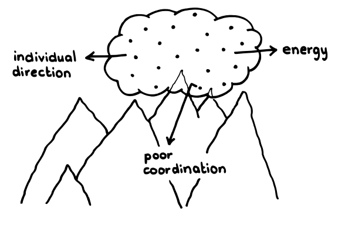
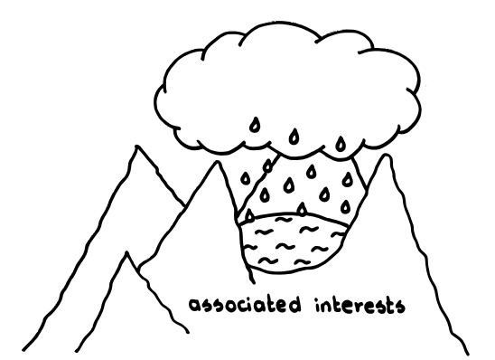

# ¶2 もやもや

確信度：*

…偉大な業績は、コミュニティにわたる漠然とした憧れから始まります。試行錯誤を重ねる人や職人が個々に、その人自身の分野に閉じた視点から、自分の環境や手元で重大な問題を解決しようとしています。彼らは偉業を成し遂げたいと願っていますが、効果的な協力がないために、小さく局所的な利益にとどまってしまいます。より大きな善のために一緒に改善を探求するという感覚は、すでに文化となっています 。それが [1 ゲームの精神](ch01_01_1_The_Spirit_of_the_Game.md)なのです。

＊　　＊　　＊

イノベーションが最高の輝きを見せたのは、人類がまとまり、集団になったときでした。最初期の人類は、小さな集団で一緒に暮らし、小さな自給自足経済で生活できました。Steve Johnsonはその著書で、都市はイノベーションのゆりかごとして、多様なスキルとバックグラウンドを持つ人々が自由に意見を交換する場を提供したと評しています(“Where Good Ideas Come From: The Natural History of Innovation” [Joh11] Chapter 2, “Liquid Networksˮ)。人々が集団になると、生産が自給自足を補なうようになりました。都市の成長でも同じように、生産設備がイノベーションを推進する新たなエンジンとなりました。労働者の集団とその同僚は、イノベーションを生み出して市場を熱狂させ、経済的な報酬も得るようになりました。

Individual direction: 個人の目的意識

Energy: エネルギー

Poor coordination: 協調不全

しかしながら、そうしたコミュニティは常にヒエラルキーの影響下で活動しており、多くの場合持てる能力を十分に発揮できずにいました。これまで常に見られてきた人類の強いパターンではありますが、個人の社会的、職業的、経済的振る舞いを、適合させることになります。多くの場合で、ある社会に受け入れられるための基準が設定され、なんらかの権威によってルールになりました。 統治者、宗教、労働団体、学会などによってです。「封建領主は促し、農奴は従った」とたとえられるように、産業革命期のような人類史上もっとも激しい経済成長の中では、少数による計画を多数が実現する様子が見られました。「良い」ものが「完璧な」ものを駆逐していき、また多様性と進歩が阻害され、こんな笑い話も生まれました。「車の色は黒である限り、どんな色でも選べます」「世界中のコンピュータ市場は5台くらいだろう」

それゆえ：

個人や、数人の心が合わさって、スクラムチームが誕生するために必要な準備作業と評価がおこなわれ、「原始スープ」という環境を生み出します。準備作業の中核は、生活の質を向上できる新しいビジョンに従います。そうしたビジョンはプロダクトに基づくものであり、作る人と使う人の両方にとって価値が増えるようなものです。また、そうしたビジョンは、過去の労働慣行の隷属的な習慣を打ち破り、構想する人、構築する人、利用する人がギブアンドテイクの関係で結ばれる未来を予見するものです。スクラムは、ジェフ・サザーランドの構想によれば、、何も持っていない人であっても、無からなにかを創り出すことができるという希望を持つ能力を予見しています。

Associated interests: 一致した関心事

＊　　＊　　＊

生活の質に貢献できるようなプロダクトや、そのようなプロダクトの実現に人々を興奮させて巻き込み、ステークホルダーのコミュニティの協力を得てプロダクトを進化させてゆくようなアイデアが集まり始めます。共通の関心事を持つ人々が集まり、プロダクトやプロダクトが果たすであろう目的への情熱と同じくらい、[ゲームの精神](ch01_01_1_The_Spirit_of_the_Game.md)によって結束します。やがてそうした人々の集まりは[3 豊かな土壌](ch02_03_3_Fertile_Soil.md)を育み、偉大なもの、クールなもの、熱狂させるものを作り出そうとします。そこには、**39 Vision**の実現のために共有された目的があります。

最初のステップでは、成果物に関するアイディアとそれを実現するためのプロセスを徐々に統合していきます。最終的には、そのようなアイデアの集合を**Vision**として意識するようになります。

