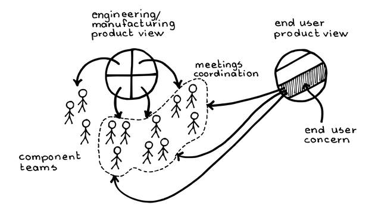

# ¶4 コンウェイの法則

確信度：★★

図の出典 : Manu Cornet / http://www.bonkersworld.net

...物事がうまくいっているとき、誰もが純粋な情熱を持ってやるべきことをやっていて、とてもシームレスで、誰もがお互いの心を読めているかのように、傍目には見えます。しかし、組織やプロダクトが成長するにつれ、仕事を完成するためにチームが習得、管理、共有しなければならない情報の量も増えていきます。意思決定は、更に（チームとプロダクトの両方の）コンテキストに敏感になり複雑さを伴うために、物事を円滑に進められるよう維持するためには、組織が成熟するにつれて何らかの構造が必要となります。あなたは​**93 Greatest Value**を生み出すために、チームが最適に物事を成し遂げられるような組織構造を探っています。

複雑なシステム開発を効果的に行うには、コミュニケーションとフィードバックが効果的であることが要となり、組織構造は、最も重要なコミュニケーション経路のために最適化されるべきです。コミュニケーションと定期的なフィードバックは、自己組織化とともにアジャイルの要です。多様で横断的な人々の相互作用が、イノベーションの要です(Where Good Ideas Come From [Joh11])。

複雑なプロダクトに取り組む[14 開発チーム](ch02_14_14_Development_Team.md)​は、機能と形態という二重の性質と絶えず格闘しています。私たちには、開発活動と組織単位の間に、そのような境界線を引いてしまいがちです。しかしながら、機能と形態は社会的に作られた、やや恣意的なカテゴリーにすぎません。システムにとって信頼性は変わらず強い関心事かもしれない一方で、美しさ、後方互換性、またはその他の関心事が、開発の取り組みを支配するかもしれません。いずれにせよ、何であれビジネス上の最も重要な関心事を中心にして[開発チーム](ch02_14_14_Development_Team.md)が自身で組織化するとき、ビジネスに最善の結果がもたらされます。

engineering/manufacturing product view: エンジニアリング／マニュファクチャリングのプロダクト視点

end user product view: エンドユーザーのプロダクト視点

Meetings coordination: ミーティングの調整

end user concern: エンドユーザーの関心事

component teams: コンポーネントチーム


チームが成熟を始めたばかりの初期の頃に、[7 スクラムチーム](ch02_07_7_Scrum_Team.md)の構築に向けて動き始めると、一つの組織単位として、ビジネスのすべての機能（リリース計画、開発、専門的な成長）をカバーするために上手く働ける人が増えます。しかしながら、成長と成熟は不快感の原因にもなり、チームは非公式に作業していたシンプルな日々の構造化されていない効率性を懐かしく思います。それでも成長し、市場のプロダクトを適切にマネジメントするためには、ある程度の規律のある組織構造と、いくらかの軽い統制が必要になります。


文化には、全体が効率的に機能できる構造への内在的な欲求があります。最も効果的なコミュニケーションは、いつも親しい範囲で局所的におこなわれます。そのため、組織の最も重要な関心事を中心に、意思決定のプロセスを局所化することが非常に重要になります。どの重要な社会組織でも、人々がある領域で情報や行動を必要とするとき、関心のある特定の領域と、最も効率的な「行くべき場所」とを、すぐに結びつけられるようにすることが重要です。


単純な組織の分割(すなわち階層)は、分離した関心事を一つだけ扱えばよい単純な領域であれば、事足ります。しかし、階層的なアプローチは、典型的には開発の取り組みが複数の関心事に跨っているような場合、崩壊してしまいます。このような状況では、より大きく、より複雑な組織単位によって、範囲の経済性で問題を解決しようとする力が働きます。しかし、最も効果的な作業チームは**9 Small Team**であり、どうにかして仕事を分割する必要があります。

訳注：範囲の経済とは、同一企業が複数の事業をおこなうことによって、経営資源を共用しコストメリットを得る効果を表します。範囲の経済では、例えばスマホアプリ部門、Web UI部門、バックエンド部門のように、一つの課題を複数の組織単位に分散して解決する傾向があり、しばしば伝統的な企業でのスクラム導入において障壁となります。

しかしながら、どのチームも島ではなく、開発の国は単に島をあつめたものではありません。チームは個々に独自のアイデンティティーを確立しますが、外国人恐怖症(親しいものを求める)という自然な感覚によって、チームは自分たちの社会の輪の外からくる事への関心が、二の次になってしまいます。単一の単純な分割に基づいて、一組の社会的な相互作用で企業を制限してしまうと、イノベーションを促進するような境界を越えたアイデアを潰してしてしまうことになります。


意思決定の速度を最も重視すべきです。いくつかの問題は緊急を要し（「他の部族に攻撃されているので、防衛策を講じて対抗しなければならない」）、他にも重要な課題、我慢がいる課題、長い審議が必要な課題まであります（「新しい会議場の最適な場所はどこか」）。せん断層という用語は、異なる速度で動く関連するプロセスを表現する概念で、地殻プレートがお互いに動いてぶつかり、それが地震を引き起こすことからきています。建物のアーキテクチャ(How Buildings Learn: What Happens After They’re Built [Bra95]) とソフトウェアアーキテクチャの分野(Pattern Languages of Program Design 4 [FHR00]を参照)の両方が、緊密に結合されたシステムの変化率の違いについて、構造や懸念を説明するためにこの表現を採用しています。企業は組織を構成するとき、最優先に分類された課題に迅速に対応できて、第二優先に分類された課題の効率的な対応を損なわないようにするべきです。


もう一つのアジャイルの原則は、私たちは外向的だということであり、私たちの焦点や関心は、仕事のために用いるツールや技術よりも、エンドユーザー、市場、顧客にあるということです。組織はこの関心をうまく反映するべきであり、それが価値提案や**41 Value Stream**​of development¶​全体を構築する鍵となります。


結局、組織の構造は、プロダクトの構造と同じように、プロセスの構造にも関係しているはずです。


それゆえ：

従業員を、企業の価値創造にとっての最も重要ないくつかの関心事に基づいて分割し、5人前後の[小さなチーム](ch02_09_9_Small_Teams.md)を組織します。第二優先の重要な関心事は、少数の横断的な構造で補います。ただし、これらの構造は、制約のない協力をおこなうオープンな環境以外の最適化に過ぎないことを、決して忘れてはいけません。


engineering/manufacturing product view: エンジニアリング／マニュファクチャリング・プロダクト視点
end user product view: エンドユーザー・プロダクト視点
feature teams: フィーチャーチーム

携帯電話を作っている企業を考えてみましょう。その企業では、主な成果物や手に入れられるオプションを中心として​[スクラムチーム](ch02_07_7_Scrum_Team.md)を組織しているかもしれません。そのため、あるチームはアドレス帳、カレンダーには別のチーム、旧来の電話機能のためにまた別のチームがあるかもしれません：​**89 Value Areas**を参照。これらはビジネスの主要な関心事です。しかし、プラクティス、ポリシー、社内標準（例えばユーザーインターフェースのルックアンドフィールなど）を定義するために、各[スクラムチーム](ch02_07_7_Scrum_Team.md)の代表者で構成されるグループがあるかもしれません。そうしたグループはプロダクトを作るのではなく、情報交換や開発をガイドする標準の情報源としての役割を果たします。健全な組織では、開発チームとしてのメンバーシップと、こうした後者のグループのメンバーシップとの間に、ほぼ完全な重複があります。


ほとんどの環境では、組織の主要な構造は、主要なステークホルダーの構造を反映しており、つまり通常は市場の構造を反映しています。このため、私たちは[スクラムチーム](ch02_07_7_Scrum_Team.md)を、内部の作成物の分け方やドメインの専門知識の領域に基づいて組織するのではなく、フィーチャーなど市場へ提供するものに基づいて組織します。フィーチャーやその他の市場提供物を中心に組織すると、フィーチャーを実装するために必要となる全ての作業の中心がチームとなるため、市場への対応力や、市場投入までの時間短縮への恩恵にも繋がります。これにより、組織境界の内側で調整が済むようになります。もし部分組立品の作業やコアコンピテンシーが組織構造を推進している場合、市場の変化や成果物の性質の変化により、複数のチームや組織の間で調整が必要となって、対応力が低下し、意思決定にかかる時間が長くなるでしょう。


これが唯一の構造であるならば、市場の観点のみをサポートすることになり、この他の有効なビジネス上の関心事の多くが疎かになってしまいます。この構造が機能するには、コミュニケーションの効率を二次的にサポートする横断的な構造、例えばコアコンピテンシーに関連する構造などによって補完されなければならなりません。従って、このパターンはほとんど常に[5 志を同じくする仲間](ch02_05_5_Birds_of_a_Feather.md)のようなパターンや、**4.2.22. ドメインエキスパート**に記述されているようなパターンと共に現れます。組織的な役割の構造は、チーム間に自然に形成される壁を取り除いてくれます。​[37 メタスクラム](ch02_38_37_MetaScrum.md)を通して、企業内のプロダクトへの取り組みを互いに、また​経営層ともつなげます。ある程度のプライドを醸成しているチーム (**4.2.13. チームのプライド**参照) は、このフォースや他の同等なフォースが責任感を促進するため、より効果的になります。このことは、チームのメンバーシップにより外国人恐怖症の影響があるにも関わらず、こうした構造が確かに有効に維持されることに役立ちます。


壁や扉のないオープンな環境で全てを結びつけましょう。[開発チーム](ch02_14_14_Development_Team.md)は開発上のコミットメントのみに関するユニットであり、開発者間やチーム間での自由な相互作業を制限するような干渉があってはいけません。真剣な内省や、少人数のミーティングを静かに短時間で行うための小さな部屋を、近くに配置しましょう。


どんな要素であっても価値があれば、組織化の基準としては適正です。例えば、スクラムはチームメンバーのコラボレーションを特に重視しているので、最も基本的な組織的境界は​[8 同じ場所に集まったチーム](ch02_08_8_Collocated_Team.md)​に該当すると考えられます。


優れたスクラムには、二段階の[コンウェイの法則](ch02_04_4_Conway_s_Law.md)が存在することに注意してください。一つはプロダクトにフォーカスして推進され、もう一つはコンピテンシー領域にフォーカスして推進されます。表面的なレベルでは、私たちはプロセスに基づいてチームを組織します。そこでは、プロセスの内向きと外向きの両方の面が重要な関心事です。そして、プロセスの領域には以下の3つがあります。

スクラムの[開発チーム](ch02_14_14_Development_Team.md)はフィーチャー（プロダクト）チームです。つまり、[スクラムチーム](ch02_07_7_Scrum_Team.md)の第一の組織化の原則は、**Value Stream**に沿ってフィーチャーの提供を継続的におこなうように調整することです。スクラムには、[34 スクラムオブスクラム](ch02_35_34_Scrum_of_Scrums.md)と呼ばれる弱く浅い階層の組織があり、一つの組織の中で、複数の[開発チーム](ch02_14_14_Development_Team.md)が、各プロダクト開発に配置され、共通の[プロダクトオーナー](ch02_11_11_Product_Owner.md)を共有します。１つのプロダクト開発に含まれる各[開発チーム](ch02_14_14_Development_Team.md)が、一度に１セットのフィーチャーを構築します。時間の経過とともに、主要なビジネスドライバー、共有されたビジネス知識、**Value Stream**の作成物がこうしたフィーチャーを一つに束ねます。開発チームの中には、認識されるような肩書やサブ組織は存在しません。


フィーチャーチームに仕事を分ける方法はたくさんあります。[開発チーム](ch02_14_14_Development_Team.md)は、決められた市場に機能を提供することもできますし（**5.1.9. 組織はマーケットに従う**を参照）、企業の技術的側面のサブセットに向けてプロダクトを開発することもできます（電話用のチームとタブレット用のチームの両者は、同じソフトウェアを多く共有します）。一般的に、各チームは、企業価値の構成要素に対応するいくつかのプロダクトを中心に形成されるべきです：**90 Value Stream Fork**も参照してください。しかし、スクラムは各チームがプロダクトの一部分、またはプロダクトの部分組立品を担うような[開発チーム](ch02_14_14_Development_Team.md)の構造は推奨しません。もし、単一チームのメンバーではシステムの一部分しか開発できないのであれば、開発上の意思決定をするには他のチームとより多くの決定事項を調整する必要があります。チームがローカルに意思決定を行うことが難しくなり、その結果、フィードバックの遅れや引き継ぎが発生します。


スクラムにおける[コンウェイの法則](ch02_04_4_Conway_s_Law.md)の二段階目では、熟練によって価値が推進されるようなコンピテンシー領域を中心に人々が組織化されます。これらの[志を同じくする仲間](ch02_05_5_Birds_of_a_Feather.md)では、メンバーがアイデアを共有したりトレーニングを受けたりすることで、専門的・技術的な分野の能力を深めることに役立ちます。ほとんどの人は向上したいという生来の欲求を持っています (Drive: The Surprising Truth About What Motivates Us [Pin11]を参照)。また、こうしたグループはチームメンバーが学び成長していく中で個人としての誇りを育みます。しかし繰り返しになりますが、こうしたグループはレポートラインを構成しません。また、どのチームメンバーも自分の[スクラムチーム](ch02_07_7_Scrum_Team.md)だけでなく、いくつもの[志を同じくする仲間](ch02_05_5_Birds_of_a_Feather.md)に所属することができます。**4.2.22. ドメインエキスパート**も参照してください。

[開発チーム](ch02_14_14_Development_Team.md)の境界線やアイデンティティ、および[スクラムチーム](ch02_07_7_Scrum_Team.md)の境界線やアイデンティティは明示的です。チームアイデンティティの概念は、**4.2.13. チームのプライド**や組織の効率的な運営の鍵を握ります。なぜなら、チームアイデンティティは意思決定の最適化に役立つ社会的な文脈をもたらすためです。繰り返しますが、[開発チーム](ch02_14_14_Development_Team.md)に「開発者」以外の公式な肩書きは存在しません。不可侵のルールが１つだけあるとすれば、いかなる個人も専門性による暗黙の立場を利用してチームのコンセンサスを覆したり、その他の方法で​[1 ゲームの精神](ch01_01_1_The_Spirit_of_the_Game.md)にあるチームワークの精神を損なってはいけません。共同で開発された​[31 行動規範](ch02_32_31_Norms_of_Conduct.md)は、チームアイデンティティの強力な先駆けとなります。


個人レベルで役割上の専門性を持つことはできますが、ローカルな意思決定の可能性を最適化するためには、[コンウェイの法則](ch02_04_4_Conway_s_Law.md)を[10 機能横断チーム](ch02_10_10_Cross_Functional_Team.md)​¶で完結することが重要です。


[コンウェイの法則](ch02_04_4_Conway_s_Law.md)の起源は、ソフトウェアに由来します (Datamation 14 [Con68], pp. 28--31を参照)。[コンウェイの法則](ch02_04_4_Conway_s_Law.md)の起源とプラクティスについては、多くの神話があります。オブジェクト指向は、市場の関心事をクラスの中にローカル化することで、[コンウェイの法則](ch02_04_4_Conway_s_Law.md)をサポートしているという見方が長い間ありました。その半分は真実です；クラスは、組織のコアコンピテンシーという長期的な関心をカプセル化する傾向があります。さらに、オブジェクト指向は、市場やユースケースへの関連よりも、開発者の専門知識や開発した成果物との関連性に焦点を当てているように思われます。市場の構造に整合しているかという懸念は、開発者のプロセスやプロダクトの世界観への懸念よりも、優先されるべきです。

かつてはウォーターフォール型の開発スタイルが全盛でした。ウォーターフォール型の組織では、主な組織構造はプロセスの工程を追従していました：工程とは要求分析、設計、実装、テストなどです (Proceedings of IEEE WESCON [Roy70], pp. 1--9)。コンウェイの法則により、組織の構造はプロセス上の関心事を反映していました。そのソフトウェアはこれらの工程を大変良く反映していたのかもしれません。例えば、サービス指向アーキテクチャ（SOA）では付加価値の高い要件のほとんどはサービスのインテグレーション層にありましたが、個別のサービスは他のレイヤーにありました。ウォーターフォールでは、機能間に相互作用があるという理由で、すべての機能を一度に開発者に渡します。ウォーターフォール時代のころのソフトウェアデザインのアプローチは、市場の関心事（ユースケース）をアーキテクチャに合わせようとしていましたが、その分類方法を組織構造は横断していました。工場での組立ラインの組織についても同じことが言えます。

[開発チーム](ch02_14_14_Development_Team.md)はフィーチャーチームなので、チームは一度に一つのフィーチャーに集中して取り組むべきです (​**25 Swarming**: One-Piece Continuous Flowのように​)。スクラムが主に市場に提供するものはフィーチャーであり、その意味でチーム構成と市場との整合性は良好です。スクラムはプロダクトのアーキテクチャーの形態については何も言いませんが、アジャイルの精神によって、個人によるコード所有をやめさせる傾向にあります。すべての[開発チーム](ch02_14_14_Development_Team.md)が、プロダクトのどの部分についても作業をすることを許されています。スクラムは、カプセル化による組織的な利益と、チームを市場への成果物に整合させる利益のバランスを取っていると言えるでしょう。[プロダクトオーナー](ch02_11_11_Product_Owner.md)は[開発チーム](ch02_14_14_Development_Team.md)のサポートを受けながら、時間の経過とともに現れる機能の相互作用をどのように取り扱うかを管理します。

例えば、あるチームが通信システムのために通話中着信の機能を実装している間に、別のチーム が自動転送を実装している場合を考えてみましょう。創発性があるため、与えられた2つの​**55 Product Backlog Item**​¶ (PBI)間の依存関係を解決するコストをいつも予測できるわけではありません。そのため、これらのPBIを別チームに割り当てることによってこの問題を克服することは、一般的に不可能です。いずれにしても、チームに作業を早々に割り当てることは、人々が難しい部分（特にパーツ間の相互作用に関わること）に効果的に取り組むことを不可能にし、[スクラムチーム](ch02_07_7_Scrum_Team.md)レベルでの自己組織化を制限します。この2つの機能は高度に相互依存しているかもしれませんが、スクラムの構造はそれらの相互作用に第一級の地位を与えていません。この場合、1つのチームが両方の機能を開発した方が良いでしょう。複数チームへの仕事の割り当ては、​継続的なプランニングと共有された意思決定に基づいて行われ、[24 スプリントプランニング](ch02_25_24_Sprint_Planning.md)で始まります。優れた[スクラムチーム](ch02_07_7_Scrum_Team.md)は、[スプリントプランニング](ch02_25_24_Sprint_Planning.md)と同様に**64 Refined Product Backlog**のイベントを継続的に繰り返し開催します。[プロダクトオーナー](ch02_11_11_Product_Owner.md)と[開発チーム](ch02_14_14_Development_Team.md)の間の親密でありながらタイムボックス化された相互作用を通じて、開発チーム全体にわたる作業の分割に取り組みます。


マネジメントは通常、組織混合の構成要素ですが、スクラムによる開発の中にはマネージャーなしで運営されているものもあります（例えば、Bosch Software Innovations社のアジャイル変革に関する最近の動画を参照[8]）。スクラムの理念は人とプロダクトに焦点を当てる傾向があり、その焦点はスクラムの役割やそれを代表する組織に([開発チーム](ch02_14_14_Development_Team.md)や​[12 プロダクトオーナーチーム](ch02_12_12_Product_Owner_Team.md)​のように)具現化されています。既存のマネージャーがいる組織がスクラムを導入しようとすると、マネジメントの部分を別世界のものとみなし、否定してしまいがちです。このようなマネジメント抜きの組織が選択できない状況では、[6 マネージャーを巻き込む](ch02_06_6_Involve_the_Managers.md)​が極めて重要になります。

