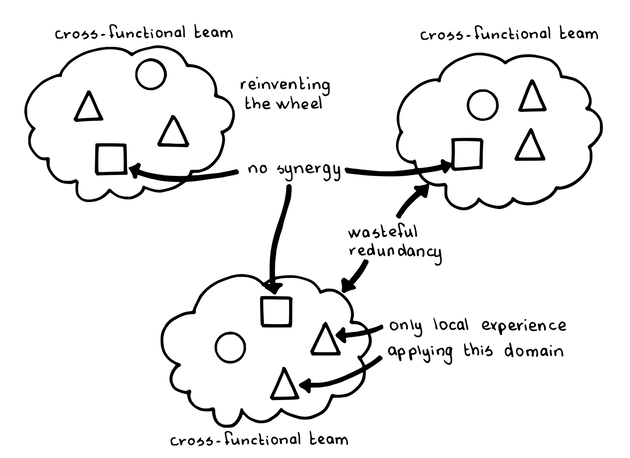
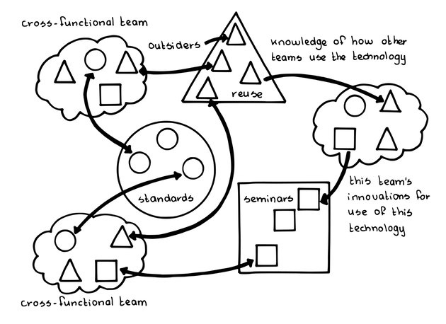

# 5 志を同じくする仲間 

確信度：★ 

{:style="text-align:center;"}
 
蝶のオオカバマダラは中央アメリカに定期的に集合する性質を持つ。 

{:style="text-align:center;"}

...スクラムの組織体や役割が整っています。[14 開発チーム](ch02_14_14_Development_Team.md)​は、プロダクトを作るために​[16 自律したチーム](ch02_16_16_Autonomous_Team.md)​として効果的に働いています。彼らは​[10 機能横断チーム](ch02_10_10_Cross_Functional_Team.md)​であり、個々のチームの専門性は、各チームがそれぞれの作業から得られる洞察によってのみ成長します。 

{:style="text-align:center;"}
＊　　＊　　＊ 

コアコンピテンシーは企業価値の極めて重要な要素であり、開発組織の境界を越えたものになります。スクラムはプロセスの改善とプロダクトの改善に重点を置いていますが、この両方の領域で企業のニーズを賄うためには、この仕事を行う人材とそのスキルセットに投資することが極めて重要です。 

アジャイルのアプローチへ移行中の組織において、「エンパワメント」や「自己管理チーム」といった言葉が叫ばれることがよくあります。しかし、チームに権限を持たせることは、チームを分離し、独自の境界につながり、企業全体のドメイン知識、ビジネス感覚、戦略に寄与しうる長期的な洞察を含む情報の共有を減らすことになりかねません (Across the Board 54の“The Limits of Participatory Managementˮを参照 [Hec95])。 

{:style="text-align:center;"}
 
 

Cross-functional team: 機能横断チーム Reinventing the wheel: 車輪の再発明 No synergy: シナジー無し Wasteful redundancy: 無駄な重複 Only local experience: 局所的な経験 applying this domain: この領域に適用 

ある程度の大きさの人の組織であれば、知識の関係はラティス構造を形成します。しかし、フォーマルな組織構造のほとんどは階層構造です（スクラムのプロダクト組織への変化、そしてスクラムのプロダクト組織から[開発チーム](ch02_14_14_Development_Team.md)への変化を含む）。ピーター・センゲはベームの言葉を引用し、組織学習の根幹は対話にあって、ヒエラルキーはその対極にあると指摘しています(The Fifth Discipline [Sen06], p. 288)。 

人は個人として自身の技能の熟達を楽しみますが、孤立して働く個人の場合、そうした技能開発は限定的なものになります。イノベーションの根底には、アイディア、技術、文化の他家受粉と広い多様性があります ( Where Good Ideas Come From [Joh11]の“Liquid Networks”を参照)。 

それゆえ： 

企業の重要なコアコンピタンスや開発者が関心を持つ分野ごとに、特別に「[志を同じくする仲間](ch02_05_5_Birds_of_a_Feather.md)」のグループを作り、興味を持ったもの同士が企業発展の鍵となる技術、ドメイン知識、プロセスについて情報交換できるようにします。 

自己組織化の精神では、そのコミュニティに参加するかどうかは各チーム（またはもしかしたら各チームメンバー）が自律的に判断します。しかしながら、チームはコミュニティの決定に従うという同意なしに、コミュニティの中での発言権は得られません。 

{:style="text-align:center;"}
 

Cross-functional team: 機能横断チーム Outsiders: 部外者 Reuse: 再利用 Knowledge of how other teams use the technology: 他のチームの技術の使い方の知識This team’s innovations for use of this technology: このチームのこの技術の革新的な使い方 Seminars: セミナー Standards: 標準 

{:style="text-align:center;"}
＊　　＊　　＊ 

こうしたグループは、個人やキャリア開発の良い場にもなり、伝統的な管理重視の組織がスクラムに移行する際に、ピープルマネジメントの才能がある人材の受け口となることができます。[7 スクラムチーム](ch02_07_7_Scrum_Team.md)​はプロダクトを管理します。一方、マネージャーは人を管理します。 

ダニエル・ピンクが『モチベーション3.0 持続する「やる気!」をいかに引き出すか』で述べたように、自律と超越的な目的意識と共に、マスタリー（熟達）がチームの成果と健全性の重要な要素であることが示されています。[志を同じくする仲間](ch02_05_5_Birds_of_a_Feather.md)は、組織の卓越性を磨くローカルなコミュニティで、副産物として個人の有効性を高めることがあります。こうしたチームは **4.2.13. チームのプライド**の場、チームのプレイヤーを動機づけるマスタリー（熟達）を育む場になります。こうしたフォーラムは、birds of a feather、ギルド、QCサークル、コミュニティ・オブ・プラクティス(実践コミュニティ)など、長年さまざまな名前、さまざまな形で作られてきました。 

これはマトリクス型管理とは違います。「[志を同じくする仲間](ch02_05_5_Birds_of_a_Feather.md)」の組織は、プロダクト管理の場ではありませんし、実際、あらゆる種類の外部からのコントロールに関わるべきではありません。このようなすべての組織は自己管理されます。こうした組織の中で最も優れたものは、コアコンピタンス(訳注: 企業の競争力の源泉)への熱意の周辺に自然と形作られます。時には、こうしたグループを形成するために[19 スクラムマスター](ch02_20_19_ScrumMaster.md)や[11 プロダクトオーナー](ch02_11_11_Product_Owner.md)からの働きかけが必要なこともあります。どのような場合でも、これらのグループはその存在を支える非公式な憲章に同意し、自分たちの支援者、会社、コミュニティに価値を与え続けているかを定期的に見直すべきです。こうしたチームの影響力を開発チーム、プロダクト、組織や企業全体に広げるための支援や組織的なコミットメントを提供することができるマネージャーを活用しましょう(​[6 マネージャーを巻き込む](ch02_06_6_Involve_the_Managers.md)​)。 

ご近所づきあいと同様に、私たちの行動は、場所やリソースが共通しているために、互いに影響を与え合います。そう、[志を同じくする仲間](ch02_05_5_Birds_of_a_Feather.md)のグループ間でも同様です。しかし強調すべき点は、[志を同じくする仲間](ch02_05_5_Birds_of_a_Feather.md)のグループは通常、提案された改善案を実施する義務は負わないということです。グループの主な役割は、すべての人がより良く情報を得て、企業全体にわたる改善のアイデア、経験、専門知識、提案、取り組みをより良く認識できるようにすることです。個々の[スクラムチーム](ch02_07_7_Scrum_Team.md)が、新たな改善 ([カイゼンとカイカク](ch02_19_Kaizen_and_Kaikaku.md)を参照)を試み、有効性を評価する義務を負います。 

ビジネスドメインの知識は、おろそかにしないでください。開発者が専門的に成長する重要な機会になるからです。技術的な知識は一般的なものとして入手可能なことが多いですが、重要なビジネスのコンピテンシーは獲得することが難しく、限られたリソースでしか入手できないことがしばしばあります。しかも、開発者がビジネスを理解できるようになることで、高い見返りを得られるのです。リチャード・ガブリエルは、彼の会社Lucidで、自分の仕事を会社のバランスシートと関連づけるのはビジネス側の人よりもエンジニアのほうがうまかったと、報告しています。 

あなたの組織が小さすぎて、[志を同じくする仲間](ch02_05_5_Birds_of_a_Feather.md)のグループをいくつも作るのが難しい場合は、代わりに地元のミートアップに参加してみるといいでしょう。とにかくやってみることです。 

1991年、レイヴとウェンガーは、コミュニティ・オブ・プラクティス(実践コミュニティ)[9]という概念を導入し、状況学習の理論を説明しました。これはつまり、個人が社会的な共同参加 を通じて専門的なスキルを身につけるというものです(Wikipediaより[10])。Spotify社には「トライブ」、「チャプター」、「ギルド」といった複数の構造があり、様々な特性の交流をチームを横断して行うこ自然な場を提供しています(Henrik Kniberg[11]に関連)。米国にあるProgress Software社では、全チームが使う欠陥追跡ツールを一つ選択するためにこうしたグループを使いました。組織全体のすべての人が欠陥を探したり報告する先がどこなのか分かるようにするためです。 

