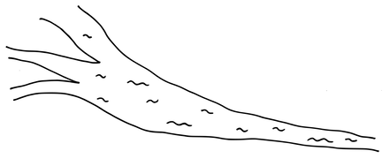
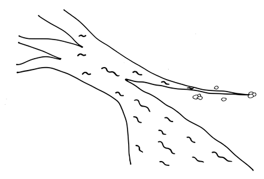

# 6 マネージャーを巻き込む

確信度：★

{:style="text-align:center;"}

…組織はスクラム採用にコミットし、今ではプロダクトを構想し実現するガイドとしてスクラムを使い始めています。しかしスクラムには従来の組織構造と大きな違いがあり、従来の役職の位置づけについて疑問が生じています。従来型プロダクト開発の管理職に慣れ親しんでいた人々は、スクラムの文化の中に、類似の役割がないか探しています。管理職は、複数のプロダクトを開発している大規模組織では、強い存在感を示していますし、どのような規模であれ従来型組織においても影響力を持っています。管理職の責任は、スクラムのいくつかの役割の責任と重複しています。組織の中で管理職のコントロール範囲や、管理職をなくすべきなのかを検討する中で、差し迫ったジレンマが明らかになってきます。

{:style="text-align:center;"}
＊　＊　＊

スクラムフレームワークにマネージャーは存在しません。スクラムの `14 開発チーム`​ は ​`16 自律したチーム`であり、 ​`11 プロダクトオーナー`はステークホルダーや投資家に対する説明責任はあるものの、企業内の上位からコントロールされる対象ではありません。アジャイルトランスフォーメーションにおいて、マネージャーは単なるサポート役以外に、自分の貢献できる仕事を見つけるのに苦労することになります。

従来の組織における開発マネージャは、作業を調整し、`開発チーム`内での作業の割り当てまで行う場合もあります。しかしレスポンスの良さや、さらには作業に直結する迅速な決断を下す必要から、開発者が自身で日々の開発作業を管理する方が良いでしょう。スクラムではそのようにプロダクトを開発します。しかし伝統的なマネジメントのスキルセットと特性も、複雑なプロダクト開発組織においては有効なこともあります。このスキルセットは、日々の開発や、スクラムが組織にもたらすものの範囲外になります。

「マネージャー」という職位は、企業を代表して発言したり、企業活動の責任を取れるという点で、しばしば法的に特別な立場です。マネージャーには`プロダクトオーナー`にはない、企業の構造を変える地位と権限があります。個々の`7 スクラムチーム`は日々の割り込みや急場に対応するものの、1チームの範囲を超えた問題に適切に対応できません。たとえば、複数のプロダクト開発（つまり、複数の`プロダクトオーナー`が関わる開発）を請け負っている外部ベンダーとの関係において、1人の`プロダクトオーナー`が契約上の責任を負っては、おかしなことになります。

{:style="text-align:center;"}

英単語のmanagementを辞書で引くと、本質的にはコントロールと責任の話である(New Oxford American Dictionary [SLJA17]による)とされています。責任とは、説明責任を受け入れる意志のことです。スクラムにマネジメントがいない理由のひとつは、開発プロセスのコントロールが`自律したチーム`の個々のメンバーに分散されていることです。開発は複雑なものなので、開発のリーダーシップもあるメンバーから別のメンバーへと動的に移動してまわるのです。どんな形であれコントロールやマネジメントを集中させると、効果的な仕事の妨げとなります。しかしながら、プロダクト開発のためには開発以外にも必要な仕事があります。`プロダクトオーナー`がプロダクトの方向性を(最終的な決定権を持つという意味において)指図するという事実はコントロールの現れであり、スクラムにはいかなるコントロールも存在しないという意見は、作り話にに過ぎません。

`プロダクトオーナー`同様に、プロダクト組織には、集団の合意よりも中央集権的な意志決定が適している側面の業務があります。たとえば、重大なビジネス上の意志決定の中には、話し合いや経験的な根拠だけでは裏付けられない「直感」に基づくほうが、適切なものもあります。通信網の市場がアナログからデジタルに切り替わるというタイミングで、AT&T社は従来のアナログ技術のほうが経済的と判断し、地域のデジタル交換機市場で戦わない意思決定をしました。ノーザンテレコム社はDMS-100デジタル交換機の開発を1970年代後半に開始し、油断しているAT&T社に付け込む形になりました。当時はデジタル時計が出始めた頃で、デジタルが流行していたのです。市場が「感知」した価値は、エンジニアリングの分析を凌駕したのです。従来のプロダクトを進化させるだけでは不十分であり、新しいプロダクトラインの立ち上げが課題でした。ノーザンテレコム社もエンジニアリング観点で同様の激しい議論をしていましたが、直感とビジョンに基づき、最終的には経営陣は、デジタル交換機に舵をきりました。1979年、ノーザンテレコム社は、AT&T社に先んじてその市場に参入しました。[12]

複数のプロダクトを開発する企業において、`スクラムチーム`がチームやプロダクトの存続や存在意義に関わる戦略的な課題に対処するのは適切ではありません。例えば、複数のプロダクトを開発する大規模な組織では、意志決定には総合的な考慮が含まれます。責任をもって、異なる時期に複数のプロダクトに、リスクを分散するなどです。`プロダクトオーナー`は単一のプロダクトについて責任を持ちますが、自分自身の存在意義に対する説明責任を負うことはできません。ビジネス上の観点からプロダクトの予算を削減すべきと判断するような場合でも、`プロダクトオーナー`自身がそうした判断をできるほど客観的な視点を持てることは稀です。つまり、個々のプロダクトでは、大きなリスクを取れる余地、リソース、代替手段がないかもしれません。

`スクラムチーム`は継続的な改善を重視しますが、改善は継続的、局所的、段階的な変化を重視します。プロダクト、場合によっては企業が、生き残るために非連続的な変化を必要とすることがあります。極端な例としては、Sun Microsystemsがハードウェアのビジネスを縮小したこと、Nokiaがゴム長靴の製造から携帯電話の製造に移行したこと、トヨタが自動織機の製造から自動車の製造への移行したことなどがあります。IBMは1985年当時ハードウェアの売り上げが全体の4分の3を占めていました(そのころソフトウェアはハードウェアの付属品として提供されるものでした。InfoWorld 9 [Wei87]参照)。それが2015年にはサービス企業となり、ハードウェアの売り上げは10パーセント未満になりました。[13] 1986年、経営陣は、当時25％だったサービス分野の売上を、6年以内に40％まで引き上げると決定したのです(Computerworld XIX [Gal85], p. 52)。

`プロダクトオーナー`と`スクラムチーム`は、通常、改善による段階的な変化を通じてリスクを管理することを重視しているため、そのような機会を見落とすかもしれません。彼らは、リスク対策としてプロダクトを、それも自分たちのプロダクトを打ち切るとは、考えないかもしれません。チームメンバーは、日本語で「カイカク」(`カイゼンとカイカク`を参照)と呼ばれる急激な変化を、脅威と受け止めるかもしれません。プロダクトを1つだけ持っている組織にとって、先に挙げたような大きな変化はリスクが大きすぎて許容できないと感じるかもしれません。組織が改善の責任をすべて、個々のプロダクトや末端のチームだけに押し付けると、より広範なプロダクトやビジネス間の相乗効果を得る機会を無視して、いくつかの局所的に最適化されたプロダクトになってしまうかもしれません。

管理職は組織のアジャイルトランスフォーメーションに初期段階から関わることが多く、管理職自身が始めることもあります。そして移行を支援したいと考えています。自己管理するよう教わったチームは、マネージャーの支援を歓迎しないことがありますす。マネージャーはスクラムチームへ干渉し、気を散らし、概して厄介者になります。極端な場合、管理職が技術的な仕事をしたり、仕事のやり方をチームメンバーに指示することもあります。Wayne Rosingは2001年にGoogleのエンジニアリング担当VPに就任した際、すべてのそうしたマネージャーを取り除きました。そして160名がすべて自分に直接レポートするようにしたと、Fast Company 69で語っています [Ham03]。しかし、Rosingは管理職として、この決定をしたのです。組織が局所最適化を乗り越えて前進するときには、「誰か」が非連続な変化を引き起す必要があるのです。

それゆえ：

**組織内で抜本的な変革を主導し、その責任を負い、`スクラムチーム`の`19 スクラムマスター`や`プロダクトオーナー`の手に余る可能性のある障害に対処するために、権力のある立場から行動できる管理職を機能として維持します。**`スクラムチーム`はプロダクトの戦術的および戦略的な面について自分たち自身を管理し、` 自律したチーム`として振る舞います。`スクラムチーム`は週次の​`37 メタスクラム`​イベントで(通常は`プロダクトオーナー`を通じて)管理職と接点を持ちますが、管理職は他のスクラムイベントには参加しません。

{:style="text-align:center;"}

`スクラムチーム`は自分たち自身で改善の方向を定めて自己管理する一方で、管理職はより抜本的な変化である「改革」の機会を求め、チームがそれをおこなう意欲をかき立てます (Lean Magazine 15 [Cop17])。管理職はこのようにしてイノベーションにおいて核となる役割を果たします。プロダクトマネジメント(Product Owner)から見れば自身の存在を脅かしかねないような、方向性であってもです。

優れた管理職はサーバントリーダーの役割を果たします。しかし、管理職はその地位から、`スクラムマスター`よりも強い権力を持っています。管理職は異なるプロダクトの`プロダクトオーナー`同士が衝突したとき、介入することがあります。管理職はその権力を行使して、`93 最高の価値`​を実現するための組織的な戦略を描いた方針を定めることもできます。たとえば、プロダクトの説明責任を担っていた運営委員会の権限を取りあげ、責任を負う意欲のある`プロダクトオーナー`にその権限を移譲するかもしれません。日々の中でも、プロダクトの提供にまつわる障害の最終的なエスカレーション先になります。管理職の地位が持つ権力やリソースがあれば、`スクラムチーム`には利用できない方法で問題に対処できます。

管理職は複数プロダクトを擁する大組織において、ファシリテーターや調整役として活躍できます。また権限のある立場、企業のリソースを利用できる立場から、​`34 スクラムオブスクラム`​や`メタスクラム`で緊急の障害を解消するように支援できます。たとえば取引のあるサプライヤーとの摩擦が`46 スプリント`​の障害となっている場合、`メタスクラム`で管理職までエスカレーションして解決に向けた支援を求めることができます。

管理職は防火壁( `4.2.9. 防火壁`参照)の役割も果たせます。チームに介入してくるステークホルダーを阻止するのです。これもまた従来の`スクラムマスター`の責務ですが、組織外からの介入に対してはマネージャーのほうがより効果的に役割を果たせるかもしれません。

[5 志を同じくする仲間](ch02_05_5_Birds_of_a_Feather.md)​グループのリーダーとして何名かマネージャーが着任してもよいかもしれません。従来からある、人材育成の一環ともみなせます。このようにチームに近いところにいる管理職は、個々人の育成や監督に関わることができます。

{:style="text-align:center;"}
＊　　＊　　＊

そうすることで企業は、1人の`プロダクトオーナー`が提示できる以上の幅広い全体像と目標を視野に入れ、リスクに対応できます。全社的なレベルでイノベーションや効果性をすぐに改善できます。`プロダクトオーナー`の責任は引き続きリスクマネジメントや意志決定にありますが、その範囲は自身の影響範囲とプロダクト内容の制御にとどまります。すなわち自身のプロダクトについてです。管理職は組織全体のリスクへの感度を高め、より革新的な方向転換や再構成などを、単一プロダクトを越えた視野を持って選択できます。上手くいっていないプロダクトがあったら、それを中止し( ​`94 プロダクトの通夜`を​参照)、解放した人員をほかのプロダクト、もしかしたら新しいプロダクトに振り向けることもあります。プロダクトの中止は全体を改善する機会となり得ますが、これは単一のプロダクトオーナーが改善を受け持つ範囲での局所的な最適化からは得られないものです。たとえば、全体的な視野を持って初めて、2つのプロダクトが同じ市場で競合していることを発見し、市場に提供する実質的な価値と価値の最大化実現(`価値とROI（投資利益率）`を参照)のためには片方を中止すべきだという判断ができるようになります。

管理職が新しい革新的な方向に邁進するリスクを取れるようになる理由の一つは、プロダクトを横断した広範なポートフォリオを把握し、あちこちにあるゆとりを統合できるためです。また、管理職には、今ある地位までのぼり詰めた、測りがたい「強力な直感」という言い表せない才能があります。(Liquid Networks” in Where Good Ideas Come From: The Natural History of Innovation [Joh11], およびGut Feelings: The Intelligence of the Unconscious [Gig08]を参照)。Gerd Gigerenzerが「Leadership and Intuition」（「Risk Savvy: How to Make Good Decisions」）で指摘しているように組織の上位にいる管理職ほど、直感による判断で合理性を補うことが多くなります (Risk Savvy: How to Make Good Decisions [Gig14])。そのようにして組織的な障害を取り除き、組織構造をスクラムに沿ったものにできます。たとえば、管理職はプロダクトの方向性に関する決定権を、強い権力を持つようになったセールスやマーケティング部門から奪い、その責任を`プロダクトオーナー`に移すという決定ができます。ここでNortelの実例を見てみましょう。

Nortelが際立っていたのは、上位の管理職やディレクターでさえ、仕事や組織の慣習を破ることを厭わず、むしろそうすることに慣れており、また現行のプロダクトやサービスのポートフォリオが現在でも妥当であるか、オープンに批判的に見る点でした。すべての階層において、遊び心と拡張性をもって組織について考えていました。

…彼らは数多くの矛盾を認識したうえで、その矛盾を受け入れるだけでなく、矛盾を組織やイノベーションのマネジメントに適用しようとしていました。

…漸進的なイノベーションは従来の組織構造でも達成可能ですが、抜本的なイノベーションは現在の構造を超える力を持った組織が必要だと示唆しています。(Managers of Innovation: Insights into Making Innovation Happen [SS04], ff. 46.より)

また管理職は大規模な組織において戦略的、戦術的な調整の拠点とサポートを提供します。「エンパワーメント」は1980年代のバズワードであり、`自律したチーム`という一種のカルトでした。もともと管理職は従来から調整やファシリテーションでチームを支えてきましたが、DuPont、AT&T、その他の大企業での調査から、エンパワーメントはチーム間の価値あるつながりを破壊することがわかりました (The Limits of Participatory Management [Hec95])。`自律したチーム`が「行きついた」結果、破壊されてしまう価値ある機能を管理職は提供していたのです。しかし管理職の人数は少なく保ってください。先述のGoogleの管理職であるRosingが、160名の部下から中間管理職なしで直接レポートさせていたことを思い出してください。Rosingの場合のように、管理職の多くが組織内で新しい役割を見つける必要があるかもしれません。

実際、GoogleのProject Oxygenでは、管理職という肩書きを持つ人が果たす役割を、管理職よりもコーチに近い機能に解釈し直しました(How Google Sold Its Engineers on Management [Gar13])。Googleは、優れた管理職はマイクロマネジメントをせず、効果的なコミュニケーションをとり、気を配りつつ生産的でもあり、部下のキャリア成長を重視していると認識しました。こうした特徴は従来の環境では優れた管理職のものでしたが、`スクラムチーム`においては優れた`スクラムマスター`がそうしたコーチングの役割を担います。

日々の業務の中で、`スクラムチーム`はデリバリーの妨げになっている障害物を取り除くように管理職に依頼できます。これにより、チームが回避策を作る必要もなくなり、開発者を発生している障害に対応させるのではなく、その障害の原因になっている構造上の問題を取り除く役に立ちます。

管理職は、すでに`41 バリューストリーム`を確立した「プロダクト」どうしのシナジーを追求し続けるべきであることに注意してください。このパターンは、管理職がプロダクト開発の一部を複数のベンダーに外注する言い訳にはなりません。ただし外注するコンポーネントがそれ自体で市場の地位を（例えばコモディティーとして）形成している場合は別です。複数の開発が外部のベンダーの成果を共有することで、企業全体として範囲の経済が成り立つのでない限り、`プロダクトオーナー`個人がそのような外注を管理すべきです。

経営陣は寿命が来たビジネス戦略について(IBMのハードウェア販売戦略のように)、保証や最低限のメンテナンスを残して終了する判断を下すかもしれません。それにより、ビジネスは新しい方向(サービス販売、コンサルティング、アウトソーシング、クラウドなど)に自由に移行できます。ハードウェアの`プロダクトオーナー`自身が、自分にとっては自殺に等しいような方向に向かうのは、たとえ幅広い視点で見れば企業全体にとってメリットのあることであっても、難しいでしょう。経営陣は、新しい方向に適した`39 ビジョン`​をもたらす`プロダクトオーナー`に導かれた、代替となる新しいビジネスを開始できます。これは抜本的な「改革」による変化です。

もちろん、管理職はそのようなすべての施策において、`プロダクトオーナー`たちと密接に協力します。`プロダクトオーナー`と管理職の影響や活動の主な違いは、変化の視野や範囲に関わります。 大部分は、カイゼンとカイカクの違いです。管理職は`メタスクラム`で`スクラムチーム`と接点を持つので、主にスクラムにおける`プロダクトオーナー`の役割と接点を持つことになります。`メタスクラム`とは組織内で何が起きているのか(透明性と情報共有)を、管理職が把握する役に立つフォーラムの一つです。逆も同様です。`メタスクラム`を通じて公式に管理職が`スクラムチーム`と接触できます。管理職は、それ以外では、スクラムイベントに介入すべきではありません。

管理職はスケーリングの中心になります。プロダクトをスケールするのではなく、管理職は企業をスケールし、企業内の部門間の相互作用を促進します。管理職ではなく`プロダクトオーナー`が個々のプロダクトを率いるのですが、その上のレベルにはベニヤ板のように非常に薄い管理職の層があります。もし管理職が他の管理職からの管理を必要としていたら、それは障害です。繰り返しになりますが、Northern Telecomの管理職がイノベーションで果たした役割を見てみましょう。

Nortelは非常にフラットです。ここにはほとんど階層構造は見られません...あらゆるレベルにチャンピオンがいるでしょう。(『Computerworld XIX』[Gal85]、50ページ)

大きな組織では管理職がいわゆる「人事担当」の機能を持って、個々人のスキルを目の前の需要に当てはめるだけでなく、より幅広い能力と学びの可能性にフォーカスしています。良い企業はいまあるプロダクトの目前のデリバリー目標を達成するため慌てて足らない能力を埋めるためにではなく、幅広い能力と学びの欲求がある人材が、数あるプロダクトのいずれかに長いキャリアの中で繰り返し貢献してもらうために雇用します。よりプロダクトの現場に近いところでは、人事関連以外の管理職の役割は、キャリア開発、知識管理、コンピテンシー管理を支援することです。例えば[志を同じくする仲間](ch02_05_5_Birds_of_a_Feather.md)の組織を活用します。SpotifyにはChapter Leadと呼ばれる管理職機能、Squad (Development Team) メンバーでありながら自身のChapter内のライン管理職を務める人がいます。Chapter Leadの責務には、人材育成と給料管理が含まれることもあります。[14] それぞれのChapterは、特定のトピックに集中します。このやり方は、管理職が開発を管理しない限りは上手くいきます。そうでない場合、グループに管理職の専門領域が反映されてしまい、`10 機能横断チーム`ではなくなってしまいます。

Eric Ries は Lean Startup [Rie11] で、一般に信じられているアントレプレナーの成功は「不屈の忍耐に創造的な才能、勤勉」という神話と紐付けられていますが、現実には「おもしろくないことこそが大事なのだとわかったのだ。...起業とはマネジメントの一種である。」と書いています。われわれはステレオタイプ的に、`スクラムマスター`をコック長であり皿洗いでもあって汚れ仕事をする人だと捉えがちですが、偉大なチームでは誰でも日々の雑務を助け合うのです。`スクラムマスター`と管理職はそうした責務を、ちょっとだけ多めに負っているだけなのです。`開発チーム`自身が自分の面倒を見るよう仕向ければ、そこから偉大な価値を生み出すための基礎が作り上げられます。つまらないことには手がかかるのです。

ここでオランダにあるTony’s Chocolonely社の例と関連付けて話をしてみましょう。報道によって、チョコレートの製造に奴隷や児童労働が関わっていると暴かれました(​[2 もやもや](ch02_02_2_The_Mist.md)​を思い出そう)。Tony’s Chocolonely社はどうしたら世界を変えられるか思案しました。「われわれ自らが率先して、奴隷や児童労働がなくともチョコレート製造が成功すると示そう[15]」(`ビジョン`を思い出そう)。「われわれのチョコレートだけではない。世界中のチョコレートすべてだ。チョコレート業界から奴隷と児童労働を一掃できたら、われわれはゴールを達成したことになるのだ[16]」(`最高の価値`を思い出そう)。ビジネスは成長しました。会社が成長するにつれ、いろいろと手のかかることが発生しました。ファイナンス、調達、その他色々な管理の仕事です。もはやゴールに集中できなくなってしまいました。嫌々ながらも、そうした問題を取り扱える管理職を雇うための募集を始めました。しかし創業者は候補者の面接をするうちに、お金のために応募している「中古車セールスマン」のような日和見主義の候補者ばかりだと感じました。うまくいかない一因は、創業者の一人であるMaurice Dekkerが自分と同じような人材を見つけようとしていた点にありました。究極の皮肉ではありますが、彼は、いまの状況は彼自身のスキルセットのせいで（とりわけ管理能力不足で）起きたのであり、そこには管理職が解決できる問題があると気がつきました。Tony’s Chocolonely社は後にCEOとなるHenk Janと協力するようになり、オランダ最大のチョコレート製造業者となりました。同社は奴隷労働のないチョコレート製造のバリューストリームを作り[17]、オランダの裁判所でも認められました。[18]

管理職の責務の一部は、結果的に`スクラムマスター`が担うことも多いです。たとえば ​`82 完成の定義`の「管理」などです。`スクラムマスター`は`スクラムチーム`を焚き付けて、チームがコントロールできる範囲で「改革」を促すこともあります。ここに、`スクラムマスター`とマネージャーとの重要な違いがあります。`スクラムマスター`はチームに直接指示できず、説得したり励ましたりすることを通じて働きかけるのです。

書籍などで「管理職はよい(安全な、支援的な)環境を作り、そこでチームが働けるようにせよ」などと提示されています。そうかもしれません。管理職は、チームに安全を感じさせる能力よりも、安全性を破壊する能力が強いのです。このような提示に従うと、`スクラムチーム`自身で環境をコントロールしにくかったり、まったくできなかったりしてしまいます。よいバランスを取る必要はありますが、チームの自律を認める方向に倒しすぎるほうが、管理職がコントロールしすぎるほうに倒しすぎるよりは望ましく、管理職はチームが影響を直接及ぼせない領域の問題に集中するのです。

従来からの管理職は、スクラムの中で新たな役割に進化し始めたら、以前のやり方に戻ってしまわないよう気を付けるべきです。特に、Product Ownersや`開発チーム`と普段の仕事のなかで接するときは注意が必要です。管理職は、特にプロダクトの内容やリリースに関して`プロダクトオーナー`が有する権威を尊重する必要があります。同時に`開発チーム`が機能開発を「どのように」、「誰が」、場合によっては「いつ」、おこなうかの自己判断も尊重する必要があります。何かしら関心を持つべき状況が現れたときには、`スクラムマスター`の仕事は可視化と、必要な会話の始動であり、例えば障害物の除去などができるきっかけを作ります。管理職はチームに対するコントロールできるかもしれませんが、個別のプロダクトやリリース戦略のレベルでコントロールすべきではありません。管理職が持つ権力は、出し惜しむこと、たまに使うことが大前提です。

 `5.2.6. 極秘の商談部屋`は、このパターンの前兆です。`5.2.6. 極秘の商談部屋`は、管理職が意志決定にあたり、影響を受ける人々に事前に知らせずに決定しなくてはならない場合があることを立証しましたが、緊急性と秘密主義を同一視してしまうという誤りがありました。管理職は強大な力であり、緊急事態にすぐに反応できますし、合意によるプロセスより上手に大型船を操れるときもあります。しかし、管理職は当該パターンで示されるような影の組織として行動するのではなく、信頼と公開をもって行動すべきです。

