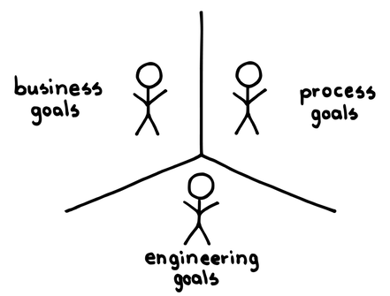
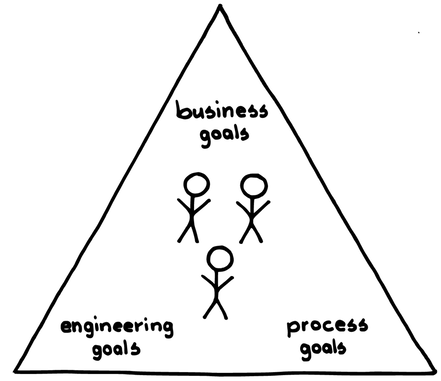

# 7 スクラムチーム

確信度：★★

{:style="text-align:center;"}
 
ビジョンを達成するために、チーム（プロデューサーとサポーター）が緊密に協力している。チームを守るために警護が必要である。

顧客のためのプロダクトの​`39 ビジョン`​があります。顧客が気に入るであろうアイデアを記録し始めており、こうしたアイデアを実現する必要があると考えています。プロダクトをどのように作るべきか、提案されたアイデアが適切かどうかは分かりませんが、学びを深めることで新しいアイデアが生まれるということは分かっています。

多くの素晴らしい`ビジョン`は、個人の努力だけでは実現不可能であり、そのような`ビジョン`を達成するためには、複雑なプロダクトの構築、市場への投入、フィードバックの活用をおこなう必要があります。

プロダクトの中には、個人で大きな成果を実現することが、どうしても難しいものもあります。フィードバックがない状態では、あまりにも簡単に価値の低いプロダクトを開発してしまいます。経験上、チームは個人を上回り、手を多くすることで、作業は楽になります。

経験、経歴、志向によって、個人は特定の分野に集中しがちです（例：生産とは対照的に、市場からのニーズを引き出す）。しかし、開発上のニーズはデリバリーごとに異なるため、過ぎた専門化は却って専門知識の不足につながってしまう可能性があります（例：ドキュメント作成やテスティングなどの開発タスクを放置して生産に入ろうとする）。役割の区別は、主にその役割の主要な活動の長期的なリズムの違いに基づいて行うべきです。例えば、リリースサイクルごとに市場へ対応する一連の役割、一日ごとの生産上の問題に対応する一連の役割があるかもしれません。

{:style="text-align:center;"}

business goals: ビジネスゴール

process goals: プロセスゴール

engineering goals: エンジニアリングゴール

ビジネスと開発の仕事のリズムが異なるのには、それなりの理由があります。両者を別々に働かせることで自律性を高め、それぞれが得意とする分野に集中できるようにします。良い点は、開発がプロダクトを出荷する準備を行っている間、ビジネスは他のことに取り組む自由を得られることです。悪い点は、ビジネスがプロダクト開発を発注し、プロダクトの出荷責任を別の開発組織に移す場合に発生する引き継ぎです。引き継ぎには納期が含まれることがあり、ビジネスの組織と開発の組織が切り離されているため、開発が実際に提供できるものに対して納期は恣意的になる可能性があります。そうなると開発にできる唯一のことは、生産速度を上げることだけになってしまいます。

プロダクト全体に関心を持つということは、気持ちの問題です。プロダクトの小さな一部を生産する組立ラインの作業者が、そのような考え方を身につけることは困難です。プロダクト全体への関心から切り離されることで、仕事の意義が感じられなくなり、ビジョンに対する当事者意識が奪われ、プロダクトの目的に共感できなくなります。

チームは学習と改善の場であるべきで、チームの構造は学習をサポートするべきです。複雑な問題を解決するということは、開発の最中に多くのことを学び、その学びを活かして解決策を浮かび上がらせるということです。ビジネスと開発の両方が、それぞれの世界観に関連したフィードバックを引き出して、行動できます。ビジネスの視点で上手くいくソリューションが、`93 最高の価値`をもたらすとは限りません。開発側の視点についても同様です。猛烈な勢いで開発を進めることと、プロダクト構築作業の知的な要求とが合わさって、目の前の問題だけに集中してしまいます。プロダクトを作るのに忙しすぎて、より良いプロダクトを作ることに気が回りません。そして、開発もビジネスも立場を超えたプロセスの問題に構わなくなってしまいます。これは、スクラムのルーツである日本で言われている「正しいプロセスを構築すれば、正しいプロダクトを構築できる」という観点からすると、非常に憂慮すべきことです。

迅速なフィードバックは、学習をタイムリーかつ効果的なものにします。異なる専門性や視点を持つ人たちが開発を通して一丸となって取り組むことで、学習の効果はさらに高まります。人はプロダクトの開発に集中していると、どうすれば改善できるかを考える時間が少なくなりがちです。

Therefore: それゆえ：

必要な能力をすべて備えたチームを組織します。プロダクトを作成し提供できる人々（`14 開発チーム`）、プロダクトの方向性を導く`11 プロダクトオーナー`​ 、そして学習を促進する`19 スクラムマスター`です。

{:style="text-align:center;"}

business goals: ビジネスゴール

process goals: プロセスゴール

engineering goals: エンジニアリングゴール	

` 開発チーム`は、プロダクトを実装し、エンドユーザーに届けるために必要なすべての作業を行うスキルと知識を持っています。`プロダクトオーナー`は、`スクラムチーム`を顧客とつなげ、ビジネスを体現する存在です。`スクラムマスター`は、`スクラムチーム`をコーチし、開発プロセスの継続的な改善を支援し、障害に対処するためのスキルと知識を持っています。

通常、`プロダクトオーナー`は自身の`ビジョン`を実現し価値を実現するために、`スクラムチーム`を編成します。そして多くの場合、`プロダクトオーナー`は企業内で活動し、大きな組織の中の小さな自律した企業として`スクラムチーム`を作ります。`プロダクトオーナー`は、`ビジョン`に向けてチームを導きます。チームは少数の開発者を迎えたり、時間の経過とともに成長することもありますが、どんな開発チームも7人程度の開発者からなる ​`9 小さなチーム`を超えることはありません。

開発者は`開発チーム`としてのアイデンティティを持ち、予測とコミットメントに基づき自らを管理します。`プロダクトオーナー`と開発者は協力して、`スクラムマスター`を雇うか指名します。`スクラムマスター`はプロセスに当事者意識を持ち、継続的な改善のためにチームを支援します。

` スクラムチーム`は、`プロダクトオーナー`をチームに含めるための枠組み以上のものです。`スクラムチーム`は小さなビジネスです。組織を背景に活動し、顧客に対応するための意思決定を独立して行うことができます。この構造の変化は、スクラムを用いてプロダクトを開発する上で大きな影響をもたらします。

` スクラムチーム`は、`プロダクトオーナー`の`ビジョン`を支える組織的な拠点となります。それぞれの`スクラムチーム`は、`16 自律したチーム`として、小さな企業のように運営されます。各チームは、共有された価値観を中心に集まり、`31 行動規範`を意識し、時にはそれを表明することもあります。

小規模でインタラクティブな`スクラムチーム`は、​`85 定期的なプロダクトインクリメント`​としてのプロダクトの開発を通して、`54 プロダクトバックログ`​へのフィードバックを得る機会を作ります。`開発チーム`は`プロダクトオーナー`と多くの時間を過ごし、仕事をする関係性を強固に築くことで、`開発チーム`はプロダクトの方向性をよく理解するようになります。`プロダクトオーナー`もプロダクトの実装について深く理解するようになり、`開発チーム`と`プロダクトオーナー`の間で、ROIやその他の価値を高めるような決定を共同で行うことに繋がっていきます。

` スクラムチーム`は、プロダクトの方向性やゴールを中心にチームを形成します。チームは定期的に集まり、レビューや計画づくり（`23 枠を決めて作業`​）などの定期的に行うことが決まっている作業や、`24 スプリントプランニング`​などの中核となるイベントに参加します。チームには目的があります。`スクラムチーム`によるプロダクトの方向性への明確な繋がりがなければ、チームの目的は分断されてしまいます。機能別サブグループはそれぞれ独立した目的を持っていますが、`スクラムチーム`の中にはそのようなグループはありません。プロダクト開発の風土もまた、`スクラムチーム`によって形成されます。プロダクトに求められるものが、高いセキュリティー、非常に早い提供、高い堅牢性のための連携を支える構造の何であれ、`スクラムチーム`は、プロダクト市場との繋がりによって、市場が求めるものを素早く実証できます。`開発チーム`と`プロダクトオーナー`が密接につながることで、開発全体を正しい方向に導く風土が醸成されます。複数の`スクラムチーム`は、必要に応じて非公式に連携し、またより正式には包括的に`37 メタスクラム`を通して連携します。

真のチームは`8 同じ場所に集まったチーム`​であることがほとんどです。チームを`小さなチーム`に従ったサイズにして、`10 機能横断チーム`である事を確実にし、チーム自身が、​`15 安定したチーム`​の原則に基づいて、時間の経過とともに`開発チーム`のメンバーシップを管理できるようにします。これにより、チームが自律的かつ自己組織的になり、プロダクトとの整合性を高める機会が生まれます。

共通のプロダクトを開発する複数の`開発チーム`は、同じリズム（`47 組織とスプリントの鼓動`）で仕事をします。必要に応じて自由にお互いを調整するほか、毎日正式に調整する機会として`34 スクラムオブスクラム`​があり、`46 スプリント`​​ごとに1回ずつ、​`35 スプリントレビュー`​と​`36 スプリントレトロスペクティブ`で調整が行われます。優れたチームは、プロセスの改善と生産への焦点を交互に切り替えるリズムで作業をします（`26 カイゼンパルス`​）。

緊急事態が発生した場合には、チームは例外的な行動をとり、リズムを中断することがあります。`32 緊急時手順`​を参照してください。

アウトソーシングやその他の共同開発プログラムでは、`スクラムチーム`の役割の配置に、`13 開発パートナーシップ`​を用いることを検討します。特に注意を払うのは、`プロダクトオーナー`をビジネスドライバー (推進要因)に近づけておくことです。

複数の人々が一緒に働くことで、個別にできることを合わせた以上のものを生み出すことができます。一方で、グループを作ると、調整とコミュニケーションのオーバーヘッドが発生します。これはプロセスロスと呼ばれます。`小さなチーム`によって、このプロセスロスに対抗します。

ジェフ・サザーランドは、トヨタ生産方式のワークセルの組織から`スクラムチーム`のコンセプトを発展させました。ワークセルは通常、チーフエンジニアとワーカーで構成されます。ジェフは、チーフエンジニアの役割を2つに分け、ビジネスへの注力は`プロダクトオーナー`が、プロセスへの注力は`スクラムマスター`が担うものとしました。

