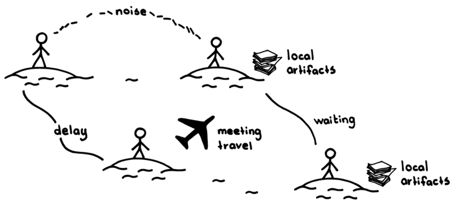
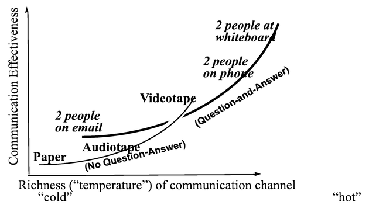

# 同じ場所に集まったチーム

 Original:[Collocated Team](https://sites.google.com/a/scrumplop.org/published-patterns/product-organization-pattern-language/development-team/collocated-team)

確信度：★★

{:style="text-align:center;"}

… あなたは​一つ以上の[小さなチーム](ch02_09_9_Small_Teams.md)を、[機能横断チーム](ch02_10_10_Cross_Functional_Team.md)​として立ち上げ、プロダクトに一緒に取り組んでいます。

{:style="text-align:center;"}
＊　　＊　　＊

**知識労働のような複雑な共同開発を効果的に行うには、高品質のコミュニケーションが必要になります。この成功のために必要なコミュニケーションのタイミング、頻度、長さを予測することは困難です。**

{:style="text-align:center;"}
 
noise: ノイズ delay: 遅れ local artifacts: 場所固有の作成物 meeting travel: 会議のための旅行 waiting: 待ち local artifacts: 場所固有の作成物

人によっては独りで仕事をすることを好みますし、パーティションで仕切られた作業場所があれば、人々が集中するための場所になります。また、自分専用のオフィスを持つことは、成功したキャリアの証なのかもしれません。どちらの場合も、進捗の小さい明確な兆候、例えば待ち望んでいた荷物が届いたときの歓声や、個人状況の掲示板の更新などは視界に入らず、気にすることもありません。それを補うために、私たちは人が集まるためのミーティングスペースを予約します。どのビルでもミーティングスペースの数は少なく、一緒に過ごすためのオーバーヘッドは大きくなってしまいます。結果として、人々が集まろうとする意欲を失わせ、、人と人とのコミュニケーションは減少してしまいます。人々は、情報伝達の忠実性が低いコミュニケーション手段であるIM、電子メール、電話、ファックス、電報、Jiraチケット、伝書鳩、郵便などにしばしば頼ります。

{:style="text-align:center;"}
 
Communication Effectiveness: コミュニケーションの有効性 Richness(“temperature”) of communication channel: コミュニケーション・チャネルの豊かさ（”温度”） “Cold”: “冷たい” “Hot”: “熱い”  (No Question-Anser): （質問と回答無し） Paper: 紙 Audiotape: オーディオテープ Videotape: ビデオテープ (Question-and-Anser): （質問と回答有り） 2 people on email: 二人でemail 2 people on phone: 二人で電話 2 people at whiteboard: 二人でホワイトボード

このグラフは、質問と回答が可能な場合とそうでない場合の2つの状況を表しています。”より暖かい”ということは、より多くの感情や情報が豊かに伝わることを示します（Agile Software Development [Coc06], pp.90-100）。

コミュニケーションは、単にメッセージを送受信できることだけではなく、受け手がメッセージを理解する必要があります。豊かなコミュニケーションチャネルは、個人間のコミュニケーションのニュアンスを言語的にも非言語的にも支えます。送り手と受け手の双方にとってメッセージがまだ「新鮮」なうちに理解を確認するためには、迅速なフィードバックが必要です。非言語的なコミュニケーションは、「感情を表現する、人と人の関係を伝える、言語的な相互作用を支える」ために重要です（Bodily Communication [Arg10], p.303）。

1977年に発表された「アレン曲線」によれば、人々が10メートルの距離まで離れた場合、少なくとも週に1回コミュニケーションをとる確率は10％以下でした（Managing the Flow of Technology [All77]）。近年のコミュニケーション技術の発展にもかかわらず、アレンはこの状況は改善されていないと述べています。

トーマス・J・アレンは、1977年に出版した『Managing the Flow of Technology』で、物理的な距離とコミュニケーションの頻度に強い負の相関関係があることを初めて測定した人物です。「アレン曲線」によると、6フィート(約2メートル)離れた場所にいる人とは、60フィート(約20メートル)離れた場所にいる人に比べて、定常的に4倍のコミュニケーションを取る可能性があり、別のフロアや別の建物にいる同僚とコミュニケーションをとることはほとんどありません。

しかし、オフィスはもはや単なる物理的な場所だけとは限られていません。私たちはログオンすれば、オフィスに入ることができ、どこからでも会議に参加でき、お互いに顔を合わせることなくドキュメントを共同で作成することができます。距離を縮める技術はアレン曲線を打破し、コミュニケーションはもはや距離とは無関係であるかのように思われます。

それは間違っています。アレン曲線は保たれています。それどころか、距離を縮める技術が加速するにつれ、明らかに近接性はより重要になってきています。Ben Waberの研究によると、対面のコミュニケーションとデジタルのコミュニケーションの両方がアレン曲線に従っていることを示しています。ある研究では、オフィスを物理的に共有しているエンジニアは、別の場所で仕事をするエンジニアに比べて、デジタルで連絡を取り合う傾向が20％高かったのです。また、密接な共同作業が必要な場合、同じ場所にいる同僚は、別の場所にいる同僚に比べ4倍の頻度で電子メールをやり取りし、その結果、プロジェクト完了までの時間が32％短縮されました(Harvard Business Review 92 [WML14]より)。

距離よりもさらに強力なのは、建物の構造上の特徴です。異なるオフィスは障害、異なる廊下は重大な障害、異なるビルの階は極度の障害、別々のビルは大惨事となります。世界最大の遠隔コミュニケーション会社のCEOは、遠隔コミュニケーションで人気の自社プロダクトは、複数拠点でのソフトウェア開発をサポートするのに適したツールではないと言っています。

{:style="text-align:center;"}
 
Distance Effects on Communications: コミュニケーションにおける距離の影響 Probability of communicating at least once a week: すくなくとも週に1回のコミュニケーションを取る確率 Separation distance (meters): 離れている距離（メートル）

人と人との距離が遠くなると、互いに週に1回のコミュニケーションを取る確率が下がります（Managing the Flow of Technology [All77]）。

物理的に離れているチームメンバーは、効果的に一緒に機能することができず、場合によっては全く機能しないこともあります。ニュージーランドのオールブラックスであろうと、3つのラグビー場で同時にプレーしたら勝つことはできません。（まあ、それでも何チームかには、勝てるかもしれませんが。）

それゆえ：

**同じ場所にチームメンバーを集めて、理想的にはチーム専用の一室で、会話ができる距離にしましょう。**Alistair Cockburnは、チーム全員がスクールバス1台分の長さに収まるように座ることを提案しています（Agile Software Development [Coc06]、p.102）。

{:style="text-align:center;"}
 
one mind: 心を一つに instant feedback: 即座にフィードバック shared resources: 共有リソース

同じ場所に集まることで、一緒に働く人々は、その場限りの会話を気軽にできます。人々は常にかつ素早く情報を共有します。また、同じ場所に集まったスタッフは、仕事以外のカジュアルな会話を楽しむことができ、チームの結束が高まります。

Reinertsenは、私たちに次のように諭しています。「同じ場所に集まることは、開発チームのコミュニケーションを向上させるための妖精の粉のようなものです。」（Managing the Design Factory: A Product Developer's Toolkit [Rei98]、p.113）。

しかしながら、中断されることなく静かに考えたり、電話をかけたり、ペアで話し合ったりすることが、時には必要になります。そのため職場環境には、必要に応じて使用できるスモールオフィスなどの静かな部屋を用意するべきです。もし、同じ場所に集まったチームがほとんどの時間をそうしたスペースで孤立して作業していたり、ほとんどの時間ヘッドフォンを装着していたり、コミュニケーションの大部分がSlackやその他の電子メディアで行われていたりすると、同じ場所に集まるメリットが著しく制限されてしまいます。​[スクラムマスター](ch02_20_19_ScrumMaster.md)​は、そのような行動の背景にある理由を探り、チームと向き合うべきです。

{:style="text-align:center;"}
＊　　＊　　＊

人によってはこうすることを居心地悪く感じるかもしれません。特に独り作業を好む人たちです。チームで働くこと、そして[同じ場所に集まったチーム](ch02_08_8_Collocated_Team.md)で働くことはすべての人に向いているわけではなく、このような人が組織から出て、自分の好みにより適した機関で働けるよう手助けする必要があるかもしれませんし、あるいはスクラムは彼らには向いていないのかもしれません。人によっては、広い範囲で頻繁に人と接すると自分の快適な領域から外れてしまうと感じるかもしれませんが、ほとんどの人はチームの幅広いニーズに自分の行動を適応させることができます。そうするために他の人よりも多くのエネルギーを必要とする人もいますが、効果的なチームワークのためには、このようなコミュニケーションが必要なのです。

大規模なチームを持ちたい、あるいは大規模なチームを持たなければならないと考えている組織にとって、同じ場所に集まることは非常に困難です。スペースがなかったり、場所を移すのに多額の移転費用がかかったりします。組織にとって、この状況を障害として扱うか、それともこの最適でない状態を受け入れるかは重要な節目となるでしょう。[小さなチーム](ch02_09_9_Small_Teams.md)、[機能横断チーム](ch02_10_10_Cross_Functional_Team.md)、[コンウェイの法則](ch02_04_4_Conway_s_Law.md)を参照してください。

乳児は母国語の音素に繰り返し触れることで、その音素を認識できるようになります。生身の人間の存在が非常に重要であることは研究で示されています。（生身の人間からの）外国語の音素にさらされた乳児は、（その後にオーディオや動画から聞いた場合でも）生身の人間から聞くのと同様に、外国語の音素を認識できるようになります。しかしながら、オーディオや動画メディアで音素を聞いた場合には、学習効果は見られませんでした（Nature Reviews Neuroscience 5 [Kuh04]）。コミュニケーションは社会的なプロセスであり、技術がコミュニケーション手段の自然さを制限すると、コミュニケーションは効果的ではなくなります。このことは、電話会議やビデオ会議が、効果的なコミュニケーションには不適切であることを裏付ける傾向があります。次の電話会議やビデオ会議では、そのセッションと対面での対話との違いを観察してみてください。一連の発言の間における、割り込み、オーバーラップ、相槌の量、また発言者が交代する際のフォーマルさの度合いなどの違いです。研究では、電話会議やビデオ会議は対面での対話を再現するものではないことが示されています（Human-Computer Interaction 8 [OWW93]）。

同じ場所に集まったチームのメンバーは、自分たちのアイデンティティと自分たちが作ったプロダクトに誇りを持つ可能性が高くなります。 ​([プロダクトプライド](ch02_39_38_Product_Pride.md)​を参照)

同じ場所に集まったチームメンバー間の信頼関係の構築は、意思決定が公平に行われるという認識とも大いに関連している。このことはチームの誇りや自尊心に影響を与え、さらに脆弱性や自己開示のプロセスにも影響を与える可能性があります（Trust in Virtual Teams: Organization, Strategies and Assurance for Successful Projects [Wis13], p.116)。

