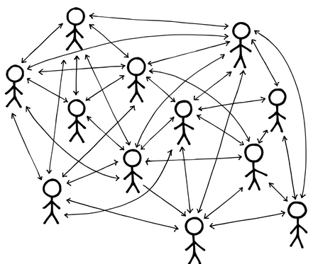

# スモールチーム

確信度：★★

{:style="text-align:center;"}
 
毎週月曜日の朝、5000人規模の会社のCEOは、“Hello Team.”という言葉で始まるメールを送っていた。私たちは皆、自分たちはワンチームではないと分かっていた。

...複雑なプロダクトの開発は共同作業であり、その構築のために、人々が一緒に働く必要があります。共通の目標に向かって一緒に働くとき、人々がチームとして働くことは、通常の場合、作業を最適化するための最良の方法です。

[Vision](https://sites.google.com/a/scrumplop.org/published-patterns/value-stream/vision)​が生まれ、それを達成しようとするエネルギーが、[もやもや](ch02_02_2_The_Mist.md)から現れるステークホルダーとなって集まってきています。

{:style="text-align:center;"}
＊　　＊　　＊

**膨大な量の仕事が待ち受けていると、総動員したくなるものです。しかし、プロダクトの設計や開発のような複雑な仕事には、高度な知識の共有と調整が必要になります。この種の仕事は、そうしたアプローチを拒むのです。**

難しい仕事を複数の人で行うことには、明らかな利点があります。多くの人の目と声があることで、チームは一人で行う際に起こりうるバイアスを避けることができます。また、複雑な開発の過程でチームが出くわす新たなフロンティアを探索することで、誰もが直に学ぶことができます。これは、大人数のグループが一緒に働くことに繋がります。そのようなチームにはスペシャリストが集まり、それがチームを成長させる傾向にあります。

締め切りがあるので、並行で働いて完成させるために、できるだけ多くの人を配置したくなるかもしれません。しかし、作業を独立した部分に分解できない限り、節約したつもりの時間は、コミュニケーションや調整のオーバーヘッドに食い尽くされてしまいます。

組織内の地位がチームの大きさに比例する状況であれば、組織の政治の一部として大きなチームが現れます。

大きなチームを組んで一緒に働くということは、小さなチームの数を減らすことを意味します。大きなチームを持つことで、小さなチームをたくさん持つことの煩わしさが軽減されると考えがちです。しかし、大きなチームで煩わしさが軽減されるということはありません。大きな組織は、物事を完成することのできる小さな（サブ）チームに自己組織化します。大きなチームを１つ持つことで簡単になると思うかもしれませんが、結局は小さなチームを山のように持つことになります。そこで、上手く行く方法や、人々のグループが自然に進化する構造から始めてはどうでしょうか？

大きなグループが、相互に依存するタスクで一緒に働くと、残念なことに予期せぬ問題が発生してしまいます。

一緒に働く人が増えれば増えるほど、コミュニケーションのオーバーヘッドは大きくなります。効果的なチームワークには良好なコミュニケーションが不可欠ですが、このオーバーヘッドはコミュニケーションの質に悪影響を及ぼします。グループが大きくなると、グループ内の情報の伝達は比例して少なくなりますが、人数が増えれば増えるほど、より多くの情報が伝達される必要があります。極端に言えば、コミュニケーションと調整のオーバーヘッドは、グループのリソースをほぼすべて使ってしまい、生産的な仕事をする時間はほとんどなくなってしまいます。これは、コンピュータの「スラッシング」と呼ばれる問題に似て、実際には何も達成されることなく多くのエネルギーが費やされます。

あるいは組織は、コミュニケーションを交わす場所として、管理職、意思決定フォーラム、委員会など、それ自体が組織構造であるものを指定するかもしれません。このような余分なコミュニケーションの結び付きは、コミュニケーションのボトルネックとなったり、コミュニケーションの忠実性を損なったり、その両方を引き起こしたりします。

{:style="text-align:center;"}

大きなグループでは、各個人の相対的な貢献度が低下します。このことはモチベーショ ンに無視できないほどの影響を与える可能性があり、タダ乗りや社会的手抜き（グループだと個人の貢献度が一人で作業するよりも低くなること）はチームサイズが大きくなるほど、増加します。その結果、大きなグループは小さなグループよりも成果が少なくなったり、大きなグループは小さなグループよりも質の低い成果を生み出す可能性があります。

大きなグループで人々が一緒に働くとき、その個人個人を調整する必要性は大きくなります。この調整の労力は、プロセスロスと呼ばれます。1972年にシュタイナーが述べたように、チームの実際の生産性は、潜在的な生産性からプロセスロスを差し引いたものになります(Group Process and Productivity [Ste72], p. 9)。チームの規模が大きくなるとプロセスロスも大きくなるため、チームの規模が大きくなるほど生産性の伸びが実質的に制限されます。このような状況では、チームは調整をサポートするために、付加価値のない役割をどんどん追加し、チームの生産性を実質的に低下させてしまいます（チーム内のこうした役割の数を「ウォーリー数」といいます。スコット・アダムの『ディルバート』のキャラクターにちなんで名付けられたものです）。

クリストファー・アレグザンダーは、グループの規模が大きくなるとコミュニケーションの有効性が低下するという研究を引用しています。彼のパターン「小さな会議室」では、会議のあいだ「12人のグループでは、1人はまったく話をしません。24人のグループでは、6人がまったく話をしません」（A Pattern Language [AIS77]のパターン151「Small Meeting Rooms」）と述べています。

論理的な推定によって、より大きなチームを持つことにつながるにもかかわらず、、こうした大人数のグループには大きな問題が伴ないます。

それゆえ:

**人々を[小さなチーム](ch02_09_9_Small_Teams.md)にして、偽の並列性を追求するのではなく、直列化した作業に取り組むようにします。**

[スクラムチーム](ch02_07_7_Scrum_Team.md)​は5人程度と考えましょう。彼らには適切な専門知識と共同作業を行う能力が必要であり、それは​[機能横断チーム](ch02_10_10_Cross_Functional_Team.md)につながります。

{:style="text-align:center;"}

[小さなチーム](ch02_09_9_Small_Teams.md)で働く人々は、チームやチームの目標に対してより大きな愛着を持ち、話を聞いてもらえる機会が多いためチーム内でのコミュニケーションが良好で、一般的に生産性が高いと言われています。[小さなチーム](ch02_09_9_Small_Teams.md)は、社会的手抜きやプロセスロスなどのチームワークのマイナス効果を克服するだけでなく、ケーラー効果（チーム内で最もパフォーマンスの低いメンバーにならないようにするモチベーション）などのプラスの効果を促進します。

{:style="text-align:center;"}
＊　　＊　　＊

小さな[機能横断チーム](ch02_10_10_Cross_Functional_Team.md)で、​​[Regular Product Increment](https://sites.google.com/a/scrumplop.org/published-patterns/value-stream/regular-product-increment)を作成するために誰がチームに参加する必要があるのか、答えを出すのは難しいかもしれません。これを解決するために（マネージャーなどの）神託を下す者や他の追加の役割などのオーバーヘッドを発生させるのではなく、`4.2.11. 自分たちで選んだチーム`を使ってみてください。チームサイズが成長し始めるときは、成長することで補おうとしている組織的な問題をより深く探求する機会となります。例えば、過度に複雑なアーキテクチャは、インクリメントを完成させるために、チームで多くの専門家が一緒に働くことへの依存につながるかもしれません。このような問題を解決して、チームが小さくてもプロダクトインクリメントが提供できるように保つ努力をすることは、良い投資になります。そのような整頓は、プロダクトとプロセスの両方にメリットがあります。

広範な研究の努力により、小さなチームの方が大きなチームよりも多くの面で効果的であること、また、人々は大きな組織にいるよりも小さなチームにいることを好むことが示されています。1958年、スレーターの研究に参加した人々は、大きなチームよりも5人のチームにいることを好みました(Group Process and Productivity [Ste72], p. 86)。チームのメンバーは、大きなチームは協調性が低く、アイデアを共有するのが難しく、チームメンバーの時間を有効に使うことができないことを発見しました。また、小さなチームのメンバー（2人から4人）は5人までのチームに所属することを好み、小さなチームサイズが好まれることが示されました。1992年に亀田らが行った研究では、チームサイズを大きくするとパフォーマンスは向上し、その後ある一定のポイントを超えるとパフォーマンスが低下することが示されました。この実験では、2人、4人、6人、12人のチームサイズが使用されました。結論は、メンバーが4人のチームのパフォーマンスが最も高いというものでした(Social Psychology Quarterly 55 [KSDP92])。ソフトウェア開発に関するより最近の研究では、9人以上のメンバーがいるチームは、9人未満のメンバーがいるチームよりも生産性が低いことがわかりました(Journal of Systems and Software 85 [RSBH12])。他の研究では、最高の個人よりも優れたパフォーマンスを発揮するために必要十分な最小限の人数は3人であると示されています。したがって、小さいことは美しいことですが、有効なチームサイズの下限はおそらく3人となります(Journal of Personality and Social Psychology 90 [LHSB06])。

チームに最適なサイズを見つけるための実験をしてください。ここでは最適な数は与えられません。ほとんどの取り組みは1人か2人から始まり、その後、正式に資金提供を受けて成長していきます。優れたチームは、機能する小さなチームから育つということを忘れないでください。チームメンバーを新しく追加することには、大きな不安が伴います。欠けている専門知識を補うためにチームを大きくするよりも、クロストレーニングを行ってチーム全体の専門知識を広げる方が、長期的にはほとんどの場合において良い結果をもたらします。適正なサイズにするために大きくなりすぎたチームから人を削減すると、壊れた人間関係で悲しみに暮れる人が出てくることになります。それよりも、グループから人を移動させる自然な機会を探す方が良いでしょう。例えば、人員の自然減、昇進、あるいはチームメンバーが自発的に他のチームでのキャリアの機会を求めるなどです。

大きなチームは（統計的に見て）小さなチームよりも多くの人が入れ替わるので、チームが大きくなればなるほど、そのメンバーが長期にわたって安定している可能性は低くなります。それゆえに[小さなチーム](ch02_09_9_Small_Teams.md)は​[安定したチーム](ch02_15_15_Stable_Teams.md)を後押しします。

チームが大きすぎる状態になり始めた場合は、​[有糸分裂](ch02_18_18_Mitosis.md)を検討してください。

