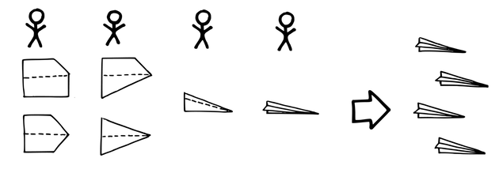
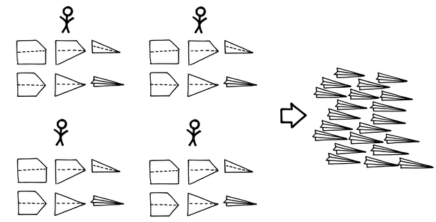

# 機能横断チーム

確信度：★★

{:style="text-align:center;"}
 
チームは全体として、プロダクトの提供に必要なすべての才能を備える必要がある。

...[スクラムチーム](ch02_07_7_Scrum_Team.md)は、開発の取り組みを組織化し、チームメンバーを選び、チームのスキルセットをどのように成長させるか評価しています。

{:style="text-align:center;"}
＊　　＊　　＊

**[スクラムチーム](ch02_07_7_Scrum_Team.md)は、複雑に関連するタスクを完了するために必要となるすべてのスキルを持っていないため、自律的に作業することができません。チーム外の人のスキルに依存することで、チームは自分たちのタスクを終わらせることにオーナーシップを持てなくなります。終わらせるまでにかかる時間に対するチームの影響力が低下し、最終的な品質が損なわれる可能性があります。**一貫性と再作業の削減というリーンの中核となる原則は、短いフィードバックループに依存しています。ほとんどの複雑な開発は、人的要因、エンジニアリングの卓越、品質保証など、さまざまな分野から数多くの才能を持った人材が必要となります。個人はもちろんのこと、一つのチームのメンバーの中にこうした才能のすべてを見出すことは稀です。チームは、多くの場合コンピテンシー領域に基づいて組織され、同じ類の人が集まります。これを機能別組織と呼ぶこともあります。しかし、チームの境界を越えてこうした調整を行うにはコストがかかります。なぜなら、効率的なコミュニケーションは、現在の仕事のコンテキストが共有された人たち、つまり通常はチームのメンバーの間で行われるものだからです。

{:style="text-align:center;"}

複雑なプロダクトでは、チームは「完成した」機能（​[Definition of Done](https://sites.google.com/a/scrumplop.org/published-patterns/value-stream/definition-of-done)を参照​）を開発するために、多くのスキルを習得する必要があるかもしれません。作業に必要となるスキルごとに人員を追加すると、チームが大きくなりすぎて効率的ではなくなります。チーム内のスキルセットを拡張せず、代わりに外部への依存を持ちこみたくなるかもしれません。一方で、チームに作業を任せて、必要なスキルを開発・習得してもらうという選択もあるでしょう。しかし、学習には時間がかかります。

局所的な学習は局所的な最適化、つまり専門家グループが自分たちの仕事を最適化するプラクティスやプロセスを開発することになります。専門化、局所的なプラクティスやプロセスはいずれも組織の効率化の源となりますが、グループの境界で問題を引き起こす可能性があります。こうした問題に対処するために、組織は「契約」を定め、お互いにどのように仕事をするかを示すことができます（例：業務依頼）。このような契約では、要求に対し期待する対応期間など、作業について組織が望むような性質が規定されることもあります。そのグループの専門性を必要とする人は皆、この契約を利用する必要があります。しかしながら、こうすることで個別部門の効率は上がっても、プロダクト全体の開発は遅くなる可能性があります。さらに、境界にあるこうした契約を管理するために、組織内に追加の調整グループが必要になるかもしれません。例外事項の交渉をしたり、すべての当事者が必要事項を理解していることを確認したり、各チームが契約に基づいて、他のチームや顧客に対する義務を果たしていることを確認するためです。

新しいプロダクトや既存のプロダクトの新バージョンは、それぞれが顧客のために新しい世界を創造するものです。この新しい世界がどのようなものになるのか事前に知ることができないため、プロダクトが進化するにつれ実験と学習に焦点をあてる必要があります。チームは、事前に用意された計画に従うのではなく、各プロダクトインクリメントを実際の顧客が使った経験から教訓を見いださなければなりません。そして、その教訓をプロダクト開発のプロセス全体へ統合しなければなりません。プロセスの各ステップや機能エリアの中で、個人として働くことで得られる局所的なフロー、自律性、コントロールの利点は、誰もが認識しています。しかし、そのような仕事の構造は、（最後のステップを行う人を除く）全員をエンドユーザーからも、エンドユーザーとの境界での相互作用から得られる幅広い洞察からも、遠ざけてしまいます。これでは、局所的な機能の最適化になってしまい、プロダクト開発のプロセス全体に渡るような大きな最適化はされません。

それゆえ：

**それぞれのスクラムチームは機能を「完成」し提供するために必要となる、すべての才能を含むべきです。**

最初にチームを作る時、スキルセットのカバー率に注意を払うのは良いことです。しかし、チームの設立メンバーが[Vision](https://sites.google.com/a/scrumplop.org/published-patterns/value-stream/vision)に対する熱意を共有し、新しく物事を学ぶ実績があることがより重要です。物事は時間とともに変化するため、長期的に必要となるスキルを最初からすべて予測することは難しいでしょう。

{:style="text-align:center;"}

{:style="text-align:center;"}
＊　　＊　　＊

新しいスキルが必要になるたびにチームのメンバーを変えるのではなく、内部で人材を育て、[小さなチーム](ch02_09_9_Small_Teams.md)、[安定したチーム](ch02_15_15_Stable_Teams.md)を目指しましょう。時間をかけ、チームメンバーをクロストレーニングして、より多くのコンピテンシー領域に適応できるようにスキルセットを拡大します（`4.2.24. トラックナンバーはほどほどに`を参照）。こうすると、チームが[自律したチーム](ch02_16_16_Autonomous_Team.md)​として機能する​能力が高まります。[機能横断チーム](ch02_10_10_Cross_Functional_Team.md)では、`5.1.13. 作業を均等に配分せよ`が容易になります。

チームメンバーには今、副次的なスキルを学ぶあらゆる機会があります。彼らは​[Product Backlog Item](https://sites.google.com/a/scrumplop.org/published-patterns/value-stream/product-backlog/product-backlog-item)​s (PBIs)に群がる（​​[スウォーミング：1個流し](ch02_26_25_Swarming_One_Piece_Continuous_Flow.md)を参照）ことができます。これは学習の機会を増やし、機能を早く「完成」できるようにフローを最適化するものです。副次的なスキルを身につけることで、チームはより柔軟になり、手の空いていないメンバーの代わりに誰でも作業できるようになります。チームは常に進捗し、自律しています。

スクラムは、欠けているコンピテンシーの取り扱いについて言及していません。常識に従いましょう。例えば、チームが驚くぐらい大きな作業のインクリメントを、他のチームに依頼したり、外注したりするとします。時々、チームがそうした助けを必要とするのは理解できます。しかし、もしチームが頻繁に外部の力を借りているようであれば、それは障害であり、その状況を改善するための対策（トレーニング、組織変更、雇用など）を講じるべきです。

例えば、ソフトウェアプログラマーのチームが、医薬品や航空宇宙など、自分たちの専門外の分野のプロダクトを開発することになったとします。このような場合、不足するコンピテンシーごとにチーム内の人を任命して、外部のドメインエキスパートに相談したいと思うかもしれません。しかし、チームの代表者は、自分達がどれだけ知らないか、そしてドメインエキスパートにどのような質問をすればよいかすらも、分からないかもしれません。ほとんどのドメインエキスパートは、ドメインの専門知識を暗黙知として持っているので、ソフトウェア担当者の適切な実装をサポートするための適切な洞察を埋め合わせる立場にはありません。チームのメンバーが、ドメインを考慮して実装に与える影響を理解することや、ビジネスとソリューションの両方の領域について十分な知識を持つことが極めて重要です。最近の記事で、アマゾンのジェシー・ワトソンは、この2つの要素が「1つの頭蓋骨の中で」共存することが極めて重要だと指摘しています[19]。専門家をチームに迎え入れ、クロストレーニングで知識を広げていくのがよいでしょう。ただし、[小さなチーム](ch02_09_9_Small_Teams.md)を忘れてはいけません。専門家を追加するとチームが大きくなり、チームワークがほとんどなくなってしまう可能性があります。

こうしたチームは自然と「フィーチャーチーム」（[コンウェイの法則](ch02_04_4_Conway_s_Law.md)を参照）のように振る舞います。なぜなら、ほとんどのPBIはフィーチャーの形をしているからです。フィーチャーとは、市場性のある要素で、収益を生み出し機能するプロダクトインクリメントに含まれます。[機能横断チーム](ch02_10_10_Cross_Functional_Team.md)がプロダクトを開発する場合、引き継ぎは[Value Stream](https://sites.google.com/a/scrumplop.org/published-patterns/value-stream)から自然に消えていきます。どんなフィーチャーであっても外部のサポートや介入を受けることなく、チーム自身で開発できるからです。複数のチームを巻き込むことは、フィードバックループに遅れを生じさせ、手直しのムダ（waste）を増やし、[Value Stream](https://sites.google.com/a/scrumplop.org/published-patterns/value-stream)内の開発ステージ間にムラ（inconsistency）を生みます。

Harvard Business Review誌に掲載された、機能別組織と製品別組織の2つの企業の研究では、機能横断チームは両方の組織構造の最良の特徴を提供することが示されています（「Organizational Choice: Product vs. Functionˮ in Harvard Business Review 46 [WL68]」を参照）)。

[Set-Based Design](https://sites.google.com/a/scrumplop.org/published-patterns/value-stream/set-based-design)は、たとえ最終的には現在の製品に採用されなくても、ビジネスに関連しそうな多くの分野やドメインに開発者を関わり続けさせる手法です。このようなプラクティスは、チームや企業の専門知識の基盤を広げ、チームが予期しなかった新しい分野の習得が必要になる可能性を減らします。

チームが新しい学びを統合することで、新しいプロダクトのアイデアが生まれます。変化は素早く進行します（そして素早く進行させなければいけません）。変化は例外ではなく、むしろ普通なことです。それには、何が起きているか全員が知っているような小さな組織が必要になります。変化を受け入れ、専門性を越えて働き、定期的に価値を提供できる組織です。別の言葉で言うと、「アジャイル」な組織です。

**ゲーム**

いくつかの小さなチームを作って、紙飛行機を作って飛ばすゲームを競いましょう。チームの各メンバーは、一度に一回だけ折ることができ、一度折ったあとは、別の紙飛行機に移らなければなりません。飛行機は、15回を超えて折ってはいけません。長さは15センチ以上、幅8センチ以上なければなりません。先端は尖っておらず、幅は2センチ以上なければなりません。品質の高いプロダクトであると保証するためには、テスターがテストしたときに、紙飛行機は3メートル水平に飛ばなければなりません。テスターはそれぞれの紙飛行機を一度だけテストできます。

ゲームをおこない、スクラムのパターン（ヒント：[スウォーミング：1個流し](ch02_26_25_Swarming_One_Piece_Continuous_Flow.md)）を適用し、1分間のスプリントで、品質の高い飛行機が作られる数を最適化してください。

