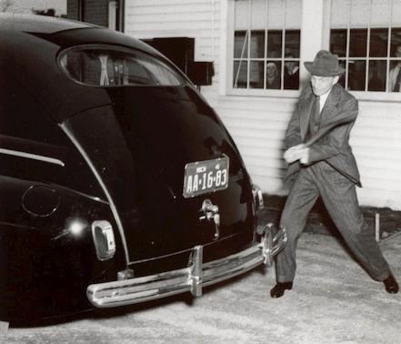
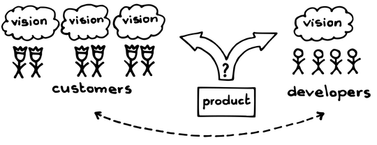
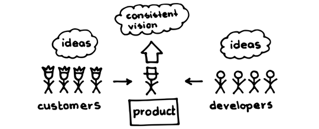

# プロダクトオーナー

 Original:[Product Owner](https://sites.google.com/a/scrumplop.org/published-patterns/product-organization-pattern-language/product-owner)

確信度：★★

{:style="text-align:center;"}
 
ヘンリー・フォードは、自ら思い描いた車を（斧で叩いて）テストした。車は彼の会社が、麻から作ったものだった。

訳注：ヘンリー・フォードは、ヘンプカーとして知られる車体が麻(hemp)の繊維で作られ、麻由来のバイオ燃料で走る車を作りました。

...[ビジョン](ch03_02_39_Vision.md)やできる限りの良い成果について、誰もが自分なりの大まかな考えを持っていますが、一方でコミュニティはその情熱と熱意を結集できるリーダーを探し求めています。

**ひとりが、[Product Backlog](https://sites.google.com/a/scrumplop.org/published-patterns/value-stream/product-backlog)に責任を持つ必要があります。**この人物には、深いドメイン知識や、ビジネスの洞察力、プロダクトの技術や技術的な依存関係への理解、そしてビジネス価値を最大化するために、バックログを強制的に順位付けする権限が必要です。

{:style="text-align:center;"}
 
Vision: ビジョン Customers: 顧客 Product: プロダクト Developers: 開発者

[スクラムチーム](ch02_07_7_Scrum_Team.md)のメンバーは、価値提供に集中するために、単一の、よく整えられ、順序づけられた、[プロダクトバックログアイテム](ch03_21_55_Product_Backlog_Item.md)​sのリストを必要とします。このリストがなければ、チームは市場に使われることのない機能や、ほとんど使われない機能を作ってしまうかもしれません（そしてチームはそれを維持する労力を払うことになります）。また、チームは間違ったタイミングで機能を提供したり（収益の部分最適化）、何も提供しないかもしれません。チームのベロシティを支え最大化するために、スクラムチームは適切なタイミングにバックログを必要とします。しかし、委員会方式ではこの適切なタイミングを実現できません。また、委員会では妥協を含み、やや一貫性を欠いた結論になりがちです。

あまりにも多くの組織が、プロダクトの市場投入のための計画表作りに、複数の人やグループを投入しています。複数部門のスタッフが、それぞれの視点からプロダクトの市場投入のための計画を作るプロセスに参加します。複数の視点を持つことで、プロダクトを消費者に最も効果的に届ける方法への洞察が広がるという意味では、これは良いアイデアです。しかしながら、このような委員会は、企業内部の任務を代表して行動してしまい、真に価値がある市場の関心事から切り離されることが多すぎるのです。さらに、これらのグループには意思決定を行う権限がなく、別のグループがプロダクトの重要な意思決定をする権限を持つという「スポンサーシップ」が必要なことがよくあります。意思決定は、プロダクトに関する作業や、作業を行う人々の両方から遠く離れたところで行われます。このような意思決定は、開発者がこのプロセスに参加していない場合（あるいは参加していても）、開発者のやる気を奪うことになります。議論は、[Value Stream](https://sites.google.com/a/scrumplop.org/published-patterns/value-stream)​s​の末端にいる人々の利益ではなく、しばしば政治的な配慮、支配権の保持、特定の支持者の利益増加に陥ってしまいます。このような交渉は、プロセスを遅らせ、プロダクトの提供を遅らせ、品質を低下させ、バックログの一貫性を損なうのです。

組織によっては、市場投入のための計画を上司やマネージャーからなる委員会に委ねるところもあります。彼らは、プロダクトは何かということにさえ合意できないこともあります。こうした状況では、一点に集約する事なしに、うまくいくことはほとんどありません。プロダクトの開発を明確にリードする人が必要なのです。

よくある方法は、プロジェクトマネージャーを雇ってチームの日々の作業を監督することです。プロジェクトマネージャーは、経営陣が「無視するには重要すぎるが、自分たちに差し迫っている課題から目をそらすほどには重要ではない」と感じている作業を行います。これは非常に一般的で、どこにでもあることですが、実際にはプロダクトの提供を遅らせ、品質と収益性を低下させるでしょう。第一に、組織はプロジェクトを遂行しているのではなく、プロダクトを作っているのです。プロジェクトで行う開発が完了しても、プロダクトはまだ現場にあり、保守や追加機能の開発に関する質問をしても不適切な答えしか得られません。プロダクトの作成と継続的な開発（「保守」）を組織的に分離することは、多くの問題を引き起こします。第二に、会社がプロジェクトマネージャーにROIや正味現在価値（[Value and ROI](https://sites.google.com/a/scrumplop.org/published-patterns/value-stream/product-backlog/value-and-roi)を参照）など価値に対する責任を与えることはほとんどありません。そのためプロジェクトマネージャーのインセンティブは、財務上の制約の中でできる限り早く納品することとなります。このような責任の欠落により、プロジェクトマネージャーは長期的に影響がある決定を短期的な判断でおこなうことが多くなります。そして短期的な決定が長期的にプラスの影響を与えることはほとんどありません。

ベータサイトとしてユーザーを継続的に巻き込み、製品を洗練させていくことで収益を最大化することはできます（この場合、成果物はベータ版の提供となります）。しかしながら提供側の人間が、事前の計画や判断に責任を持つ方が、顧客の満足はより高くなります。リーンでは、意思決定することを早い段階で列挙しておき、いざという時、容易に決断できるようにすることが重要だと言われています。

それゆえ：

**[プロダクトオーナー](ch02_11_11_Product_Owner.md)を起用し、[Product Backlog](https://sites.google.com/a/scrumplop.org/published-patterns/value-stream/product-backlog)の順序付けを任せ、プロダクトのビジョンとそのビジョンの実現から生まれる価値に対する責任を持ってもらいます。**

{:style="text-align:center;"}
 
Ideas: アイデア Customers: 顧客 Consistent vision: 一貫したビジョン Product: プロダクト ideas: アイデア Developers: 開発者

{:style="text-align:center;"}
＊　　＊　　＊

[プロダクトオーナー](ch02_11_11_Product_Owner.md)は自身のプロダクトを所有します。プロダクトの内容や提供順について最終的な決定権を持っています。[プロダクトオーナー](ch02_11_11_Product_Owner.md)の役割は、単にプロダクトを「管理」する、ということではありません。それもありますが、それ以上にプロダクトは自身の子供であり、情熱なのです。真の[プロダクトオーナー](ch02_11_11_Product_Owner.md)は、[プロダクトプライド](ch02_39_38_Product_Pride.md)によって突き動かされているのです。

[プロダクトオーナー](ch02_11_11_Product_Owner.md)は、プロダクトの内容、提供、スケジュールに関する問題に対する単一窓口となります。[プロダクトオーナー](ch02_11_11_Product_Owner.md)は、自身が所有するプロダクトの市場投入を最終的にコントロールし、その結果のROIに説明責任を持ちます。この役割に、社員を割り当てる必要があるためコストがかかりますが、優れた[プロダクトオーナー](ch02_11_11_Product_Owner.md)は、プロダクトの収益の流れを劇的に向上させ、提供する価値を増加させることができます。

最高の[プロダクトオーナー](ch02_11_11_Product_Owner.md)は、価値提供に限りなく近い存在です。ステークホルダーは複数存在します。エンドユーザー、エンドユーザーがプロダクトを使うことで収益を得る組織、規制当局・法律問題・標準化団体の関係者、そして他にも多くの人々が潜在的に存在します。ステークホルダーが[プロダクトオーナー](ch02_11_11_Product_Owner.md)になれないことはよくあります。知識が限られていたり、利益相反があったり、意思決定の権限がなかったりするためです。[プロダクトオーナー](ch02_11_11_Product_Owner.md)の主要な成功指標の1つは、プロダクトからの価値創出、つまりビジネスプランです。

スクラムに顧客は存在しません。顧客の役割は、現実世界の多くのバリューストリームに存在します。スクラムは、エンドユーザーとビジネスのパートナーシップという、リーンのビジョンを反映する傾向があり、それは敵対的もしくは距離のある関係、あるいは壁越しのコミュニケーションではありません（[開発パートナーシップ](ch02_13_13_Development_Partnership.md)を参照）。顧客は市場への道を現実のものにできますが、企業は顧客が遅延と無駄をもたらす追加の受け渡しであることに留意する必要があります。これらは多くの場合、プロダクトオーナーが取り除くべき障害となります。スクラムでは、顧客を含むすべてのステークホルダーの利益を[プロダクトオーナー](ch02_11_11_Product_Owner.md)が代表します（`4.2.7. 顧客の代理`を参照）。[プロダクトオーナー](ch02_11_11_Product_Owner.md)が、チームの外のすべてのビジネス関係を管理することにより、ビジネスのビジョンと開発努力の間の受け渡しがなくなります。

[スクラムチーム](ch02_07_7_Scrum_Team.md)は、組織内の他の声は無視して、[プロダクトオーナー](ch02_11_11_Product_Owner.md)に耳を傾ける必要があります。そうすることで、チームは集中を維持することができます。[開発チーム](ch02_14_14_Development_Team.md)は、チームの作業の方向性や優先順位を変えたいと望む人々への対応を[プロダクトオーナー](ch02_11_11_Product_Owner.md)に任せるべきです。こうした場合に、[スクラムマスター](ch02_20_19_ScrumMaster.md)​は、[開発チーム](ch02_14_14_Development_Team.md)を割り込みから守るという支援をするべきです。

[Product Backlog](https://sites.google.com/a/scrumplop.org/published-patterns/value-stream/product-backlog)は、[プロダクトオーナー](ch02_11_11_Product_Owner.md)の[ビジョン](ch03_02_39_Vision.md)を達成する方法について、すべての会話に関わる決定を文書化したものです。理想的には、（特に[開発チーム](ch02_14_14_Development_Team.md)の視点に関して）合意された見解を反映したものとなりますが、その内容や順序について、[プロダクトオーナー](ch02_11_11_Product_Owner.md)が最終的な決定権を持ちます。それぞれの[スクラムチーム](ch02_07_7_Scrum_Team.md)は、その[開発チーム](ch02_14_14_Development_Team.md)のために、一つの[Product Backlog](https://sites.google.com/a/scrumplop.org/published-patterns/value-stream/product-backlog)を作成する一人の[プロダクトオーナー](ch02_11_11_Product_Owner.md)を必要とします。もし複数のチームが一つのプロダクトを一緒に開発している場合、これらのチームの作業を推進する[Product Backlog](https://sites.google.com/a/scrumplop.org/published-patterns/value-stream/product-backlog)は一つにするべきです。

私たちは、[ある]テーマについて本当に情熱を持つ人々を集めて、チームを結成します。もし、作ろうと思っているプロダクトはこれだ、という70ページのドキュメントをあなたが書いてしまうと、実際にはプロセスで創造性を押し殺してしまうことになります。「ええっと、あなたが忘れているこんな機能があって、ぜひ追加したいのですが」というエンジニアがいたとします。その創造性をプロダクトから排除したくはないでしょう。

チームが、ビジョンの実現のために協力し、なおかつチームの各メンバーが創造的に参加できるだけの余地を十分に残しておく合意重視のアプローチは、本当に刺激的で、これまでで最高の結果をもたらしています。[20]

[Product Backlog](https://sites.google.com/a/scrumplop.org/published-patterns/value-stream/product-backlog)の作成に時間がかかりすぎたり、一人では提供できない専門知識を要する場合、[プロダクトオーナー](ch02_11_11_Product_Owner.md)は自分と一緒に取り組む[プロダクトオーナーチーム](ch02_12_12_Product_Owner_Team.md)​を形成するべきです。自分自身はチーフ[プロダクトオーナー](ch02_11_11_Product_Owner.md)となって、[Product Backlog](https://sites.google.com/a/scrumplop.org/published-patterns/value-stream/product-backlog)の並べ替えに関する最終的な決定権を持ちます。

誰でも[Product Backlog](https://sites.google.com/a/scrumplop.org/published-patterns/value-stream/product-backlog)の内容として何かを提案できます。提案者は、[プロダクトバックログアイテム](ch03_21_55_Product_Backlog_Item.md)を完全な形にするための支援を提供しなければならないという点において、そのアイテムは提案者のものです。[プロダクトオーナーチーム](ch02_12_12_Product_Owner_Team.md)は、そのアイテムを全体の[Product Backlog](https://sites.google.com/a/scrumplop.org/published-patterns/value-stream/product-backlog)の中で並べ替えます。繰り返しますが、並べ替えの最終決定権は[プロダクトオーナー](ch02_11_11_Product_Owner.md)が持ちます。

優れた[プロダクトオーナー](ch02_11_11_Product_Owner.md)は、健全なユーザーエクスペリエンス(UX)のスキルセットを持っているか、少なくともそうした専門性を[プロダクトオーナーチーム](ch02_12_12_Product_Owner_Team.md)で活用できます。UXのスキルを持つチームメンバーが、優しく説得し、配慮や気配りをすることで、[プロダクトオーナー](ch02_11_11_Product_Owner.md)は、時が経つにつれ、こうしたスキルの多くを身につけることができます。

プロダクトオーナーは、​[Product Roadmap](https://sites.google.com/a/scrumplop.org/published-patterns/value-stream/release-plan/product-roadmap)​と[Release Plan](https://sites.google.com/a/scrumplop.org/published-patterns/value-stream/release-plan)にも責任を持ちます。

[プロダクトオーナー](ch02_11_11_Product_Owner.md)のポジションを埋めることはしばしば困難です。ビジネスの専門家（ときにはCEOの場合も）は、ビジネスへの情熱や知識を持っているかもしれませんが、[Product Backlog](https://sites.google.com/a/scrumplop.org/published-patterns/value-stream/product-backlog)を完全に管理するだけの十分な時間はありません。開発組織が小さかったり、若い場合は特にそうなります。[開発チーム](ch02_14_14_Development_Team.md)のどのメンバーでも、今いる[プロダクトオーナー](ch02_11_11_Product_Owner.md)と相談することで、[プロダクトオーナー](ch02_11_11_Product_Owner.md)の仕事を何かしら引き受けられるかもしれません。また、[プロダクトオーナー](ch02_11_11_Product_Owner.md)が不在の場合には、一時的にその役割を果たすこともできます。[開発チーム](ch02_14_14_Development_Team.md)と[スクラムマスター](ch02_20_19_ScrumMaster.md)は、そうした状況が無期限に続くことのないようにすべきです。

