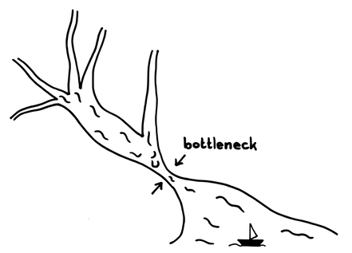
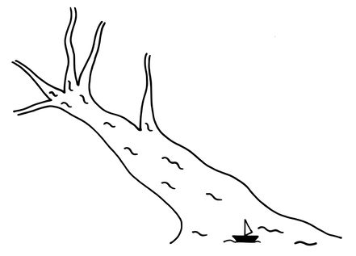

# プロダクトオーナーチーム

確信度：★

{:style="text-align:center;"}
 
トヨタ自動車の豊田章男社長と彼のチームによる新しいトヨタGRスポーツカーの発表

...​[プロダクトオーナー](ch02_11_11_Product_Owner.md)は、​`バリューストリーム`の有効性を高めたいと望んでいます。

一人の[プロダクトオーナー](ch02_11_11_Product_Owner.md)が、ROI（投資利益率）などのすべての価値に責任を持ち、市場分析、プロダクトディスカバリー、ステークホルダーマネジメント、顧客フィードバック、そして市場向けのその他の仕事のほとんどを行うべきです。その一方で、チームが正しいものを構築できるように支援します。

{:style="text-align:center;"}
＊　　＊　　＊

**[プロダクトオーナー](ch02_11_11_Product_Owner.md)は、一人でうまく対処するには多すぎる仕事を抱えています**（例えば、Proceedings of the Agile Development Conference [MBN04]を参照）。

{:style="text-align:center;"}

Bottleneck: ボトルネック

[プロダクトオーナー](ch02_11_11_Product_Owner.md)は[開発チーム](ch02_14_14_Development_Team.md)に頼めますが、それでは単に開発者へ負担を移すだけです。それにより、実際の開発に当てられるキャパシティーが減ってしまいます。[プロダクトオーナー](ch02_11_11_Product_Owner.md)にとって、学び改善し、より良い[プロダクトオーナー](ch02_11_11_Product_Owner.md)になる動機はありません。

​`プロダクトバックログアイテム`をReady（`準備完了の定義`​を参照）にしないと、[開発チーム](ch02_14_14_Development_Team.md)は間違ったものを作ってしまうかもしれません。また、[プロダクトオーナー](ch02_11_11_Product_Owner.md)とのコミュニケーションも増えてしまい、[開発チーム](ch02_14_14_Development_Team.md)の速度が落ちてしまいます。

十分な`プロダクトバックログアイテム`を持たない[開発チーム](ch02_14_14_Development_Team.md)は、キャパシティーを無駄にします。チームが、次の`スプリント`​で対象とする市場機会に対して十分な`実装可能な仕様`を受け取っていない場合、[開発チーム](ch02_14_14_Development_Team.md)がより価値の低い`プロダクトバックログアイテム`の作業をしたり、Readyではない`プロダクトバックログアイテム`の作業を始めることになります。遅れが生じることで、本来ならチームが生み出せる全体的な価値が減少するかもしれません。

`プロダクトバックログアイテム`について十分に考える時間を持つことは、それらの相対的な価値を理解し、依存関係を特定し、市場の機会を活用する可能性をもたらします。

多くのタスクを遂行する[プロダクトオーナー](ch02_11_11_Product_Owner.md)を支援する一つの方法は、専門家チームを雇うことです。しかし、これは引き継ぎやコミュニケーションの問題を引き起こします。結果として、顧客の問題への理解が薄れてしまい、不適切な解決策になる可能性があります。

開発者は、[プロダクトオーナー](ch02_11_11_Product_Owner.md)の示す方向性に反しない限り、他のステークホルダーと協力して詳細の明確化を支援できます。成功や失敗に対する責任を一点に維持することは重要です。[プロダクトオーナー](ch02_11_11_Product_Owner.md)が委員会であってはなりません。

それゆえ：

**チーフプロダクトオーナーが率いる[プロダクトオーナーチーム](ch02_12_12_Product_Owner_Team.md)を作り、そのメンバーが共にプロダクトのオーナーシップを遂行してください。**

{:style="text-align:center;"}

[プロダクトオーナーチーム](ch02_12_12_Product_Owner_Team.md)には、`プロダクトバックログ`​を作成する際にチームを導く役割を持つ人々が集まります。[プロダクトオーナーチーム](ch02_12_12_Product_Owner_Team.md)を作るとき、`プロダクトバックログ`の優先順位付けに最終決定権を持つチーフプロダクトオーナー（CPO）が存在することが重要です。CPOとそのCPOを支える他の人たちを、[プロダクトオーナーチーム](ch02_12_12_Product_Owner_Team.md)と呼びます。一部では、[プロダクトオーナーチーム](ch02_12_12_Product_Owner_Team.md)のメンバーを「プロダクトオーナー」と呼ぶこともありますが、彼らはオーナーではありません。CPOは唯一の[プロダクトオーナー](ch02_11_11_Product_Owner.md)であり、製品の成功に対する責任を負う「唯一の絞れる首(single wringable neck)」とされています。

CPOは、戦略と`プロダクトバックログアイテム`を明確に伝えます。CPOは、[プロダクトオーナーチーム](ch02_12_12_Product_Owner_Team.md)のメンバーと協力して、チームのためにバックログアイテムを選択し、順序をつけます。[プロダクトオーナーチーム](ch02_12_12_Product_Owner_Team.md)のメンバーは、CPOが[開発チーム](ch02_14_14_Development_Team.md)と連携して、バックログを小さな`プロダクトバックログアイテム`に分割し、実行可能にする手助けができます。

経験によれば、[プロダクトオーナーチーム](ch02_12_12_Product_Owner_Team.md)は[同じ場所に集まったチーム](ch02_08_8_Collocated_Team.md)であるべきです。[プロダクトオーナー](ch02_11_11_Product_Owner.md)の機能を組織の境界（特に企業の境界）を越えて分散させると、一人の[プロダクトオーナー](ch02_11_11_Product_Owner.md)がどちらか一方にだけいる場合よりも、事態は悪化するかもしれません。

{:style="text-align:center;"}
＊　　＊　　＊

[プロダクトオーナーチーム](ch02_12_12_Product_Owner_Team.md)は、大規模なプロダクトのプロダクトオーナーシップを遂行します。

[プロダクトオーナーチーム](ch02_12_12_Product_Owner_Team.md)は、一つの`プロダクトバックログ`上で`プロダクトバックログアイテム`を並べることにより、`ビジョン`を実現します。

[プロダクトオーナーチーム](ch02_12_12_Product_Owner_Team.md)のメンバーのほとんどが、ビジネスのバックグラウンドを持っています。しかし、プロダクトオーナーシップとは、単に`バリューストリーム`のオーナーというだけではありません。[プロダクトオーナーチーム](ch02_12_12_Product_Owner_Team.md)は、[開発チーム](ch02_14_14_Development_Team.md)のために`実装可能な仕様`も作成します（`リファインメントされたプロダクトバックログ`に向けて、[開発チーム](ch02_14_14_Development_Team.md)と協力して共同作業を行うことがよくあります）。その際には、ユーザーエクスペリエンスの問題や、製品戦略の鍵となるようなローレベルの技術や開発アプローチの調査が必要となる場合もあります。[プロダクトオーナーチーム](ch02_12_12_Product_Owner_Team.md)は、`セットベース設計`を通じてこれらの領域を探索し、[開発チーム](ch02_14_14_Development_Team.md)のために、`実装可能な仕様`の作成を支援することができます。

[プロダクトオーナー](ch02_11_11_Product_Owner.md)と同様に、[プロダクトオーナーチーム](ch02_12_12_Product_Owner_Team.md)全体も[プロダクトプライド](ch02_39_38_Product_Pride.md)の姿勢で、活気づけられるべきです。

