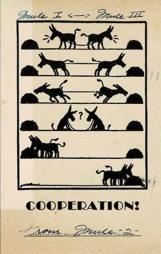
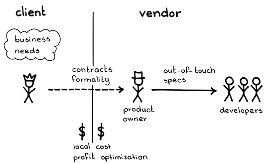
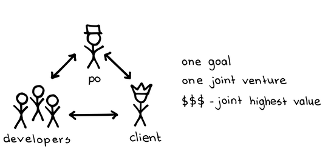

# 開発パートナーシップ

 Original:[Development Partnership](https://sites.google.com/a/scrumplop.org/published-patterns/product-organization-pattern-language/development-partnership)

確信度：★

{:style="text-align:center;"}
 
​¶41 Value Stream​に関わる複数の当事者は、可能な限り調和して働くように努めるべきだ。​

...企業では、新市場向けのプロダクトを開発する時に、スキルのある開発者が不足していることがあり、そのため開発の一部または全部を別の組織にアウトソーシングすることがあります。このような取り組みは、「提携」、「委託」、「外注」と呼ばれます。（サードパーティーの一般的な商品やサービスは、このパターンの範囲外です。）

{:style="text-align:center;"}
＊　　＊　　＊

**パートナーシップはうまくいけば素晴らしいですが、組織部門が共同で製品を開発する取り組みに対して、しばしば恣意的に企業や組織の境界が引かれます。**ビジネスニーズがいくつかの分野にまたがっていても、組織は自分たちのコアコンピタンスに集中し、能力のあるプロバイダーで不足を埋める選択をするかもしれません。例えば、製造業者は自社の人事管理ソフトウェアを、社内で開発できる専門知識を持っている可能性は低い一方で、市販のソフトウェアでは満たせない特別なニーズがあります。あるいは、企業が社内ではまかなえない専門知識を必要とする市場に突如として巻き込まれることがあります。そこで、企業は外部の会社と協働し、ニーズに合うように適応します。ここでの「外部」とは通常別の会社を意味しますが、クライアントと別の内部部門との間にも同様に高い壁があることもあります。

{:style="text-align:center;"}
 
Client: クライアント Business needs: ビジネスニーズ Contracts formality: 正式な契約 Local profit: 局所的な利益 Vendor: ベンダー Product owner: プロダクトオーナー Out-of-touch specs: 実態と乖離した仕様 Developers: 開発者 Cost optimization: コスト最適化

これにより、ベンダーとクライアントの対立関係が生じます。双方が自分たちのプロセスを多く維持するのは自然なことで、それらのプロセスは自分たちの中の人間関係をうまく繋げますが、外部の人間を自然に統合することはありません。引き継ぎ、特に要件の引き継ぎがより頻繁になっていきます。開発者は、雇用主（もしくは上司）とクライアントとの間で忠誠心の危機に直面します。[開発チーム](ch02_14_14_Development_Team.md)は、政治的なファイアウォールのため、また誰にアプローチすべきかの知識がないため、クライアント組織から要件や背景を得ることが困難になるかもしれません。このようなアプローチに組み込まれた信頼の欠如が、固定スコープ契約の根底にあり、複雑なドメインに適用されると、多くの場合、誰かを不幸にしてしまいます。誰も得をしません。

[プロダクトオーナー](ch02_11_11_Product_Owner.md)​を雇用すべきは、ベンダー側かクライアント側かどちらでしょうか？クライアントはドメイン知識を持っており、プロダクトの内容を管理すべきです。しかし、クライアントは最大の価値（[Value and ROI](https://sites.google.com/a/scrumplop.org/published-patterns/value-stream/product-backlog/value-and-roi)を参照）を得ることに関心があるため、ベンダーの利益を最小限に抑えることにも関心があります。一方で、ベンダーは契約から得られる利益を自ら管理すべきかもしれません。これは、[プロダクトオーナー](ch02_11_11_Product_Owner.md)がベンダー側に所属すべきであると示唆します。通常の解決策は、ベンダー側の[開発チーム](ch02_14_14_Development_Team.md)に[プロダクトオーナー](ch02_11_11_Product_Owner.md)プロキシーを配置することです。[プロダクトオーナー](ch02_11_11_Product_Owner.md)プロキシーは、チームからの質問や明確化に対する最初の防衛ラインとなり、[Refined Product Backlog](https://sites.google.com/a/scrumplop.org/published-patterns/value-stream/product-backlog/refined-product-backlog)イベントや[スプリントプランニング](ch02_25_24_Sprint_Planning.md)などの重要な活動で、[プロダクトオーナー](ch02_11_11_Product_Owner.md)の役割を務めることさえあります。ベンダー側の[プロダクトオーナー](ch02_11_11_Product_Owner.md)プロキシーが実際の[プロダクトオーナー](ch02_11_11_Product_Owner.md)と同じオフィスで働いていない場合、複数拠点の問題がすべて発生し、開発は1つの双方向のコミュニケーションではなく、2つの一方通行のコミュニケーションになります。

さらに悪い状況として、クライアントはベンダー側のスタッフを[プロダクトオーナー](ch02_11_11_Product_Owner.md)の役割に充てることを提案するかもしれません。しかし、これは通常、[プロダクトオーナー](ch02_11_11_Product_Owner.md)を実際には何のオーナーでもないプロダクトマネージャーやプロジェクトマネージャーに格下げし、プロダクトの内容に対して権威を持って発言できず、プロダクトの決定を一人で行うことができなくなります。よくある結果は、要件の明確化が遅れることや、[Regular Product Increment](https://sites.google.com/a/scrumplop.org/published-patterns/value-stream/regular-product-increment)​が単純にクライアントの期待に応えられないことです。

それゆえ：

**クライアントとベンダーの間に、組織間の壁を取り払うパートナーシップを築きます。最初の合意では、関与のルールが明確にされ、このルールには、同じ場所での開発への配慮、公平なリスクの共有、納品物の定義への継続的な調整が含まれるべきです。それらは、初期のビジネス目標が達成された後も、長期的な関与が続くというビジョンに基づいています。**

{:style="text-align:center;"}
 
Po: PO Developers: 開発者 Client: クライアント One goal: 単一のゴール One joint venture: 単一の共同事業 $$$ - joint highest value: $$$ - 共同価値の最大化

最適な[プロダクトオーナー](ch02_11_11_Product_Owner.md)は価値の提供にできるだけ近い立場で働くため、[プロダクトオーナー](ch02_11_11_Product_Owner.md)はクライアントに雇用されます。[プロダクトオーナー](ch02_11_11_Product_Owner.md)は、自分の雇用者のために価値を最大化することに注意を払う一方で、ベンダーがこの取り組みから利益を得る方法に基づいて合意した、精神と契約を尊重します。

[開発チーム](ch02_14_14_Development_Team.md)がクライアントの現場に物理的に配置されることが最善です。クライアントがどのように働いているかを観察したり、冷水器の周りの話を聞くことで、企業文化やプロダクトへの暗黙のニーズについて手がかりが得られます。これにより、[開発チーム](ch02_14_14_Development_Team.md)がドメイン専門家をより簡単に利用できるという利点もあります。

訳注：現在であれば、ウォーターサーバーなど、人が集まって会話をする場所の例として挙げられている。（¶132 The Water Coolerを参照）

常に同席できない場合でも、[プロダクトオーナー](ch02_11_11_Product_Owner.md)はベンダーの[開発チーム](ch02_14_14_Development_Team.md)とできるだけ多くの時間を過ごすよう努力すべきです。どれくらい「多くの時間」が適切かは検査と適応が必要になります。参考になる成功例としては、週4日で6時間以上、毎日で4時間以上が適切で、週に1~2日であったり、毎日のオンラインミーティングへの出席ではありません。もし[プロダクトオーナーチーム](ch02_12_12_Product_Owner_Team.md)​が存在する場合でも、チーフプロダクトオーナーは[開発チーム](ch02_14_14_Development_Team.md)とこの程度の関わりを持つべきです。再度言いますが、この問題をプロキシーで解決しようとする誘惑がありますが、経験から、その配置は要件伝達の損失が大きすぎることが示唆されています。（現実には、肩書が[プロダクトオーナー](ch02_11_11_Product_Owner.md)でも、実際にはプロダクトのオーナーでなかったり、関与が不十分であることが明らかになるかもしれません。）

ベンダーとクライアント間で、リスクを共有するビジネスモデルにするべきです。これを実現する方法は多くあります。[Change for Free](https://sites.google.com/a/scrumplop.org/published-patterns/value-stream/product-backlog/change-for-free)や[Money for Nothing](https://sites.google.com/a/scrumplop.org/published-patterns/value-stream/product-backlog/money-for-nothing)を参照してください。最良のケースでは、ベンダーはリスクと利益の両方を共有します。例えば、ベンダーが開発したプロダクトから得られる利益（おそらく損失も）の長期的な共有を規定することです。

つまり、アウトソーシングで作業をいくつかの政治的組織に分散しても、開発がスクラムの原則に従わなくても良いという理由にはなりません。給与に署名する上司が同じであるかのように、全員が同じ原則を尊重しましょう。

{:style="text-align:center;"}
＊　　＊　　＊

ベンダーとクライアントは、局所的に個別に最適化するのではなく、多くのムダを削減し、共同のスコープにおいて​​[Greatest Value](https://sites.google.com/a/scrumplop.org/published-patterns/value-stream/greatest-value)を達成するために協力できます。

プロダクトのガバナンスにおいて、技術的専門性よりも文化的な調和がより重要です。すべてのチームメンバー（[プロダクトオーナー](ch02_11_11_Product_Owner.md)、​[スクラムマスター](ch02_20_19_ScrumMaster.md)​、[開発チーム](ch02_14_14_Development_Team.md)メンバー）は、組織ではなくプロダクトに献身的です。すべての忠誠心は[プロダクトオーナー](ch02_11_11_Product_Owner.md)に集まります。

パートナーのリズムを合わせると、物事がずっとスムーズに進みます。​[Organizational Sprint Pulse](http://sites.google.com/a/scrumplop.org/published-patterns/product-organization-pattern-language/organizational-sprint-pulse)を参照してください。

[スクラムマスター](ch02_20_19_ScrumMaster.md)は、チーム外からの干渉に特に注意を払う必要があります。それは、チームを「手助け」したいと考える別拠点のマネージャーや、契約上の義務を満たすためにチームにプレッシャーをかけたいと思っている同一拠点のマネージャーからの干渉です。

このような取り組みを完全に計画することは困難です。紙の上で良いと思われることが、実際にはひどく失敗することもあります。検査と適応を行い、最初の数か月で多くの誤った決定を修正する方法を学ぶことを期待しましょう。積極的に[スプリントレトロスペクティブ](ch02_37_36_Sprint_Retrospective.md)を利用して、問題を迅速に調整し、解決してください。

時間が経つにつれて、[開発チーム](ch02_14_14_Development_Team.md)はどんどんクライアントの文化の一部になっていくでしょう。アジャイルの経験が豊富なベンダーは、クライアントをよりアジャイルなやり方に導くことができます。両者が新しいビジネスニーズを検討する際には再契約交渉のコストがかかり、クライアントと新しいベンダーの協力や全体のビジネスプロセスの統合には容認しがたい負担がかかりますが、これらは長期的な提携によって、避けることができます。​[安定したチーム](ch02_15_15_Stable_Teams.md)​を維持するためには、このような手配に特に注意を払う必要があります。

このようなパートナーシップにおいて、全ての関係者は[プロダクトプライド](ch02_39_38_Product_Pride.md)の感覚を共有すべきです。一方のパートナーがこの感覚により無自覚で、他方のパートナーに支配的な影響を受けていると、それが[プロダクトプライド](ch02_39_38_Product_Pride.md)の感覚に対するバランスの崩れとなって表れるかもしれません。

[同じ場所に集まったチーム](ch02_08_8_Collocated_Team.md)​や藤野晃延の連邦パターン（Federation Pattern [Fuj99]）も参照してください。さらに、このパターンと`5.1.10. 離れて作業する前の顔合わせ`の根底にある考え方の間には興味深い類似点があります。

