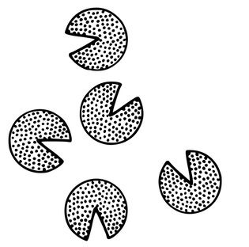
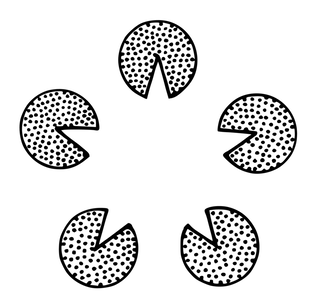

# 14 開発チーム

別名：開発/デリバリーチーム

確信度：★★

{:style="text-align:center;"}

...[2 もやもや](ch02_02_2_The_Mist.md)​から出てきた​[11 プロダクトオーナー](ch02_11_11_Product_Owner.md)​は、実現には個人の手に余るプロダクトの​`39 ビジョン`​を持っています。[プロダクトオーナー](ch02_11_11_Product_Owner.md)は、新しいベンチャー企業の最前線で一人で働いているか、もしくは、企業の中で同じ`ビジョン`に情熱を持って取り組む仲間と一緒に働いています。芽生えたばかりの活動は、[もやもや](ch02_02_2_The_Mist.md)の中で形づくられ、一つにまとまる必要があります。その活動は、`ビジョン`を現実のものにするための段階にあり、グループに長くいるメンバーの仕事を調整し、新しい人々を巻き込みます。彼らはともに、集団としてのアイデンティティと個人の開発責任のバランスをとる方法を模索しています。つまり、ビジネスを支えるために時間と才能を管理するフレームワークのもとで互いに繋がり、働きがいのある職場を作ります。

{:style="text-align:center;"}
＊　　＊　　＊

**多くの偉大な取り組みは、個人の努力だけでは卓越性を達成できません。生産における最大の力はチームワークから生まれます。**優れた個人は優れたプロダクトを生み出すことができますが、一人で始めると、後でスケールすることが難しくなります。新しいメンバーが加わるたびに、チームの他のメンバー全員の効率が約6ヶ月間、約25%低下します（ジェームズ・コプリエンの経験則）。一人の手に余るプロダクトもあり、適切なフィードバックがないと、盲目的になりがちです。経験から、チームの方が個人よりも優れた成果を上げることが分かっています。多くの手があれば、作業が楽になるのです。業界のデータでは、個人のプログラマーとチームの生産性には10倍の開きがあることが示されていますが（「Making Software」567-574ページ）、他のデータでは、あるチームが他のチームの2000倍の成果を上げたことが示されています（「Scrum: The Art of Doing Twice the Work in Half the Time」42ページ）。

{:style="text-align:center;"}

一方で、大きすぎるグループでは、方向性を合意形成することが難しくなります。料理人が多すぎると、スープが台無しになってしまうのです。大勢の人々で構成された開発部門でも、最終的に合意を得ることはできますが、通常は長時間の相互協議と共同化によってのみ可能です。このような遅れは、即応性が要求されるビジネスでは許容できません。

リーンスタートアップのモデルでは、ビジネス、プロセス、生産の何であるかに関わらず、全員が何でもやります。問題は、市場が多層的（ニーズが異なる速度で進化する市場セグメントがある）で、変化の速度が開発の速度とは異なる可能性があることです。市場分析と計画は数ヶ月にわたって行われる可能性がありますが、市場向けの開発は通常、月単位のリズム（​`77 月をおいかける`）で行われ、顧客の緊急事態への対応では、1日、数時間または数分と短いことがあります。そのため、両方の機能を1つの密結合した組織単位に置くと、人々とスケジュールにストレスがかかります。このようなモデルは、企業が成長するにつれて持続が困難になります。

組織は複数のリズムで運営する必要があります。あるリズムはプロダクトを作る日々の仕事かもしれませんし、別のリズムは市場と協働するより長いサイクルかもしれません。「The Handbook of Social Psychology」の「Role Theory」の章（488-567ページ）によると、役割の差別化は、主にこれらのリズムの変動に応じて行われるべきです。歴史、経験、傾向が個人を特定の役割に引き寄せますが、役割に必要とされるリズムで機能しない可能性があるため、組織にとって問題になる可能性があります。組織は一貫性を持って機能する必要があります。

それゆえ：

**[15 安定したチーム](ch02_15_15_Stable_Teams.md)をベースに、[プロダクトオーナー](ch02_11_11_Product_Owner.md)の`ビジョン`に触発され、プロダクトを中心に集まった[開発チーム](ch02_14_14_Development_Team.md)を作ります。このチームは、そのプロダクトの連続的なインクリメントを​`41 バリューストリーム`を通じてエンドユーザーに提供します。**チームは、およそ5人の同じ場所に集まったした個人で（[8 同じ場所に集まったチーム](ch02_08_8_Collocated_Team.md)と[9 小さなチーム](ch02_09_9_Small_Teams.md)を参照）、共通の目標に向かって互いに協力することを誓っています。

{:style="text-align:center;"}

チームは自律的です。自己選択し、自己組織化し、自己管理するのです。個人個人に[プロダクトオーナー](ch02_11_11_Product_Owner.md)の`ビジョン`を実現するための集団としてのアイデンティティを与えます。[プロダクトオーナー](ch02_11_11_Product_Owner.md)は彼らに「これはあなたたちのプロダクトです。やってください」と言うことができます。

{:style="text-align:center;"}
＊　　＊　　＊

個人は、新しい組織の中で互いのアイデンティティを尊重しながら、プロダクトの`ビジョン`に結びついた新しいアイデンティティを形成します。これは、個人の能力を上げて生産性を向上させることではありません。開発のパラダイムを変え、集合知、つまり「全体」で、個人の総和以上のことを達成できると考えるのです。

チームは、トップダウンでもボトムアップでも作ることができますが、どちらの場合でもチームを始動するには`ビジョン`が必要です。トップダウンアプローチでは、[プロダクトオーナー](ch02_11_11_Product_Owner.md)が取り組みのための資金を確保した後、チームを雇用します。ボトムアップアプローチは、リーンスタートアップのような環境から生まれます。「私たちはオタクの集まりで、市場に対応するのに奮闘しており、開発チームとして認められたいと考えています。誰に応えるのでしょうか？それは[プロダクトオーナー](ch02_11_11_Product_Owner.md)です。どのように働くのでしょうか？`54 プロダクトバックログ`の上位から着手します。」 チームは、このパターンの残りの部分で説明されているように、他のパターンを導入することでスクラムフレームワークに従ってさらに進化させることができます。

候補となる安定したチームがまだない場合は、利用可能な人材から、ゼロから、市場から、`4.2.11. 自分たちで選んだチーム`を構築することを強く検討してください。信頼のコミュニティ（`4.1.1. 信頼で結ばれた共同体`を参照）を見つけてください。つまり、現在の個人の集まりの中に信頼がまだ無い場合、それはグループが最初に取り組むべき課題となるでしょう。

私たちは、分割できない「全体」を損なうようなラベル付けや区分けを避けるために、チームメンバーをまとめて「開発者」と呼びます。「開発者」は、単一の[開発チーム](ch02_14_14_Development_Team.md)のメンバーとして働きます。チームは専門性を最小限に抑え、内部にサブチームを持たず、メンバーに地位の違いはありません。スクラムでは、チーム内またはチーム間でのあらゆる種類の組立ライン構造を避け、各成果物のためのすべての作業は単一の[開発チーム](ch02_14_14_Development_Team.md)内で行われます。つまり、例をあげれば、別個のテストチームや、開発とプロダクトの構成などの開発の運用面をつなぐ別個のチームは存在しないということです。「完成」したプロダクトインクリメント（`82 完成の定義`を参照）の構築に完全に成功するために、できるだけ早い段階で、必要なスキルセットと才能、あるいはスキルと才能を開発する意欲がある[10 機能横断チーム](ch02_10_10_Cross_Functional_Team.md)を構築することを目指してください。

スクラムの伝統では、チームの規模は7±2人を推奨していますが、効果的なチームはそれよりも小さい傾向があります。`4.2.2. 組織を細かくする`のパターン（「Organizational Patterns of Agile Software Development」[CH04]、セクション4.2.2）では、メンバー数は5人に近いことを推奨しています。私たちの経験によれば、最高の[開発チーム](ch02_14_14_Development_Team.md)は、わずか3人の開発者で構成されることもあります。

[開発チーム](ch02_14_14_Development_Team.md)は、​`71 スプリントゴール`に集中し、個々の開発のインクリメントを一緒に「スウォーミング」しながら、心を一つにして働くべきです。個人が「自分の持ち場で時間を費やす」のではありません（[25 スウォーミング：1個流し](ch02_26_25_Swarming_One_Piece_Continuous_Flow.md)を参照）。チームは、[29 デイリースクラム](ch02_30_29_Daily_Scrum.md)と呼ばれる進行中の作業を再計画するためのイベントを毎日開催します。

独立した短期的なビジネスニーズを満たすために、小さな取り組みが生まれることがあります。そのような場合、チームを作るのは大げさすぎるかもしれません。`4.2.5. ソロ・バイオリニスト`を検討してください。

先に述べたように、チームは他のパターンとともにスクラムフレームワークに従って進化することで、自らを差別化することができます。`プロダクトバックログ`は、​`46 スプリント`​と呼ばれるタイムボックス化された開発間隔で、`85 定期的なプロダクトインクリメント`​を生産するためにチームの作業を導きます。チームメンバーは、各`スプリント`ごとに自分たちの作業計画（`72 スプリントバックログ`）を作成し、「スプリント」中の生産期間、自分たちを管理します。「スプリント」中の生産期間は、[開発チーム](ch02_14_14_Development_Team.md)を保護して、メンバーが​[16 自律したチーム](ch02_16_16_Autonomous_Team.md)として働き、[17 自己組織化チーム](ch02_17_17_Self_Organizing_Team.md)​として作業を管理できるようにします。[プロダクトオーナー](ch02_11_11_Product_Owner.md)と[19 スクラムマスター](ch02_20_19_ScrumMaster.md)は、このような保護に加え、励まし、サポート、プロセスガイダンスを提供します。

