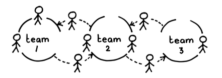
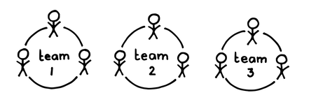

# 15 安定したチーム

確信度：★★

{:style="text-align:center;"}

...チームは以前からプロダクトを作り続けてきました。絶えず変化するビジネス環境により、スタッフの調整、成長、最適なチーム構成に疑問が浮かんできます。

{:style="text-align:center;"}
＊　　＊　　＊

**ステークホルダーは、自分たちの期待に迅速に応えることができるチームに最も満足している。そのためチームは予測のばらつきを減らすために必要なことを行いたいと考えています。**

プロジェクトマネジメントでは、人間を人的資源と混同する傾向があります。それは「リソース管理」につながり、各チームのキャパシティ（または、場合によっては各チームメンバーのキャパシティ）と納品物に対する要求を一致させることにつながります。

{:style="text-align:center;"}

よくある結果としては、プロジェクトの開始時もしくは提供中の危機から危機へと、チーム間で人々を移動させ、以下のような追加コストが発生する不安定な環境につながります:

* 人々が何に取り組んでいるかを把握するための管理、

* 新メンバーがチームの一員となる必要性（事実上新しいチームが作成される）、新メンバーがチームと製品について学ぶ必要性により低下した効率、

* ブルックスの法則（「遅れているソフトウェア・プロジェクトに人員を投入しても、そのプロジェクトをさらに遅らせるだけである。」（The Mythical Man-Month: Essays on Software Engineering [Bro95]、p.25））の影響。

リソースプールからチームが編成されると、リソース活用のため、人々が複数のチームやプロダクトにまたがり、マルチタスクにつながります。要件の変更が加わると、その不安定さは耐え難くなります。そのため、何かを修正する必要があります。それにより、安定的な部分と不安定な部分をバランスさせる必要があります。長年にわたり、要件を固定し、絶えず変化するリソースを（願わくば）予測可能な時間にデリバリーできるよう、割当てることが、解決策とされてきました。しかし、プロダクトの要件を固定することは、学習を妨げ、`93 最高の価値`を生み出す可能性のある製品の変更を無視するため、良い解決策ではありません。

それゆえ：

**チームの安定を保ち、チーム間で人を入れ替えるのを避けてください。安定したチームは、自分たちのキャパシティーを把握しやすく、それによってある程度はビジネスが予測可能になります。**チームメンバーは、可能な限り、1チーム専任にしてください。

{:style="text-align:center;"}
＊　　＊　　＊

[安定したチーム](ch02_15_15_Stable_Teams.md)のメンバーはお互いを理解し合うようになります。チームメンバーは、お互いの仕事のスタイルを経験し、一緒にどれだけの仕事ができるかを学びます。[安定したチーム](ch02_15_15_Stable_Teams.md)は、親密さと、相互の期待を満たす一貫性の面で成長し、信頼で結ばれた共同体（`4.1.1. 信頼で結ばれた共同体`を参照）を築き始めます。

{:style="text-align:center;"}

研究によれば、NASAの共同作業において、休息十分なクルーが一緒に働いたことのないパイロットと組むよりも、疲れ切っていたクルーでも一緒に幅広く仕事をしたことのあるパイロットと組んだチームの方が、ミスの数は半分になることが示されています（Harvard Business Review 87 [Cou09]）。これは、効果的なチームワークに関連する多くの要因（共有されたメンタルモデル、結束力、風土、心理的安全性など）が、継続して一緒に仕事をしてきたチームでのみ生まれるためです（Psychological Science in the Public Interest 7 [KI06], pp.77--124、Personnel Psychology 70 [FFKP17]を参照）。短期間しか一緒に仕事をしない人々が、仕事のプロセスやお互いの社会的相互作用の改善に多くのエネルギーを注ぐことはおそらくありません。彼らは数ヶ月（あるいはそれ以下）後には、他の人と働くことになるでしょう。一方で、長期間同じ同僚と一緒にいると理解している人々は、楽しいチーム環境を作り、仕事のプロセスの改善にエネルギーを注ぐ可能性が高くなります。

チームは、自分たちの仕事のキャパシティーの向上を計測するために、ベロシティ（`ベロシティについて`を参照）を活用できます。多くの​​[7 スクラムチーム](ch02_07_7_Scrum_Team.md)​は、予測可能性を高めるためにベロシティを重視しています。ベロシティは現在、予測可能性を高めるための最も実績のあるプラクティスです。しかし、チームがベロシティを測定する際に、自分たちのベロシティを把握する唯一の方法は、長期間同じチームメンバーを維持することだという点はしばしば忘れられます。

長期的な安定性から最も恩恵を受けるのは、​[10 機能横断チーム](ch02_10_10_Cross_Functional_Team.md)です。なぜなら、知識や経験を共有する機会がより多くなるからです。専門家チーム（例えば、専門能力や技術に対応するサービスを提供するチーム）にもいくつかの利点がありますが、組織全体に対して広範な悪影響をもたらすことがあります。例えば、待ち行列が作られ、追加の余分な管理作業が必要になります。

[安定したチーム](ch02_15_15_Stable_Teams.md)は、作業のパイプラインにプレッシャーを与えます。作業に合わせてチームを再構成したり、危機に対処するのではなく、チームに合わせて作業を構造化する必要があります。その結果、組織が対処すべき能力の問題が浮き彫りになります。例えば、チーム間で専門家の入れ替えが続くことで、いくつかのチームの専門能力不足が明らかになります。[安定したチーム](ch02_15_15_Stable_Teams.md)への移行においては、必要なチームに一時的に専門家を割り当てますが、その専門分野をチームメンバーにクロストレーニングすることを条件とし、長期的なリスクを減らしてください。

[安定したチーム](ch02_15_15_Stable_Teams.md)の適用を始めるには、チームを維持することを約束し、可能なら`4.2.11. 自分たちで選んだチーム`（`4.2.11. 自分たちで選んだチーム`を参照）を採用します。その後、この構造に合わせた作業の管理を継続し、チームの能力不足を調整する努力をしてください。チームを自己組織化させ、コンピテンシーを広げ、最適なチーム構成を探求してください。その結果、構造が素早く収束することがわかるでしょう。

組織は、危機から危機へと人々を移動させる「柔軟性」を止め、作業割り当てを柔軟にします。この柔軟性により、チームは自分たちの現在の能力とキャパシティーに応じて仕事を引き受けることができ、それがより正確な予測につながります。逆に、チーム間で人を「柔軟」に移動させると、コストと不確実性の増大につながります。

このパターンは、チームが時間とともに成長し専門知識を共有して、チームメンバーを失うリスクを減らすのに役立ちます。`4.2.24. トラックナンバーはほどほどに`を参照してください。

安定したチームが、`60 見積りポイント`​を使い、`57 豚たちの見積もり`​をすることで、数回の`46 スプリント`の後には、チームはベロシティーの現実的な数値を把握できます。`67 移動平均によるベロシティ`を参照してください。

[安定したチーム](ch02_15_15_Stable_Teams.md)によって、個人がチームの作業を習得できます。複数の[14 開発チーム](ch02_14_14_Development_Team.md)や複数の[スクラムチーム](ch02_07_7_Scrum_Team.md)がある場合、[5 志を同じくする仲間](ch02_05_5_Birds_of_a_Feather.md)​の活用により、チームメンバーのさらなる熟達を支援できます。

[安定したチーム](ch02_15_15_Stable_Teams.md)は、集団的なアイデンティティを築き、「プロダクト」と「チームへの帰属」の両面について、共通の誇りを持つ基盤となります（[38 プロダクトプライド](ch02_39_38_Product_Pride.md)​と`4.2.13. チームのプライド`を参照）。

