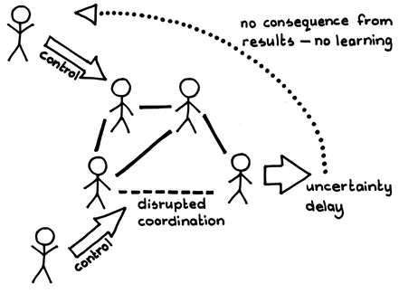
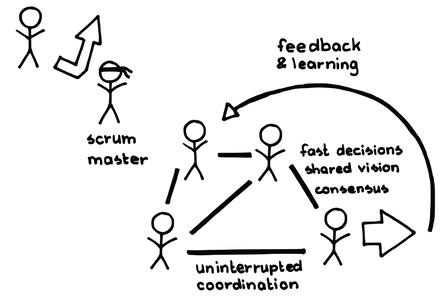

# 自律したチーム

 Original:[Autonomous Team](https://sites.google.com/a/scrumplop.org/published-patterns/product-organization-pattern-language/development-team/autonomous-team)

別名：自己管理型チーム

確信度：★★

{:style="text-align:center;"}

...新しいチームがスクラムで仕事をするために集まってきたり、既存のチームがスクラムを採用しています。いずれの場合でも、共に作業する方法をチーム内で確立する必要があります。

{:style="text-align:center;"}
＊　　＊　　＊

**ポリシーや手順に関しては、全てに適した一つの方法などありません。異なるチームには、異なる人々とそれぞれ独自のダイナミクスがあります。また、責任を与えられ、それを果たすための専門知識を持つチームは、どのように進めるべきかを最もよく知っています。**

ステークホルダーは、その性格上、スクラムの取り組みの成功に対して利害関係があります。そのため、開発の取り組みに関与したいということは自然です。プロダクトの責任を持つステークホルダーは、作業の詳細を指示する権限があると、より安心できます。しかし、[開発チーム](ch02_14_14_Development_Team.md)の外部にいるステークホルダーは、開発作業の詳細を知らない可能性が高いため、彼らが望む方針や手続きがチームのニーズに合わないか、[Greatest Value](https://sites.google.com/a/scrumplop.org/published-patterns/value-stream/greatest-value)に貢献しない可能性があります。また、​[スクラムチーム](ch02_07_7_Scrum_Team.md)​が大企業の構造内で作業を行うとき、その構造が、プロダクトやその展開について表面的な知識しかないのに、企業の投資対効果を気にして、ビジネス目標を押し付けたり、開発の方向性を変えるかもしれません。少なくとも、これらの介入は、企業がチームの自主性を信じていないという微妙だが明確なメッセージになります。これは「我々対彼ら」の心理を生むことになり、信頼を損います（`4.1.1. 信頼で結ばれた共同体`を参照）。

{:style="text-align:center;"}
 
Control: コントロール Disrupted coordination: 妨げられる調整 Uncertainty delay: 不確実性による遅延 No consequence from results - no learning: 結果に対する結論がないー学びがない

善意のある組織は往々にして、より大きな利益のために作られた「ベストプラクティス」を定義することにより、範囲の経済性を追求しがちです。経営者や管理組織は、しばしばこのようなプラクティスを標準として規定します。リーンの原則に基づけば、標準は有効なはずです。しかし、あるチームのベストプラクティスは、他のチームにとっては害となる可能性があります。チームは外部からの命令に従うのではなく、個人としても集団としても、自身が主導してこれらの採用を検討すべきです。

チーム内で行われる決定は、外部から押し付けられる決定よりも効果効果的です。

それゆえ：

**[スクラムチーム](ch02_07_7_Scrum_Team.md)は、外部のコントロールに囚われずに決定し、外部との調整に注意を払うオープンなシステムでありながら、外部からの不当な影響は受けずに、価値追求に基づいて自らの方向性を定めます。これをさらに進めると、[Production Episode](https://sites.google.com/a/scrumplop.org/published-patterns/value-stream/production-episode)の間、[開発チーム](ch02_14_14_Development_Team.md)は外部からの干渉を受けずに自己統治します。**

{:style="text-align:center;"}
 
Scrum master: スクラムマスター Fast decisions: 迅速な意思決定 Shared vision: 共有されたビジョン Consensus: 合意 Uninterrupted coordination: 妨げられずに調整 Feedback & learning: フィードバックと学習

{:style="text-align:center;"}
＊　　＊　　＊

チームは、自分たちが責任を負う結果につながる行動を自らコントロールします。自らのプロセスに影響を与える決定を行いつつも、チームは他の開発チームやデリバリーチームとの対話にオープンであり、[Information Radiator](https://sites.google.com/a/scrumplop.org/published-patterns/value-stream/information-radiator)を通じて自らの内部作業を可視化し、[志を同じくする仲間](ch02_05_5_Birds_of_a_Feather.md)のようなグループから改善方法についての意見を求めます。

自律性には、自分たち独自の文化の構築が含まれます。これには[行動規範](ch02_32_31_Norms_of_Conduct.md)や報酬制度も含まれます。また、チームが作業を進める方法も含まれます。詳しくは[自己組織化チーム](ch02_17_17_Self_Organizing_Team.md)を参照してください。

これは、[開発チーム](ch02_14_14_Development_Team.md)が単にやりたいように何でもして良い（そして何も達成しないかもしれない）という意味ではありません。組織がスクラムを採用している場合、[開発チーム](ch02_14_14_Development_Team.md)はスクラムに従います。効果の高い自律性は、いつも組織の価値や目標と共にあります。この場合、チームは[ビジョン](ch03_02_39_Vision.md)に向けて進化し、​[Value Stream](https://sites.google.com/a/scrumplop.org/published-patterns/value-stream)を通じて価値を創出するという共通の責任を負います。

自律性の重要な部分は、チームを組織する権限（[自己組織化チーム](ch02_17_17_Self_Organizing_Team.md)）です。自律性を持つチームは、時間の経過とともに自己管理する能力が高まる傾向があります。これら二つのパターンは互いに段階的に構築され、最初はどちらかが先行するかもしれません。[自律したチーム](ch02_16_16_Autonomous_Team.md)は自らのプロセスを定義し実行することが可能で、自分たちがどのように働くかを決めます。これには組織パターン、`4.1.17. 開発者がプロセスをコントロールする`が含まれるだけでなく、プロセスを超えてチーム独自の文化の創出に至ります。

[スクラムマスター](ch02_20_19_ScrumMaster.md)の仕事の大半は、主に`4.2.9. 防火壁`として、[開発チーム](ch02_14_14_Development_Team.md)の自律性を維持することであり、時にはより広く[スクラムチーム](ch02_07_7_Scrum_Team.md)の自律性も維持します。組織の規範や儀式も、チームの自律性を保護するのに役立ちます。例として[おやつ神社](ch02_21_20_Oyatsu_Jinja_Snack_Shrine_.md)​ を参照してください。

自律性と結果責任との関連性を理解することが重要です。チームが自律的であれば、人々はチームが計画を達成するだろうと信頼し、チームは信頼してくれる人々に対して結果責任を負います。チームには、[スプリントゴール](ch03_38_71_Sprint_Goal.md)​を達成するための責任と権限があります。

[自律したチーム](ch02_16_16_Autonomous_Team.md)には、チームが自分たちの弱点に気づかないという危険があります。したがって、[自律したチーム](ch02_16_16_Autonomous_Team.md)に[ハッピーバブルをつつく](ch02_29_28_Pop_the_Happy_Bubble.md)を組み合わせ、さらに[スクラムマスター](ch02_20_19_ScrumMaster.md)がチームと共に働いて、フィードバックを提供し、チームの外からのフィードバックを伝え、他の情報源からのフィードバックに対してチームがオープンであるように保ちます。チームは、より大きなオープンシステムの一部として組み込まれており、レビュー（[スプリントレビュー](ch02_36_35_Sprint_Review.md)や​[スプリントレトロスペクティブ](ch02_37_36_Sprint_Retrospective.md)など）や外部からのフィードバックを受けます。

チームが自律的であれば、価値創造を最適化するために、自分たちのベロシティ（[Notes on Velocity](https://sites.google.com/a/scrumplop.org/published-patterns/value-stream/notes-on-velocity)を参照）を検証して高める最大の力が得られます。[Value Stream](https://sites.google.com/a/scrumplop.org/published-patterns/value-stream)の比喩を拡張すると、下り坂を流れる水は、自らが流れる水路を切り開き、最も速く効率的に山を下る道を見つけることができます。

人々は、一般的に自律性を持つときに最もやる気を出し、積極的になります（Drive: The Surprising Truth About What Motivates Us [Pin11]）。これが成功すると、好循環が生まれます。責任を果たした[自律したチーム](ch02_16_16_Autonomous_Team.md)はより多くの自律性を獲得し、それによってさらに成功することが可能となります。これは、非常に効果的な組織の重要な成功要因です。

このパターンは、[開発チーム](ch02_14_14_Development_Team.md)や[スクラムチーム](ch02_07_7_Scrum_Team.md)全体を中心に書かれていますが、一緒に働く開発者のペア（`4.2.28. ペアで開発する`を参照）に対しても拡張できます。自律性は、成功や失敗の報告に最善を尽くし、外部からの監視がなくても、自発的にプロセスを遵守する（あるいは遵守しない）と信頼されている個々のチームメンバーのレベルにまで拡張されます。実際、研究によると、一般に「透明性」と呼ばれているものの低下により、障害の表面化と解決が促進されると示されています。作業者は欠陥の修正を見られると、外部から干渉を受けていると感じましたが、観察されない状態では、作業者は物事を正しくする意志があり、品質が改善しました。個々の自律性を尊重することは、プライバシーを尊重することを意味します（Administrative Science Quarterly 57の“The Transparency Paradoxˮ [Ber12]を参照）。管理者に欠陥の追跡を許すようなツールを採用する前によく考えてみてください。

長期的には、自律性は逆の方向にも広がるべきで、つまり全体の[Value Stream](https://sites.google.com/a/scrumplop.org/published-patterns/value-stream)が自律性を持った存在になります。トヨタは、考えられるほぼ全ての自動車部品の生産を一つの系列の傘下に収めています。全企業を通じたサプライチェーン管理がそれを自律的なグループに統合します。

スケーリングは自主性の妨げとなることがあり、成長しながらチームの自律性を維持することはしばしば困難です。より多くのチームに対する管理構造の追加を避けるためには多大な努力が必要でしょう。また、管理者の権限はそのマネージャーの管理範囲によって決まるという長年の組織原則があるため、潜在的に管理構造を持つ組織は、開発の調整や進行を管理することで力を誇示するというリスクを冒します。優れた[スクラムマスター](ch02_20_19_ScrumMaster.md)は、より良い自己組織化を目指すため、チームに介入し疑問を投げかけるかもしれません。

Jens Østergaardは、開発チームの自律性が「スクラムの核心」であると述べています。自律性はスクラムの有効性において中心的な役割を果たし、それがなければ、スクラムを実施することが可能であると主張することすら難しいでしょう。そしてJeff Sutherlandは、("スクラムの柱"と"劇的"に強調して)、「The Scrum Handbook [Sut10]」の23ページから24ページにかけて次のように書いています：

スクラムの柱の一つは、チームが一度コミットメントをした後であれば、追加や変更は次のスプリントまで待つ必要があるということです。つまり、スプリントの途中でプロダクトオーナーが新しいアイテムをチームに作業させたいと決定した場合でも、その変更は次のスプリントが始まるまで待たなければなりません。外部の状況が大幅に優先順位を変え、チームが作業を続けることが時間の無駄になるという状況が生じた場合、プロダクトオーナーまたはチームはスプリントを中止することができます。チームは立ち止まり、新しいスプリントプランニングによって、新しいスプリントを開始します。通常、このような変更を行う際の混乱は大きく、プロダクトオーナーやチームがこの劇的な決定をすることを抑制する効果があります。

プロダクトの構造とその開発プロセスは、チームがある程度の自律性を保ちつつ、そのプロダクトを共同で開発できるかどうかに大いに影響します。複数チームのスクラムにおいては、いくつかの疎結合なチーム間で作業を分割できるようにプロダクトを構成することが重要です。[コンウェイの法則](ch02_04_4_Conway_s_Law.md)および`5.1.9. 組織はマーケットに従う`を参照してください。

[自律したチーム](ch02_16_16_Autonomous_Team.md)が、近視眼的になったり閉鎖的にならない対策のため、[スクラムオブスクラム](ch02_35_34_Scrum_of_Scrums.md)​、[志を同じくする仲間](ch02_05_5_Birds_of_a_Feather.md)、[スプリントプランニング](ch02_25_24_Sprint_Planning.md)、[スプリントレビュー](ch02_36_35_Sprint_Review.md)、[スプリントレトロスペクティブ](ch02_37_36_Sprint_Retrospective.md)を利用してください。`4.2.10. 門番`も参照してください。

