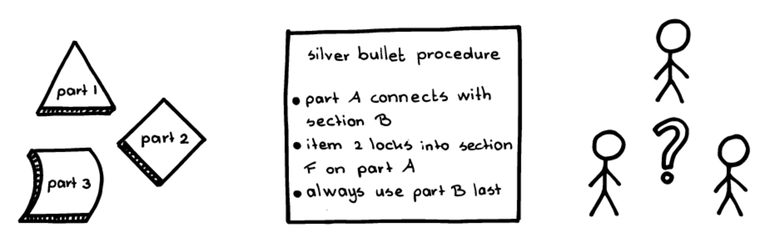
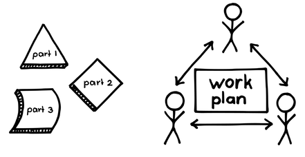

# 17 自己組織型チーム

確信度：★★

{:style="text-align:center;"}
 
鳥は自ら組織化して編隊を成し、その編隊を継続的に再組織化する。

...組織は信頼のコミュニティ（`4.1.1. 信頼で結ばれた共同体`を参照）を確立し、[3 豊かな土壌](ch02_03_3_Fertile_Soil.md)を耕しています。[14 開発チーム](ch02_14_14_Development_Team.md)は、[16 自律したチーム](ch02_16_16_Autonomous_Team.md)として運営されています。

{:style="text-align:center;"}
＊　　＊　　＊

**チームや仕事を構成する時に、すべての状況や仕事に対して正しく、時を経ても変わらないような唯一の方法はありません。**

複数人で行う作業では、タスクや人を組織して、一貫性のある調整されたやり方で、協力して作業する必要があります。さもないと、カオスに陥るおそれがあります。しかし、この組織化は複雑になることがあります。

複雑さを減らすべく、組織はプロセスや構造を標準化しようとします。これはベストプラクティスの採用によるかもしれませんし、組織文化の長年の積み重ねによる場合もあります。ベストプラクティスとは、特定の文脈の中で特定の目的を達成するために編み出されたものであり、適用したい組織には合わないかもしれません（Managing the Design Factory: A Product Developer's Toolkit [Rei98], p.184）。必要なのは「十分よさそう」なものだけであり、そこから先は創発によって導かれます。組織は状況によって、ある時期に独自のベストプラクティスとなる構造やプロセスを開発することがあり、それは確立されたプラクティスとなります。しかし、このようなアプローチは、しばらくの間はうまくいきますが、時間の経過とともにベストなプラクティスではなくなっていきます。経営手法の進歩や技術の向上により、ビジネスの状況は変化していきます。チームは新たな停滞期に入り、行き詰ってしまうかもしれません。

{:style="text-align:center;"}

Part 1: パーツ１ Part 2: パーツ２ Part 3: パーツ３

銀の弾丸的な最強手順

人は誰かにリードされたり、何をすればいいか指示をされると安心するものです。こうした指示とコントロールは、いくつかの結果をもたらします。人々がコントロール型の管理者のもとで働くと、モチベーションや職場の状況(例えば離職率や仕事の満足度など)が悪化するおそれがあります（“The impact of work design, autonomy support, and strategy on employee outcomes: A differentiated perspective on self-determination at work” in Motivation and Emotion 39 [Gün15]を参照)。 しかも、仕事のやり方を一番よく理解しているのは、その仕事を行っている人々です。仕事をする人自身が自分の仕事をコントロールできなければ、効率性・有効性・質の高い成果を得るための貴重な機会が失われます。例えば、工場の従業員は率先して作業の効率化や安全性の向上に取り組むことがあります。解決策を考えるどころか、その必要性を理解することもできないほど現状に疎い管理者に期待をしても、こうした改善は望めないかもしれません。

開発チームのメンバーは専門的なスキルを持っていることがよくあります。そうした違いを活かして効率的に仕事をすることは有効です。しかし、全員が自分の専門分野だけで仕事をしてしまうと、より均等な分担をしないことによって、作業を遅らせてしまうかもしれません。

それゆえ：

**開発チームは、仕事を「完成」（`82 完成の定義`を参照）させるべく、自らを組織化しましょう。**自らの仕事をどのように行うかについては、開発チームのみが責任を負います。

{:style="text-align:center;"}

Part 1: パーツ１ Part 2: パーツ２ Part 3: パーツ３ Work plan: 作業計画

開発チームは、日々の仕事のあらゆる面をコントロールします。例えば、開発チームは​`29 デイリースクラム`ミーティングを行い、誰が何をするかを決めます。作業の順番を決め、​`25 スウォーミング：1個流し`をどのように行うかを決めます。開発チームは、メンバーの専門スキルや得意分野をどう活用するかを自分たちで決めます。これには、どうペアを組むかを決めることなども含まれます。

{:style="text-align:center;"}
＊　　＊　　＊

自己組織化には成熟と規律が必要であることに注意しましょう。自己組織化を不快に思う人もいるでしょう。利害関係者、例えば​[11 プロダクトオーナー](ch02_11_11_Product_Owner.md)​は飛び込んで助けたくなるかもしれませんし、`19 スクラムマスター`は誰が何に取り組むべきか自分は知っていると思うかもしれません（スクラムマスターは、タスクに人を割り当てたり、開発者に作業の仕方を指示したりはしません。）。しかし、開発チームの外の人々は、自己組織化を通じてチームが学べるようにする必要があります。たとえ最初は難しいとしてもです。`22 スクラム(マスターの)コーチ`が役に立ちます。

明確な監督者の役割を置かないことの危険性は、（チームの）他の誰かがその同じ役割を担い、カリスマ性、いじめ、会話の支配などによって自分の意志をチームに押し付けてしまうことです。これでは、以前と全く変わらない力学が、チームに残ってしまいます。スクラムマスターは、こうしたことが起こるということを理解し、開発チームの誰もが貢献できることを保証する行動モデルによって、チームに心構えをさせる必要があります。これはチームの行動規範の確立に役立ちます。このような行動（もしくは自己組織化を阻害するような他の何か）が現れたときに、チームがその阻害要因を識別し解消するのを助けるのは、スクラムマスターの責任です。

当然ながら、自己組織化はチームが小さく（[9 小さなチーム](ch02_09_9_Small_Teams.md)）、同じ場所に集まっている（[8 同じ場所に集まったチーム](ch02_08_8_Collocated_Team.md)​s）と最も行いやすくなります。どちらの場合も実務が容易になるためです。

このパターンは、スクラムの中核となるプラクティスのうちの１つです。​`46 スプリント`​での作業を最も効率的な方法で進めることができるようになります。開発チームのモラルを改善します（そして、パフォーマンスが改善したという証拠もあります。Small Group Research 48 [JTAL16]を参照してください）。開発チームが自分自身を検証し、改善できるようになります（​`36 スプリントレトロスペクティブ`、`92 スクラムでスクラムを改善`、`91 幸福指標`を例として参照）。これにより、開発チームは自己治癒力、つまり自分たちの欠陥を理解することができ、修正する力を持つようになるのです。これはスクラム組織が習得すべき最も重要なパターンの１つです。

ビジネスが開発チームの自己組織化を認めた時、チームは自由と、それにみあった責任の両方を得ることになります。これは`4.1.1. 信頼で結ばれた共同体`への入り口です。プロダクトをどう構築するかについて、自分たち自身が発言するチームは、自分たち自身とプロダクトの両方により誇りを持つようになるでしょう。それぞれ、`4.2.13. チームのプライド`(`4.2.13. チームのプライド`のパトレット) と`38 プロダクトプライド`を参照してください。

`76 開発者が順序付けた作業計画`、`25 スウォーミング：1個流し`、 `4.1.14. 非公式の労働計画`も参照してください。

