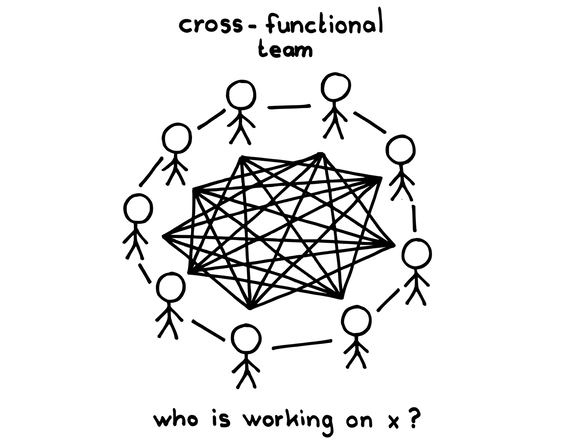
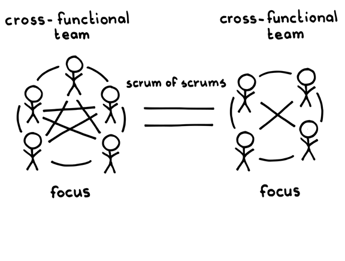

# 有糸分裂

確信度：★★

{:style="text-align:center;"}

…ステークホルダーからの要求に対応するために、チームにメンバーを追加してきました。しかし、チームは1つのチームというより、2つのチームとして働くようになってきており、チームメンバーは起きている全ての事を把握するのが難しくなってきています。

{:style="text-align:center;"}
＊　　＊　　＊

**[スクラムチーム](ch02_07_7_Scrum_Team.md)​は少しずつ段階的に成長させるべきですが、いつかチームは大きくなって、効率を維持することが難しくなります。[小さなチーム](ch02_09_9_Small_Teams.md)​は最も効率的ですが、時には成長が必要です。**市場の要求に対する機能の広範さやボリュームを満たすために、組織を十分に大きくすることは可能ですが、大きなチームは非効率になりがちです。フレッド・ブルックスは、「1人のプログラマが1ヶ月でできることに、2人のプログラマは2ヶ月かかる」と述べています（The Mythical Man-Month: Essays on Software Engineering [Bro95]にて）。既存の開発力に人を追加することで得られる利益は少しだけです。チームメンバーを徐々に追加すことは、移行時の「立ち上げコスト」をなだらかににしますが、結果としてチームではなく群衆を生み出します。

一つの製品に対して一つのチームで働くのが、最も効果的です。全てのチームメンバーは、自分の仕事が過去、現在、未来にどうつながるのかを正確に理解します。他のチームメンバーが作業の求めに応じて、すぐに方向転換できます。チームが二つであるよりも一つであるほうが、仕事からの学びは、より自然な流れになります。[プロダクトオーナー](ch02_11_11_Product_Owner.md)​にとって、二つよりも一つの[開発チーム](ch02_14_14_Development_Team.md)と調整する方が、より容易です。二つのチームを扱うことは、[スクラムマスター](ch02_20_19_ScrumMaster.md)の仕事を増やし、チームごとに[スクラムマスター](ch02_20_19_ScrumMaster.md)を持つということは、調整のラインをもう一つ増やすということです。

{:style="text-align:center;"}

Cross-functional team: 機能横断チーム Who is working on x ?: 誰がxに取り組んでいますか？

公式チームと実動チームという用語で明確に区別できます。公式チームとは、組織図に存在しており、[スクラムマスター](ch02_20_19_ScrumMaster.md)や[プロダクトオーナー](ch02_11_11_Product_Owner.md)のような肩書きに対応するものです。一方、実動チームは、個人間の社会的相互作用が実際に起きる場に生まれます。非公式と公式の構造を合わせるのは良いことです。そして、先述のように一つのチームを持つのは良いことですが、実体は二つのチームにもかかわらず、あたかも一つのチームであるかのようにふるまうのは愚かです。

追加で新たにチームを雇うこともできますが、新しい人たちにプロダクト、文化、技術を理解してもらう労力は膨大です。経験則として、プロダクト開発組織に一人加えるごとに、約半年の間その組織全員の有効性が25％低下します。また、新しい社員を追加するごとに「立ち上げ」時間が必要となり、その時間とそれに伴うオーバーヘッドは組織が大きくなるにつれて増加します（ブルックスの法則[21]）。さらに、大規模な社員の増員を実現するには、かなりの手元資金か強力なキャッシュフローがが必要です。組織が単に成功するだけでなく成長の段階に移るとき、ほとんどの企業の経営陣は「企業を統合し、成長のための資源を動員します。オーナーは、その企業の現金と築き上げてきた借入能力を利用し、全てを成長資金に投じるリスクを負います」（Harvard Business Review 61 [CL83]から）。もし技術者1人当たりの年間の総費用が10万ドルで、5人編成のチームを外部から追加したとすると、新たな雇用者が完全にチームの一員となるまで約半年かかるため、始めるだけで30万ドルかかります。さらに、収益が増員分の人件費をカバーするまでには、追加の時間が必要になることが多いです。もしチームが社内にいる場合、半年という期間は短縮できますが、そのためには、要求に応じて利用可能なチームのプールを維持するほどの大きな組織でなければなりません。そして、スケーリングの専門家は、そのようなチームはアプリケーションのドメインでの経験が必要であり、すでに「ハイパフォーマンスチーム」として働いている必要があると指摘します。これは、利用可能なチームが仕事に適合する可能性をさらに制限します。[22]

さらに、一部の国の労働法では、「試用期間」（通常6ヶ月）を終えた従業員を解雇することが企業にとって非常に高くつくことが多いです。企業が社内の他の仕事に人々を簡単に割り当てることができない限り、チームを自由に雇用したり解雇したりすることは、費用対効果が良いとは言えないということです。それができるのは、企業が大規模であることを意味します。米国国勢調査局によれば、年間収益が120万ドル以下の企業が全ソフトウェア開発の85％を行っており、これは彼らが5人から8人の従業員を雇用していることを示唆しています[23]。そうした企業のほとんどは「企業を統合し、成長のために資源を動員する」ための社内リソースがありません。

それゆえ：

**元のチームが徐々に成長し、7人程度になって非効率的になったところで、一つの大きな[開発チーム](ch02_14_14_Development_Team.md)を二つの小さなチームに分けます。**元のチームの経験、ドメイン知識、プロダクトの知識、そして文化を、新チームそれぞれに引き継ぎます。

{:style="text-align:center;"}

Cross-functional team: 機能横断チーム Scrum of scrums: スクラムオブスクラム Focus: 集中

分割後も各チームが[機能横断チーム](ch02_10_10_Cross_Functional_Team.md)であり続け、自律的に[Regular Product Increment](https://sites.google.com/a/scrumplop.org/published-patterns/value-stream/regular-product-increment)を届けられるように、十分に広い分野をカバーしていることが重要です（[自律したチーム](ch02_16_16_Autonomous_Team.md)を参照）。新しいチームはそれぞれ、プロダクトの全ての部分の作業をする権限を持つべきです。

{:style="text-align:center;"}
＊　　＊　　＊

新たな[開発チーム](ch02_14_14_Development_Team.md)は、それぞれが専任の[スクラムマスター](ch02_20_19_ScrumMaster.md)と開発者を持つべきです。新しいチームは元のチームと同じ[Product Backlog](https://sites.google.com/a/scrumplop.org/published-patterns/value-stream/product-backlog)の作業を行い、同じ[プロダクトオーナー](ch02_11_11_Product_Owner.md)と一緒に作業します。何らかのプロダクトに取り組むチームはお互いに調整を行い、同じ作業環境を共有すべきです（[同じ場所に集まったチーム](ch02_08_8_Collocated_Team.md)を参照）が、[Production Episode](https://sites.google.com/a/scrumplop.org/published-patterns/value-stream/production-episode)でそれぞれのチームが取り組む[Product Backlog Item](https://sites.google.com/a/scrumplop.org/published-patterns/value-stream/product-backlog/product-backlog-item)​sのデリバリーについては自律性を持つべきです。

別々のチームのメンバーは、非公式に連携を続け、必要に応じて[スクラムオブスクラム](ch02_35_34_Scrum_of_Scrums.md)​の日々のリズムも活用します。

チームの成功に不可欠なある分野の専門家が、元のチームに一人だけいる場合があり、それは、結果として得られる一方のチームには、対応する知識が欠けていることを意味します。[Set-Based Design](https://sites.google.com/a/scrumplop.org/published-patterns/value-stream/set-based-design)、[志を同じくする仲間](ch02_05_5_Birds_of_a_Feather.md)、`4.2.4. 徒弟制度`を利用して、できるだけ早く障害を取り除きます。その間、チームは不足している領域を最善を尽くして補います。

1つのチームから2つのチームへの拡大は難しいものです。同じチームメンバーで構成される1つのチームの仕事を2つのチームで行うためには調整が必要になり、それによってベロシティー（[Notes on Velocity](https://sites.google.com/a/scrumplop.org/published-patterns/value-stream/notes-on-velocity)を参照）が、40％程度低下することがよくあります。チーム数が増えるにつれて、この割合は減少する可能性があります。これは、大規模にスケールする計画がある場合にのみスケーリングに意味があると言えるかもしれません。

新しいチームのうちの一つが特定のステークホルダーコミュニティを担当することが自然であると感じられる場合は、[Value Stream Fork](https://sites.google.com/a/scrumplop.org/published-patterns/value-stream/value-stream-fork)または[Value Areas](https://sites.google.com/a/scrumplop.org/published-patterns/value-stream/value-areas)​を検討してください。

インクリメンタルな成長と最終的な部分への分化は、Christopher Alexanderの「センター」の理論の根底にある基本的なプロセスであり、彼が構造の調和的な成長をどのように見ているかの核心である。彼は、『ザ・ネイチャー・オブ・オーダー　建築の美学と世界の本質　生命の現象  [Ale04a]』において、この一般的な原則を明らかにしています。また、『時を超えた建設の道 [Ale79]』の第24章（"修復のプロセス"）では、これらの原則をより具体的に探求しています。

チームを小さく保つことは、アイデンティティを高め、それがチームにポジティブなチームメンバーシップの意識を醸成します（`4.2.13. チームのプライド`を参照）。

