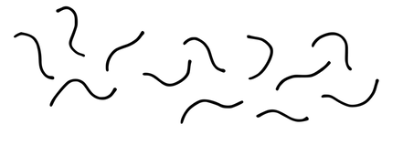
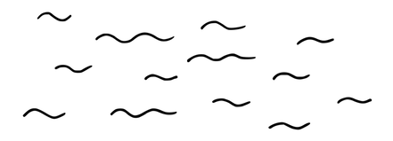

# スクラムマスター

 Original:[ScrumMaster](https://sites.google.com/a/scrumplop.org/published-patterns/product-organization-pattern-language/scrummaster)

確信度：★★

{:style="text-align:center;"}
 
エドムンド・ヒラリーが先頭に立ち、シェルパのテンジン・ノルゲイが後を追う形で、ジョン・ハントによって率いられたイギリスの遠征隊は、1953年に史上初めてエベレストを制覇した。目立つ役割ではないものの、ミッションにおいて核心的な役割を担い支援する人も、目標達成者として評価される。スクラムマスターは多くの場合、後方から支援することが多い。

...[開発チーム](ch02_14_14_Development_Team.md)​と[プロダクトオーナー](ch02_11_11_Product_Owner.md)は、ある市場向けの複雑な製品を開発するために集まりました。[プロダクトオーナー](ch02_11_11_Product_Owner.md)はビジネス面を管理し、製品の内容を定義する一方、[開発チーム](ch02_14_14_Development_Team.md)は仕事をするための最良のツールや技術に焦点を当てています。しかし、どちらの役割にも、彼らがどのように協力するか、またスクラムのプロセス全体をどのように実施するかを検討する責任はありません。

{:style="text-align:center;"}
＊　　＊　　＊

**[開発チーム](ch02_14_14_Development_Team.md)、[プロダクトオーナー](ch02_11_11_Product_Owner.md)、組織は、スクラムの原則と価値観を深く理解し、それを適用しない限り、スクラムの恩恵を受けることはできません。**

{:style="text-align:center;"}

スクラムの理論とその原則について深く理解しなければ、組織がスクラムを使用して最も価値ある製品を作り出すことは困難です。そして、組織は自身のパフォーマンスがどれほど良いかを理解していても、必ずしも改善の方法が分かるわけではありません。自分たちを正確に見ることができれば、何をすれば改善できるのか明確になることもあります。しかし、自分自身が問題の一部である場合、何が問題かを見極めることは、しばしば困難です。客観的な視点を持つ人によって、私たちは自身のブロックしている行動や思考を認識することが可能になり、それによって何か行動を起こすことを決断できます。

チームは品質、間隔、スループットを改善するために、改善（カイゼン）と革新（カイカク）としてスクラムを採用します（[カイゼンとカイカク](ch02_19_Kaizen_and_Kaikaku.md)参照）。スクラムが機能するのは、複雑な開発を支えるために、原則、理論、価値、基盤といった広範で強力で深いシステムが複雑に組み合わせられているからです。「明確化されたスクラム」は、一般的な実践者が通常スクラムを理解するレベルの作成物、役割、イベントであり、背後にあるより豊かな原則の単なる風刺画に過ぎません。チームメンバーはそれらの豊かな原則をほとんど理解していないかもしれませんし、単にそれらに注意を払っていないだけかもしれませんが、これらの原則はスクラムを成功させるためには不可欠です。

組織的な障害物の排除、意見の対立や議論のファシリテーション、グループイベントや講座の企画、ライブラリの更新、グループへのキャリア機会の提供―これらは全て健全なチームの活動です。これらの活動の一部は、ステークホルダーの期待に応える上で、不十分な点に対する[スクラムチーム](ch02_07_7_Scrum_Team.md)外からのフィードバックへの対応であり、内部改善のための好機ともなります。これらの活動の多くは、[プロダクトオーナー](ch02_11_11_Product_Owner.md)や[開発チーム](ch02_14_14_Development_Team.md)が自身の責任範囲に加えると、時間を消費する「邪魔」なものになります。そのため、これらのタスクはしばしば管理スタッフやマネージャーのような他の役職に任されることになります。マネージャーは支配的な立場を取り、伝統的な管理スタッフはサービスを要求するチームメンバーからの要求と指示に応じます。どちらの場合でも、活動に関与するチームメンバーを、他の役職者との関係に巻き込み、その仕事を完遂する中で個人の自律性は弱くなります。

[プロダクトオーナー](ch02_11_11_Product_Owner.md)と[開発チーム](ch02_14_14_Development_Team.md)の役割がそれぞれの仕事に集中することによって、より深い構造的な問題が生じます。価値の最大化（[Value and ROI](https://sites.google.com/a/scrumplop.org/published-patterns/value-stream/product-backlog/value-and-roi)を参照）、特定の[Sprint Goal](https://sites.google.com/a/scrumplop.org/published-patterns/value-stream/sprint-goal)の達成、または[Sprint](https://sites.google.com/a/scrumplop.org/published-patterns/value-stream/sprint)の完了に集中していると、大局を見失いがちです。そのため個人が、自分の関心をチームの利益やプロダクト開発全体の利益から区別することが難しくなります。

このような近視眼的な視点により、プロセスが犠牲になりがちです。スクラムの日本の起源は、「正しいプロセスを構築すれば、正しいプロダクトを構築できる。」と教えています。しかし、ビジネス戦略や開発視点からプロダクトだけに集中していると、プロセス改善が必要とする厳格さと注意を忘れがちです。合意したプロセスの標準を、理由をつけて除外することなく、チームが自己監視するためには規律が必要です。例えば、[開発チーム](ch02_14_14_Development_Team.md)は、いくつかの小さな開発基準を守らなかったり、いくつかのテストを省略したり、一つの小さな欠陥が市場に出ても、すぐには結果に影響しないと考えるかもしれません。[プロダクトオーナー](ch02_11_11_Product_Owner.md)は、今回だけはと自分の意向を押し付け、開発を中断するかもしれません。チームは、スクラムの知識を深めるための取り組みをおこなうこともなく、プロセス改善に全く時間を投資することもないくらいに、近視眼的になるかもしれません。このような行動は、これらの役割の一般的な合理化された責任に沿っているかもしれませんが、長期的には破壊的になる可能性があります。

内向的なチームが、自分たちの成果のオーナーシップを得るのは簡単で、結果に対する反応を待つことはありません。実装が終わったら、テストを待つのには忍耐が必要です。テストが終わったら、市場からのフィードバックを待つ時間が必要です。チームにフィードバックループが構築されていても、フィードバックに変化がなければ自己満足に陥りやすいのです。「品質は大丈夫です。欠陥のバックログは18ヶ月間、2000件で変わっていません。」各役割が自身の仕事（例えば、製品戦略の策定や依頼されたものの提供）に集中していると、製品の品質について他のフィードバックを受け取ることはないかもしれません。

自律した感覚は、孤立した感覚に簡単に変わってしまいます。[開発チーム](ch02_14_14_Development_Team.md)のメンバーは、同じ役割の他の人々が集まって話をしているだけでも、自分の懸念が無視されるかもしれないと感じるかもしれません。結局のところ、彼らはただの[開発チーム](ch02_14_14_Development_Team.md)のメンバーで、ステークホルダーはしばしば彼らの戦略的な問題に対する洞察を無視します。[プロダクトオーナー](ch02_11_11_Product_Owner.md)もまた支持者を必要とします。

そして、ステークホルダーを満足させること、良い仕事をすること、スケジュールを守ることに集中しているチームは、しばしば自身のニーズを見失うことがあります。スクラムには2つのプロダクトがあります。それは、成果物とチームです。全員が良い市民であり、自分の仕事に注意を払っているかもしれませんが、チームの健康と成長は企業の健全性にとって不可欠です。これは誰にでもできることですが、全員の責任であるということは、誰の責任でもないということでもあります。

それゆえ：

**スクラムのフレームワーク、その原則、価値を理解するために、[プロダクトオーナー](ch02_11_11_Product_Owner.md)、[開発チーム](ch02_14_14_Development_Team.md)、組織全体をガイドし、リードする[スクラムマスター](ch02_20_19_ScrumMaster.md)を導入します。[スクラムマスター](ch02_20_19_ScrumMaster.md)は、スクラムのプロセスを守って、組織がスクラムを使用し成功できるように育てます。[スクラムマスター](ch02_20_19_ScrumMaster.md)は、特定の障害が生じたときに作用する可能性がある深い原理を説明するガイドとして行動し、チームと共にこれらの原理を解釈し、解決策の特定と実装を支援します。**

{:style="text-align:center;"}

[スクラムマスター](ch02_20_19_ScrumMaster.md)は組織と[スクラムチーム](ch02_07_7_Scrum_Team.md)の反省と改善を導き、障害の解決やスクラムプロセスの改善を支援します。これがスポーツ、音楽、エンターテイメント、その他の分野でトップパフォーマーでさえ、通常パーソナルコーチを持つ理由です。興味深いことに、コーチは必ずしもトップパフォーマーではありませんが、弟子を教えること、観察すること、さらなる高みを目指して挑戦させることに特に長けています。

[スクラムマスター](ch02_20_19_ScrumMaster.md)は、[プロダクトオーナー](ch02_11_11_Product_Owner.md)が成功するようにガイドします。例えば、[プロダクトオーナー](ch02_11_11_Product_Owner.md)が[Product Backlog](https://sites.google.com/a/scrumplop.org/published-patterns/value-stream/product-backlog)を適切に順序づけていないと仮定しましょう。[スクラムマスター](ch02_20_19_ScrumMaster.md)は単に[プロダクトオーナー](ch02_11_11_Product_Owner.md)に順序をつけるように頼むこともできますが、より良いアプローチは[プロダクトオーナー](ch02_11_11_Product_Owner.md)に対して、バックログ上の​[Product Backlog Item](https://sites.google.com/a/scrumplop.org/published-patterns/value-stream/product-backlog/product-backlog-item)の順序づけをどのように行うかについて、さりげなくガイドすることです。[スクラムマスター](ch02_20_19_ScrumMaster.md)は以下のような質問をするかもしれません。「次の数日で次のスプリントの計画を立てる予定ですが、[開発チーム](ch02_14_14_Development_Team.md)は次に何に取り組むべきかわかりません。アイテムAとアイテムBの両方が重要なようですが、どちらが最も重要なのかわかりません。あなたは組織のビジョン、ビジネスモデル、財務についての洞察を持っていますし、ユーザーのニーズと要望についても良い視点を持っています。これらに基づいて、私たちが今取り組むべきことを判断できますか？」(このアプローチはお世辞のニュアンスを持っていますが、それが目的ではありません。それは、[プロダクトオーナー](ch02_11_11_Product_Owner.md)に対して、アイテムが、どのようになぜ価値があるのかを示しています。)

[スクラムマスター](ch02_20_19_ScrumMaster.md)はチームにおける、スクラムの進め方に責任を持っていますが、[開発チーム](ch02_14_14_Development_Team.md)や[プロダクトオーナー](ch02_11_11_Product_Owner.md)に対する権限はありません。[スクラムマスター](ch02_20_19_ScrumMaster.md)の主な活動は以下の通りです：

1. 観察し、質問する

1. ファシリテーションする

1. 教える

1. 介入する、そして最も重要なのは、

1. あえて、「何もしない」

「何もしない」が最も重要な活動かもしれません。なぜなら、[スクラムマスター](ch02_20_19_ScrumMaster.md)が問題を「解決」したり、チームのために決定するたびに、チームは学び、成長する機会を失うからです。

デイリースクラムの例：スクラムプロセスに責任を持つ[スクラムマスター](ch02_20_19_ScrumMaster.md)の役割の一つは、チームに​[デイリースクラム](ch02_30_29_Daily_Scrum.md)のオーナーシップを持つように動機づけることです（[スクラムマスターが隠れる](ch02_31_30_ScrumMaster_Incognito.md)を参照）。

{:style="text-align:center;"}
＊　　＊　　＊

[スクラムマスター](ch02_20_19_ScrumMaster.md)はチームのマネージャーではなく、チームの決定や行動に対して権限を持っていません。[スクラムマスター](ch02_20_19_ScrumMaster.md)がチームに何をするべきか、またはどのように仕事を行うべきかを直接指示することはありませんが、効果的な説得と動機付けをしなければなりません。[スクラムマスター](ch02_20_19_ScrumMaster.md)の重要な役割の一つは、自己満足に立ち向かうことです（[ハッピーバブルをつつく](ch02_29_28_Pop_the_Happy_Bubble.md)​を参照）。[スクラムマスター](ch02_20_19_ScrumMaster.md)が直接的に行使できる唯一の権限は、破壊的な人物をチームから排除することです（[日陰をなくす](ch02_28_27_Remove_the_Shade.md)を参照）。

スクラム導入の初期段階における[スクラムマスター](ch02_20_19_ScrumMaster.md)の一般的な役割は、[開発チーム](ch02_14_14_Development_Team.md)やメンバーのコーチと考えることができます。[スクラムマスター](ch02_20_19_ScrumMaster.md)はスクラムプロセスに責任を持ち、少なくとも開発チームが、スプリントごとに[Regular Product Increment](https://sites.google.com/a/scrumplop.org/published-patterns/value-stream/regular-product-increment)を提供できるよう特に支援します。[Regular Product Increment](https://sites.google.com/a/scrumplop.org/published-patterns/value-stream/regular-product-increment)はスクラムを始めるチームにとって十分に難しく、目指すべき初期の目標と言えます。理想的には、スクラムチーム自身が[スクラムマスター](ch02_20_19_ScrumMaster.md)を選択し、[スクラムマスター](ch02_20_19_ScrumMaster.md)の選択はしばしばチームの自己組織化の最初の行為となります。チームは、プロセスの改善につながらない[スクラムマスター](ch02_20_19_ScrumMaster.md)や、合意したプロセスの基準をチームに守らせない[スクラムマスター](ch02_20_19_ScrumMaster.md)を解任することがあります。いずれにしても、[スクラムマスター](ch02_20_19_ScrumMaster.md)はスクラムチームにとってのサーバントリーダーです。

`5.1.3. 生産者`パターンの説明によれば、チームメンバーは通常、プロデューサー（組織のROIに直接貢献する人）か、サポーター（プロデューサーの仕事を助ける人）のいずれかになります。[スクラムマスター](ch02_20_19_ScrumMaster.md)は典型的なサポーターです。[スクラムマスター](ch02_20_19_ScrumMaster.md)が行うこと全ては、チームの残りの人々（通常、すべてがプロデューサー）が効果的になる支援に集中すべきです。外部の障害で、開発チームや[プロダクトオーナー](ch02_11_11_Product_Owner.md)の意見や専門知識を直接的には必要としないものには、[スクラムマスター](ch02_20_19_ScrumMaster.md)が対処するかもしれません。極端なケースでは、[スクラムマスター](ch02_20_19_ScrumMaster.md)は、破壊的なメンバーをチームから排除することがあります。それは、破壊が深刻で、根本的なプロセスの障害であり、チームが他の方法では対処できない場合です。（[日陰をなくす](ch02_28_27_Remove_the_Shade.md)を参照）。

[スクラムマスター](ch02_20_19_ScrumMaster.md)は、チームとその目標に対する共感と配慮からチームに奉仕しますが、鋭い客観性を弱めるほどチームに同化すべきではありません。これはバランスの問題です。[スクラムマスター](ch02_20_19_ScrumMaster.md)は、物事がどのように進行しているかについて、認識の鋭さを保つために、社会的にチーム内部にいるべきですが、外部の客観性を失うべきではありません。この視点から導かれることの一つは、一人の人がパートタイムで[スクラムマスター](ch02_20_19_ScrumMaster.md)と[開発チーム](ch02_14_14_Development_Team.md)メンバーを兼ねることは、意味をなさないかもしれないということです。一方でバランスを保つために、孤立したり、孤立していると見なされることを避けます。[スクラムマスター](ch02_20_19_ScrumMaster.md)は、予期せぬ障害が突然現れたときにチームを支援し奉仕するために、存在感を示すよう努力すべきです。​[赤い携帯電話](ch02_22_21_Small_Red_Phone.md)を参照してください。

[スクラムマスター](ch02_20_19_ScrumMaster.md)は時折、チームの顔となって外の世界に対応することがあります。この役割では、[スクラムマスター](ch02_20_19_ScrumMaster.md)は、チームが望まない妨害を防ぐことができます（`4.2.9. 防火壁`を参照）。[スクラムチーム](ch02_07_7_Scrum_Team.md)の外部から、チームメンバーやチーム全体に干渉したい人は、[スクラムマスター](ch02_20_19_ScrumMaster.md)を通すべきです。[スクラムマスター](ch02_20_19_ScrumMaster.md)は、チームを不当な脅迫や批判から保護しつつ、チームの改善に役立つ情報をどのようにまとめるかを検討します。そして最終的に、[スクラムマスター](ch02_20_19_ScrumMaster.md)がそのような外部の関係者とチームとの直接のコミュニケーションを促進するかもしれません。しかし、これは決して[スクラムマスター](ch02_20_19_ScrumMaster.md)がチームのコミュニケーションチャネルであることを意味するものではありません。逆に、チームメンバーは必要な人物と自由かつ頻繁にコミュニケーションを取るべきです。しかし時折、単一の連絡窓口が適切であり、チームは[スクラムマスター](ch02_20_19_ScrumMaster.md)がその役割を果たすことを検討し、適応するべきです（`4.2.10. 門番`を参照）。

繰り返しますが、[スクラムマスター](ch02_20_19_ScrumMaster.md)の重要な役割の一つは、チームがスクラムの要素の背後にある「理由」を理解する手助けをすることです。[スクラムマスター](ch02_20_19_ScrumMaster.md)は[スクラムチーム](ch02_07_7_Scrum_Team.md)と組織の指導者であり、彼らをスクラムの精神に則って導きます（​[ゲームの精神](ch01_01_1_The_Spirit_of_the_Game.md)​を参照）。

スクラムの性質上、プレッシャーの強い環境となることがあります。各[Sprint](https://sites.google.com/a/scrumplop.org/published-patterns/value-stream/sprint)のペースが速く、時には慌ただしく感じられることもあります。これが長期にわたると、個人のやる気を失わせ、燃え尽き症候群を引き起こす可能性があります。[スクラムマスター](ch02_20_19_ScrumMaster.md)はチームメンバーを励まし、小さな成功を称え、[開発チーム](ch02_14_14_Development_Team.md)が持続可能なペースで活動を続けるようにします。[スクラムマスター](ch02_20_19_ScrumMaster.md)の役割自体もプレッシャーの強い仕事となり得ます。燃え尽き症候群を防ぐために、[スクラムマスター](ch02_20_19_ScrumMaster.md)はコーチングを求めるべきです。[スクラム(マスターの)コーチ](ch02_23_22_Scrum_Master_Coach.md)を参照してください。

重要な結果として、チームレベルでのスクラムは、[開発チーム](ch02_14_14_Development_Team.md)内の戦術的な介入だけでなく、より戦略的な役割に広がることで、組織全体に影響を及ぼします。それによって、組織全体の文化を変えることに役立ちます。そのような戦略的な活動を組織全体に広げるため、[スクラムマスター](ch02_20_19_ScrumMaster.md)は、[志を同じくする仲間](ch02_05_5_Birds_of_a_Feather.md)を使用することを検討してみてください。そこでは[スクラムマスター](ch02_20_19_ScrumMaster.md)は改善の取り組みを共有し、交流し、調整することができます。

