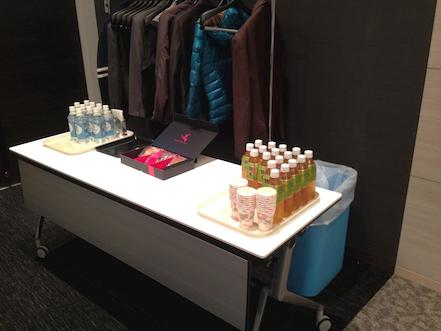
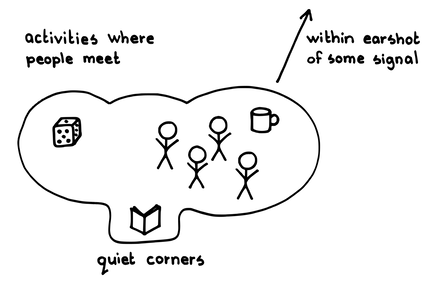

# おやつ神社

 Original:[Oyatsu Jinja (Snack Shrine)](https://sites.google.com/a/scrumplop.org/published-patterns/product-organization-pattern-language/development-team/oyatsu-jinja)

別名：スナック神社

{:style="text-align:center;"}

...[開発チーム](ch02_14_14_Development_Team.md)​は、持続可能なペースで[Regular Product Increment](https://sites.google.com/a/scrumplop.org/published-patterns/value-stream/regular-product-increment)​の提供に成功してきました。チーム自身とその技術的プラクティスは、どちらも改善を見せています。最近では、チームに助けを求める声はますます増えています。他のチームのメンバーが技術的なアドバイスを求めてきます。マネージャーや他のステークホルダーは、チームの仕事の仕方を学び、新しいビジネスのアイデアを議論するために頻繁にチームに訪れます。チームメンバーはしばしば邪魔され、製品開発に集中する時間が減ってしまいます。

{:style="text-align:center;"}
＊　　＊　　＊

**[開発チーム](ch02_14_14_Development_Team.md)には、邪魔の入らない環境が必要です。同時に、チームメンバーは、他のメンバーや[プロダクトオーナー](ch02_11_11_Product_Owner.md)​とのやり取りも必要とします。**さらに、チームは、ステークホルダーや他のチームなど、チーム外の人々との交流を通じて、継続的に、情報を共有し改善する必要があります。

{:style="text-align:center;"}

チームを孤立させることはコミュニケーションを妨げる一方、環境を完全に部外者に開放することはチームの効率を損なう可能性があります（X-teams: How to Build Teams that Lead, Innovate and Succeed [AB07]）。

それゆえ：

**チームエリアの近くにキャンディー、スナック、飲み物（コーヒーまたはお茶）を用意し、[おやつ神社](ch02_21_20_Oyatsu_Jinja_Snack_Shrine_.md)を作りましょう。**神社はチームの作業エリアから十分に離れた場所に設置する必要があり、神社での会話がチームを邪魔しないようにします。しかし、神社はチームから十分に近い場所にあるべきで、神社とチームエリアの人々が互いを認識できるようにする必要があります。[おやつ神社](ch02_21_20_Oyatsu_Jinja_Snack_Shrine_.md)は、チームが神社での活動を観察できるように、秘密の場所ではいけません。神社を利用する人々がチームの邪魔にならないことも重要です。

 
A Pattern Language [AIS77], "A Place to Waitˮ "より

Activities where people meet: 人々が集まって活動 Quiet corners: 静かな場所 Within earshot of some signal: 何かしら音が耳に入る範囲

チームメンバーは、神社で休憩しても構いません。スナックは人々がリラックスし、互いに交流する機会を提供します。神社は、他のメンバーの邪魔にならない形で、チームメンバーが話をしたり助けを求めたりする場所を作り出します。

ステークホルダーも神社を訪れて構いません。チームの元に直接行って邪魔をするのではなく、チームメンバーへ会いに神社へ行きます。多くの場合、神社での会話で十分です。訪問者が、神社にいないチームメンバーの助けを必要とする場合、そのチームメンバーが休憩を取るまで神社で待ちます。チームメンバーが神社にいる訪問者を見れば、休憩を取るタイミングを調整することができます。[開発チーム](ch02_14_14_Development_Team.md)が集中していて神社にチームメンバーがいない場合、訪問者はこれに気付き、時間をおいて神社に戻ってきます。

[おやつ神社](ch02_21_20_Oyatsu_Jinja_Snack_Shrine_.md)はまた、スクラムイベント後の良好なコミュニケーション場所としても機能します。例えば、[デイリースクラム](ch02_30_29_Daily_Scrum.md)、[スプリントレビュー](ch02_36_35_Sprint_Review.md)、[スプリントレトロスペクティブ](ch02_37_36_Sprint_Retrospective.md)を終えた後、必要であれば、メンバーは神社を手短なフォローアップの会話の場として利用することができます。

神社はまた、改善（[カイゼンとカイカク](ch02_19_Kaizen_and_Kaikaku.md)を参照）と自己組織化のための実験場になることができます。誰でも神社にスナックを提供したり、神社を清潔で素敵な出会いの場所に保つように協力できます。例えば、一部のチームはコーヒーを新鮮に保つための自分たち独自のプロセスを開発します。この神社は自己組織化の中心地となります。

[おやつ神社](ch02_21_20_Oyatsu_Jinja_Snack_Shrine_.md)は複数チームが存在する環境でも機能します。一つの神社が、チームにとっての町の広場のように機能します。この場合、神社をチームにとって行きやすく、見えやすい場所に設置することが重要です。

{:style="text-align:center;"}
＊　　＊　　＊

このパターンは、`5.1.20. 複数の責務が関与する`と関連しています。それは、人々が話に行く共通のエリアです。`5.1.20. 複数の責務が関与する`（またはコーヒーメーカーや従業員ラウンジ）は、非公式のコミュニケーションネットワークを強化する場所で、配置や組織構造により、ともすれば分断されてしまう人々の間で情報が素早く流れるのを助けます。[おやつ神社](ch02_21_20_Oyatsu_Jinja_Snack_Shrine_.md)は、持続可能なコミュニケーション環境（または場）を促進するためにチームに十分近い場所に位置し、目につきやすいという点で、`5.1.20. 複数の責務が関与する`とは異なります。[おやつ神社](ch02_21_20_Oyatsu_Jinja_Snack_Shrine_.md)は一部の`5.1.20. 複数の責務が関与する`のように出会いの中心地として機能しますが、その主な焦点は[開発チーム](ch02_14_14_Development_Team.md)とそのチームの外部の人々との間のより意図的なコミュニケーションです。

このパターンはまた、`9 何か食べながら` (Fearless Change [RM05])とも関連しています。一緒に食卓を囲むことには、障壁を下げ、良好なコミュニケーションを促すという社会的な意味があります。

このパターンと`4.2.10. 門番`との間には、いくつかの類似点があります。このパターンでは、`4.2.10. 門番`は一個人ではなく、[おやつ神社](ch02_21_20_Oyatsu_Jinja_Snack_Shrine_.md)です。

チームメンバーが自分達自身とその製品を信じているなら、チームは自分たちの集中を守ることにモチベーションを感じることができます。​[プロダクトプライド](ch02_39_38_Product_Pride.md)を参照してください。

ソリューションに示されたスケッチは、Christopher Alexanderのパターンである「待ち合わせ場所（A Place to Wait）」に触発されており、それは「待合を積極的にするような状況をつくり出す」("A Pattern Language [AIS77]", "A Place to Waitˮ, pattern 150)。また、[おやつ神社](ch02_21_20_Oyatsu_Jinja_Snack_Shrine_.md)をAlexanderの親密度の変化(Intimacy Gradient）（"A Pattern Language [AIS77]"、pattern 127）における変化点と考えることもできます。

編集者の注：このパターンは、オリジナルの英語版制作中の技術的な問題により、パターン名に漢字が表示されないため、”Oyatsu Jinja”とされていますが、長らく「おやつ神社」という名前で知られていました。

