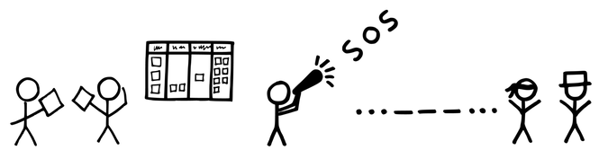

# 赤い携帯電話

{:style="text-align:center;"}

主要な役割が設定され、同じ場所に集まって連絡をとりあえる​[スクラムチーム](ch02_07_7_Scrum_Team.md)​のダイナミクスを保ちたいと考えています。

{:style="text-align:center;"}
＊　　＊　　＊

スクラムは秒単位のフィードバックに依存しています。チームは、個々人がリモートにいたり周りにいない場合、彼らの情報を待って、止まってしまうことがあります。一方、[プロダクトオーナー](ch02_11_11_Product_Owner.md)​および[スクラムマスター](ch02_20_19_ScrumMaster.md)​は、チームを見続けることはできず、すべきでもありません。彼らは、チームの仕事を懸命に支えているとしても、他の場所にいる方が適切なことがあります。しかし、​[開発チーム](ch02_14_14_Development_Team.md)​つまり黄金の卵を産むガチョウが、彼らに直ちに連絡できることが重要な場合もあります。そして、彼らに連絡できないのが数秒間なら、開発は止まらないでしょうが、数時間、時には数分間、連絡できない場合でも、戦略的な問題に遭遇することがあります。一つの例は、`プロダクトバックログアイテム`​について何か根本的な誤解があることに、[開発チーム](ch02_14_14_Development_Team.md)が予期せず気づいたときです。他には、[開発チーム](ch02_14_14_Development_Team.md)が外部のステークホルダーからの情報が必要で、これまで[プロダクトオーナー](ch02_11_11_Product_Owner.md)と[スクラムマスター](ch02_20_19_ScrumMaster.md)が連絡を取っており、[開発チーム](ch02_14_14_Development_Team.md)が連絡方法を知らない場合があります。

{:style="text-align:center;"}

チームに対して、重要な役割を担う個人の業務用電話番号を利用可能にすることはできますが、その場合、彼らは[開発チーム](ch02_14_14_Development_Team.md)のチーム支援を構築したり、問題を軽減するために、絶えず邪魔される可能性があります（`4.1.26. 手を止めて始めた作業を中断するな`を参照）。

それゆえ：

**重要なスタッフメンバーごとに、専用の番号を持つ赤い携帯電話を支給し、重大な状況に限り、これらのキープレイヤーに連絡するために使用します。このような電話の支給対象となる可能性があるのは、[プロダクトオーナー](ch02_11_11_Product_Owner.md)や[スクラムマスター](ch02_20_19_ScrumMaster.md)などです。**どうしても必要な緊急事態にのみ使用されることを理解した上で、[スクラムチーム](ch02_07_7_Scrum_Team.md)のメンバーに電話番号を公開します。

{:style="text-align:center;"}

その使用を最小限に抑えるようにメンバーに促すユーモラスまたは軽い抑止力を、何らかの形で創り出してください。似たような抑止力として、スプリントの中止が連想されます。それは出来事を印象づけ、あとで、 ​[スプリントレトロスペクティブ](ch02_37_36_Sprint_Retrospective.md)​のときに思い出しやすくなります(​[緊急時手順](ch02_33_32_Emergency_Procedure.md)​を参照)。

{:style="text-align:center;"}
＊　　＊　　＊

Richard Gabrielが、開発者が業務時間外や週末に働いているソフトウェア開発チームとの共同作業をしていたときのことです。彼らは必然的に、コンピュータサーバーなどの物理的に保護されたリソースへのアクセスを必要とします。サービスを復元するためには、物理的に行動することが必要になるためです。Richardは、故障した機械やネットワークルーターが致命的問題にならないように、誰か業務時間外に錠を開ける方法を知っている人が常に居るように求めました。

[赤い携帯電話](ch02_22_21_Small_Red_Phone.md)は、割り込みによるコミュニケーションスタイルです。はるかに好まれるプロトコルである[おやつ神社](ch02_21_20_Oyatsu_Jinja_Snack_Shrine_.md)​とは対照的です。

多くの場合、このパターンは欠陥のある官僚制度の埋め合わせになってしまっています。このパターンが頻繁に必要だと感じる場合、代わりに​[同じ場所に集まったチーム](ch02_08_8_Collocated_Team.md)を試すことを検討すべきです。例として、[赤い携帯電話](ch02_22_21_Small_Red_Phone.md)や、他の何かを使ったとしても、複数拠点での開発の長期的な解決策にはなり得ません。

ID4RealのKenny Munckに感謝します。

