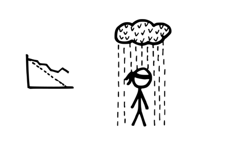

## 22 スクラム (マスター) コーチ

確信度：★

{:style="text-align:center;"}

...[19 スクラムマスター](ch02_20_19_ScrumMaster.md)は​、[14 開発チーム](ch02_14_14_Development_Team.md)​に奉仕し、チームの継続的な改善を支援しています。

{:style="text-align:center;"}
＊　　＊　　＊

**[スクラムマスター](ch02_20_19_ScrumMaster.md)は、時として[7 スクラムチーム](ch02_07_7_Scrum_Team.md)​の問題の原因であったり、期待されるパフォーマンスを発揮していなかったり、あるいは単純に上達したいと思っていることもあります。**

世界中で[スクラムマスター](ch02_20_19_ScrumMaster.md)の数は増えており、それは多くのスクラムマスターがその仕事を始めて間もないことを意味します。[スクラムマスター](ch02_20_19_ScrumMaster.md)の役割には多くの側面があり、それらの一部を見落してしまいがちです。また、起こりうるすべての課題に直面したことがある人はいませんし、不慣れな状況では新しい考え方を必要とします。逆に、経験豊富な[スクラムマスター](ch02_20_19_ScrumMaster.md)は型通りの対応に陥りかねません。なぜなら、「経験豊富」ということは、過去の成功を何らかの形で再利用していることを意味するからです。

[スクラムマスター](ch02_20_19_ScrumMaster.md)の役割の一つは、[開発チーム](ch02_14_14_Development_Team.md)の​`28 ハッピーバブルをつつく`​ですが、[スクラムマスター](ch02_20_19_ScrumMaster.md)自身が[スクラムチーム](ch02_07_7_Scrum_Team.md)の現在の状態に安心してしまい、チーム同様、改善の精神を失ってしまうかもしれません。さらに、[スクラムマスター](ch02_20_19_ScrumMaster.md)は、一部の組織的な障壁を日常業務として受け入れてしまうかもしれません。これは、繰り返しの中で卓越性への意識が鈍くなるためです。また、[スクラムマスター](ch02_20_19_ScrumMaster.md)は、状況によっては変えられないものもあると思い込んでしまうかもしれません。これは、改善の精神に反するものです（[カイゼンとカイカク](ch02_19_Kaizen_and_Kaikaku.md)を参照）。

極端な場合、[スクラムマスター](ch02_20_19_ScrumMaster.md)自身に限界を設けてしまっているかもしれませんし、その役割は自分には不向きだと思ってしまう可能性あります。また[スクラムマスター](ch02_20_19_ScrumMaster.md)は、自分の経験を思い出して、目の当たりにしたチームの状況を他のチームの状況に当てはめようとしてしまうかもしれません。

{:style="text-align:center;"}

助けがなければ、[スクラムマスター](ch02_20_19_ScrumMaster.md)の行動が[スクラムチーム](ch02_07_7_Scrum_Team.md)内の関係やチームのステークホルダーとの関係を傷つけるかもしれません。

それゆえ：

**[スクラムマスター](ch02_20_19_ScrumMaster.md)であれば、スパーリングパートナーやコーチと共に、時々、内省や成長の機会を求めるべきです。**

コーチは、組織内の他の[スクラムマスター](ch02_20_19_ScrumMaster.md)かもしれませんし、組織外の人かもしれません。どちらの場合でも、その人が[スクラムマスター](ch02_20_19_ScrumMaster.md)の置かれた状況から十分な距離を取り、冷静に問題に取り組むことに意味があります。誰であれ、[スクラムマスター](ch02_20_19_ScrumMaster.md)に協力している人が、[スクラムマスター](ch02_20_19_ScrumMaster.md)と同じ状況に巻き込まれないことが極めて重要です。

{:style="text-align:center;"}

コーチは、取り組む課題について事前に経験（または認定）を持っている必要はありません。時には、良い質問は、明確な答えより価値があります。なぜなら、それは思い込みを解放する可能性があるからです。`4.2.28. ペアで開発する`のように、時々、初心者が達人に教えることがあります。

コーチングには様々なスタイルがあります。[スクラムマスター](ch02_20_19_ScrumMaster.md)がチームをより効果的に支援することを目指していれば、状況に応じて精神浄化的、挑戦的、変革的など、どのような対話にもなり得ます。

[スクラムマスター](ch02_20_19_ScrumMaster.md)とコーチの間に信頼は不可欠です。[スクラムマスター](ch02_20_19_ScrumMaster.md)が状況の詳細とそれに対する反応の両方を完全に開示できるとき、より速く本当の意味で前進できます。そして、[スクラムマスター](ch02_20_19_ScrumMaster.md)は実際に変わろうとしなければなりません。

コーチは[開発チーム](ch02_14_14_Development_Team.md)と[スクラムマスター](ch02_20_19_ScrumMaster.md)との対話を観察してもよいですが、介入すべきではありません。どのような介入も、[スクラムマスター](ch02_20_19_ScrumMaster.md)とチームの関係や、コーチと[スクラムマスター](ch02_20_19_ScrumMaster.md)の関係を混乱させるでしょう。コーチが重視するのは、[スクラムマスター](ch02_20_19_ScrumMaster.md)がチームにより良く奉仕するのを助けることで、チームを向上させることです。

{:style="text-align:center;"}
＊　　＊　　＊

自分の中にある改善の精神を持続的に育てる[スクラムマスター](ch02_20_19_ScrumMaster.md)は、チーム内でより良く改善を支援、促進できるでしょう。神父が、独りで自身の困難に対処するのではなく、他者の助言を求めるように、[スクラムマスター](ch02_20_19_ScrumMaster.md)も、独りで自身の困難を解決しようとすべきではありません。[スクラムマスター](ch02_20_19_ScrumMaster.md)が自分の意識を高め、チームをサポートする能力を向上させるにつれて、チームの自信、能力、幸福感（`4.2.13. チームのプライド`を参照）は成長していきます。

[スクラムマスター](ch02_20_19_ScrumMaster.md)は、継続的な向上の機会としてだけでなく、職務の遂行中に何らかの限界を感じたときにもコーチを求めるのが望ましいです。大きな組織では、[5 志を同じくする仲間](ch02_05_5_Birds_of_a_Feather.md)の構造を通じて[スクラムマスター](ch02_20_19_ScrumMaster.md)の支援があるかもしれません。小さな組織では、[スクラムマスター](ch02_20_19_ScrumMaster.md)は組織の外部に助けを求める必要があるでしょう。その他に、誰かが[スクラムマスター](ch02_20_19_ScrumMaster.md)にコーチと共に仕事をするように勧めることもあるでしょう。[スクラムマスター](ch02_20_19_ScrumMaster.md)は、この提案に驚くかもしれませんが、成長と向上の機会として前向きに受け入れ、不快に感じない限りはオープンな姿勢を保ち、コーチを信頼することをお勧めします。

同じ組織内で多くの[スクラムマスター](ch02_20_19_ScrumMaster.md)を一人のコーチが支援する場合、そのコーチの偏見が組織に影響を及ぼすリスクがあります。[スクラムマスター](ch02_20_19_ScrumMaster.md)は、コーチを選ぶ際に、この可能性に注意してください。

コーチングは繊細な活動です。それは、ほぼ常に行動の変化をもたらし、変化はそれ自体が不愉快なものかもしれません。さらに、これらの新しい行動は、変化自体が目的に見える不誠実な印象を容易に作り出すことがあります。[スクラムマスター](ch02_20_19_ScrumMaster.md)にとって、このような変化は進歩であるかもしれませんが、[スクラムマスター](ch02_20_19_ScrumMaster.md)と対話するその他の人にとっては、不愉快なものかもしれません。例えば、対立している状況でアクティブリスニングのスタイルを使い始める[スクラムマスター](ch02_20_19_ScrumMaster.md)は、柄にもない行動から不誠実と見なされることがあります。[スクラムチーム](ch02_07_7_Scrum_Team.md)のメンバーは、アクティブリスニングが良いツールであることを頭では理解しているかもしれませんが、以前に対話の手腕が不足していた[スクラムマスター](ch02_20_19_ScrumMaster.md)が柄にもない行動を取るのを見ると、反感を持つかもしれません。コーチングを受ける個人が新しい行動を自然に取り入れるためには時間が必要で、チームが新しい対話のスタイルを受け入れるにも時間が必要です。加えて、これらの二つの変化は異なるペースで進行することがあります。この問題は、“The Coaching Ripple Effectˮ in Psychology of Well-Being: Theory, Research and Practice [OC13] (p. 2)でさらに詳しく説明されています。この論文の筆頭著者は次のように詳述しています：

言い換えれば、リーダーが、新しくより挑戦的な対話を洗練され効果的な方法で進める力は、そのような対話を開始する取り組みから遅れるかもしれません。スタイルの大きな変更が、初めから完全な形で現れることは滅多にありません。

