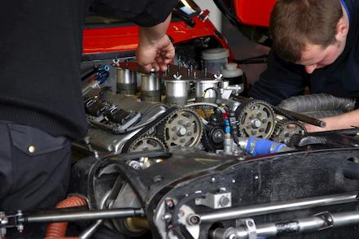
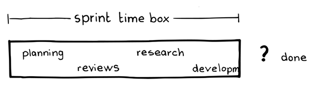
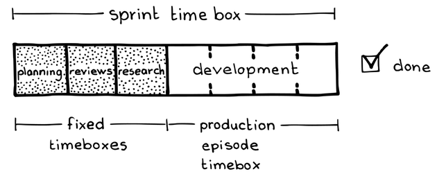

# 23 枠を決めて作業

{:style="text-align:center;"}
 
メカニックは、レーシングカーのエンジンを調整する時間を、レースの完走タイムの予測とは別に計算する。レースのタイムは短縮され続けるのに対して、エンジンの調整は繰り返される作業である。

...あなたは製品を提供するために完成させなければいけない作業を整理しており、​​[11 プロダクトオーナー](ch02_11_11_Product_Owner.md)​は、要求と​`54 プロダクトバックログ`​の準備のために、チームに協力してもらう方法を探しています。

スクラムは時間を2つに分けます。分析とビジネスのための連続したタイムラインと、生産のための`46 スプリント`の周期的なタイムラインです。分析やイノベーションにかかる時間は見積もり不可能で、時として長期間かかることもあります。そのような瞬間は、スティーブ・ジョンソンが『Where Good Ideas Come From』[Joh11]で「ゆっくりとした閃き」と呼ぶプロセスの中で、前触れもなく生じるからです。

{:style="text-align:center;"}
＊　　＊　　＊

**[プロダクトオーナー](ch02_11_11_Product_Owner.md)がリリース計画のためにチームのベロシティ（`ベロシティについて`を参照）を使用する場合、すべての作業を計測対象にする必要がありますが、開発作業すべてを時間で区切ることはできません。**例えば、チームは​、`64 リファインメントされたプロダクトバックログ`​が完璧に出来上がり、どの​`55 プロダクトバックログアイテム`​もReady（`65 準備完了の定義`​を参照）であると宣言できる瞬間に至ることはありません。​[14 開発チーム](ch02_14_14_Development_Team.md)​の見積もりには含まれない、定常的で定期的な作業は常にあります。

{:style="text-align:center;"}

Sprint time box: スプリントのタイムボックス Planning: プランニング Reviews: レビュー Research: 調査 Development: 開発 Done: 完成

`プロダクトバックログ`は、プロダクト開発作業の予算策定をするための主要なツールです。[プロダクトオーナー](ch02_11_11_Product_Owner.md)は、`プロダクトバックログアイテム`（PBIs）を、開発の見積もりと予想される価値を考慮して、並べます。チームは​ ​`71 スプリントゴール`を確約し、[開発チーム](ch02_14_14_Development_Team.md)は自分たちの見積もりに自信を持っています。その作業には時間がかかります。[開発チーム](ch02_14_14_Development_Team.md)のメンバーは、すべての作業を​`75 プロダクションエピソード`​の範囲内に収める責任があります。

通常、[開発チーム](ch02_14_14_Development_Team.md)のメンバーは、自らのスキルセット、経験、担当分野に関連する開発タスクだけを予測できます。それは通常、プロダクトの構築に関連するものです。他の作業は、開発者が見積もるのが難しい、あるいは不可能なこともあります。例えば、開発の実現性、コスト、トレードオフを評価するための終わりのない調査を必要とする分析タスクがあります。分析は通常、[プロダクトオーナー](ch02_11_11_Product_Owner.md)の仕事ですが、そのような分析には、[開発チーム](ch02_14_14_Development_Team.md)からの情報や作業が必要となることがよくあります。このような調査を固定期間で試みることはできますが、そうすると調査期間の延長を繰り返す可能性があります。そして、調査からは洞察が得られますが、`プロダクションエピソード`中に行われた作業から期待されるような​`85 定期的なプロダクトインクリメント`​をあまり生み出さないことが多いです。これは、そのような作業を`スプリント`内で行うこと、および`プロダクトバックログ`でそれを予算化することに疑問を投げかけます。それがプロダクトを生産していない場合、それは何らかの無駄かもしれません。

もし​[12 プロダクトオーナーチーム](ch02_12_12_Product_Owner_Team.md)​だけで調査できるならば、問題にはならないでしょう。なぜなら、[プロダクトオーナー](ch02_11_11_Product_Owner.md)は自らの時間を管理することができるからです。しかし、実際には、[プロダクトオーナー](ch02_11_11_Product_Owner.md)はビジネススキルセットが強力である一方、調査をサポートするには、作成物を実際に構築するスキルセットが弱いことがよくあります。それにもかかわらず、テクノロジーや生産に関する問題は、ビジネスリスクの主要な要素としてしばしば浮上し、そのような問題は、[プロダクトオーナー](ch02_11_11_Product_Owner.md)の権限範囲内にあります。

`プロダクトバックログ`は、プロダクト開発という大きなカテゴリーに含まれる作業の一部しか文書化していません、ましてやチームが開発以外に費やす時間まで考慮するわけではありません。例として、​`24 スプリントプランニング`で費やされる時間、​​`35 スプリントレビュー`​、インターバル（例えば、コーヒーを飲んだり、オフィスでのネットワーキングに費やす時間など）、​`36 スプリントレトロスペクティブ`​、`リファインメントされたプロダクトバックログ`の維持に注力する時間などがあります。

それゆえ：

**[開発チーム](ch02_14_14_Development_Team.md)の作業を、時間を見積もるもの（つまり、プロダクトに関する作業）と、見積もることができないもの（例えば、PBIをReadyに移動する際の要件を理解する作業など）に分けます。各`スプリント`では、`プロダクションエピソード`のタイムボックスに収まるだけの見積もりされたタスクだけを計画的に実施します。`プロダクションエピソード`の枠外で、見積もりが難しい作業のための定期的なタイムボックスを設定し、タイムボックスが許す範囲でそのような作業を完了させます。**各`スプリント`では、​[7 スクラムチーム](ch02_07_7_Scrum_Team.md)​​は、見積が難しい作業（例：分析作業、ビジネス計画、レビュー活動など）を、そのために用意されたタイムボックスに収まる分だけ実施します。この見積が難しい作業を、`スプリントプランニング`、`スプリントレビュー`、`スプリントレトロスペクティブ`、[スクラムチーム](ch02_07_7_Scrum_Team.md)全体が`リファインメントされたプロダクトバックログ`を継続的に維持するためのタイムボックス、といったイベントで実施します。

{:style="text-align:center;"}

Sprint time box: スプリントのタイムボックス Planning: 計画づくり Reviews: レビュー Research: 調査 Development: 開発 Done: 完成 Fixed timeboxes: 固定されたタイムボックス Production episode timebox: Production Episodeのタイムボックス

チームが、一連の見積もりできないタスクの作業を現時点で完了したと感じる場合、対応するタイムボックスを無理に埋める必要はありません。例えば、チームが`スプリントプランニング`をそのタイムボックスが終了する前に完了したなら、[開発チーム](ch02_14_14_Development_Team.md)はすぐに`プロダクションエピソード`に移ることができます。

＊　　＊　　＊

これで、[開発チーム](ch02_14_14_Development_Team.md)は、抜本的な革新を必要とするタスクや、さもなけば高い不確実性を伴うタスクなど、見積もりが難しいアイテムの作業を継続できます。このような作業を`プロダクトバックログ`から取り除き、したがって`プロダクションエピソード`の時間から除外することで、そうした作業を適切なペースで進めることができます。抜本的な革新やブレイクスルーを必要とするタスク、例えば[開発チーム](ch02_14_14_Development_Team.md)が[プロダクトオーナー](ch02_11_11_Product_Owner.md)をサポートするための作業などは、`プロダクションエピソード`内のタイムボックスで作業をせずに、適切なペースで進行できるようになります。`リファインメントされたプロダクトバックログ`や`スプリントプランニング`に割り当てられた時間で、このような際限のない作業を行うことにより、`プロダクションエピソード`の予算への影響や、開発時間の減少を避けられます。

とはいえ、`スプリント`ごとの[枠を決めて作業](ch02_24_23_Fixed_Work.md)の「合計」時間、さらには`スプリント`内の[枠を決めて作業](ch02_24_23_Fixed_Work.md)それぞれの時間はタイムボックス化されています。例えば、チームは高性能のネットワークルーティングアルゴリズムの代替案を探求すると決定するかもしれません。そのタスク全体の工数をタイムボックスに区切ることも、その完了をスケジュールすることもできませんが、タイムボックス化したイベントとして制限することで、その作業の工数を`スプリント`ごとにタイムボックス化することは可能です。したがって、そのようなすべての作業はタイムボックス化した`スプリントプランニング`内で行われるか、または（`スプリント`を越えて）進めている`42 セットベース設計`​というタイムボックス化した工数に含まれる作業として行うことができます。

さらに、[プロダクトオーナー](ch02_11_11_Product_Owner.md)は、`スプリント`内でのPBIがプロダクトに直接貢献しない場合でも、よくまとまった（すなわち、ある程度見積もり可能な）PBIにチームが取り組むことに投資できます。[プロダクトオーナーチーム](ch02_12_12_Product_Owner_Team.md)が一部の技術的懸念（例：プロダクトのパフォーマンス分析、プロトタイプ構築）のビジネスへの影響を評価するための専門知識を持っていない場合、[プロダクトオーナー](ch02_11_11_Product_Owner.md)は、`スプリント`内の`セットベース設計`の取り組みで、[開発チーム](ch02_14_14_Development_Team.md)がそうした分析作業を行うことに投資できます。このような作業は、[開発チーム](ch02_14_14_Development_Team.md)が合理的に小さい誤差範囲で見積もった作業として行うか、[プロダクトオーナー](ch02_11_11_Product_Owner.md)と[開発チーム](ch02_14_14_Development_Team.md)が予め決定されたタイムボックスで行います。例えば、[プロダクトオーナー](ch02_11_11_Product_Owner.md)がプロトタイピングツールを必要とし、それを使用してチームが何を構築するかを理解するのに役立つ`63 実装可能な仕様`​を作成できる場合、その作業を行うようにチームに指示するためにPBIを使用しても構いません。このようなツールは`41 バリューストリーム`を支え、投資対効果は明らかです。

しかしながら、このような作業は、現在のプロダクトインクリメントに集中する[開発チーム](ch02_14_14_Development_Team.md)の注意を逸らすため、多くの場合ムダであることを[スクラムチーム](ch02_07_7_Scrum_Team.md)が認識するべきです。代わりに[プロダクトオーナーチーム](ch02_12_12_Product_Owner_Team.md)に分析作業を担当させることで、貴重な開発にかける時間を奪わずに済みます。先述のプロトタイプ作成ツールは、一回のコストで、継続的な投資対効果をもたらすという好例です。[プロダクトオーナー](ch02_11_11_Product_Owner.md)が`実装可能な仕様`の提供の代わりに、実際に分析を行うようにチームに何度も依頼する場合、それは[プロダクトオーナーチーム](ch02_12_12_Product_Owner_Team.md)の専門知識の不足を示している可能性があり、チームはそれを障害として対処するべきです。`スプリント`をまたいで変動するこのような作業は、[開発チーム](ch02_14_14_Development_Team.md)の作業能力の変動を直接生み出し、予測を難しくします。このような障害に対しては、[プロダクトオーナーチーム](ch02_12_12_Product_Owner_Team.md)は、スキルセットを補完するためにチームメンバーを訓練または雇用して、適切な人員の数を確保し、`実装可能な仕様`を開発者に一貫して提供できるようにすべきです。

代替手段として、[開発チーム](ch02_14_14_Development_Team.md)の分析への時間の貢献（ひいては他の活動）をPBIとして管理できる妥協的なアプローチも考えられます。`セットベース設計`のデザインスプリントのようなものです。

