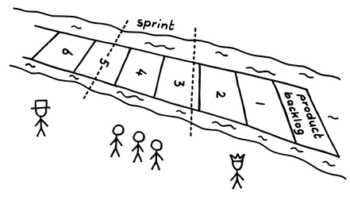
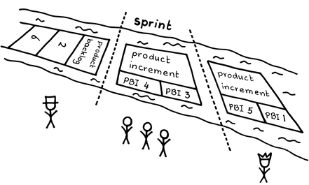

# スプリントプランニング

確信度：★★

{:style="text-align:center;"}

…今、チームは[Product Backlog](https://sites.google.com/a/scrumplop.org/published-patterns/value-stream/product-backlog)​を作り、洗練させましたが、[Product Backlog Item](https://sites.google.com/a/scrumplop.org/published-patterns/value-stream/product-backlog/product-backlog-item)​ (PBI)はまだ潜在的な価値を表しているだけです。それらのアイテムは開発して現実のものにすることによってのみ、価値を生み出す（つまり、[Value Stream](https://sites.google.com/a/scrumplop.org/published-patterns/value-stream)の末端に動かす）ことができます。あなたは、​[Sprint](https://sites.google.com/a/scrumplop.org/published-patterns/value-stream/sprint)で一つ以上のPBIの開発に着手して[Regular Product Increment](https://sites.google.com/a/scrumplop.org/published-patterns/value-stream/regular-product-increment)​を創り出す準備ができています。

{:style="text-align:center;"}
＊　　＊　　＊

**スプリントでは、[Regular Product Increment](https://sites.google.com/a/scrumplop.org/published-patterns/value-stream/regular-product-increment)を生み出すべきです。しかし、単純に[Product Backlog](https://sites.google.com/a/scrumplop.org/published-patterns/value-stream/product-backlog)の一番上からPBIを取り出すだけでは、​[Greatest Value](https://sites.google.com/a/scrumplop.org/published-patterns/value-stream/greatest-value)や、[Sprint](https://sites.google.com/a/scrumplop.org/published-patterns/value-stream/sprint)のタイムボックスに収まるプロダクトインクリメントを生み出すという成果を得られるとは限りません。**

{:style="text-align:center;"}
 
sprint: スプリント product backlog: プロダクトバックログ

作業の順番を心配することなく、[Product Backlog](https://sites.google.com/a/scrumplop.org/published-patterns/value-stream/product-backlog)の上から順番に作業できるといいのですが、いくつかの理由でいつもそうなるとは限りません。PBIのサイズは統一されておらず、チームは[Sprint](https://sites.google.com/a/scrumplop.org/published-patterns/value-stream/sprint)のタイムボックスで、提供可能なプロダクトインクリメントを創る必要があります。そのためチームは何がフィットするかを考え、PBIの順番を入れ替え、さらにはPBIの内容を調整する必要があるかもしれません。

タスクはしばしば相互に依存しており、現在のプロダクトの状態やドメインに関するチームの知識があれば、機能Qの前に機能Pを開発する、タスクYの前にタスクXを実施するといった事で、時間を節約できることに気づくかもしれません。

​[スクラムチーム](ch02_07_7_Scrum_Team.md)全体は、[開発チーム](ch02_14_14_Development_Team.md)がPBIをどのように実装するかについて事細かに記述できるほど、詳細には理解していないのが一般的です。実際の所、そこまでのレベルのPBIの設計は無駄なのです。なぜならPBIがしばらくの間未開発のまま放置される可能性があり、ビジネスやチームの状況は時間とともに変化するかもしれないからです。あるいは、他のPBIが[Product Backlog](https://sites.google.com/a/scrumplop.org/published-patterns/value-stream/product-backlog)のどこかに置かれ、いくつかのPBIが無期限に延期されるかもしれません。しかし、[開発チーム](ch02_14_14_Development_Team.md)が与えられたPBIをどのように実装するかを検討するためには、何らかの設計検討が必要です。もしこれを早くやりすぎると、そのような計画は古くなってしまうかもしれませんし、かといって計画が手遅れになることは避けたいのです。

[開発チーム](ch02_14_14_Development_Team.md)のメンバーは、ビジネスニーズや技術的な制約をより深く理解するにつれて、[Sprint](https://sites.google.com/a/scrumplop.org/published-patterns/value-stream/sprint)中に作業計画を調整する必要があるかもしれません。これは、大規模の場合や、モノリシックなPBIで作業する場合は難しいことです。

それゆえ：

**すべての[Sprint](https://sites.google.com/a/scrumplop.org/published-patterns/value-stream/sprint)の最初に、[スクラムチーム](ch02_07_7_Scrum_Team.md)（または共同して開発し、プロダクトインクリメントを一緒に提供するすべてのチーム）は、[Sprint](https://sites.google.com/a/scrumplop.org/published-patterns/value-stream/sprint)の期間中にどのように価値を創るかを計画するためのミーティングをします。チームは[Sprint Goal](https://sites.google.com/a/scrumplop.org/published-patterns/value-stream/sprint-goal)​に合意し、[開発チーム](ch02_14_14_Development_Team.md)が何をどのように開発するかについての計画を作成します。**これには、[スクラムチーム](ch02_07_7_Scrum_Team.md)がソリューションの詳細な設計を十分に行い、プロダクトをどのように構築するかについて高い確信を持ち、チームメンバーが[Sprint](https://sites.google.com/a/scrumplop.org/published-patterns/value-stream/sprint)中に作業計画を完了できると感じることが必要です（[Granularity Gradient](https://sites.google.com/a/scrumplop.org/published-patterns/value-stream/product-backlog/granularity-gradient)を参照）。

{:style="text-align:center;"}
 
sprint: スプリント product backlog: プロダクトバックログ product increment: プロダクトインクリメント product increment: プロダクトインクリメント

[スプリントプランニング](ch02_25_24_Sprint_Planning.md)は、[Sprint](https://sites.google.com/a/scrumplop.org/published-patterns/value-stream/sprint)の最初の活動です。これは、[Product Backlog](https://sites.google.com/a/scrumplop.org/published-patterns/value-stream/product-backlog)と[開発チーム](ch02_14_14_Development_Team.md)の作業計画との間を[Value Stream](https://sites.google.com/a/scrumplop.org/published-patterns/value-stream)に沿って移行する期間です。

[スプリントプランニング](ch02_25_24_Sprint_Planning.md)では、[スクラムチーム](ch02_07_7_Scrum_Team.md)は[Sprint Goal](https://sites.google.com/a/scrumplop.org/published-patterns/value-stream/sprint-goal)を作成し、[Sprint Backlog](https://sites.google.com/a/scrumplop.org/published-patterns/value-stream/sprint-backlog)の最初のバージョンを作成します。副次的なアウトプットとして、[Product Backlog](https://sites.google.com/a/scrumplop.org/published-patterns/value-stream/product-backlog)が更新されます。[スプリントプランニング](ch02_25_24_Sprint_Planning.md)を開始した時に[Product Backlog](https://sites.google.com/a/scrumplop.org/published-patterns/value-stream/product-backlog)がまだ完全にリファインメントされていない場合（おそらく[プロダクトオーナー](ch02_11_11_Product_Owner.md)​が前回の[開発チーム](ch02_14_14_Development_Team.md)とのミーティング以降にバックログの上の方に新しいアイテムを追加したため）、[スクラムチーム](ch02_07_7_Scrum_Team.md)は新しい[Product Backlog Item](https://sites.google.com/a/scrumplop.org/published-patterns/value-stream/product-backlog/product-backlog-item)について話し合い、見積もり、分解し、順序付けして、目の前の[Sprint](https://sites.google.com/a/scrumplop.org/published-patterns/value-stream/sprint)の作業計画に備えます。

[スプリントプランニング](ch02_25_24_Sprint_Planning.md)では、主に以下のような活動を行います。チームが[Product Backlog](https://sites.google.com/a/scrumplop.org/published-patterns/value-stream/product-backlog)の準備完了（[Definition of Ready](https://sites.google.com/a/scrumplop.org/published-patterns/value-stream/product-backlog/definition-of-ready)を参照）を確認していること、[Sprint Goal](https://sites.google.com/a/scrumplop.org/published-patterns/value-stream/sprint-goal)について合意に至っていること、この[Sprint](https://sites.google.com/a/scrumplop.org/published-patterns/value-stream/sprint)で提供できる程度のPBIを選択していること、[Sprint Goal](https://sites.google.com/a/scrumplop.org/published-patterns/value-stream/sprint-goal)を達成するための作業の実行方法を計画できていることです。ほとんどのチームは、これらの活動を同時に行うことが最善だと考えています。たとえば、作業の方法を把握することで、そのスコープと必要な労力を理解できます（[開発チーム](ch02_14_14_Development_Team.md)が[Sprint](https://sites.google.com/a/scrumplop.org/published-patterns/value-stream/sprint)で完了できる作業量を予測するには、ベロシティが効果的です。[Notes on Velocity](https://sites.google.com/a/scrumplop.org/published-patterns/value-stream/notes-on-velocity)を参照） もちろん、これは[開発チーム](ch02_14_14_Development_Team.md)が[Sprint](https://sites.google.com/a/scrumplop.org/published-patterns/value-stream/sprint)で完了できる量に影響します。

[スプリントプランニング](ch02_25_24_Sprint_Planning.md)では、十分に理解された[Sprint Backlog](https://sites.google.com/a/scrumplop.org/published-patterns/value-stream/sprint-backlog)を作成するために十分な設計のための時間を確保することが重要です。しかし、[スプリントプランニング](ch02_25_24_Sprint_Planning.md)はタイムボックス化する必要があります。目安として、2週間の[Sprint](https://sites.google.com/a/scrumplop.org/published-patterns/value-stream/sprint)では4時間以内、より短い[Sprint](https://sites.google.com/a/scrumplop.org/published-patterns/value-stream/sprint)では比例して短くなるはずです。長く時間がかかってしまうなら、かけてもいいのですが、計画にかける時間を短縮し、その分プロダクトの構築に時間をかけるようなカイゼンの機会を模索しましょう。

[プロダクトオーナー](ch02_11_11_Product_Owner.md)がPBIを十分に明確化していないため、[開発チーム](ch02_14_14_Development_Team.md)が関連する[Sprint Backlog Item](https://sites.google.com/a/scrumplop.org/published-patterns/value-stream/sprint-backlog/sprint-backlog-item)を設計できない場合、[開発チーム](ch02_14_14_Development_Team.md)はその[Sprint](https://sites.google.com/a/scrumplop.org/published-patterns/value-stream/sprint)でそのPBIを引き受けるべきではありません（[Enabling Specification](https://sites.google.com/a/scrumplop.org/published-patterns/value-stream/product-backlog/enabling-specification)または[Definition of Ready](https://sites.google.com/a/scrumplop.org/published-patterns/value-stream/product-backlog/definition-of-ready)を参照）。明確化が不適切なPBIは、作業の肥大化とその後の[Sprint](https://sites.google.com/a/scrumplop.org/published-patterns/value-stream/sprint)の失敗の主な原因になります。Jeff Sutherland氏によると、ある[スクラムチーム](ch02_07_7_Scrum_Team.md)では、PBIが十分に明確化されていない場合、チームは全員ビーチに行くというルールが決められていたそうです。(これは[プロダクトオーナー](ch02_11_11_Product_Owner.md)に[Product Backlog](https://sites.google.com/a/scrumplop.org/published-patterns/value-stream/product-backlog)に関する明確なメッセージを伝えることになります！）。

[スプリントプランニング](ch02_25_24_Sprint_Planning.md)の要となるアウトプットは、[開発チーム](ch02_14_14_Development_Team.md)が[Sprint Goal](https://sites.google.com/a/scrumplop.org/published-patterns/value-stream/sprint-goal)をどのように達成できるかを説明できるようになることです。説明できるようになれば、十分な理解度で議論したということであり、実際にチームが見積もった時間内にできる確率が上がります。チームはこれをミーティングの効果を測る指標として考えてもいいかもしれません。

前述のように、[スプリントプランニング](ch02_25_24_Sprint_Planning.md)では、[Sprint Backlog](https://sites.google.com/a/scrumplop.org/published-patterns/value-stream/sprint-backlog)の最初のバージョンを作成します。これは[開発チーム](ch02_14_14_Development_Team.md)が[Sprint](https://sites.google.com/a/scrumplop.org/published-patterns/value-stream/sprint)で作業する最初の計画であり、毎日[デイリースクラム](ch02_30_29_Daily_Scrum.md)で洗練され調整されます。[デイリースクラム](ch02_30_29_Daily_Scrum.md)は本来、毎日の再計画のイベントです。

{:style="text-align:center;"}
＊　　＊　　＊

[スプリントプランニング](ch02_25_24_Sprint_Planning.md)の質は、その後の[デイリースクラム](ch02_30_29_Daily_Scrum.md)の成功に強く影響します。[Sprint Goal](https://sites.google.com/a/scrumplop.org/published-patterns/value-stream/sprint-goal)と[Sprint Backlog](https://sites.google.com/a/scrumplop.org/published-patterns/value-stream/sprint-backlog)が十分に定義され理解されていれば、[開発チーム](ch02_14_14_Development_Team.md)は効果的な[デイリースクラム](ch02_30_29_Daily_Scrum.md)を行うことができて、必要な再計画も明確になります。[スプリントプランニング](ch02_25_24_Sprint_Planning.md)での活動が不十分だと、複数チームで開発を行うときの反復的な[スクラムオブスクラム](ch02_35_34_Scrum_of_Scrums.md)の負担が増加するかもしれません。

[スプリントプランニング](ch02_25_24_Sprint_Planning.md)の明確なアウトプットは、[Sprint Backlog](https://sites.google.com/a/scrumplop.org/published-patterns/value-stream/sprint-backlog)と[Sprint Goal](https://sites.google.com/a/scrumplop.org/published-patterns/value-stream/sprint-goal)です。しかし、[スプリントプランニング](ch02_25_24_Sprint_Planning.md)は、`4.2.12. 目的の統一`を強化し、[開発チーム](ch02_14_14_Development_Team.md)と[プロダクトオーナー](ch02_11_11_Product_Owner.md)が互いのニーズとモチベーションをより理解するのに役立ちます。これは、`4.1.1. 信頼で結ばれた共同体`を強化し、[豊かな土壌](ch02_03_3_Fertile_Soil.md)​を育みます。

チームは、[Greatest Value](https://sites.google.com/a/scrumplop.org/published-patterns/value-stream/greatest-value)を追求するだけではなく、純粋な[プロダクトプライド](ch02_39_38_Product_Pride.md)によってバックログを磨き上げます。

