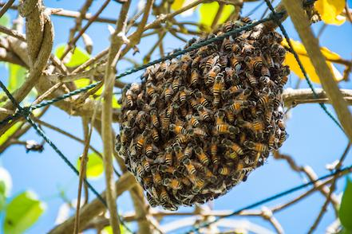
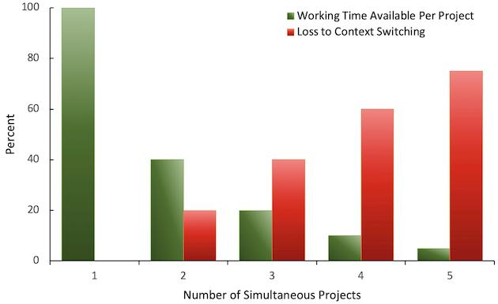
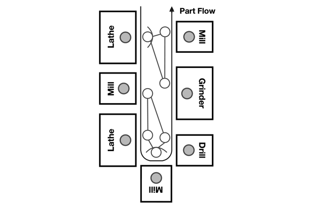

# スウォーミング：一個流し

 Original:[Swarming: One-Piece Continuous Flow](https://sites.google.com/a/scrumplop.org/published-patterns/product-organization-pattern-language/development-team/swarming--one-piece-continuous-flow)

確信度：★★

{:style="text-align:center;"}

...組織、チーム、個人は、共同で作業して仕事を完成（[Definition of Done](https://sites.google.com/a/scrumplop.org/published-patterns/value-stream/definition-of-done)を参照）します。[プロダクトオーナー](ch02_11_11_Product_Owner.md)​の責任は、価値の提供を最大化するために[Product Backlog](https://sites.google.com/a/scrumplop.org/published-patterns/value-stream/product-backlog)を並べることですが、[開発チーム](ch02_14_14_Development_Team.md)の責任は、生産のフローを最大化するために[Sprint Backlog](https://sites.google.com/a/scrumplop.org/published-patterns/value-stream/sprint-backlog)を実装順に並べることです。（[Developer-Ordered Work Plan](https://sites.google.com/a/scrumplop.org/published-patterns/value-stream/sprint-backlog/developer-ordered-work-plan)を参照。）

{:style="text-align:center;"}
＊　　＊　　＊

**同時に多くの仕事を進めると、個人の有効性、チームのベロシティ、企業の健全性が劇的に低下することがあります。それにより、ベロシティは損なわれ、時にはゼロになることもあります。**もし、全員がそれぞれ個別に自分の仕事に取り組んでいるなら、互いに助け合ったり、長期的には互いに学び合うことは少なくなるでしょう。

チームメンバーそれぞれの好みや、作業環境の障害は、しばしば努力を分散させる原因になります。一度に複数のアイテムに取り組むチームでは、多くの仕掛り作業、低いプロセス効率、それに伴う遅延が生じます。

**仕掛中の作業（Work in process）、進行中の作業（Work in progress）、仕掛中の商品、仕掛中の在庫は、企業の部分的に完成した商品で、完成を待って最終的には販売されるか、アイテム自体に価値があります。これらのアイテムは、製造中であるか、キューやバッファストレージでさらなる処理を待っています。この用語は、製造やサプライチェーンマネジメントで使われています。**

最適な生産管理は、仕掛中の作業を最小限にすることを目指します。仕掛中の作業は、ストレージスペースを必要とし、投資可能な資本を束縛し、製品の使用期限を早めるリスクを伴います。ある生産工程へのキューは、前工程の供給不足に対して十分にバッファがあることを示しますが、前工程の出力に対して後工程の処理能力が不足していることを示しているのかもしれません。[29]

並行作業でスループットを向上させようとするチームを考えてみてください。メンバーは個々に、一度に一つの[Product Backlog Item](https://sites.google.com/a/scrumplop.org/published-patterns/value-stream/product-backlog/product-backlog-item)​ (PBI)に取り組んでいます。単独で作業すると、[開発チーム](ch02_14_14_Development_Team.md)のメンバーは、テストよりも、アイテムの構築に集中する可能性が高いでしょう。一つの理由は、テストへの専門知識や意欲が、設計や構築のクリエイティブなタスクへの専門知識や意欲より少ないためです。​[Sprint](https://sites.google.com/a/scrumplop.org/published-patterns/value-stream/sprint)中に複数の作業アイテムが遅延すると、[Sprint](https://sites.google.com/a/scrumplop.org/published-patterns/value-stream/sprint)の終了時にPBIを完成できないリスクが高まります。さらに悪いことに、シリコンバレーとヨーロッパでは、複雑なソフトウェアに取り組む一部のチームは、[Sprint](https://sites.google.com/a/scrumplop.org/published-patterns/value-stream/sprint)内でバグを特定して修正しないと、コーディング完了時の1時間のテストが、3週間後の24時間のテストに変わってしまいます。チームがスウォーミングの代わりにテストを延期すると、1か月で提供できるものが2年かかることもあります。

この問題をさらに難しくしているは、ジェラルド(ジェリー)・ワインバーグが提供している経験則モデルで、マルチタスクが仕事の完成を遅らせるというものです（Quality Software Management: Volume 1, Systems Thinking [Wei92], p. 284):

{:style="text-align:center;"}
 
Percent: パーセント Number of Simultaneous Projects: 同時プロジェクト数 Working Time Available Per Project: プロジェクト毎の作業時間 Loss to Context Switching: コンテキストスイッチによる損失

さらに悪いことに、最近の脳科学では、マルチタスクが人を愚かにし、速度を遅くするだけでなく、ストレスを増加させ、老化を早めることが明らかになっています(Proceedings of Agile 2007 [RL07])。

一度に多くのことを進めることは、仕事が速く進んでいるという幻想を生み、マネージャーが持つ従業員個人の効率化への期待に応えるように見えます。しかし、これによりチームが後で修正しテストしなければならない欠陥の数が増加し、開発費用が増大し、リリースの日程が遅れることになります。

チームは作業をサブグループに分割することができますが、作業アイテムが相互に独立している範囲に限り、各サブグループは自律的に作業することができます。複雑なシステムでは、アイテムは通常相互に関連しており、これらの依存関係を処理することは進捗を妨げ、遅延を引き起こすことがありますが、作業アイテムの順序をつける際に循環的な依存関係が必要となることはほとんどありません。[開発チーム](ch02_14_14_Development_Team.md)のメンバーは、お互いのコードに干渉することを避けるために独立して作業をしたいと考えることがよくありますが、これはプロセスやエンジニアリングプラクティスの不足により、機能不全に陥っているチームの症状です。Googleは、デイリーミーティングとスウォーミングを実施することでこの問題を解決し、仕事を完成(Proceedings of Agile 2006 [Str06])させました。

それゆえ：

**[Product Backlog](https://sites.google.com/a/scrumplop.org/published-patterns/value-stream/product-backlog)の1つのアイテムにチームの最大限の努力を集中させ、できるだけ早くすべての分かっている作業を完了させます。このアイテムを引き受ける人が、チームのキャプテンとなります。全員が、キャプテンを可能な限り助け、キャプテンの邪魔をしてはいけません。キャプテンがアイテムを完成させ次第、次のバックログアイテムを引き受ける人がキャプテンになります。**

{:style="text-align:center;"}
 
Part Flow: モノの流れ Lathe: 旋盤 Mill: フライス盤 Lathe: 旋盤 Mill: フライス盤 Drill: ドリル Grinder: 研磨機 Mill: フライス盤

出典： 「ザ・トヨタウェイ（上）」 ライカー著　ー純利益1兆円を突破した世界最強メーカーを支える14の原則を徹底解明ー2004年 第8章 図8-4[Lik04]

1947年に私たちは設備を平行に二列かL字型に配置して一人の作業者が製造工程上の3台か4台の設備を操作するようにしました。作業時間や労働密度に何ら変化がなかったのに、現場の作業者からは強い反発を受けました。わが社の職人たちは、多能工として働かざるを得ないような新しい仕組みが嫌いだったのです。ひとりの作業者が1台の設備を受け持つという方式から、ひとりでさまざまな工程の設備を受け持つというやり方に反発しました。 出典：ライカー著 「ザ・トヨタウェイ（上）」 ー純利益1兆円を突破した世界最強メーカーを支える14の原則を徹底解明ー2004年[Lik04] (第8章 原則2 よどみのない流れをつくって、問題を表面化させる P.195)

訳注：上記の記述の元は、大野耐一著「トヨタ生産方式」の以下の記述と思われる。 昭和二十二年には機械を「ニの宇型」または「L字型」に並べて、一人の作業者の二台持ちを試み、二十四年から二十五年にかけては、「コの字型」、「ロの宇型」として、工程順の三台持ち、四台持ちへの挑職をしていた。生産現場の風当りは、とうぜん強かった。仕事の量や作業時間が増大するわけではないが、当時の熟練工は良くも悪くも職人気質おう盛な連中であったから、機械を配置換えして、従来の一台持ちから工程の多数台持ちにし、しかも旋盤からフライス盤、ボール盤など、多能工としての仕事が要求されることになるのだから、抵抗も多かったはずである。 出典： 大野耐一著「トヨタ生産方式」ー脱規模の経営をめざしてー 1977年 第1章 [Ohn88] (第一章　ニーズからの出発　●生産の流れを作る　P.23)

このパターンは、チームが一緒に働くことで、ビジネス価値を届けるためにベロシティを最大化することを目指しています。与えられたタスクの効率性に焦点を当てるのではなく、バックログアイテムにスウォーミングし、生産のフローに注目する思考の転換が必要です。個々の効率が生産を最適化することはなく、ゆとりを持つことで仕事を速くできます。

矛盾するようですが、スウォーミングではチームが一度に一つのPBIに焦点を当てる一方で、進行中のアイテムに関する多くの開発作業が迅速に入れ替わることになります。チームは実装を数分おこなった後、少しテストを追加し、それが実際には新たな分析と次の開発に繋がり、PBIが完成になるまで続けます。別の方法として、一度に一つの開発フェーズを実施することで、チームワークを避けることができますが、スウォーミングは全てのチームメンバーが自分たちの才能を常に最大限に活用するために最も効果的です。

これはフラクタルなパターンであり、企業レベル、ポートフォリオレベル、チームレベル、個人レベルに適用できます。スティーブン・R・コヴィーの『完訳 7つの習慣 人格主義の回復 [Cov94]』を参照してください。これは、より幸せなチームと文化的な成功をもたらします。

{:style="text-align:center;"}
＊　　＊　　＊

チームのスウォーミングは、個人よりもチーム全体に焦点を当てたアイデンティティをチームが維持することによって促進できます。卓越した個人の業績に対する報酬を制限するか、排除してください。残業、残業手当、一生懸命働くことを価値とする労働倫理を排除することで「ヒーロー文化」に対抗します。一度に一つのPBIに取り組むことで、チームメンバーの新しいスキルセットが広がり、複数のスキルを持つ個人が増えることになります。また、明確に述べられた​[Sprint Goal](https://sites.google.com/a/scrumplop.org/published-patterns/value-stream/sprint-goal)を持つことで、チームが毎[Sprint](https://sites.google.com/a/scrumplop.org/published-patterns/value-stream/sprint)で素晴らしいことを達成する動機付けにもなります。

 ​[Scrum Board](https://sites.google.com/a/scrumplop.org/published-patterns/value-stream/information-radiator/scrum-board)上の最優先のPBIに取り組むことによって、個人やチームは、[Sprint](https://sites.google.com/a/scrumplop.org/published-patterns/value-stream/sprint)におけるフローの最大化のために、自己組織化しやすくなります。デンマークのSystematic A/Sは、このパターンを実施することで、会社のすべてのチームの生産性が倍増したことを示しました（Proceedings of Agile 2007 [SJJ07]）。Citrix Onlineは、このパターンを企業レベルで適用し、リリースサイクルを42ヶ月から10ヶ月未満に短縮し、そのプロダクトの市場シェアを大幅に拡大しました（Proceedings of 43rd Hawaii International Conference on System Sciences [Gre10]）。

このパターンを適用することにより、チームは一個流しのフローに移行します。トヨタはこれが生産能力を最適化することを示しました：

理想では、一個流しとは、ある付加価値工程から次の付加価値工程まで、待ち時間ゼロ、ロットまとめなしで部品が直接移動し、顧客に納入されることをいう。長年、私たちはこれを「連続的流れ生産」と呼んできた。トヨタがいまこれを「一個流し生産」と呼ぶのは、多くのメーカーが自社の連続的に動いているが付加価値工程間に仕掛けのあるラインを指して、「すべてが動いているので、わが社も連続的流れ生産をやっています」と間違ったことを言うからだろう。「一個流し生産」と呼べば、このような間違った解釈が難しくなる（マイク・ローザー. トヨタのカタ：驚異の業績を支える思考と行動のルーティン (Kindle の位置No.907-912).）。

一度に一つの[Product Backlog Item](https://sites.google.com/a/scrumplop.org/published-patterns/value-stream/product-backlog/product-backlog-item)に取り組むことで、進行中の作業アイテム間の調整を不要にします。調整をする代わりに、チームは最も依存関係が少ないアイテムから作業を進めることができます。

チームは[Developer-Ordered Work Plan](https://sites.google.com/a/scrumplop.org/published-patterns/value-stream/sprint-backlog/developer-ordered-work-plan)で常に方向性を調整します。彼らは[デイリースクラム](ch02_30_29_Daily_Scrum.md)で集まり、毎日心を一つにして方向性を調整します。しかし、すべての方向性の変更は[Sprint Goal](https://sites.google.com/a/scrumplop.org/published-patterns/value-stream/sprint-goal)の条件内で行われます。[Sprint Goal](https://sites.google.com/a/scrumplop.org/published-patterns/value-stream/sprint-goal)は、チームが結束する中心となり、フローを方向付ける助けとなります。経験豊富な経営者であり技術投資家でもあるMark Gillettは、次のように述べています。「個人に対する一連のタスク（とおそらく引き継ぎ）が存在するかのように振る舞うチームは、PBI を「完成」するために必要なことを探し、動的にパートナーシップを組んで作業するチームに比べて、低い価値しか見いだせないでしょう。」緊密に連携して作業するチームは、プロダクトが何であるかについての共有ビジョンを築き、プロダクトや達成した事に対するプライドを育むことができます。詳しくは[プロダクトプライド](ch02_39_38_Product_Pride.md)を参照してください。

スクラムコミュニティのメンバーたちも、何年もスウォーミングについて議論してきました。例として、Dan Rawsthorneの著書『Exploring Scrum: The Fundamentals, 2nd ed. [RS11]』を参照してください。

