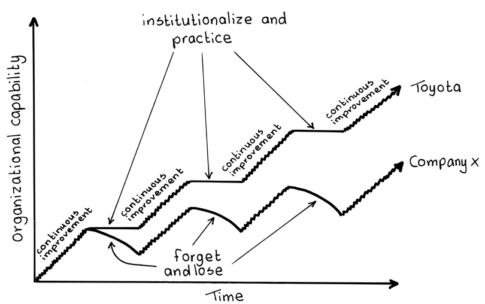

# カイゼンパルス

確信度：★★

{:style="text-align:center;"}

...​[開発チーム](ch02_14_14_Development_Team.md)は、信頼性のあるベロシティ（`ベロシティについて`を参照）、品質、その他の指標によって、持続可能なパフォーマンスを示してきた実績があり、次のレベルへと進みたいと考えています。チームの能力と品質の指標には透明性があり（​[豊かな土壌](ch02_03_3_Fertile_Soil.md)）、そしてチームはそれらがそのまま維持され、改善することに誇りをもちたいと思っています。チームはカイゼンを行っており、​`一歩づつ`での改善を取り入れています。

{:style="text-align:center;"}
＊　　＊　　＊

**統計的に妥当な基準を確立するには時間がかかるため、１分単位、１時間単位、`スプリント`単位での改善を示すのは難しいです。**さらに、`スプリント`は通常、[開発チーム](ch02_14_14_Development_Team.md)の効果性を測定する最もよく知られた粒度で、特にベロシティの粒度でもあります。これは、プロダクトの価値、見積りポイントあたりの価値、プロダクトの品質、チームの情熱（​`幸福指標`​を参照）などの広く望まれる目標にも同じことが言えます。

つまり、スクラムが、トヨタ生産方式と同様に基礎としている2つの事は、カイゼンの精神と人です。改善は重要で、「継続的な改善」という言葉は専門家たちから頻繁に出てきます。しかし、実は継続的な改善には逆説的な問題があります。改善を測定することが重要であり、少なくともある変更が事態を良くしたのか悪くしたのかを知る必要があります。我々は常にある基準に対して改善を測定しますが、ある時点での単一のプロセスの測定値はプロセスの変動の影響を受けます。つまり、私たちには改善を評価する統計的な基準が必要なのです。

さらに重要な点は、プロセス改善には人間的な側面が欠かせないということです。集団としての人というものは、変化を受け入れるのに時間がかかります。改善の必要性を常に意識することは良いことですが、すべてを継続的に改善することはできません。より良い開発手法を取り込んだり、新しい技術を採用するには時間がかかります。つまり、良いものづくりは実践される習慣に裏打ちされるもので、習慣を形成するには時間がかかります。そのため、​[デイリースクラム](ch02_30_29_Daily_Scrum.md)で、[開発チーム](ch02_14_14_Development_Team.md)のメンバーは、長期的なプラクティス、習慣、行動を変えることに焦点を当てるよりも、​`スプリントゴール`​​に向けて戦術的な調整を行います。

ベロシティ（または他の指標）が何にせよ乱高下している場合、カイゼン活動による利益や損害を測定することはできません。一度に複数の変更を加える場合、どの変更がベロシティもしくは、価値、欠陥の減少、その他の価値指標に寄与したのか分からなくなってしまいます。

それゆえ：

**ベロシティを制御する期間と、プロセス改善のスパイクを交互に行ないます。**これを「継続的な改善」ではなく、「断続的な改善」と呼ぶこともできます。まず、ベロシティの基準を設定し、それを統計的にコントロールすることから始めます（ベロシティの経験則として、その変動を20％以内に減少させます）。次に、プロダクト開発に新しい改善を1つ導入します。[開発チーム](ch02_14_14_Development_Team.md)、または適切なら​[プロダクトオーナー](ch02_11_11_Product_Owner.md)​や​[スクラムマスター](ch02_20_19_ScrumMaster.md)​​は、Jon Jaggerが97 Things Every Programmer Should Know [Hen10]、pp. 44--45で説明するように、意図的な訓練に取り組みます。改善を実践し、たゆまぬ反復によってそれを習慣にします。

{:style="text-align:center;"}

Organizational capability: 組織の能力 Time: 時間 Continuous improvement: 継続的な改善 Institutionalize and practice: 仕組み化して実践する Forget and lose: 忘れ去られ、失われる Toyota: トヨタ Company X: ○○社

出典： Takeuchi et al., Extreme Toyota: Radical Contradictions That Drive Success at the World’s Best Manufacturer [OSTD08 TOS08], p. 84.

継続的に反省することは重要で、[スクラムチーム](ch02_07_7_Scrum_Team.md)のメンバーが一緒に変更を導入し、取り入れた変更による、長い目で見た改善の見込みを評価します。変更によっては予見できない負の作用があり、実績がベロシティや長期的な価値に悪影響を及ぼすと判明した場合、もちろん、チームはそのプラクティスの採用を撤回すべきです。

{:style="text-align:center;"}
＊　　＊　　＊

`スプリント`は、スクラムにおける戦略的なカイゼンのためのよく知られた道具です。「プラクティス集中実施」の期間中にベロシティが安定すると、チームは今後に続く予測可能な`スプリント`の納品を達成できたり、ベロシティを増加させる別のカイゼンを準備したりできます。プロセスやチームのダイナミクスを改善し、プロダクトを改善し、チームが新たな段階に上るため、混乱もあるかもしれません。​[スプリントレトロスペクティブ](ch02_37_36_Sprint_Retrospective.md)​と[スプリントレビュー](ch02_36_35_Sprint_Review.md)​の両方が、チームの新たな高みへの収束を評価する機会となりますが、結果の安定性への自信を高めるために、いくつかの連続するレビューで評価が行われる必要があります（つまり、それらが一時的でないことを確認するために）。[デイリースクラム](ch02_30_29_Daily_Scrum.md)は「変化」をもたらすことができますが、[スプリントレトロスペクティブ](ch02_37_36_Sprint_Retrospective.md)と[スプリントレビュー](ch02_36_35_Sprint_Review.md)は「移行」をもたらします。そして戦略的な変化とは持続的な変化です。持続しない変化は、戦略的な変化には値しませんし必要でもありません。

ベロシティのカイゼンには、ベロシティの変動を減少させるものと、ベロシティを増加させるものの2つのタイプが考えられます。この原則は、測定されるあらゆる指標に当てはまります。多くのカイゼンは、性能や価値を増加させるよりも、プロセスを統計的に制御するのに適しています。このようなカイゼンは、[スクラムチーム](ch02_07_7_Scrum_Team.md)がベロシティの変動を減少させようとしているときに、適切である上に、重要でもあります。最もよくあるベロシティの変動の原因としては、​[機能横断チーム](ch02_10_10_Cross_Functional_Team.md)になっていない、経営陣の生産に対する干渉、貧弱な要求などが挙げられます。これらの問題を軽減するカイゼンは、チームを良好な基準に導くのに役立ちます。

複雑なシステムでは、驚くような事が頻発します。変化自体が良いことは稀であり、よく考えられた変更も、現実が絡むとしばしば否定的な結果をもたらします。変化の価値（価値、ベロシティ、一貫性、欠陥密度）を測定しようと努力し、変化が事態を悪化させた場合に備えて撤退の準備をしておく必要があります。測定が一面的にならないようにしてください。努力によってベロシティが増加し、同時に（ROIなどの）価値（「`価値とROI（投資利益率）`」を参照）が減少するかもしれません。ベロシティのみを測定している場合、全体的な価値の減少に気づかないでしょう。そのため、ピアジェの研究では時間をかけて単調に増加し、到達したより高い段階から次のレベルへと移行するモデルを提供していますが、キーガンの学習モデル（Higher Psychology: Approaches and Methods, 2nd ed. [Kee09]）はより現実的で、学習が複雑なプロセスであり、多くの失敗に満ちていることを認めています。繰り返しますが、[スクラムチーム](ch02_07_7_Scrum_Team.md)は改善サイクル全体を通じて、​`ROIで順序付けたバックログ`​やその他の価値を継続的に監視するべきです。なぜなら、ベロシティだけでは増加した価値の指標にはならないからです。ベロシティは予測のためのツールであり、価値が最終目標であることを忘れてはなりません。

​`ベロシティの更新`は、ベロシティの新しい基準を確立するためのパターンです。

`スクラムでスクラムを改善`との違いを比較してみてください。

パターン理論の観点からすれば、このパターンは本来のパターンというよりも「メタパターン」といえます。このパターンは、チームが漸進的なパターンのプラクティスに基づいて、基本的なプロセス（局所的な変更・レビュー・反省、もしくはplan-do-check-act（PDCA）やplan-do-study-act（PDSA）サイクル）の使い方を調整します。これは組織の変更を伴う構造的な改善に、統計的な変動を考慮した進行の時間的側面を組み合わせます。PDCAの「check」部分を、システムの静的な分析と考えるのは簡単すぎるため、統計的な制御の面を追加します。これは、デミングがPDSAという用語を再定義し、単に形式的な検査に従うのではなく、「学習」への知的な投資を求めることにも通じるものです。

自らのプロセスを改善するチームは、プロダクトを改善する可能性が高く、プロダクトの継続的な進歩と組み合わさることで、[カイゼンパルス](ch02_27_26_Kaizen_Pulse.md)は​​[プロダクトプライド](ch02_39_38_Product_Pride.md)に大きく貢献し、長期的にはチームが​​`最高の価値`を達成する助けになります。

[カイゼンパルス](ch02_27_26_Kaizen_Pulse.md)のサイクルに類似して必要になるのは、より急進的で構造を変更する改善（「改革」とも呼ばれる）と、それらの変更に対する後続の微調整は交互に切り替えることです。後者は通常、よりインクリメンタルな性質を持っています（この場合、「カイゼン」という用語は、通常の日本語で使われる「改善」よりも狭い意味で用いられます）。[カイゼンとカイカク](ch02_19_Kaizen_and_Kaikaku.md)を参照してください。

基本となるパターンは、「Extreme Toyota: Radical Contradictions That Drive Success at the World’s Best Manufacturer [OSTD08 TOS08]」に由来しています。 基本となるパターンは、「トヨタの知識創造経営: 矛盾と衝突の経営モデル」に由来しています。

