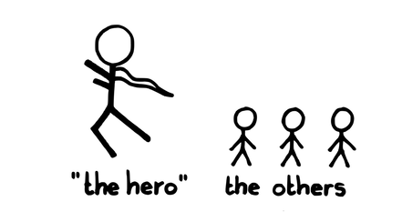
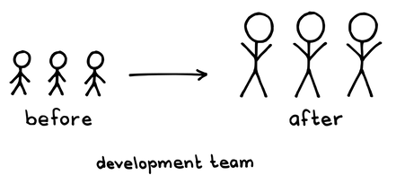

# 27 日陰をなくす

別名：日なたに出す

確信度：★★

{:style="text-align:center;"}

...​¶15 Stable Team​があり、チームメンバー間での作業負荷を均等に分散することを試み(`5.1.13. 作業を均等に配分せよ`を参照)、ペアでの開発を行い(¶126 Developing in Pairs)、良い実習プログラムがあります(`4.2.4. 徒弟制度`を参照)。

{:style="text-align:center;"}
＊　　＊　　＊

あなたは、特に熟練した[14 開発チーム](ch02_14_14_Development_Team.md)​のメンバーが来るまで、チームメンバーがいつも、決定や重要な作業を先延ばしにしていることに気付きます。しかし、[19 スクラムマスター](ch02_20_19_ScrumMaster.md)として、全てのチームメンバーに、それぞれの能力に応じて最適にパフォーマンスを発揮して欲しいと望んでいます。

{:style="text-align:center;"}

“The hero”: 「ヒーロー」 The others: その他の人たち

熟練したチームメンバーは、特に重要な仕事が迫ってくると、常に組織に呼ばれる存在です。なぜなら、その人が最終的な意思決定を主導する可能性が高いと誰もが知っているからです。熟練したチームメンバーは、ビジネスが迅速な解決を必要とするときに呼び出され、ヒーローの役割を果たすことがよくあります。[開発チーム](ch02_14_14_Development_Team.md)の他のメンバーは、複雑な課題を放棄する傾向になりがちです。なぜなら、ヒーローの方が複雑な課題をうまく解決できるし、いずれにしても組織がヒーローの意見を求めることを知っているからです。

時々、ヒーローは、忙しい親のように振る舞うことがあります。つまり、他の人が学ぶのを助けるより一人で仕事を行う方が簡単だと考えてしまうのです。ヒーローはとても生産性が高いため、チームの他のメンバーは成長に必要な光を浴びることなく、日陰で働くことになります。また同時に、ヒーローは燃え尽きてしまう危険もあります。

こうした状況は、[開発チーム](ch02_14_14_Development_Team.md)のメンバーの勇気とモチベーションを奪ってしまいます。彼らは成長を止めてしまい、チームは、全員がなんらかの価値に貢献しようとする自己組織化チームというよりも、サポーターつきのワンマン部隊のようになってしまいます。

それゆえ：

**大きな木が嵐で倒れた後に花に光があたるように、ヒーローをチームから取り除き、残りのメンバーが成長できるようにしてください。**ヒーローの才能を発揮できる他の場所を見つけてください。おそらく会社や組織の他の場所になるでしょう。

{:style="text-align:center;"}

Before: ビフォー After: アフター Development team: 開発チーム

{:style="text-align:center;"}
＊　　＊　　＊

これは簡単に実施できる解決策ではありません。マネージャーがヒーローと親しい場合、不機嫌になるかもしれません。ヒーローは外されたことを降格のように感じ、不機嫌になるかもしれません。引き継ぎのためにチームが学んでいる間、生産性は下がるでしょう。

デンマークの企業の事例を紹介します。あるチームには、他のチームメンバーよりも5倍の仕事をこなすスクラムチームのメンバーがおり、`29 デイリースクラム`に参加する時間がありませんでした。[スクラムマスター](ch02_20_19_ScrumMaster.md)がこの生産的なチームメンバーをチームから取り除いた後、チームのベロシティは2倍になりました。これは、「ヒーロー」を取り除くことで、[7 スクラムチーム](ch02_07_7_Scrum_Team.md)​全体のベロシティが向上する数多くの事例のうちの一つです。

​[11 プロダクトオーナー](ch02_11_11_Product_Owner.md)​がその個人に過度に依存している場合、影を作っているチームメンバーを外すことは不評で、そのため困難かもしれません。それにより、彼または彼女を外すことは難しくなります。一方で、チームが一人の人を失うことに対して脆弱であることも明らかです。それはつまり、チームは一人の人への依存リスクを減少させるために、トラックナンバーを上げる努力をすべきということでしょう（`4.2.24. トラックナンバーはほどほどに`を参照）。

通常、[スクラムマスター](ch02_20_19_ScrumMaster.md)は、プロセスの課題のオーナーとして、この課題に取り組みます。優れた[スクラムマスター](ch02_20_19_ScrumMaster.md)は、個人をコーチングしたり、他の手段を講じて、チームからその人物を外す以外の方法で、問題を軽減しようとします。しかし、最終的には、影を作っているメンバーをチームから外す権威があるのは[スクラムマスター](ch02_20_19_ScrumMaster.md)です。優れた[スクラムマスター](ch02_20_19_ScrumMaster.md)は、チームメンバー全員と相談した上で、どのような行動を取るか決めるかもしれません。影を作っている個人が[スクラムマスター](ch02_20_19_ScrumMaster.md)である場合、残りの[スクラムチーム](ch02_07_7_Scrum_Team.md)にはその個人を解任する権限があります。

20人から5人に減少したチームの[スクラムマスター](ch02_20_19_ScrumMaster.md)はインタビューで以下のように述べました：

別のことを試したいと思っていた人々はチームを去ることが許されました。しかし、私がそれをチームに提示したとき、大きな非難が起きることがありました。「これで終わりだ。私たちにはできない。彼が去れば、お手上げだ。」と彼らは言いました。私は彼らに、残りのチームが成長すると信じていると伝えました。強力なアーキテクトの後ろには、小さな花が咲いているでしょう。この木を伐採したらちょっと待ってみてください。私は皆さんが成長すると信じています。そして、それが実際に起こるのを見てきました。

このパターンは、`4.2.24. トラックナンバーはほどほどに`にも従います。

チームの全員が仕事を共有し、重要な貢献をしているという意識を持つことで、チームの自尊心を高めることができます(`4.2.13. チームのプライド`を参照)。重要な仕事をただ一人の人に任せたり、他のメンバーのやる気をくじくチームメンバーがいると、それがチームを破壊する可能性があります。

場合によっては、ヒーローが価値を提供できる余地が他にあるかもしれません。例えば、個人として貢献することです（`4.2.5. ソロ・バイオリニスト`を参照）。

このパターンの軽量版は、ヒーローの仕事を専門分野にのみに制限することです。[スクラムマスター](ch02_20_19_ScrumMaster.md)は、ヒーローと合意し、ヒーローが通常得意とする種類の仕事や、チームがヒーローに依存するようになった領域の仕事を避け、その代わり、ヒーローに他の仕事を引き受けてもらうことができます。ヒーローは、専門分野における他の人々へのコーチやリソースとして、助言することに限定された役割であれば、まだ価値があるかもしれません。`4.2.28. ペアで開発する`は、しばしば良い移行手段となります。

