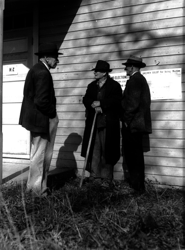

# デイリースクラム

確信度：★★

{:style="text-align:center;"}

...[スクラムチーム](ch02_07_7_Scrum_Team.md)が結成され、[Sprint](https://sites.google.com/a/scrumplop.org/published-patterns/value-stream/sprint)​を開始する準備ができているか、すでに開始しています。そして、[開発チーム](ch02_14_14_Development_Team.md)​は[Sprint Backlog](https://sites.google.com/a/scrumplop.org/published-patterns/value-stream/sprint-backlog)​を作成し、[Sprint Goal](https://sites.google.com/a/scrumplop.org/published-patterns/value-stream/sprint-goal)​を達成するために作業しています。しかし、ドイツの陸軍元帥ヘルムート・フォン・モルトケの「主要な敵勢力との最初の接触を超えて、確実に延長される作戦計画はない」という言葉が残っています。簡単に言えば、[スプリントプランニング](ch02_25_24_Sprint_Planning.md)​の間に作成された計画は、作った直後から古くなります。

{:style="text-align:center;"}
＊　　＊　　＊

**チームは、​[Sprint Backlog Item](https://sites.google.com/a/scrumplop.org/published-patterns/value-stream/sprint-backlog/sprint-backlog-item)を完了させることで[Sprint](https://sites.google.com/a/scrumplop.org/published-patterns/value-stream/sprint)を進めていきますが、作業の複雑さのため、タスクの特性、大きさ、量は頻繁に変わることがあり、時には分単位で変化することもあります。**

例えば、別の解決策、必要なのに知らない知識、隠れたタスク、誤解された要件、さらなる詳細化が必要な要件、開発者間の依存関係、手詰まりという形で表面化する問題が、チームの日々の作業に現れるかもしれません。問題は、これらの課題にどう効果的に対処するかです。

100のタスクの並べ方は9かける10の157乗通りがあるが、そのうちの数通りだけがチームの作業を楽なものにし、ベロシティーを大きく向上させる、「ゾーン」に導きます（[Notes on Velocity](https://sites.google.com/a/scrumplop.org/published-patterns/value-stream/notes-on-velocity)を参照）。作業の性質が変わるため、チームは平凡を超えるために、少なくとも1日に1回は新しい順序に適応する必要があります。

作業に加えて、チームメンバーの不在（病欠など）により、チームは作業計画の再考を迫られるかもしれません。

{:style="text-align:center;"}
 
current: （今の）流れ

一方、再計画や再見積もりを過度に行うと、時間が無駄になり、開発者を圧迫します。しかし、再計画や再見積もりをあまりにも少なくすると、遅延を引き起こす手詰まりや、現実離れした使われない計画が生まれます。

個人は非常に迅速に意志決定できますが、チームという環境では個人が単独で決定することは不可能です。決定の影響を受ける可能性があるすべての人々の協力が必要です。そのような当事者全員からの同意を得るには時間がかかります。

個人がチーム全体に問題を提起する必要がある場合もあります。しかし、その機会を見つけるのは難しいかもしれません。特に、問題はチームが解決するまで障害であり続けます。

Therefore:

それゆえ：

**毎日短いイベントを開催して、[Sprint](https://sites.google.com/a/scrumplop.org/published-patterns/value-stream/sprint)を再計画し、第一に[Sprint Goal](https://sites.google.com/a/scrumplop.org/published-patterns/value-stream/sprint-goal)の達成を、第二に[Sprint Backlog Item](https://sites.google.com/a/scrumplop.org/published-patterns/value-stream/sprint-backlog/sprint-backlog-item)すべてを完了する機会として最適化してください。ミーティングのタイムボックスを厳格に守り、日次の計画に対する集中を保ち、開発の時間を奪わないようにします。ミーティングは厳格に時間で区切ってください。[Sprint](https://sites.google.com/a/scrumplop.org/published-patterns/value-stream/sprint)の残りの部分も考慮に入れつつ、次の1日の作業に集中してください。**

ミーティングは15分以内にします。タイムボックスに至るまで、チーム自身でミーティングを管理し、[スクラムマスター](ch02_20_19_ScrumMaster.md)は必要に応じてプロセスのこのような側面を強化します。多くのチームは、短いミーティング時間を強調するために立ってミーティングを行います。チームは、[デイリースクラム](ch02_30_29_Daily_Scrum.md)で解決しなかった課題を処理するためにミーティングを継続できますが、そのような再計画に1日15分以上を費やすことは、[カイゼンとカイカク](ch02_19_Kaizen_and_Kaikaku.md)が必要な兆候です。

{:style="text-align:center;"}
 
rudder: 舵 current:（今の）流れ

[開発チーム](ch02_14_14_Development_Team.md)全員の出席が肝心です。まれに病気やコンフリクトのために開発者が欠席する必要がある場合、おそらく代理を送ることは意味がないでしょう。チームは、遅くとも次の[デイリースクラム](ch02_30_29_Daily_Scrum.md)で開発者との情報を最新に更新します。

計画を立てるためには、自分たちがどこにいるのか、そしてどんな問題が立ちふさがっているのかを知る必要があります。全体像を把握する必要もあります。広く採用されている方法は、[開発チーム](ch02_14_14_Development_Team.md)の各メンバーが以下の三つの質問に答えることです：

* [開発チーム](ch02_14_14_Development_Team.md)が[Sprint Goal](https://sites.google.com/a/scrumplop.org/published-patterns/value-stream/sprint-goal)を達成するために、私が昨日やったことは何か？

* [開発チーム](ch02_14_14_Development_Team.md)が[Sprint Goal](https://sites.google.com/a/scrumplop.org/published-patterns/value-stream/sprint-goal)を達成するために、私が今日やることは何か？

* 私や[開発チーム](ch02_14_14_Development_Team.md)が[Sprint Goal](https://sites.google.com/a/scrumplop.org/published-patterns/value-stream/sprint-goal)を達成する上で、障害となる物を目撃したか？

開発者が障害物について声にしたとき、それらを掘り下げて解決策を探ろうとするのは、自然な傾向であることに注意してください。しかし、このミーティングは再計画と意思決定のためのものであり、問題解決のためのものではありません。代わりに、[開発チーム](ch02_14_14_Development_Team.md)の数名が、解決策を考えるためにその日のうちにミーティングすることに同意するかもしれません。これにより、他の全員の時間を無駄にしません。彼らは、次の日の[デイリースクラム](ch02_30_29_Daily_Scrum.md)で行ったことを報告します。

これは[開発チーム](ch02_14_14_Development_Team.md)のミーティングです。[開発チーム](ch02_14_14_Development_Team.md)外の人々は、[開発チーム](ch02_14_14_Development_Team.md)の招待により、[デイリースクラム](ch02_30_29_Daily_Scrum.md)に出席することもできます。[開発チーム](ch02_14_14_Development_Team.md)は、スクラムには透明性の精神があることを考慮するかもしれません。しかし、一方で、外部の人々は存在するだけでミーティングに影響を与える可能性があります。いずれにせよ、ミーティングに積極的に参加するのは[開発チーム](ch02_14_14_Development_Team.md)だけです。これは[開発チーム](ch02_14_14_Development_Team.md)のメンバーでない他の人と同じく、[プロダクトオーナー](ch02_11_11_Product_Owner.md)にも当てはまります。

[スクラムマスター](ch02_20_19_ScrumMaster.md)は、いつでもミーティングに出席できます。特に組織内でのスクラムの初期段階において、主にタイムボックスや他のプロセス面を守るために出席します。しかし、多くの場合、[開発チーム](ch02_14_14_Development_Team.md)はこれらのミーティングで[スクラムマスター](ch02_20_19_ScrumMaster.md)をマネージャーとして扱い始めます。そのような場合、[スクラムマスター](ch02_20_19_ScrumMaster.md)がこれらのミーティングから外れるか、出席する際には[スクラムマスターが隠れる](ch02_31_30_ScrumMaster_Incognito.md)の役割を演じるのが良いでしょう。

[デイリースクラム](ch02_30_29_Daily_Scrum.md)の結果、[Sprint Backlog](https://sites.google.com/a/scrumplop.org/published-patterns/value-stream/sprint-backlog)が更新され、また関連する[Information Radiator](https://sites.google.com/a/scrumplop.org/published-patterns/value-stream/information-radiator)ができます。ただし、[デイリースクラム](ch02_30_29_Daily_Scrum.md)が再計画のミーティングであり、進捗確認の会ではないと理解することが極めて重要です。発信される情報は副産物であり、会議の目的ではありません。

{:style="text-align:center;"}
＊　　＊　　＊

[デイリースクラム](ch02_30_29_Daily_Scrum.md)の精神は、現実を確認することです。例えば「私達は[Sprint Goal](https://sites.google.com/a/scrumplop.org/published-patterns/value-stream/sprint-goal)を達成できそうか？ 」と言う確認です。[デイリースクラム](ch02_30_29_Daily_Scrum.md)の結果は、現実に基づいた新しい日々の計画であり、より協力しやすく、より良い共有されたビジョンを持ち、何をしているのかを共に理解したチームを生み出します。チームは、自分たちの作業における障害の状況に、より良く適合できるようになります。

[デイリースクラム](ch02_30_29_Daily_Scrum.md)の儀式は、人の集まりからチームのアイデンティティの感覚を生み出すのを助けます。それは、共有された目的と共通のアイデンティティを再確認します。それによりチームの士気が高まります（`4.2.13. チームのプライド`を参照）。これは、ある意味で以前に公開されたパターンの日次版です。そのパターンでは、個別の作業タスクに取り組む前に、チームメンバーがテーブルの上で大まかな問題を最初に調整するよう助言しています。`5.1.10. 離れて作業する前の顔合わせ`を参照してください。

[デイリースクラム](ch02_30_29_Daily_Scrum.md)には、さらに次のような利点もあります。

* チームが毎日障害物を可視化することで、無駄な時間を減らします。

* 他のすべての人は何に取り組んでいるかを、すべての人が知っているので、調整の機会を見つけやすくなります。

* [Sprint Goal](https://sites.google.com/a/scrumplop.org/published-patterns/value-stream/sprint-goal)に対する共通認識を強固なものにします。

* 毎日少なくとも一回の全体での相互交流を保証することで、チームの結束を強めます。

* 知識の共有と知識のギャップの特定を促進します。

* 全体的な緊迫感を高めます。

* 日々の状況が検証可能になることによって、開発者間の信頼と正直さを促進します。そして、

* 共有の儀式と積極的な参加の奨励により、[開発チーム](ch02_14_14_Development_Team.md)の文化を強化します。

「スタンドアップミーティング」のアイディアには長い伝統があり、イギリスのヴィクトリア女王が出席したイベントで使われたと言われています。女王の前では立っている必要がありました。スクラムのプラクティスとしては、Borland Quattro Pro for Windows (QPW) プロジェクトのコプリエンの分析にその起源があります（Dr. Dobb’s Journal of Software Tools 19 [CE94], pp. 88--97）。このプロジェクトは、価値と品質を迅速に生み出すことにおいて顕著な成果がありました。当時、プロジェクトを運営していたボブ・ウォーフィールドは次のようにふりかえります：

これは私たちの生産性にとって重要な部分であり、今日ではアジャイル/スクラムの要となっており、「スタンディング」ミーティングや「スタンドアップ」ミーティングと呼ばれています。どうやら、文字通りに受け取った人たちが、椅子なしのミーティングを始めたようです。それは良いと思いますが、私は椅子を使い続けるつもりです。ただ、ミーティングは短いので、椅子がなくても問題はないはずです。私は人々に、ミーティングの時間通りに来てもらうために、「参加者の数よりも椅子は2つ少ないよ」と言っていましたが、それは私のくだらない冗談で、実際にそんなことをした記憶はありません。[30]

1994年2月に最初のスクラムチームがデイリーミーティングを実施し、それはQPWの取り組みに基づいていました。スクラムチームは、Borlandでのデイリーミーティングが類まれなるパフォーマンスを達成するための重要な要因であったと結論づけました。スクラムチームは、2回目の月次[Sprint](https://sites.google.com/a/scrumplop.org/published-patterns/value-stream/sprint)の間にデイリーミーティングを導入しました。1994年3月、チームは前月と同じ量の作業を[Sprint](https://sites.google.com/a/scrumplop.org/published-patterns/value-stream/sprint)に取り入れ、初週にはそれを完了しました。それ以来、効果的なデイリーミーティングは、世界中のスクラムチームのベロシティを大幅に向上させてきました。

最後に一つ注意しておきます。一般の人々は、「スクラムを行うこと」を、「[デイリースクラム](ch02_30_29_Daily_Scrum.md)を行うこと」と同義と考えがちです。​[Scrum Board](https://sites.google.com/a/scrumplop.org/published-patterns/value-stream/information-radiator/scrum-board)​の前でおこなう[デイリースクラム](ch02_30_29_Daily_Scrum.md)は、スクラム組織の中で最も目立つイベントの一つではありますが、スクラムには、使用するツールの種類にとどまらず、はるかに多くの特徴があります。アナロジーとして、公園でサッカーボールを蹴り回ることは、サッカーをしているように見えるかもしれませんが、サッカーではありません。このパターンは、スクラムフレームワークの重要な要素を示す他の多くのパターンを参照していますが、それらもまた、始まりに過ぎません。

このパターンは、以前に公開された`5.2.7. スタンドアップ・ミーティング`の発展形です。

