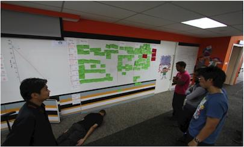
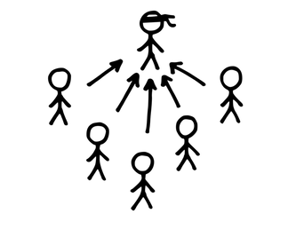
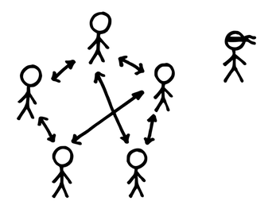

# 30 スクラムマスターが隠れる

確信度：★★

{:style="text-align:center;"}
 
この写真の中にいるスクラムマスターを探してみよう。

…​[19 スクラムマスター](ch02_20_19_ScrumMaster.md)がいて、[14 開発チーム](ch02_14_14_Development_Team.md)に奉仕しています。[開発チーム](ch02_14_14_Development_Team.md)は[29 デイリースクラム](ch02_30_29_Daily_Scrum.md)を使って、進捗情報を共有し、​​`72 スプリントバックログ`の方向性を調整し、​`46 スプリント`で残っている作業を調整することになっています。

{:style="text-align:center;"}
＊　　＊　　＊

**[デイリースクラム](ch02_30_29_Daily_Scrum.md)で、[開発チーム](ch02_14_14_Development_Team.md)のメンバーが課題についてお互いに議論するのではなく、[スクラムマスター](ch02_20_19_ScrumMaster.md)に話しかけます。[開発チーム](ch02_14_14_Development_Team.md)**のメンバーが、行動する前に繰り返し指示や承認を待ちます。これは、イベントのオーナーシップを持っておらず、チームとして行動していないということです。

{:style="text-align:center;"}

スクラムの[開発チーム](ch02_14_14_Development_Team.md)のメンバーは、実装計画の詳細を最も理解している立場にあります。開発者は、`スプリント`を再計画する意思決定を行う代わりに、安全策として[スクラムマスター](ch02_20_19_ScrumMaster.md)に現状を報告するためにミーティングを利用することがあまりにも多いです。これは、従来のプロジェクトマネージャとの関係からくる習慣であったり、チームが[スクラムマスター](ch02_20_19_ScrumMaster.md)の役割について誤解していることを反映しているのかもしれません。もし私が開発者で、[デイリースクラム](ch02_30_29_Daily_Scrum.md)で何かを言うとしたら、おそらく話に耳を傾けていると確信できる一人の人物に向けて話をするでしょう（ミーティングを行うことを主張したのは彼らだからです）。そのため、弱いチームでは[スクラムマスター](ch02_20_19_ScrumMaster.md)に話しかける傾向があるかもしれません。チームが[スクラムマスター](ch02_20_19_ScrumMaster.md)からの明確な指示を期待するほど、機能不全が進行していることもあります。

それゆえ：

**スクラムプロセスのオーナーであるスクラムマスターの役割は、チームにデイリースクラムのオーナーシップを持たせることです。**

{:style="text-align:center;"}

{:style="text-align:center;"}
＊　　＊　　＊

この問題を解決する一つの方法は、[スクラムマスター](ch02_20_19_ScrumMaster.md)が見えなくなることです。例えば、[スクラムマスター](ch02_20_19_ScrumMaster.md)は、状況報告を続ける人の背後に移動したり、ただ静かに部屋を出たりすることができます。もう一つの方法は、責任を持つことがなぜ重要なのか、[開発チーム](ch02_14_14_Development_Team.md)のメンバーに教えることです。

[デイリースクラム](ch02_30_29_Daily_Scrum.md)では、現在の`スプリント`の進捗を検査し、​`71 スプリントゴール`に到達するよう作業の計画を適応させます。したがって、[デイリースクラム](ch02_30_29_Daily_Scrum.md)は[開発チーム](ch02_14_14_Development_Team.md)のものです。[スクラムマスター](ch02_20_19_ScrumMaster.md)は出席してもいいですが、要請がない限り[開発チーム](ch02_14_14_Development_Team.md)の計画づくりには介入しません。そして、作業の編成について指示したり、チームの判断に先入観を抱かせることもありません。([スクラムマスター](ch02_20_19_ScrumMaster.md)はタイムボックスのようなプロセスの問題には介入するかもしれませんが、こうした問題も開発者自身が対処することが最善です)。

もちろん、[開発チーム](ch02_14_14_Development_Team.md)と[スクラムマスター](ch02_20_19_ScrumMaster.md)のこの関係は、[デイリースクラム](ch02_30_29_Daily_Scrum.md)だけでなく、チームが製品を構築する方法の全ての側面に及びます。

自分たちの仕事を計画することに責任を持つという内発的動機を築くには、チームが自信を持ち、メンバーが結果に投資することが必要です。これらの両方が、[スクラムマスター](ch02_20_19_ScrumMaster.md)からチームが自立するための前提条件です。チームが、より自律的に（[16 自律したチーム](ch02_16_16_Autonomous_Team.md)​を参照）なり、自尊心が向上する（`4.2.13. チームのプライド`を参照）ことにより、内発的動機や、結果への投資のそれぞれが成長します。

[スクラムマスター](ch02_20_19_ScrumMaster.md)が、[デイリースクラム](ch02_30_29_Daily_Scrum.md)に参加することは、必須ではありません。[スクラムマスター](ch02_20_19_ScrumMaster.md)は、チームメンバーに[デイリースクラム](ch02_30_29_Daily_Scrum.md)の利点を明確に伝え、彼ら自身がその結果に責任を持つように促します。

