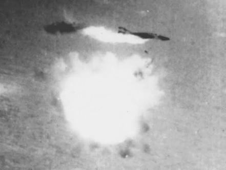
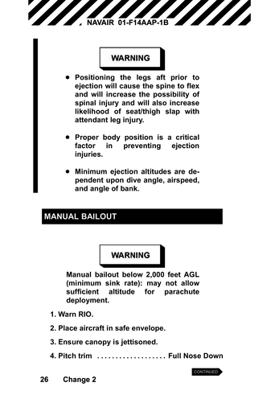

# 緊急手順

別名：ラインを止めろ

{:style="text-align:center;"}
 
ジェフ・サザーランドの同僚エド・アターブリーがハノイ上空でSAMミサイルに撃墜される様子。脱出するのが見えます！

...企業、チーム、個人はしばしば自分たちが努力しても期限内の納品に間に合わないことに気がつきます。`スプリントバーンダウンチャート`は失敗が実質的に確定していることを示しています。問題を素早く特定し、迅速に対応することは、アジリティの精神の基本です。

{:style="text-align:center;"}
＊　　＊　　＊

**`スプリント`​の途中で、新たに出てきた要件や予期しない変更による問題が発生します。`スプリント`の中盤までに、[開発チーム](ch02_14_14_Development_Team.md)が`スプリントバックログ`をうまく完了できないことが明らかになることがあります。チームの`スプリントバーンダウンチャート`は高い位置にあり、現在の仕事の速度では`スプリントゴール`を達成できないことが分かります。**

`スプリント`の機能不全の原因は以下のように多岐にわたりますが、このパターンでは主に上位３つの一般的な問題に焦点を当てます。

* 新たな要求

* 技術的な問題

* 重要な人材や能力の喪失

* 過大評価されたキャパシティ（`昨日の天気`​を使用）

* 計画外の中断（[割り込みに負けるな](ch02_34_33_Illegitimus_Non_Interruptus.md)​を使用）

* 完了していない以前の作業（`完成の定義`​を使用）

* [プロダクトオーナー](ch02_11_11_Product_Owner.md)によるバックログの変更（[プロダクトオーナー](ch02_11_11_Product_Owner.md))を使用）

* 経営陣の干渉（[マネージャーを巻き込む](ch02_06_6_Involve_the_Managers.md)​および[メタスクラム](ch02_38_37_MetaScrum.md)​​を使用）

アジリティは変化への迅速な対応を要求します。それは、できるだけ早く問題を可視化することを意味します。残念ながら、新しいチームや平均的なチームは、問題が可視化されることを望んでいません。特に、彼らは作業を停止し、問題を修正し、批判を受けるリスクを冒すことを嫌がります。アメリカで最初のトヨタの工場「NUMMI」（New United Motor Manufacturing, Inc）では、6ヶ月後に日本の経営陣が工場を訪問したときに、従業員が「アンドン」のコードを引くのを恐れていると気付きました。このコードはトラブルランプを点灯させ、生産ラインを停止するカウントダウンタイマーを開始します。作業者は、障害を十分に修正できるほど、ラインを停止していませんでした。経営陣は、その場で「アンドン」のコードを引いて生産ラインを停止し、ラインの停止することをためらっていることが最大の障害であると作業者に伝えました。ラインを停止することで問題が可視化され、適切に修正されます。「問題がないことが最大の問題」とは、日本の経営の信念です（MIT Sloan Management Review 51 [Sho10]、pp. 63--68）。

チームは、仕事がうまくいかないときには、[プロダクトオーナー](ch02_11_11_Product_Owner.md)に相談する必要があります。それだけでなく、[開発チーム](ch02_14_14_Development_Team.md)は、`スプリントゴール`の達成に影響する主な問題を迅速に解決する方法について、[プロダクトオーナー](ch02_11_11_Product_Owner.md)と合意するべきです。

それゆえ：

**バーンダウンが高い時、パイロットが決まって使う手順を試してください。悪いことが起こったとき、その問題のための特別に設計された[緊急時手順](ch02_33_32_Emergency_Procedure.md)を実行します。**

何が間違っているのか、何をすべきかを明らかにしようとして手を止めないでください。戦闘機では、何が起こっているのかを把握する前に命を落とすかもしれません。[スクラムマスター](ch02_20_19_ScrumMaster.md)​の責任は、仕事が軌道を外れているとき、即座に、できれば`スプリント`中盤までに、チームによるスクラムの[緊急時手順](ch02_33_32_Emergency_Procedure.md)の実行を確実にすることです。これには[プロダクトオーナー](ch02_11_11_Product_Owner.md)との慎重な調整が必要ですが、カイゼンの精神は、[プロダクトオーナー](ch02_11_11_Product_Owner.md)が不在のときでもこのパターンの実行を要求します。優れたチームは、許可を得ずに行動し、後で許しを乞います（`4.1.1. 信頼で結ばれた共同体`を参照）。

**スクラム[緊急時手順](ch02_33_32_Emergency_Procedure.md)：（必要なことだけを行ってください）**

* チームの仕事のやり方を変えます。何か違うことをします。

* 助けを求めます。通常、バックログを他の誰かに依頼します。

* スコープを縮小します。

* `スプリント`を中止し、再計画します。

* 緊急事態がリリース日にどのように影響するか、経営陣に報告します。

困難に直面したとき、チームはよくスコープを縮小したがります。しかし、優れたチームは`スプリントゴール`を達成するために、別の戦略を実行する方法を探します。2005-6のサッカーシーズンで、チェルシーのキャプテンでセンターバックのジョン・テリーは、レディングとの試合でゴールキーパーを代理で務めなければなりませんでした。ペトル・チェフが頭蓋骨骨折を負った後、さらに交代したサブゴールキーパーのカルロ・クディチーニも前半終了前に意識を失って運び出されてしまったためです。テリーは2つの素晴らしいセーブをし、チェルシーは2-0で試合に勝ちました。同様にソフトウェアにおいても、無駄を取り除く新しいプラクティスを採用することで、労力を大幅に削減しながらパフォーマンスを何倍にもできます。

複数のチームが同じプロダクトに取り組んでいる場合、余裕がある別のチームにバックログを渡すことができることがよくあります。医療分野でアジャイル開発の先駆者であるPatientKeeper社は、この戦略を自動化しました（Proceedings of Agile Development Conference (ADC’05) [Sut05]）。あるチームが遅れている場合、`スプリントバックログアイテム`​を別のチームに割り当てることができました。2番目のチームがそれらを受け取ることができない場合、それを3番目のチームに渡しました。3番目のチームも受け取ることができない場合、3チーム全てが集まって何をすべきか決めました。これにより、自動的にチーム間でのバックログの負荷が均等になり、すべてのチームが同時に終了できるようになりました。

早めにスコープを縮小して、チームが計画した作業を完了できることが、失敗に向かってただ流されるよりも望ましいです。組織は、驚かされるのではなく、問題を検査し適応できます。`早く終えるチームほど加速する`を参照してください。

`スプリント`を中断すること（ラインを停止すること）は、特にチームが連続して出荷に失敗する場合、最良の選択肢かもしれません。`スプリント`を中止するかどうかを決定できるのは[プロダクトオーナー](ch02_11_11_Product_Owner.md)のみです。状況がどれだけ悪くても、[プロダクトオーナー](ch02_11_11_Product_Owner.md)は、それがビジネスとして見合わないか、または`スプリント`を中止することが市場やビジネスに長期的な悪影響を及ぼすと考えるかもしれません。

`スプリント`を中止した後、チームは通常、短縮`スプリント`のための簡易な​​[スプリントプランニング](ch02_25_24_Sprint_Planning.md)​を開催します（`組織とスプリントの鼓動`に従ってリズムを保つため、また`月をおいかける`も参照）。可能であれば`スプリントゴール`を達成し、できるだけ多くの価値を提供するためです。あるいは、チームは環境やチームのスクラム実装における問題を探求し、修正するために、いつもより長時間の[スプリントレトロスペクティブ](ch02_37_36_Sprint_Retrospective.md)​を開催し、その後再計画を行い次の`スプリント`に移行するかもしれません。しかし、繰り返しますが、`スプリント`の中止による多くの価値は、チームがその仕事をするのを妨げる基本的な障壁があることを公然と可視化することにあります。可視化された問題は、チームによって修正が可能です。

`スプリント`の中止は、何か問題があるという強いメッセージを組織全体に送り、失敗の原因となる障害を取り除く力を高めます。遊び心でおこなうスクラムの伝統（あるいは少なくともメタファー）の一つに、「スプリント中止セレモニー」があります。これは、企業の本社ロビーで行われるとされており、[開発チーム](ch02_14_14_Development_Team.md)のメンバーが集まって背中を地面につけ、叫びながら両手両足を空中で振り回してストレスを発散させます。その目的は、[プロダクトオーナー](ch02_11_11_Product_Owner.md)がチームのコミットメントを破棄したことを可視化することです。

このパターンは[スクラムチーム](ch02_07_7_Scrum_Team.md)​が実行します。そしてこれは特に高いパフォーマンスを出すチームにとって非常に有用です。カイゼン（[カイゼンとカイカク](ch02_19_Kaizen_and_Kaikaku.md)を参照）に真剣なチームにとって、スクラムはエクストリームスポーツであり、彼らはもっと速く進むためにある程度リスクを取って`スプリント`に取り組みます。チームは他の原因による失敗のほとんどに対処してきているので、主なリスクは新たに発生する要求や予期しない技術的な問題になります。チームは、新しい技術を導入し最先端をいく場合は特に、このパターンを3回や4回の`スプリント`ごとに使用する必要があるかもしれません。しかし、ほとんどの緊急事態に対して、優れたチームは回復し、`スプリントゴール`を達成します。そして、彼らがラインを停止する（`スプリント`を中止する）場合、同じ問題が再発しないように、彼らのプロセスにポカヨケ（Toyota Kata: Managing People for Improvement, Adaptiveness and Superior Results [Rot10]）を適用します。

「フェイルセーフ」や「ミスの防止」という意味の「ポカヨケ」は、英語でも”Poka-yoke”として知られています。「ポカヨケ」は、リーン製造プロセスにおける、装置の操作者がミス（ポカ）を避ける（ヨケ）ためのメカニズムの総称です。その目的は、ヒューマンエラーが発生する際にそれを防ぐ、訂正する、注意を向けることで、製品の欠陥を排除することです。[31]

 
訳注：F14戦闘機 緊急手動脱出手順 (NATOPS POCKET CHECKLIST F-14B AIRCRAFT)

問題を可視化することは、カイゼンの精神の一部です。[カイゼンとカイカク](ch02_19_Kaizen_and_Kaikaku.md)​を参照してください。

{:style="text-align:center;"}
＊　　＊　　＊

チームは、規律ある方法で変化に迅速に対応することを学び、課題を克服します。多くの組織では、仕事がうまくいっていないとき、チームは頭が働いておらず、フラストレーションを感じてやる気を失っています。自分たちの問題の原因とそれを修正する方法を理解していません。[緊急時手順](ch02_33_32_Emergency_Procedure.md)の実行によって、チームは成功に焦点を当て、障害を体系的に取り除く方法を身に付けます。優れたチームは、逆境を乗り越える自らの能力に驚き、ますます強くなります。それは、短期的にも長期的にも​`定期的なプロダクトインクリメント`​を成功裏に提供する可能性を高めます。チームは、プロフェッショナルとしての誇り（`4.2.13. チームのプライド`を参照）や[プロダクトプライド](ch02_39_38_Product_Pride.md)のあらわれとして、[緊急時手順](ch02_33_32_Emergency_Procedure.md)を使用して元に戻すために、全力を尽くしていると感じるでしょう。

[割り込みに負けるな](ch02_34_33_Illegitimus_Non_Interruptus.md)のパターンと併せて、[緊急時手順](ch02_33_32_Emergency_Procedure.md)を使うことで、管理されていない要求の透明性をより規律正しい方法で高めることができます。

`4.1.9. 細かいリスケをしない`も参照してください。

このパターンは、高度に規律を持ったチームに使われることを想定しています。もしチームがこれを頻繁に使用していて（例えば、4回の`スプリント`ごとに1回以上）、かつ価値、品質、出荷率が向上していない場合、環境やチームのスクラムの使用方法に何か根本的な問題がないかどうか、チームは考えるかもしれません。若いチームにとっては、出荷に最善を尽くし、`スプリント`に最後まで取り組み、`スプリント`に失敗する方が通常は良いでしょう。[スプリントレトロスペクティブ](ch02_37_36_Sprint_Retrospective.md)で戦いの熱から離れて、チームは失敗の原因を探求し、カイゼンを計画できます。いくつかのプロセスの改善は、チームが将来の似た状況で[緊急時手順](ch02_33_32_Emergency_Procedure.md)に頼る助けになるかもしれません。

