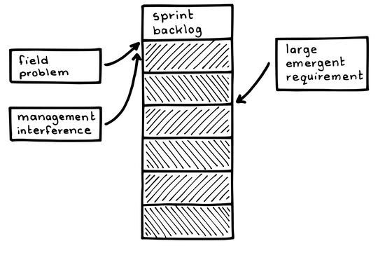

# 割り込みに負けるな

確信度：★

{:style="text-align:center;"}
 
ガワー共有地の牛たち

...​[スクラムチーム](ch02_07_7_Scrum_Team.md)は多くのステークホルダーに仕えていて、ステークホルダーたちは皆、競い合ってチームの関心を得ようとしています。要求や要望は、経営陣、顧客A～Z、セールス・マーケティング部門からチームに寄せられます。さらに、進行中の作業によりプロダクト自体の思わぬ不備が見つかり、そこへ注意を向ける必要に迫られることもあります。これらの要求の頻度と重要性は時間とともに変化し、時にはそれらの量と緊急性に圧倒されることもあります。

{:style="text-align:center;"}
＊　　＊　　＊

**しばしば、優先順位の変更や現場の問題が、`スプリント`​中の[スクラムチーム](ch02_07_7_Scrum_Team.md)の作業に割り込んできます。セールス・マーケティングの要求と経営陣の干渉が合わさると、チームの慢性的な機能不全、スプリントの失敗の繰り返し、リリース日の遅延、さらには会社の破綻を招くかもしれません。**

{:style="text-align:center;"}
 
Field problem:現場の問題 Management interference:経営陣の干渉 Sprint backlog:スプリントバックログ Large emergent requirement:大きな突発的要求

多くの点で、[スクラムチーム](ch02_07_7_Scrum_Team.md)は多くのステークホルダーのニーズに応える共有リソースです。「共有地の悲劇」は、多くの個人が独立して合理的に自己の利益を追求する状況から生じるジレンマです。長期的に誰にとっても望ましくないことは明らかであるにもかかわらず、限られた共有リソースを最終的に枯渇させてしまうのです。アメリカの生態学者で哲学者のギャレット・ハーディンは、このジレンマを「共有地の悲劇」という影響力のあるタイトルで初めて記述し、1968年に「サイエンス」誌に掲載されました。[32]

[スクラムチーム](ch02_07_7_Scrum_Team.md)は、新しいソフトウェアを創り、古いソフトウェアの維持するための極めて重要なリソースです。そのため、プロダクトの開発中や利用中に生じる問題の解決、顧客との技術的なコミュニケーション、マーケティングのためのデモ、組織内の全員のニーズに応える特別プロジェクトなどの、中心的なリソースとなっています。`4.1.18. 作業が内側に流れる`を参照してください。

しばしば、プロダクトオーナーシップが弱いため、企業内の競合する優先順位が[スクラムチーム](ch02_07_7_Scrum_Team.md)に及ぶことがあります。​`プロダクトバックログ`にない機能に取り組むために賄賂を受け取ったチームも存在します。

ほとんど全ての場合、[スクラムチーム](ch02_07_7_Scrum_Team.md)は「自分たちのプロダクトを使う（ドッグフーディング）」ことが望ましいです。作り出した欠陥が現場に出た場合、できるだけ早く修正する必要があります。特別なメンテナンスチームを設置して欠陥を修正することは、[スクラムチーム](ch02_07_7_Scrum_Team.md)が潜在的な欠陥に注意を払わないことを奨励してしまいます。

ここにあげた以外にも、様々な理由から、[スクラムチーム](ch02_07_7_Scrum_Team.md)は常に生産を妨げる割り込みにさらされています。

それゆえ：

**割り込みのための時間を明示的に割り当て、割り当て内に収まる以上の作業を許さないでください。作業が割り当てを超える場合は、スプリントを中止します。**

{:style="text-align:center;"}
 
Product backlog:プロダクトバックログ Field problem:現場の問題 Management interference:経営陣の干渉 Large emergent requirement:大きな突発的要件 Sprint backlog:スプリントバックログ Buffer:バッファ Abort sprint:スプリントの中止

生産活動を妨げないように組織が自己組織化するための3つの簡単なルールを設定します。

この戦略によって、チームが`スプリント`中に再計画をおこない、​`定期的なプロダクトインクリメント`の完成品を提供する可能性を高めることができます。

* チームは、過去のデータに基づいて、予期せぬアイテムのためのバッファを作成します。例えば、平均的にチームの仕事の3分の1が計画外の仕事で、予期せず`スプリント`の作業になっているとしましょう。チームの`ベロシティについて`の平均が60ポイントの場合、チームは割り込みバッファとして20ポイントを確保します。

2. 些細とは言えないすべての要求は、トリアージのために[プロダクトオーナー](ch02_11_11_Product_Owner.md)​を通す必要があります。（ウェブページのスペルミスやコンパイルエラーなどは、些細なエラーの例で、修正が明白でビジネス側からの洞察を加えても利益はありません。開発者は、[プロダクトオーナー](ch02_11_11_Product_Owner.md)にエスカレートする前に、些細とは言えない欠陥であっても、限られたタイムボックスの中で対処することがあります。）[プロダクトオーナー](ch02_11_11_Product_Owner.md)は、ビジネスプランに対して見込まれる価値がないアイテムには低い優先順位を付けます。[プロダクトオーナー](ch02_11_11_Product_Owner.md)は、即座に価値があるとしても、他のアイテムの多くは後続のスプリントに回します。特に重要な限られたアイテムについて、チームとしては、進行中のスプリントで完了しなければならないため、[プロダクトオーナー](ch02_11_11_Product_Owner.md)はそれらを割り込みバッファに入れます。

3. バッファがあふれ始める、つまり[プロダクトオーナー](ch02_11_11_Product_Owner.md)がスプリントに20ポイントより1ポイントでも多く追加する場合、[スクラムチーム](ch02_07_7_Scrum_Team.md)は自動的にスプリントを中止し、スプリントを再計画しなければなりません。[プロダクトオーナー](ch02_11_11_Product_Owner.md)は経営陣に日程の遅れを通知します。

これらのルールに関して経営陣の合意を得て、それを実施することが不可欠です。[プロダクトオーナー](ch02_11_11_Product_Owner.md)は常にチームや他のステークホルダーと応対できる必要があります。[プロダクトオーナー](ch02_11_11_Product_Owner.md)が不在の場合、[スクラムチーム](ch02_07_7_Scrum_Team.md)はその役割を一時的に果たすために自分たちの中から代理を指名するべきです。

[プロダクトオーナー](ch02_11_11_Product_Owner.md)は、短期的な顧客満足度と将来の収益創出のバランスを取るためにバッファのサイズを調整します。しばしば、[プロダクトオーナー](ch02_11_11_Product_Owner.md)は顧客満足度に関する第三者的な指標を持っており、バッファサイズを上げ下げすることで調整が可能です。

これは、作業したバックログアイテムから生じる全ての欠陥をスプリント中に修正に集中すること（`きちんと整理整頓 `を参照）とは独立した戦略です。また、[プロダクトオーナー](ch02_11_11_Product_Owner.md)が技術的負債を減らすために、[スプリントプランニング](ch02_25_24_Sprint_Planning.md)の中で`プロダクトバックログアイテム`をスプリントに割り当てることとも独立しています。欠陥への許容度が低いことは一般的にベロシティを高めますが、バッファを超えることは通常、少なくとも50％のベロシティ低下を引き起こします。[プロダクトオーナー](ch02_11_11_Product_Owner.md)は、常識を使ってこれらの制約のバランスを取る必要があります。`モグラたたき`を参照してください。

{:style="text-align:center;"}
＊　　＊　　＊

これらのルールによって、常に個人はスプリントの炎上を避けるように自己組織化するでしょう。スプリントの失敗の直接的な原因と見なされるのは、誰にとっても避けたいことだからです。

さらに上手くいくと、バッファがいっぱいになることはほとんどなく、チームは早期に作業を終えてバックログから先取りしたり、障害の除去に取り組むことができます。これは、​`早く終えるチームほど加速する`​という意味で重要です。さらに、チームが`昨日の天気`を使用してバッファのサイズを決定し、バッファがほとんど満たされない場合、バッファのサイズは継続的に小さくなり、割り込みの問題は解消されます。

直感に反して、これによって重大な問題が隠されたり、未解決のままになることはありません。[プロダクトオーナー](ch02_11_11_Product_Owner.md)は、重要なアイテムを`プロダクトバックログ`に載せます。これによりチームはそのベロシティを高め、将来の`スプリント`のアウトプットを増加させることができます。これにより通常は、重要なアイテムに対処するために十分以上の時間が得られ、しばしば余裕が生まれます。

チームは、プロダクトの品質と評判を高めるために作業を一時停止することで、[プロダクトプライド](ch02_39_38_Product_Pride.md)の高さを示します。関連する他のパターンには、[プロダクトオーナー](ch02_11_11_Product_Owner.md)、`プロダクトバックログ`、`早く終えるチームほど加速する`、`4.1.18. 作業が内側に流れる`、`4.1.10. 期日までのゆとり`があります。

