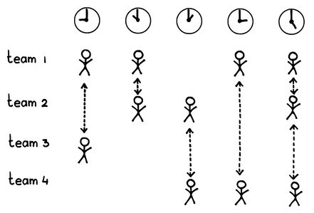
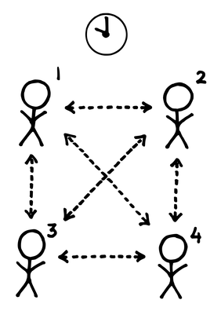

# スクラムオブスクラム

 Original:[Scrum of Scrums](http://sites.google.com/a/scrumplop.org/published-patterns/product-organization-pattern-language/scrum-of-scrums)

確信度：★

{:style="text-align:center;"}

...[スクラムチーム](ch02_07_7_Scrum_Team.md)​は、単一の製品に、複数の[開発チーム](ch02_14_14_Development_Team.md)​​で取り組んでいます。[開発チーム](ch02_14_14_Development_Team.md)​は、依存関係と共有作業を調整する必要があります。個々のチーム内の未解決の依存関係は、すべてのチームに共通する課題です。

{:style="text-align:center;"}
＊　　＊　　＊

**複数のチームが互いに独立して作業するとき、彼らはしばしば自分たちの関心事に近視眼的に集中し、共通のゴールを見失いがちです。**

アジリティが一つのチームの規模でのみ機能するという誤った信念から、組織はコマンド・アンド・コントロールのアプローチに戻ることがあります。しかしながら、そのような場合、複雑さは減少するどころか増大してしまいます。階層的なコントロールは遅延を増やし、ビジネスや技術の変化に対するチームとより広範な組織の対応力を低下させます。

{:style="text-align:center;"}
 
team 1:チーム 1 team 2:チーム 2 team 3:チーム 3 team 4:チーム 4

[スクラムチーム](ch02_07_7_Scrum_Team.md)は問題を小さく分割し、それによって各[開発チーム](ch02_14_14_Development_Team.md)は成果物の一部を別々に作業できます。しかし、「科学的管理の原則[Tay4]」におけるテイラー主義の考え方、つまり、「部分最適によって、全体最適を実現する」という考えは、複雑な環境では機能しません（International Journal of Operations and Production Management 14 [Bur94]、International Journal of Operations and Production Management 17 [DLP97]）。予期せぬ依存関係により、作業の調整に手間がかかり、納期が遅れ、組織が変化に対応する能力が低下します。

別々のチームが一つの統合されたチームに集まることもできますが、その場合、コミュニケーションと調整のオーバーヘッドは指数関数的に増加します。その結果として出現する非公式のサブグループは、おそらくクロスファンクショナルではない境界線に沿って作られるでしょう。

複数のチームは、依存関係、障害物、その他のチーム間の問題を解決するために、共通のマネージャーや管理部門に報告することができます。そのマネージャーは、[開発チーム](ch02_14_14_Development_Team.md)の作業を調整するためのマスタープランを作成します。しかし、このアプローチによりチームの自律性は失われ、プロダクトへの投資（「自身が参加している」という感覚）は低下し、反応性と柔軟性が減少して、開発中に生じる学習機会が制限されます。リチャード・ハックマンは彼の著書「Leading Teams [Hac02]」で、成功するチームは自分たちの周囲を自ら把握して対処しており、その中には他のチームとの調整も含まれていると主張しています。ハーバードビジネススクールのローズベス・モス・カンターは、職場におけるエンパワーメントの研究で、世界がより不安定になり、「“例外”と変更要求が増え、企業は定常的な対応が存在しない問題に対して決定を下すために、ますます多くの人々に頼らざるを得なくなる...」と書いています（Change Masters: Innovation and Entrepreneurship in the American Corporation [Kan84], p. 18）。同時に、真の自律性が存在するのは、チームと個人が意思決定に対する責任と説明責任を受け入れるときだけであると、経験が示しています。「上から」の指示は自律的な意思決定のための場を作り出すかもしれませんが、自己統治が実現するのは、「下」がその場を活用する意志があり、それを前提として行動するときだけです(The Social Psychology of Organizations [KK66], p. 398)。

自己統治型チームは、変化に対してより反応性や適応性が高いだけでなく、仕事の満足度をもたらす唯一の持続可能な源です（A Pattern Language: Towns, Buildings, Construction [AIS77], p. 398）。一方で、整合性を欠いた自律性は、各チームが独自の方向に進む結果となり、プロダクトと組織の両方に不利益をもたらす可能性があります（Across the Board 54 [Hec95]）。

**それゆえ：[プロダクトオーナー](ch02_11_11_Product_Owner.md)​​は共通のゴールを特定し、[開発チーム](ch02_14_14_Development_Team.md)自身にそのゴールを達成するために協力する権利と責任を与えます。チームに、自分たちの取り組みを調整する最善の方法を見つける自由を与えます。**

{:style="text-align:center;"}

{:style="text-align:center;"}
＊　　＊　　＊

連携を成功させるには、開発に関わるすべての人々、すべてのチームがプロダクト全体、[ビジョン](ch03_02_39_Vision.md)（[ビジョン](ch03_02_39_Vision.md)を参照）、ゴールを理解する必要があります。これには通常、[スクラムチーム](ch02_07_7_Scrum_Team.md)が適切と判断するレベルまで、[プロダクトオーナーチーム](ch02_12_12_Product_Owner_Team.md)​​を拡張することが必要になります。[開発チーム](ch02_14_14_Development_Team.md)は、その能力の一部を[プロダクトオーナー](ch02_11_11_Product_Owner.md)をサポートするために使います。

スケーリングが行われる時、それは常に状況に応じたものであり、協力の具体的な方法は[開発チーム](ch02_14_14_Development_Team.md)によって決定されますが、一般的な戦術には以下のようなものがあります。

* 一緒におこなうスプリントー[Organizational Sprint Pulse](http://sites.google.com/a/scrumplop.org/published-patterns/product-organization-pattern-language/organizational-sprint-pulse)​​を使用して、同じリズムで、同時に

* 共通の​[Definition of Done](https://sites.google.com/a/scrumplop.org/published-patterns/value-stream/definition-of-done)​の維持

* 共通の[スプリントプランニング](ch02_25_24_Sprint_Planning.md)​、​[スプリントレビュー](ch02_36_35_Sprint_Review.md)​、その他の必須のスクラムイベント

* 共通の​[リファインメントされたプロダクトバックログ](ch03_30_64_Refined_Product_Backlog.md)​イベントの開催

* ​セミフォーマルな最適化ネットワークである[志を同じくする仲間](ch02_05_5_Birds_of_a_Feather.md)​を作り、チーム間で共有されるアーキテクチャなどの共通の専門知識を活用して、事前に分かった課題に積極的に対応

* 定期的な[スクラムオブスクラム](ch02_35_34_Scrum_of_Scrums.md)イベントを確立[33]、仕事を完成（[Definition of Done](https://sites.google.com/a/scrumplop.org/published-patterns/value-stream/definition-of-done)を参照）させるために、おそらく毎日、チームの​[デイリースクラム](ch02_30_29_Daily_Scrum.md)イベントの後に、発生した依存関係や課題を解決

依存関係を調整し、障害物について議論するための正式な取り決めが何であれ、チームはその解決を[スクラムオブスクラム](ch02_35_34_Scrum_of_Scrums.md)まで延期すべきではありません。チームは障害物が発生したら対応します。チーム間で調整が必要な場合、計画されている次の会議を待たずに、チーム同士が単に直接話し合うことができます。[開発チーム](ch02_14_14_Development_Team.md)は、自己組織化して自分たちの作業を完成させ、​[Dependencies First](https://sites.google.com/a/scrumplop.org/published-patterns/value-stream/sprint-backlog/dependencies-first)を使用して、依存関係のリスクを最小限に抑えます。​[スクラムマスター](ch02_20_19_ScrumMaster.md)は[開発チーム](ch02_14_14_Development_Team.md)の進捗に対する障害物を取り除くことを助け、チームは最終手段として​[緊急時手順](ch02_33_32_Emergency_Procedure.md)を発動することができます。チームとそのメンバー間で、どこまで自発的な相互作用と台本にない協力をできるかが、[スクラムオブスクラム](ch02_35_34_Scrum_of_Scrums.md)の効果を測る真の尺度です。

チームとそのメンバーは、恐れや義務感からではなく、​[プロダクトプライド](ch02_39_38_Product_Pride.md)に基づいて[スクラムオブスクラム](ch02_35_34_Scrum_of_Scrums.md)に問題を持ち込むべきです。

[スクラムオブスクラム](ch02_35_34_Scrum_of_Scrums.md)は確立されたパターンで、1996年にIDX Systems（現在のGE Healthcare）で初めて実施されました。ジェフ・サザーランドはエンジニアリングのシニア・バイスプレジデントで、ケン・シュエイバーがスクラムの展開を支援するコンサルタントとして参加していました。8つのビジネスユニットがあり、それぞれが複数のプロダクトラインを持っていました。各プロダクトには独自の[スクラムオブスクラム](ch02_35_34_Scrum_of_Scrums.md)がありました。いくつかのプロダクトは、より高いレベルの[スクラムオブスクラム](ch02_35_34_Scrum_of_Scrums.md)を持つ複数の[スクラムオブスクラム](ch02_35_34_Scrum_of_Scrums.md)を持っていました。どのプロダクトも3ヶ月以下のリリースサイクルで市場に提供しなければならず、プロダクトはすべて、6ヶ月ごとに完全に統合、アップグレード、提供され、スタンフォード・ヘルス・システムのような地域の医療提供者をサポートしなければなりませんでした。この例から、複数の、あるいは並行する[スクラムオブスクラム](ch02_35_34_Scrum_of_Scrums.md)が存在し、さらに毎日の[スクラムオブスクラム](ch02_35_34_Scrum_of_Scrums.md)（イベントとして）が、異なる焦点を持つサブミーティングに分割されることもあることがわかります。[スクラムオブスクラム](ch02_35_34_Scrum_of_Scrums.md)について初めて言及された出版物は2001年のもの（Cutter IT Journal: The Great Methodology Debate [Sut01]）で、2011年のScrum Papers[34]にも掲載されました。

