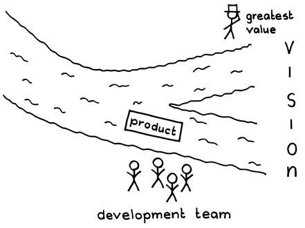
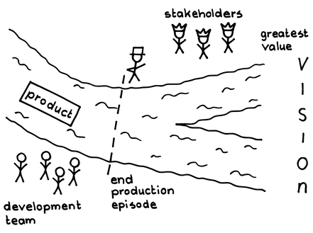

# スプリントレビュー

 Original:[Sprint Review](https://sites.google.com/a/scrumplop.org/published-patterns/value-stream/sprint-review)

確信度：★★

{:style="text-align:center;"}
 

...[Production Episode](https://sites.google.com/a/scrumplop.org/published-patterns/value-stream/production-episode)が終了しました。

{:style="text-align:center;"}
＊　　＊　　＊

**開発が終了した後、プロダクトの締めくくりをする必要があります。期待した成果のチェックリストを満たしただけでは、プロダクトに必要なことができているか、チームが開発において適切な次のステップに進めそうか確認できません。**[開発チーム](ch02_14_14_Development_Team.md)は、​[自律したチーム](ch02_16_16_Autonomous_Team.md)および[自己組織化チーム](ch02_17_17_Self_Organizing_Team.md)として働き、​[スプリントゴール](ch03_38_71_Sprint_Goal.md)が示すコンテキストとフォーカスに従って、[定期的なプロダクトインクリメント](ch03_52_85_Regular_Product_Increment.md)を作り、チームの理解に基づいて¶55 Product Backlog Item(PBI）を完了させます。

[プロダクトオーナー](ch02_11_11_Product_Owner.md)と[開発チーム](ch02_14_14_Development_Team.md)は、[定期的なプロダクトインクリメント](ch03_52_85_Regular_Product_Increment.md)を作成することで組織に価値を提供するために協力して働きます。[開発チーム](ch02_14_14_Development_Team.md)のメンバーは、[Production Episode](https://sites.google.com/a/scrumplop.org/published-patterns/value-stream/production-episode)中にチーム内で作業を行うことが普通ですが、[プロダクトオーナー](ch02_11_11_Product_Owner.md)や他のステークホルダーに対して、正しいものを開発する責任を負います。長い期間、自分たちの印象に頼っていると、[ビジョン](ch03_02_39_Vision.md)​の意図から外れる恐れがあります。

{:style="text-align:center;"}
 
greatest value: 最高の価値 VISION:ビジョン product:プロダクト development team:開発チーム

優れた[プロダクトオーナー](ch02_11_11_Product_Owner.md)は、[定期的なプロダクトインクリメント](ch03_52_85_Regular_Product_Increment.md)の具体的なビジョンを描くことができ、[スプリントプランニング](ch02_25_24_Sprint_Planning.md)でチームに構築を依頼します。このビジョンは、[開発チーム](ch02_14_14_Development_Team.md)との綿密な計画作りや議論に基づいています。これは、[Enabling Specification](https://sites.google.com/a/scrumplop.org/published-patterns/value-stream/product-backlog/enabling-specification)のレベルに達しますが、複雑なプロダクトを構築する際に完璧に先を見通すことは不可能です。具体的に実装すると、ほぼ常に疑問が生まれます。プロダクトのビジョンを描いたり、チームと議論した時に生まれる物を超えた疑問です。また、[プロダクトオーナー](ch02_11_11_Product_Owner.md)とチーム間のコミュニケーションが情報を失ったり、[プロダクトオーナー](ch02_11_11_Product_Owner.md)がプロダクトに対する暗黙の仮定や思いをすべて伝えていない可能性も常にあります。

実際に何が起こっているかを検査するためには透明性が必要であり、それを得る唯一の方法は、[スプリントバックログ](ch03_39_72_Sprint_Backlog.md)の項目をチェックするのではなく、実際に動作するプロダクトを検査することです（例：Agile Project Management with Scrum [Sch01], p. 56）。[定期的なプロダクトインクリメント](ch03_52_85_Regular_Product_Increment.md)のための規定リストをチェックしたとしても不十分で、常にそのようなリストは必然的に不完全です。なぜなら出現する潜在的な要件、つまり未知の未知が存在する可能性があるためです。また、`4.1.1. 信頼で結ばれた共同体`を確立することも必要です。

それゆえ：

**プロダクションエピソードの終わりには、プロダクトの状態を評価し、エンドユーザーのニーズ、リスク、機会、問題、予想される完成時期に関する知見を得るイベントを設け、プロダクトが[Greatest Value](https://sites.google.com/a/scrumplop.org/published-patterns/value-stream/greatest-value)へ向かって進むことを保証します。**イベントには、[開発チーム](ch02_14_14_Development_Team.md)、[プロダクトオーナー](ch02_11_11_Product_Owner.md)、他の招待されたステークホルダーが参加します。参加者は、[定期的なプロダクトインクリメント](ch03_52_85_Regular_Product_Increment.md)のどの部分が提供可能でどの部分が不可能なのか、​[Sprint](https://sites.google.com/a/scrumplop.org/published-patterns/value-stream/sprint)でプロダクトに関して得られた教訓、今後の暫定的なプロダクト計画について共に議論します。参加者は、理想的には提供に関する決定と今後の計画に関して合意に達しますが、これらの事は[プロダクトオーナー](ch02_11_11_Product_Owner.md)が最終決定します。

複雑な開発における問題に対処する良い方法は、短いフィードバックループを用いて、ステークホルダーがソリューションを評価することです。これにより、チームは大きく逸脱することなく迅速に適応できます。[スプリントレビュー](ch02_36_35_Sprint_Review.md)は、スプリントサイクル中の検討とフィードバックの中心です。[プロダクトオーナー](ch02_11_11_Product_Owner.md)はどんなステークホルダーでも[スプリントレビュー](ch02_36_35_Sprint_Review.md)に招待できます。キーとなるエンドユーザーを招待し、彼らのフィードバックを引き出すことが推奨されます。

{:style="text-align:center;"}
 
stakeholders:ステークホルダー greatest value:最高の価値 product:プロダクト VISION:ビジョン end production episode:プロダクションエピソードの終わり development team:開発チーム

参加者は、プロダクトを検査して、現在のプロダクトインクリメントが出荷に適しているか理解するだけでなく、将来の作業を方向付ける情報（例えば、[Product Backlog](https://sites.google.com/a/scrumplop.org/published-patterns/value-stream/product-backlog)の並べ替えなど）を提供します。

このイベントは最大3時間のタイムボックスに収めるべきです。プロダクトの評価が中心となります。[開発チーム](ch02_14_14_Development_Team.md)は、このイベントの準備に30分以上かけるべきではありません。チームが、プロダクトに手をいれて[スプリントレビュー](ch02_36_35_Sprint_Review.md)で上手く動くように一時的な仕組みで支えたり、洗練されたプレゼンテーションでステークホルダーに「好印象を与えよう」とすることはよくあります。しかし、ここでは説得する機会はほとんどなく、プロダクトそれ自身が語るのです。チームは、エンドユーザーの環境に近い状況でプロダクトのデモをおこない、特別な「デモサポート」やプロダクトを実際より良く見せる小道具を使用せずに行うべきです。確かな経験則があります。「PowerPoint®を使わない（プロダクトがPowerPointでない限り）。」

このイベントの一般的な活動には以下のようなものがあります。

* ユーザーがプロダクトをハンズオン評価します。

* チームが[スプリントゴール](ch03_38_71_Sprint_Goal.md)を達成したかどうかを議論します。

* [プロダクトオーナー](ch02_11_11_Product_Owner.md)が、完成したPBIと、完成していないPBIを特定します（[Definition of Done](https://sites.google.com/a/scrumplop.org/published-patterns/value-stream/definition-of-done)を参照）。

* [開発チーム](ch02_14_14_Development_Team.md)が完成した機能をデモします。

* [プロダクトオーナー](ch02_11_11_Product_Owner.md)がプロダクトを評価し、PBI を受け入れるかどうかを決定します。

* [プロダクトオーナー](ch02_11_11_Product_Owner.md)は通常、[スプリントプランニング](ch02_25_24_Sprint_Planning.md)で受け入れテストを指定します。[スプリントレビュー](ch02_36_35_Sprint_Review.md)でこれらを実行することもあります。

* 時には[プロダクトオーナー](ch02_11_11_Product_Owner.md)は[Sprint](https://sites.google.com/a/scrumplop.org/published-patterns/value-stream/sprint)が終わる前にPBI を受け入れることがあります（[Responsive Deployment](https://sites.google.com/a/scrumplop.org/published-patterns/value-stream/responsive-deployment)​を参照）が、チームはそれでも[スプリントレビュー](ch02_36_35_Sprint_Review.md)を開催し、チームと他の適切なステークホルダーは、プロダクトインクリメントの[Sprint](https://sites.google.com/a/scrumplop.org/published-patterns/value-stream/sprint)中にリリースされた部分をレビューすべきです。

* 参加者はプロダクトの方向性と、可能な範囲で[Product Backlog](https://sites.google.com/a/scrumplop.org/published-patterns/value-stream/product-backlog)の並び替えについて議論します。「学び」に集中します。

* 議論では、「プロダクト」の健全性の指標を考慮すべきです。[開発チーム](ch02_14_14_Development_Team.md)のベロシティ、推測される（および実際の）技術的負債のレベル、バグやビルドの現状、[Product Roadmap](https://sites.google.com/a/scrumplop.org/published-patterns/value-stream/release-plan/product-roadmap)の進捗状況などです。

* チームは前回の[スプリントレビュー](ch02_36_35_Sprint_Review.md)で特定されたアクションの進捗をレビューすべきです。そのようなアクションアイテムの多くはPBIとして扱われたかもしれませんが、レビュー対象のPBIにいつものように注目する他に、特に注意が必要なものがあるかもしれません。例えば、チームは不明確な課題や、2つの主要顧客間での要件の矛盾についての課題を特定したかもしれません。チームはそのプロダクトの課題が解決されるまで、引き続き注意して取り扱うべきですが、それ自体はプロダクトインクリメントの一部ではありません。

[プロダクトオーナー](ch02_11_11_Product_Owner.md)がチームを導くためにおこなう決定や指示、特にプロダクトの方向性や技術的負債とプロダクト品質への対応について、弱い態度で、チームが支持し信頼しているかどうかを聞くことは良いことです。これは`4.1.1. 信頼で結ばれた共同体`を強化するのに役立ちます。

このミーティングはプロダクトに関するものであることに注意してください。[スクラムチーム](ch02_07_7_Scrum_Team.md)のパフォーマンスやプロセスについての議論は、[スプリントレトロスペクティブ](ch02_37_36_Sprint_Retrospective.md)​で行われます。

{:style="text-align:center;"}
＊　　＊　　＊

[スプリントレビュー](ch02_36_35_Sprint_Review.md)は、すべての関係者に対する情報を作り出します。[プロダクトオーナー](ch02_11_11_Product_Owner.md)とステークホルダーは、出荷可能なプロダクトの状態と将来の方向性に関して学びます。[開発チーム](ch02_14_14_Development_Team.md)は、ステークホルダーの期待をどの程度満たしたかを学習し、これにより[スプリントレトロスペクティブ](ch02_37_36_Sprint_Retrospective.md)のためにより多くの情報を得ます。

PBIの状態を検証し、フィードバックを得る良い方法は、ユーザーに実際に操作してもらうことです（Harvard Business Review 93 [Kol15], ff. 66）。例えば、異なる市場観点でチームをサポートするユーザーフォーカスグループのメンバーは、現場の洞察を提供することができます。ゲームスタジオがゲーマーに自社のゲームをプレイしてもらいフィードバックを得るという例もあります。[スプリントレビュー](ch02_36_35_Sprint_Review.md)でのこのような評価は、言ってみれば完全な受け入れテストの代わりにはなりませんが、[Enabling Specification](https://sites.google.com/a/scrumplop.org/published-patterns/value-stream/product-backlog/enabling-specification)は時にそのような広範なテストの必要性を減少させることがあります。（[プロダクトオーナー](ch02_11_11_Product_Owner.md)が経験的にその必要性を正当化できるとしても、スクラムの反復開発は長期にわたる安定性や耐久性のテストを省略する理由にはなりません。）いずれにしても、思慮深いユーザーは意見を聞いてもらえる機会に感謝しますし、このレビューにユーザーが参加することにより信頼が構築されます。エンドユーザーはプロダクトと自分たちの期待との間に違いがあることに気づくかもしれません。いずれにせよ、グループが将来のプロダクトの方向について議論するための貴重な情報が得られます。

多くのスクラムの支持者は、[スプリントレビュー](ch02_36_35_Sprint_Review.md)をスクラムにおけるアジャイルなフィードバックの主要なメカニズムと見なしており、それは創発的な要求、市場の変化、ビジネスの状況変化などのいつも働く力を考慮しています。それも少しはあるかもしれません。しかし、複雑なプロダクトインクリメントが本当に意図したニーズを満たしているかどうかを、[プロダクトオーナー](ch02_11_11_Product_Owner.md)や他のステークホルダーが、3時間のミーティングで常に評価することは難しいでしょう。より現実的で正直な洞察は、プロダクトをより現実的なアプリケーションの設定で、より長い期間にわたって使ってみることから得られます。それでも、[プロダクトオーナー](ch02_11_11_Product_Owner.md)や他のステークホルダーは、[スプリントプランニング](ch02_25_24_Sprint_Planning.md)で合意したと信じていたことと、[開発チーム](ch02_14_14_Development_Team.md)が提供するものとの間に、仮定や全体像の不一致があることに気付くことが「可能」で、「実際」に気付きます。このような不一致は、創発、進化、顧客の心変わりよりも、プロセスの問題から生じることが多いものです。[スプリントレビュー](ch02_36_35_Sprint_Review.md)の主要な機能の一つは、顧客が期待していないものをチームが提供してしまったプロセスの誤りを特定し、この知識を[スプリントレトロスペクティブ](ch02_37_36_Sprint_Retrospective.md)に持ち込むことです。

[スプリントレビュー](ch02_36_35_Sprint_Review.md)は、チームが終わった[Sprint](https://sites.google.com/a/scrumplop.org/published-patterns/value-stream/sprint)で達成したことを振り返り、​[プロダクトプライド](ch02_39_38_Product_Pride.md)を成長させる機会です。特に注目すべき目標を達成した場合、また時には祝うためだけに、[スプリントレビュー](ch02_36_35_Sprint_Review.md)はお祝いの形式をとることがあります。フィンランドのある会社では、時々サウナで良い食事と飲み物を楽しみながら、夜遅くまで[スプリントレビュー](ch02_36_35_Sprint_Review.md)を行いました。イベントには形どおりの議題もありましたが、真の目的はチームが一緒に仕事を祝うことでした。（この話を教えてくれたユッカ・ヤルヴェラに感謝します！）

