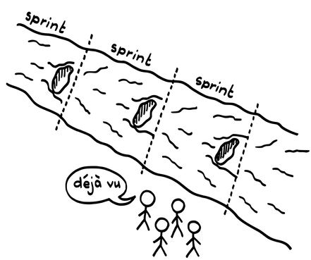
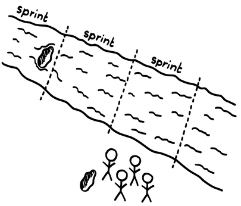

# スプリントレトロスペクティブ

確信度：★★

{:style="text-align:center;"}
 

...​[Sprint](https://sites.google.com/a/scrumplop.org/published-patterns/value-stream/sprint)​の終わりが近づき、次のスプリントの準備をしています。当然ながら、今回のスプリントがどんなにうまくいったとしても、改善したいと思うでしょう。

{:style="text-align:center;"}

{:style="text-align:center;"}
＊　　＊　　＊

**時間が経つと、特に注意を払うことがなければ、プロセスや規律は次第に衰退します。人々はだらしなくなっていきます。しかるべき注意を払うことなく、独立してプロセスの変更を行うことは無秩序を助長する一方で、定期的な変更がおこなわれないと、チームは価値を高める機会を逃してしまいます。**

{:style="text-align:center;"}
 
Sprint:スプリント Deja vu:デジャビュ

あなたは、常に改善を望んでいます。[デイリースクラム](ch02_30_29_Daily_Scrum.md)は、チームに自らを評価し、プロダクトの方向性を改善する機会を毎日与えます。しかし、いくつかの理由から、プロセスを再構築する適切な場ではありません。

第一に、日々のパフォーマンスには変動があり、通常のプロセスの変動に対応して調整を行うことは無意味です。1日（ある[デイリースクラム](ch02_30_29_Daily_Scrum.md)から次の[デイリースクラム](ch02_30_29_Daily_Scrum.md)まで）は、変更が実際に望ましい改善をもたらすかどうかを判断するには短すぎることが多く、[Sprint](https://sites.google.com/a/scrumplop.org/published-patterns/value-stream/sprint)の途中でプロセスを変更しても、せいぜい混乱を招くだけです。第二に、[デイリースクラム](ch02_30_29_Daily_Scrum.md)の焦点は[Sprint Goal](https://sites.google.com/a/scrumplop.org/published-patterns/value-stream/sprint-goal)を達成するための検査と適応です。したがって、視野は非常に短期的で、[開発チーム](ch02_14_14_Development_Team.md)​はチームのシステムとしての問題より、自分たちの作業の完了に集中しています。第三の理由は、戦いの最中（[Sprint](https://sites.google.com/a/scrumplop.org/published-patterns/value-stream/sprint)中）には、問題に対する一つか二つの視点しか得られず、大部分の要因を十分に理解することは難しいからです。チームが不完全な情報から結論を導き出すことは危険で不適切です。

[スプリントレビュー](ch02_36_35_Sprint_Review.md)では、チームはステークホルダーと共にプロダクトをレビューします。このイベントは問題を分析し、改善を提案する場ではなく、むしろプロダクトに焦点を当てるべきです。[開発チーム](ch02_14_14_Development_Team.md)と​[プロダクトオーナー](ch02_11_11_Product_Owner.md)​は、​[自己組織化チーム](ch02_17_17_Self_Organizing_Team.md)としてプロダクトの問題にオーナーシップを持ち、ステークホルダーを除いた[スプリントレビュー](ch02_36_35_Sprint_Review.md)外でそれらにどう対処するかを決定すべきです。[スプリントレビュー](ch02_36_35_Sprint_Review.md)でプロダクトに焦点を当てることで、その場の問題についてチームとステークホルダーを集めます。しかし、独立して無関係のように見える問題の多くは関連があり、原因となっている繰り返し発生するプロセスのパターンを探求することは、スクラムにおいてさらに重要です。

[Sprint](https://sites.google.com/a/scrumplop.org/published-patterns/value-stream/sprint)が次々と続くため、チームが「どのように」作業を完了した（または完了しなかった）かについて、ほとんどまたは全く考えることなく、一つの[Sprint](https://sites.google.com/a/scrumplop.org/published-patterns/value-stream/sprint)から次の[Sprint](https://sites.google.com/a/scrumplop.org/published-patterns/value-stream/sprint)へと直ちに進む傾向があります。これにより、同じことを繰り返し行い、同じ間違いを犯すことになります。

これまでの[Sprint](https://sites.google.com/a/scrumplop.org/published-patterns/value-stream/sprint)でいくつかの改善を行ってきた ​[スクラムチーム](ch02_07_7_Scrum_Team.md)は、自分たちが良い仕事をしていると確信し、新たな改善点が見つからないと思い込むことがあります（「これが私たちの働き方だ！」）。改善の付加価値が低下しているように見え、チームはそれを時間の無駄と見なすかもしれません（「私たちはすでに実際の作業で非常に忙しい！」）。

チームが自分自身を検証するとき、メンバーは批判に対して弱いものです。個人は恥ずかしさ、脅威、無能さを感じるかもしれません。これは、チームメンバーの防御的な行動につながり、自身の責任を個人的にも集団的にも否定し、問題をチーム外のものとする可能性があります(Teaching smart people how to learn [Arg91]).。

Therefore: そのため：

**各[Sprint](https://sites.google.com/a/scrumplop.org/published-patterns/value-stream/sprint)の終わりに、[スクラムチーム](ch02_07_7_Scrum_Team.md)がその[Sprint](https://sites.google.com/a/scrumplop.org/published-patterns/value-stream/sprint)中にどのように作業を遂行したかを評価できるイベントを設けてください。**

{:style="text-align:center;"}
 
Sprint:スプリント

[Sprint](https://sites.google.com/a/scrumplop.org/published-patterns/value-stream/sprint)の終わりに[スプリントレトロスペクティブ](ch02_37_36_Sprint_Retrospective.md)を開催してください。これは反省するのに自然なタイミングです。完了した作業を検討することで、システム全体の視点（システムとはチームとそのプロセスです）が明らかになります。プロセスの途中で自分たちの状況を把握することは、部分的なイメージしか描けず、視野が非常に限定されます。そのため、私たちは作業の完了時、すなわち[Sprint](https://sites.google.com/a/scrumplop.org/published-patterns/value-stream/sprint)の区切りと合わせてレトロスペクティブを行います。さらに、[Sprint](https://sites.google.com/a/scrumplop.org/published-patterns/value-stream/sprint)の課題と成果はまだ皆の記憶に残っています。

チームは、[Greatest Value](https://sites.google.com/a/scrumplop.org/published-patterns/value-stream/greatest-value)​達成への情熱から、プロセスの変更を提案します。プロセスの変更は、人々、関係性、プロセス、環境、ツールに関連することがあります。

{:style="text-align:center;"}
＊　　＊　　＊

スクラムはトヨタ生産方式（TPS）にそのルーツを持ち、その中心にはプロセス改善があります。TPSのマニュアルには、「チェックとは反省である」という指示が記載されています。反省は、失敗に対する個人的または集団的な深い後悔の形です。良い[スクラムチーム](ch02_07_7_Scrum_Team.md)は失敗に対して反省を行い、その失敗に対する後悔のエネルギーを問題解決のための積極的なエネルギーに転換します。[Scrumming the Scrum](https://sites.google.com/a/scrumplop.org/published-patterns/retrospective-pattern-language/scrumming-the-scrum)​を参照してください。したがって、[スプリントレトロスペクティブ](ch02_37_36_Sprint_Retrospective.md)はチームにとって癒しと刷新の時間でもあります。リーンコミュニティは、大野耐一をTPSの創始者と見なしています。大野耐一に由来するよく引用される有名な言葉は以下の通りです。

「困らんやつほど、困ったやつはいない」（「問題がない」ということが最大の問題）[35]

[スプリントレトロスペクティブ](ch02_37_36_Sprint_Retrospective.md)が各[Sprint](https://sites.google.com/a/scrumplop.org/published-patterns/value-stream/sprint)の不可欠な部分となる文化を育むことに焦点を当ててください。これをチームの定期的なリズムに組み込んでください。[Sprint](https://sites.google.com/a/scrumplop.org/published-patterns/value-stream/sprint)の最後の作業を完了するために時間が必要だと感じても、[スプリントレトロスペクティブ](ch02_37_36_Sprint_Retrospective.md)をスキップする誘惑を避けてください。そのような行為は、レトロスペクティブが実際にはそれほど重要ではないという文化を強化することになります。

ミーティングにタイムボックスを設定してください。問題をある程度の深さで探求するのに十分な時間を許容しつつ、人々が退屈するほど長くはしないでください。スクラムでは、1か月の[Sprint](https://sites.google.com/a/scrumplop.org/published-patterns/value-stream/sprint)に対して3時間を超えないミーティングを推奨しています。[Sprint](https://sites.google.com/a/scrumplop.org/published-patterns/value-stream/sprint)が短い場合、ミーティングも短くなるのが一般的です。

通常、[スクラムチーム](ch02_07_7_Scrum_Team.md)全体が出席するべきであり、[プロダクトオーナー](ch02_11_11_Product_Owner.md)も含まれます。まれに、[プロダクトオーナー](ch02_11_11_Product_Owner.md)が会話を支配したり、率直でオープンな議論を抑制したりすると[開発チーム](ch02_14_14_Development_Team.md)のメンバーが感じる場合、[プロダクトオーナー](ch02_11_11_Product_Owner.md)に出席しないよう依頼することがあります。これは、より大きな問題の兆候である可能性が高いことに注意してください。スクラムは問題を取り除き、より大きな価値を達成するためのフレームワークであり、[プロダクトオーナー](ch02_11_11_Product_Owner.md)が価値提案の中心にいるため、これらのミーティングに[プロダクトオーナー](ch02_11_11_Product_Owner.md)がただ参加するだけでなく、信頼されて参加することは、表面的な指標を越えた長期的な成功の鍵です。

アジャイルマニフェスト[36]の原則のひとつに、定期的なレトロスペクティブを行うことがあります。

チームがもっと効率を高めることができるかを定期的に振り返り、それに基づいて自分たちのやり方を最適に調整します。

特に定期的に予定されたレトロスペクティブは、重要な問題を探求しない表面的なミーティングになりがちです。これに対処するためには、「Agile Retrospectives: Making Good Teams Great」 [DL06]に記載されているような、効果的なレトロスペクティブの手法を使用してください。例えば、うまくいったこと、進行中の問題、具体的なアクションを特定する手法があります（Agile Software Development, 2nd ed. [Coc06], Project Retrospectives: A Handbook for Team Reviews [Ker01]）。時折、手法を変えることを検討してください。議論は経験からくる洞察に基づいて行ってください。特に、​[Sprint Backlog](https://sites.google.com/a/scrumplop.org/published-patterns/value-stream/sprint-backlog)の完了率やチームのベロシティなどの具体的な指標を検証します。さらに、次の[Sprint](https://sites.google.com/a/scrumplop.org/published-patterns/value-stream/sprint)中にチームが行う具体的なプロセス変更を特定します。

[Impediment List](https://sites.google.com/a/scrumplop.org/published-patterns/retrospective-pattern-language/impediment-list)​上の変更すると決めたことを優先順位付けしてください。パターン[One Step at a Time](https://sites.google.com/a/scrumplop.org/published-patterns/retrospective-pattern-language/one-step-at-a-time)は、チームが一度に一つの変更を行うことを推奨しており、それぞれの変更が改善にどのように寄与するかを理解できるようにします。[Scrumming the Scrum](https://sites.google.com/a/scrumplop.org/published-patterns/retrospective-pattern-language/scrumming-the-scrum)も参照してください。パターン[Happiness Metric](https://sites.google.com/a/scrumplop.org/published-patterns/retrospective-pattern-language/happiness-metric)は、チームが最も熱量を持って没頭できる変更を取り入れることを提案しています。また、そのコスト、利益、欠点といった変更がもたらす利益と負担を測定できるようにしてください。（[Testable Improvements](https://sites.google.com/a/scrumplop.org/published-patterns/retrospective-pattern-language/testable-improvements)​も参照してください）

[スプリントレトロスペクティブ](ch02_37_36_Sprint_Retrospective.md)を淡々とこなすだけでは、プロセスの改善や安定は保証されません。レトロスペクティブを行うだけでは十分ではありませんが、定期的にカイゼンマインドに基づく問題に集中することはおそらく必要です（[カイゼンとカイカク](ch02_19_Kaizen_and_Kaikaku.md)を参照）。適切に行われると、[スプリントレトロスペクティブ](ch02_37_36_Sprint_Retrospective.md)はチームを勇気づけ、チームは時間をかけて改善できるという誇りを持つようになります。[プロダクトプライド](ch02_39_38_Product_Pride.md)を参照してください。

レトロスペクティブは容易に愚痴のセッションに退化することがあります。この問題に対処するために、ノーム・カースの最優先指令に従ってレトロスペクティブに臨んでください。「見つけたものがなんであれ、当時知っていたこと、スキル、能力、利用可能なリソース、手元の状況を考慮して、皆が最善を尽くしたと理解し、心から信じている。」というものです（「Project Retrospectives: A Handbook for Team Reviews」 [Ker01]第6章Retrospective Exercises）。これには`4.1.1. 信頼で結ばれた共同体`で説明されているようなコミュニティが必要です。また、チームに対して、自分たち自身で短期間で変えることができるもの、または全く変えられないものを自覚させてください（The 7 Habits of Highly Effective People [Cov94]）。さらに、良い点（知恵）と問題点の両方を特定してください。悪い点だけを見ないでください。良い点の中には、書き留める価値のあるものもあります。例えば、文書化された[Definition of Done](https://sites.google.com/a/scrumplop.org/published-patterns/value-stream/definition-of-done)は、チームが「完成」に至るための新しいやり方を発見し学ぶにつれて拡張すべきです（[Definition of Done](https://sites.google.com/a/scrumplop.org/published-patterns/value-stream/definition-of-done)を参照）。愚痴はまた、より深い問題を示すことがあり、[スクラムマスター](ch02_20_19_ScrumMaster.md)はレトロスペクティブの全体的な雰囲気に深い問題の手がかりがあるかどうか注意を払うべきです。

2〜3時間のレトロスペクティブでは、通常、深い問題を探求するには不十分であることに注意してください。そのため、[スプリントレトロスペクティブ](ch02_37_36_Sprint_Retrospective.md)は議論の深さと会議の長さとを天秤にかけた妥協点となっています。[スプリントレトロスペクティブ](ch02_37_36_Sprint_Retrospective.md)中に見つかった問題は、グループが3時間程度では適切に明らかにし、探究することができない、より深く複雑な関係性に起因している可能性があります。ジェフ・サザーランドが投資グループとのコミュニケーションに基づいて作成した体験記には、以下のように記されています。

障害物は蚊のようなものです。1匹退治しても、25匹が戻ってきます。そのため、根本原因に取り組む必要があります。蚊が来ないようにするには、水たまりを乾かす必要があります。

「水たまりを乾かす」ためには、スウィーリンガとヴィエルドスマが記述したダブルループやトリプルループの学習が候補に挙がります（Becoming a Learning Organization: Beyond the Learning Curve [SW92], pp. 37--42）。端的に言うと、シングルループの学習はルールの変更に関するもので、ダブルループの学習は基盤となる構造の変更を意味します。トリプルループの学習は、組織の基盤と歴史における本質的な原則と価値を扱います。ノーム・カースは、組織内の深い構造的問題を探求するために3日間を費やすことを提案しており、このレベルの改善に至る3日間のオフサイトレトロスペクティブの枠組みを提案しています（Project Retrospectives: A Handbook for Team Reviews [Ker01]）。カースの拡張レトロスペクティブは、チームメンバー間の信頼を築くためにより多くの時間を投資するため、比較的短い[スプリントレトロスペクティブ](ch02_37_36_Sprint_Retrospective.md)よりもチームの深みにある弱点を扱うのに適しています。また、通常の[スプリントレトロスペクティブ](ch02_37_36_Sprint_Retrospective.md)が重視する漸進的な変化を超えて、（非連続的な）より深いカイカクの促進を可能にします。

Skypeのオーディオビジュアルエンジニアリングチームは、当時のSkypeの高品質なオーディオ、ビデオ、コーデック開発を担当し、時折2～3日のオフサイトミーティングを、​[Team Sprint](https://sites.google.com/a/scrumplop.org/published-patterns/product-organization-pattern-language/development-team/team-sprint)​に合わせて開催していました。これらのイベントは、新たな発明、チーム自身のワークスペースの再設計、開発プロセスの革新につながりました。— [Gil19]

