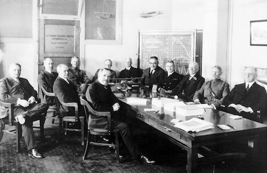
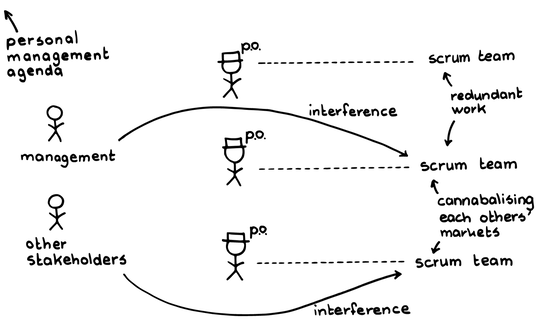
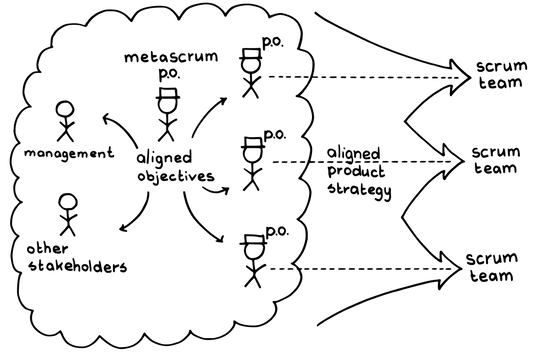

# メタスクラム

 Original:[MetaScrum](https://sites.google.com/a/scrumplop.org/published-patterns/product-organization-pattern-language/metascrum)

{:style="text-align:center;"}
 
アメリカ航空諮問委員会（National Advisory Committee for Aeronautics）がワシントンで開催され、アメリカが航空開発において最先端に立つための計画が話し合われた。

ある企業は、従来の管理手法を使用していた開発組織にスクラムを導入しました。開発組織はすでに存在しており、プロダクト開発のための[Value Stream](https://sites.google.com/a/scrumplop.org/published-patterns/value-stream)もあります。この企業には、管理や運用などの追加機能や組織がありますが、開発組織（[スクラムチーム](ch02_07_7_Scrum_Team.md)）との良好な連携が欠けています。さらに、異なるプロダクトの組織間で、互いに交流する認められた方法がありません。

{:style="text-align:center;"}
＊　　＊　　＊

**[スクラムチーム](ch02_07_7_Scrum_Team.md)は設置されていますが、既存の管理構造からの指示（または干渉の脅威）が、プロダクトの内容と方向性に対する統制の所在を混乱させています。**マネージャーがバックログを乱したり、[Sprint](https://sites.google.com/a/scrumplop.org/published-patterns/value-stream/sprint)​中でも[開発チーム](ch02_14_14_Development_Team.md)に干渉したりすることで、チームはスプリントに失敗したり、[緊急時手順](ch02_33_32_Emergency_Procedure.md)を引き起こすことがあります。[プロダクトオーナー](ch02_11_11_Product_Owner.md)​の権限を繰り返し侵害することは、チームが価値を最適化する仕事を難しくするかもしれません。[スクラムチーム](ch02_07_7_Scrum_Team.md)と管理職の間の荒れた関係が要求にノイズをもたらすため、一部の[スクラムチーム](ch02_07_7_Scrum_Team.md)は[Vision](https://sites.google.com/a/scrumplop.org/published-patterns/value-stream/vision)​に向けた価値ある[Regular Product Increment](https://sites.google.com/a/scrumplop.org/published-patterns/value-stream/regular-product-increment)の提供に失敗している可能性があります。また、管理職がチームを支援することに消極的かもしれません。たとえば、企業レベルでのビジネスや契約上の合意事項を顧客に遵守させる責任を怠ることがあります。

{:style="text-align:center;"}
 
Personal management agenda:個人の管理概略 Management:管理職 Other stakeholders:その他のステークホルダー P.o.:PO Interference:干渉[スクラムチーム](ch02_07_7_Scrum_Team.md):スクラムチーム Redundant work:無駄な作業 Cannibalizing each others markets:互いの市場の食い合い

それでも、市場は定期的に対立し変化するニーズを提示し、ステークホルダー（株主や企業の方向性に利害関係を持つマネージャーなど）が、組織の運営方法に関して懸念や要望を表明することがあります。これらの懸念を透明にすることが重要です。しかし、管理職がそのような懸念を表明するからといって、開発作業への介入が有益であるとは限りません。[プロダクトオーナー](ch02_11_11_Product_Owner.md)の権威を尊重する健全な[スクラムチーム](ch02_07_7_Scrum_Team.md)は、市場の要求と管理上の命令を別のものとして扱います。これらの議論を同じ場で混ぜ合わせると混乱を招く可能性があります。企業は、競争上の問題、市場の変化、営業契約、開発における技術的な課題や機会のために、個別のプロダクトやプロダクトの集合について、方向性を変更する必要があるかもしれません。各​[プロダクトオーナーチーム](ch02_12_12_Product_Owner_Team.md)は、プロダクトや[Value Stream](https://sites.google.com/a/scrumplop.org/published-patterns/value-stream)にわたる視点と期待を調整するために、定期的にステークホルダーと会う必要があります。

それゆえ：

**組織内のすべてのレベルのスクラムで、[プロダクトオーナー](ch02_11_11_Product_Owner.md)のバックログに基づいて全社を調整するための場として[メタスクラム](ch02_38_37_MetaScrum.md)を作ります。**[メタスクラム](ch02_38_37_MetaScrum.md)は、[プロダクトオーナー](ch02_11_11_Product_Owner.md)と経営陣で構成され、定期的に会合を開きます。CEOも出席します。[メタスクラム](ch02_38_37_MetaScrum.md)には、[メタスクラム](ch02_38_37_MetaScrum.md) [プロダクトオーナー](ch02_11_11_Product_Owner.md)がおり、管理職、スクラムチーム、その他のステークホルダーの調整を促進します。[メタスクラム](ch02_38_37_MetaScrum.md) [プロダクトオーナー](ch02_11_11_Product_Owner.md)は通常、ミーティングを運営し、[プロダクトオーナー](ch02_11_11_Product_Owner.md)、上級管理職、開発管理者の調整をリードします。

{:style="text-align:center;"}
 
Metascrum p.o.:メタスクラムPO Management:管理職 Other stakeholders:他のステークホルダー Aligned objectives:整合が取れた目標 P.o.:PO Aligned product strategy:整合が取れたプロダクト戦略[スクラムチーム](ch02_07_7_Scrum_Team.md):スクラムチーム

[メタスクラム](ch02_38_37_MetaScrum.md)は、企業レベルの[Organizational Sprint Pulse](http://sites.google.com/a/scrumplop.org/published-patterns/product-organization-pattern-language/organizational-sprint-pulse)にリズムを合わせます。[メタスクラム](ch02_38_37_MetaScrum.md)は、企業レベルのスプリントの期間に一度開かれ、スクラムチームのスプリントで、その期間に何が提供されるかを包含する一種の[スプリントプランニング](ch02_25_24_Sprint_Planning.md)です。

このミーティングで、[スクラムチーム](ch02_07_7_Scrum_Team.md)は、提供を完了するために不足している支援、資金、情報、プロダクトなどを[スクラムチーム](ch02_07_7_Scrum_Team.md)外のステークホルダーに要求することができます。[メタスクラム](ch02_38_37_MetaScrum.md)は、そのような要求を上げ、それを支援する決定を行う場になります。管理職や他の[プロダクトオーナー](ch02_11_11_Product_Owner.md)は、この定期的な会議で[Product Backlog](https://sites.google.com/a/scrumplop.org/published-patterns/value-stream/product-backlog)に対する変更を主張することができます。このミーティングの終わりで、次の[メタスクラム](ch02_38_37_MetaScrum.md)のミーティングまで[Product Backlog](https://sites.google.com/a/scrumplop.org/published-patterns/value-stream/product-backlog)への管理職の入力をロックします。

{:style="text-align:center;"}
＊　　＊　　＊

[メタスクラム](ch02_38_37_MetaScrum.md)は、[プロダクトオーナー](ch02_11_11_Product_Owner.md)が自分たちの計画を共有し、ポートフォリオレベルの懸念を解決するための場を提供します。[プロダクトオーナー](ch02_11_11_Product_Owner.md)は、管理職からの情報を加味して、プロダクト、マーケティングイニシアチブ、その他のプロダクトプログラム間での重点や優先順位を調整します。[メタスクラム](ch02_38_37_MetaScrum.md)により、[プロダクトオーナー](ch02_11_11_Product_Owner.md)は経営陣の方向性に敏感になり、管理職はプロダクト計画が企業目標をどのように支援するかを知ることができます。次の[メタスクラム](ch02_38_37_MetaScrum.md)のミーティングまでの間、[スクラムチーム](ch02_07_7_Scrum_Team.md)はマネジメントからの干渉なしに作業をします。健全な組織は[プロダクトオーナー](ch02_11_11_Product_Owner.md)の権威を侵害せず、良い[プロダクトオーナー](ch02_11_11_Product_Owner.md)は管理職を含むすべてのステークホルダーからの情報を慎重に考慮します。[マネージャーを巻き込む](ch02_06_6_Involve_the_Managers.md)を参照してください。

[メタスクラム](ch02_38_37_MetaScrum.md)は、管理職がプロダクトの方向性をコントロールするための機構ではなく、プロダクト間、プロダクトと管理職の間の調整のための場です。管理職は、[メタスクラム](ch02_38_37_MetaScrum.md)を通じてプロダクトの変更を提案できますが、[プロダクトオーナー](ch02_11_11_Product_Owner.md)は、依然としてそれぞれのプロダクトの方向性のオーナーシップを持っています。実際に非常に広く知られている[メタスクラム](ch02_38_37_MetaScrum.md)の事例では、プロダクト開発に管理職の意志を押し付けるために使用されました。プロダクト開発に関しては、[スクラムチーム](ch02_07_7_Scrum_Team.md)が自律性を保つことが重要です。

プロダクト組織が完全にスクラムであったPatientKeeper（医師向けのヘルスケアアプリケーションを提供する会社）では、市場要因、販売契約、開発上の問題のために、特定の病院の稼働日を遅らせたり、他を早めたりする必要がありました。大きなコミットメントの変更がある場合、[メタスクラム](ch02_38_37_MetaScrum.md)はその日の[メタスクラム](ch02_38_37_MetaScrum.md)ミーティングの終わりまでに、各クライアント（病院）のCIOに話をする人を決定しなければなりませんでした。また、PatientKeeperでは、[メタスクラム](ch02_38_37_MetaScrum.md) [プロダクトオーナー](ch02_11_11_Product_Owner.md)が[メタスクラム](ch02_38_37_MetaScrum.md)を運営し、上級管理職および部門長との整合を図りました。CEOは[メタスクラム](ch02_38_37_MetaScrum.md)に参加しており、通常は[メタスクラム](ch02_38_37_MetaScrum.md)自体には介入せず、必要に応じてファシリテーションするだけでした。しかし、彼は[メタスクラム](ch02_38_37_MetaScrum.md)が特定した組織の障害物（マネジメントの変更を含む）を積極的に取り除きました。人々は彼を[メタスクラム](ch02_38_37_MetaScrum.md)の[スクラムマスター](ch02_20_19_ScrumMaster.md)のような存在、いわば上位の[スクラムマスター](ch02_20_19_ScrumMaster.md)だと言っていましたが、実施は¶34 Scrum of Scrums Masterに任せていました。

3Mでは、ある事業部の最高責任者が、自らの組織の[メタスクラム](ch02_38_37_MetaScrum.md) [プロダクトオーナー](ch02_11_11_Product_Owner.md)の役割を引き受けることで[メタスクラム](ch02_38_37_MetaScrum.md)を運営しています。[メタスクラム](ch02_38_37_MetaScrum.md)はバックログを中心に整合を図ることに焦点を当て、週に2回ミーティングを開きます。彼女はここで優先順位を明確にし、対応したいと考えています。組織の障害を取り除くことについては、別のリーダーシップチームが取り組みます。

デンマークのSystematic（ソフトウェアおよびシステムソリューションを開発する企業）とスウェーデンのSaab Defenseは、組織全体をスクラムとして運営しています。彼らは、管理組織の最上位に、高レベルの[スクラムオブスクラム](ch02_35_34_Scrum_of_Scrums.md)のように機能するフォーラムを持っています。

[メタスクラム](ch02_38_37_MetaScrum.md)は、企業レベルの変革の中心です。組織全体には戦略的ビジョン、バックログ、ロードマップ、[Regular Product Increment](https://sites.google.com/a/scrumplop.org/published-patterns/value-stream/regular-product-increment)（組織再編、新市場への取り組み等）と、企業をスムーズにかつ効率よく推進するために必要なその他スクラムの構成要素があります。ステークホルダーは組織の方向性の変更、人員配置の変更、障害物を取り除くための予算配分の変更をおこなうことがあるため、これを行う権限を持つ人々が[メタスクラム](ch02_38_37_MetaScrum.md)に含まれている必要があります。

各[Value Stream](https://sites.google.com/a/scrumplop.org/published-patterns/value-stream)とプロダクトは、障害物を[メタスクラム](ch02_38_37_MetaScrum.md)レベルで可視化します。それぞれのプロダクトのリソースはその障害物に対処するには不十分かもしれません。その場合に企業全体として、そのような問題を解決するための力を提供できます。また、問題がプロダクト間で暗黙に関連しており、共同フォーラムで問題を透明化することによってのみ可視化される可能性もあります。良い[メタスクラム](ch02_38_37_MetaScrum.md) [プロダクトオーナー](ch02_11_11_Product_Owner.md)は、[メタスクラム](ch02_38_37_MetaScrum.md)ミーティングで表面化した問題を認識し、可能であればその日のうちに、そうでなければできるだけ早く解決します。

優れた[メタスクラム](ch02_38_37_MetaScrum.md)は、すべてのプロダクト間の意志決定の場です。プロダクトの意思決定に関わるすべての人を会議に招待するべきです。[メタスクラム](ch02_38_37_MetaScrum.md)は定期的にミーティングを開催し、プロダクトに関する決定をいつどこで行うか全員が知っています。CEOの強力なサポートと出席は、[メタスクラム](ch02_38_37_MetaScrum.md)を機能させるために重要です。スティーブ・ジョブズが、Appleで全てのプロダクトの戦略的決定を2週間ごとのミーティングに持ち込んだことが、[メタスクラム](ch02_38_37_MetaScrum.md)の実施例です。小規模な企業では、組織の変化のサイクルに合わせて[メタスクラム](ch02_38_37_MetaScrum.md)がミーティングを毎週開催することがよくあります。

各[プロダクトオーナー](ch02_11_11_Product_Owner.md)は自身の[Product Backlog](https://sites.google.com/a/scrumplop.org/published-patterns/value-stream/product-backlog)に最終的な権限を持っていますが、承認された予算の範囲内で作業する必要があります。[メタスクラム](ch02_38_37_MetaScrum.md)は、企業レベルでの予算変更のためのフォーラムです。管理職と[プロダクトオーナー](ch02_11_11_Product_Owner.md)は、その場で小さな変更を行います。重要な問題、例えば追加投資を求める必要がある場合は、管理職と[プロダクトオーナー](ch02_11_11_Product_Owner.md)は決定に基づいて先に進めるために、ミーティングの直後にすぐに行動を起こします。

最高に上手くいった場合、[メタスクラム](ch02_38_37_MetaScrum.md)は組織に強い影響力を持ちます。[プロダクトオーナー](ch02_11_11_Product_Owner.md)が[メタスクラム](ch02_38_37_MetaScrum.md)イベントで管理職の提案に同意した場合、それは次の[メタスクラム](ch02_38_37_MetaScrum.md)まで最終的な決定となります。経営陣は次の[メタスクラム](ch02_38_37_MetaScrum.md)イベントまで、追加の話し合いをスクラムチームとおこなう機会がないため、スクラムチームは管理職からの中断なしに作業を続けることができます。顧客や営業チームも、[メタスクラム](ch02_38_37_MetaScrum.md)イベントが終了した後は、次のイベントまで合意事項を変更しようとしても無駄であることを学びます。

[メタスクラム](ch02_38_37_MetaScrum.md)は、組織のすべてのステークホルダーに対して責任を持ち、すべてのステークホルダーグループに価値を創出する実行可能なビジネスのかじ取りをします。これには、組織の従業員、顧客、投資家が含まれます。全ステークホルダーを重視するのか、それを妥協するのかは、常識に従います。一方で、[メタスクラム](ch02_38_37_MetaScrum.md)の運営と決定は透明に保ちます。

やがて、優れた企業ははプロダクトマネジメントにおける管理職の役割が減少し、企業の権力が徐々に経営陣から[プロダクトオーナー](ch02_11_11_Product_Owner.md)に移行していることに気づくかもしれません。組織はよりフラットになります。経営陣や部門長は、古くなった役割を手放し、実際に行動する場所と近い[プロダクトオーナー](ch02_11_11_Product_Owner.md)になるかもしれません。

[マネージャーを巻き込む](ch02_06_6_Involve_the_Managers.md)を参照してください。

[メタスクラム](ch02_38_37_MetaScrum.md)に関して最初に公表された文献（「Proceedings of Agile Development Conference」 (ADC’05) [Sut05]）は、2003年に始まったPatientKeeperの[メタスクラム](ch02_38_37_MetaScrum.md)について記述しています。

