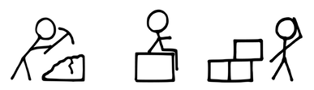
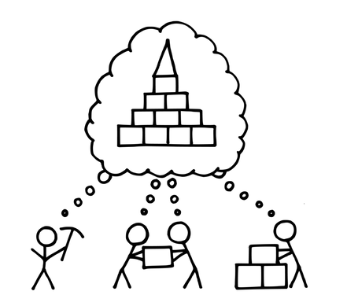

# 38 プロダクトプライド

確信度：★

{:style="text-align:center;"}
 
工事現場で3人の人が働いていた。1人に「何をしているのですか？」と尋ねると、その人は「レンガを積んでいるんだ」と答えた。2人目に「何をしているのですか？」と尋ねると、その人は「壁を建てているんだ」と答えた。3人目に近づくと、彼が鼻歌まじりに作業をしているのを聞き、「何をしているのですか？」と尋ねた。その人は立ち上がり、空を見上げ、笑顔で「大聖堂を建てているのさ」と答えた。[37]

…`4.1.1. 信頼で結ばれた共同体`（`4.1.1. 信頼で結ばれた共同体`を参照）があり、共通の​`39 ビジョン`を持っている。[7 スクラムチーム](ch02_07_7_Scrum_Team.md)はその`ビジョン`に向けて活動している。

{:style="text-align:center;"}
＊　　＊　　＊

**チームメンバーは自分の仕事の意味を知り、それをどのように行うかについて発言権を持つ必要があります。**

[スクラムチーム](ch02_07_7_Scrum_Team.md)は、持てる力を最大限に発揮してプロダクトを作るべきです。しかし、市場の状況や組織の関心が、できるだけ早く「何か」を提供するよう[スクラムチーム](ch02_07_7_Scrum_Team.md)にプレッシャーを与えることがあります。すると、[スクラムチーム](ch02_07_7_Scrum_Team.md)に手抜きをする誘惑にかられる可能性があり、プロダクト品質の低下や、技術的負債、無駄な手直しを招くことになります。このようなプレッシャーは、[スクラムチーム](ch02_07_7_Scrum_Team.md)の自律性を損ないます。品質において、自分たちの期待を満たしていないと、仕事、ひいてはプロダクトに対するプライドを損ないます。

{:style="text-align:center;"}

[11 プロダクトオーナー](ch02_11_11_Product_Owner.md)は、ステークホルダーの要望やニーズを深く理解し、プロダクトインクリメントがどうやって市場やその他のステークホルダーの期待に応え、また上回り、製品価値（`価値とROI（投資利益率）`を参照）を高めるかを正確に理解していなければなりません。顧客と直接コンタクトを取ることができない、意思決定することを許されていないなどの障害があると、プロダクトの`ビジョン`が明確でない環境が生まれ、​`93 最高の価値`を生み出すことのない、とりとめのない`54 プロダクトバックログ`​になってしまいます。結果として、チームの活力やプロダクトに対する熱意は低下し、エネルギーを他のプロジェクトに振り向けるようになるかもしれません。

そのため：

**「自律」、「熟達」、「目的」を実現できるような風土をつくります。**

[プロダクトプライド](ch02_39_38_Product_Pride.md)を与えたり押し付けることは誰にもできません。これはむしろ熟達、自律、目的が集まったときに現れる結果なのです（Drive: The Surprising Truth About What Motivates Us [Pin11]）。風土とは「このあたりはこうなっている、という共通の認識」であり、「リーダーが何をするか、どんな状況が適用されるか、どんな環境が与えられるかによって、局所的に生み出される」ものです（The Handbook of Organizational Culture and Climate [AWP10]）。[スクラムチーム](ch02_07_7_Scrum_Team.md)の命運を握っているのは[スクラムチーム](ch02_07_7_Scrum_Team.md)自身であり、そのため風土づくりは[スクラムチーム](ch02_07_7_Scrum_Team.md)の仕事となります。

{:style="text-align:center;"}

たとえば、[スクラムチーム](ch02_07_7_Scrum_Team.md)は`71 スプリントゴール`の作成に参加しています。チームは、プロダクト開発で必要になる全ての領域で能力を発揮できるよう[10 機能横断チーム](ch02_10_10_Cross_Functional_Team.md)​ でなければなりません。作業やチームメンバーに魅力を感じたチームに、開発者自身が自発的にサインアップすると、共有された目的と個人の価値観を一致させる基盤ができます（`4.2.11. 自分たちで選んだチーム`を参照）。[16 自律したチーム](ch02_16_16_Autonomous_Team.md)​も参照してください。

プロダクトを正しく作ること、優れた職人気質を認めることで[スクラムチーム](ch02_07_7_Scrum_Team.md)は誇りを持ちます。​[19 スクラムマスター](ch02_20_19_ScrumMaster.md)は、チームが卓越したスキルと働き方を身につけられるよう支援します（`26 カイゼンパルス`​と​​`92 スクラムでスクラムを改善`を参照）。正しい`85 定期的なプロダクトインクリメント`​が現れると、誰もが誇りを持ちます。市場からのフィードバックは[スクラムチーム](ch02_07_7_Scrum_Team.md)の努力を認知するもので、チームのプライドを更に高めます。

正しいプロダクトを作ることが[プロダクトプライド](ch02_39_38_Product_Pride.md)を生みます。素晴らしいチームには「場」があります。偉大なことが行われる可能性は、共有された目的に集うことから始まります。目的によってチームがまとまるということではなく、目的は素晴らしい潜在的なチームから生まれます。[プロダクトオーナー](ch02_11_11_Product_Owner.md)は`ビジョン`の一部として熱意の最初の担い手となり、熱意を伝搬させることが仕事の一部となります。

{:style="text-align:center;"}
＊　　＊　　＊

プロダクトが終わりを迎えるとき、組織は[スクラムチーム](ch02_07_7_Scrum_Team.md)の努力と貢献を認め称えるべきです。そのために、​​`94 プロダクトの通夜`を開きます。それにより[プロダクトプライド](ch02_39_38_Product_Pride.md)は高まり、いつかプロダクトが​[2 もやもや](ch02_02_2_The_Mist.md)に消えていくという事実を受け入れることができます。[プロダクトプライド](ch02_39_38_Product_Pride.md)の効果は、プロダクトそのものよりはるかに大きいのです。

私たちの世界における2つの大きな悪は、群衆に安易に従ってしまうことと、あらゆる種類の破壊に対して明らかに無関心であることです（From The Irish Monthly 79 [Bir51]）。

プライドを持つということは、自分自身の品質基準で仕事をし、その結果にオーナーシップを持つということです。これによって世の中に奉仕する自由の扉が開かれ、​チームは`91 幸福指標`で示されるように、道徳的に一点の曇りもない仕事をしていると感じられるようになります。

[7]

Manifesto for Agile Software Development: Principles. Agilemanifesto.org, http://agilemanifesto.org/principles.html, 2001, accessed 23 January 2017.

[8]

Bosch Software Innovations. “Lessons learned: Agile organization at Bosch Software Innovations.” YouTube.com, 15 June 2018, https://www.youtube.com/watch?v=CwodQs7D8BY.

[9]

“Community of Practice.” Wikipedia. https://en.wikipedia.org/wiki/Community_of_practice (accessed 5 June 2018).

[10]

“Situated learning.” Wikipedia. https://en.wikipedia.org/wiki/Situated_learning (accessed 5 June 2018).

[11]

Henrik Kniberg. “Spotify Engineering Culture Part 1 (Agile Enterprise Transition with Scrum and Kanban).” YouTube.com, https://www.youtube.com/watch?v=4GK1NDTWbkY (accessed 28 January 2019).

[12]

“Overview & Background on Electronic & Digital Switching Systems.” Telephone World, http://www.phworld.org/switch/overview.htm, January 2013 (accessed 5 December 2017).

[13]

“How IBM Makes Money? Understanding IBM Business Model.” R&P Research, http://web.archive.org/web/20180121141146/http://revenuesandprofits.com/how-ibm-makes-money/, n.d. (accessed 27 January 2019).

[14]

Ashley Hardy. “Agile Team Organisation: Squads, Chapters, Tribes and Guilds.” medium.com, https://medium.com/@achardypm/agile-team-organisation-squads-chapters-tribes-and-guilds-80932ace0fdc, 14 February 2016 (accessed 4 December 2017).

[15]

Api Podder. Amsterdam-based Tony’s Chocolonely Brings Mission of 100 Percent Slave-Free Chocolate to the U.S. My Social Good News, https://mysocialgoodnews.com/amsterdam-based-tonys-chocolonely-brings-mission-100-percent-slave-free-chocolate-u-s/ (accessed 28 January 2019).

[16]

Tonys Chocolonely Annual Report. https://tonyschocolonely.com/storage/configurations/tonyschocolonelycom.app/files/jaarfairslag/2017-2017/tc_jaarfairslag_2016_en_totaal_01.pdf, 2017 (no longer accessible; accessed 6 June 2018).

[17]

“Z Doc: TONY, Van Chocoladecrimineel Tot Wereldverbeteraar.” Documentary on Dutch television RTLZ, 20:30--22:00, 11 December 2017, https://tonyschocolonely.com/nl/nl/doe-mee/tony-de-film (accessed 28 January 2019).

[18]

“Tony’s Chocolonely.” Wikipedia, https://en.wikipedia.org/wiki/Tony's_Chocolonely (accessed 17 December 2017).

[19]

Jesse Watson. “The Hard Thing about Software Development.” LinkedIn.com, https://www.linkedin.com/pulse/hard-thing-software-development-jesse-watson, 12 July 2017 (accessed 4 July 2018).

[20]

Marissa Mayer. “Inside Google’s New-Product Process.” BusinessWeek.com, http://www.businessweek.com/technology/content/jun2006/tc20060629_411177.htm, 30 June 2006 (accessed 23 June 2010).

[21]

“Brooks’s [sic.] Law,” https://en.wikipedia.org/wiki/Brooks's_law, April 2018 (accessed 5 June 2018).

[22]

Carl Erickson. “Small Teams Are Dramatically More Efficient than Large Teams.” https://spin.atomicobject.com/2012/01/11/small-teams-are-dramatically-more-efficient-than-large-teams/, 11 January 2012 (accessed 13 April 2017).

[23]

Carl Erickson. “Small Teams Are Dramatically More Efficient than Large Teams.” https://spin.atomicobject.com/2012/01/11/small-teams-are-dramatically-more-efficient-than-large-teams/, 11 January 2012 (accessed 13 April 2017).

[24]

“Kaizen.” Wikipedia, https://en.wikipedia.org/wiki/Kaizen, 7 September 2018, (accessed 3 October 2018).

[25]

Tim Hartford. “Marginal gains matter but game changers transform.” Financial Times, https://www.ft.com/content/6b5c046c-0fc0-11e7-a88c-50ba212dce4d, 24 March 2017 (accessed 17 December 2017).

[26]

“Challenging Marginal Gains Mathematics: 10 Myths about How Marginal Gains Add Up.” https://www.youtube.com/watch?v=28E9lzSmFvI, 12 May 2017 (accessed 17 December 2017).

[27]

Tim Hartford. “Marginal gains matter but game changers transform.” Financial Times, https://www.ft.com/content/6b5c046c-0fc0-11e7-a88c-50ba212dce4d, 24 March 2017 (accessed 17 December 2017).

[28]

Russ Ackoff. “If Russ Ackoff had given a TED Talk...” Video recording, https://www.youtube.com/watch?v=OqEeIG8aPPk, 1994 (accessed 25 December 2017).

[29]

“Work in Process.” Wikipedia, https://en.wikipedia.org/wiki/Work_in_process (accessed 27 January 2019).

[30]

Robert Warfield. “How I Helped Start the Agile/Scrum Movement 20 Years Ago.” Smoothspan Blog, 2 October 2014, https://smoothspan.com/2014/10/02/how-i-helped-start-the-agilescrum-movement-20-years-ago/ (accessed 14 February 2019).

[31]

“Poke-yoke.” Wikipedia, https://en.wikipedia.org/wiki/Poka-yoke, 19 May 2018 (accessed 6 June 2018).

[32]

“The Tragedy of the Commons.” Wikipedia, https://en.wikipedia.org/wiki/Tragedy_of_the_commons, June 2018 (accessed 6 June 2018).

[33]

The ¶`スクラムオブスクラム` as a daily meeting of ‘ambassadors’ from multiple teams is described on the Agile Alliance website. https://www.agilealliance.org/glossary/scrum-of-scrums/.

[34]

Jeff Sutherland. The Scrum Papers, http://scruminc.com/scrumpapers.pdf (accessed 11 January 2017), no permalink, draft, 29 January, 2011.

[35]

Taiichi Ohno. AZQuotes, Taiichi Ohno Quotes, http://www.azquotes.com/author/44597-Taiichi_Ohno, n.d., (accessed 11 July 2018).

[36]

Manifesto for Agile Software Development: Principles. Agilemanifesto.org, http://agilemanifesto.org/principles.html, 2001, accessed 23 January 2017.

[37]

Attributed to Christopher Wren, Wikiquotes.org, https://en.wikiquote.org/wiki/Christopher_Wren, 5 June 2018 (accessed 6 June 2018).

