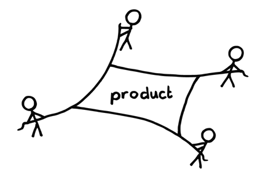
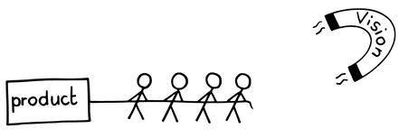

# ビジョン

 Original:[Vision](https://sites.google.com/a/scrumplop.org/published-patterns/value-stream/vision)

別名：プロダクトビジョン

確信度：★★

{:style="text-align:center;"}
 
月面着陸計画は、ビジョンから始まった。

…[もやもや](ch02_02_2_The_Mist.md)から出てきて、中心となるビジョンを持つ個人やグループは、自分たちの情熱を、共有できる概念として具体化しなければなりません。またその情熱によって、人の集まりでしかないグループの心を一つに奮い立たせ、想定する顧客の生活の質を向上させるものを構築しなければなりません。

{:style="text-align:center;"}
＊　　＊　　＊

人は、創造性を発揮し、共通の利益に向かって努力することを促す制約の中で成長しますが、過度に具体的な制約によって、協力者は盲目的に命令に従うロボットのようになってしまい、心からのものではなくなってしまいます。

偉大なビジョンを実現するには、連携の取れたチームによる仕事が必要なのはもちろん、そのチームとステークホルダーとの連携も必要です。チームは意見や感情を持つ個人で構成されており、全員が善意を持っているとしても、個々人がそれぞれの望むやり方での貢献の形を思い描いたり、表明したりします。これはチームメンバー間の対立のように見えます。しかし、そのようなノイズが、チームメンバーがお互いをどう見るかを支配している状況を取り除けば、通常は、ステークホルダーにとっての当たり前に深く根ざした感情や概念を共有できます。

チーム内に多様な視点があることで、チームが偉大なアイデアを見逃す可能性が低くなり、大きな価値がもたらされます。複数の視点を認め、異なる背景や経験を持つ人々の意見を求めることで、様々な選択肢を探ることができます。異なる経験やアイデアによって、価値ある追加の視点、革新的な視点がもたらされます。こうした違いを放置すると、チームが複数の方向に引っ張られ、分裂してしまうかもしれません。

{:style="text-align:center;"}
 
Product: プロダクト

チームが真に効果的であるためには、全てのメンバーが同じ方向に向かって引っ張り続けねばなりません。

チームは共有の目標に向かって働きます。共有の目標が広すぎたり曖昧すぎたりすると、チームは価値の低い方向性を多く探りすぎる危険があります。不必要な実験につまづき続けることで、エネルギーと勢いを失うかもしれません。一方、共有の目標が狭すぎると、チームを過度に制約し、価値ある方向性を探求しないかもしれません。これは知性と創造性の無駄遣いです。

目標は、チームがそのオーナーシップを持ったときに共有されるものになります。チームが目標を共同して創り出すとき、その目標へのオーナーシップが生まれます。それは「彼らの」目標になるのです。

未来は本質的に予測不可能です。長期間にわたって最終的な結果や計画にコミットすることには危険が伴います。考慮する外部要因が多すぎるのです。しかし、チームは結束し、パフォーマンスを方向を合わせるために、共有の目標を必要としています。

それゆえ：

**この新しいプロダクトへの情熱を体現する個人が[プロダクトオーナー](ch02_11_11_Product_Owner.md)の役割を担います。ステークホルダーや将来の同僚となる可能性のある人々はその周りに集まり、[Vision](https://sites.google.com/a/scrumplop.org/published-patterns/value-stream/vision)を明確に表現し、共に定義し、洗練させます。**[Vision](https://sites.google.com/a/scrumplop.org/published-patterns/value-stream/vision)は、将来の「プロダクト組織」が作り出す先にある望ましい未来を、プロダクトがどのようにサポートするかを表現したものです（Product Organization Pattern Languageで説明されているように）。

{:style="text-align:center;"}
 
Product: プロダクト Vision: ビジョン

{:style="text-align:center;"}
＊　　＊　　＊

[Vision](https://sites.google.com/a/scrumplop.org/published-patterns/value-stream/vision)には2つの要素があると考えることができます。1つ目は私たちが単に[Vision](https://sites.google.com/a/scrumplop.org/published-patterns/value-stream/vision)と呼ぶもので、広範な将来の方向性です。一方、Product Visionは、その広範な方向性をより具体的なビジネス要素に分解したものです。[Vision](https://sites.google.com/a/scrumplop.org/published-patterns/value-stream/vision)は、新たに生まれたグループがチームへと成長するように導く、柔軟で明確な集結地点となります。それは、思い描いたプロダクトの取り組みが、自分たちの人生、エンドユーザーとその他のステークホルダーの人生にどのように利益をもたらすかについて、システム思考的な理解を支えます。[Vision](https://sites.google.com/a/scrumplop.org/published-patterns/value-stream/vision)の重要な側面の1つは、プロダクト自体に関するものです。Product Visionは、漠然とした綺麗事を超えた、かなり具体的なものです。Product Visionは、アイデアの背後にある情熱、アイデアの必要性、素晴らしいものを構築する実現可能性の交点にあります。通常、Product Vision（「Agile Product Management With Scrum: Creating Products That Customers Love, 1st ed.」[Pic10]、24ページ）は以下のことが考慮されています。

* プロダクトの主要な機能

* プロダクトを誰が使用するのか

* プロダクトが取り組む顧客ニーズ

* ベンダーがどのように利益を得るか

[プロダクトオーナー](ch02_11_11_Product_Owner.md)は[Vision](https://sites.google.com/a/scrumplop.org/published-patterns/value-stream/vision)を持ち、それを実現するために、第2章「Product Organization Pattern Language」を作り、[Value Stream](https://sites.google.com/a/scrumplop.org/published-patterns/value-stream)を定義することから始めます。[プロダクトオーナー](ch02_11_11_Product_Owner.md)は[Vision](https://sites.google.com/a/scrumplop.org/published-patterns/value-stream/vision)に向かう道筋を[Product Roadmap](https://sites.google.com/a/scrumplop.org/published-patterns/value-stream/release-plan/product-roadmap)として示し、ステークホルダーと協力して具体的で明示的な[Product Backlog](https://sites.google.com/a/scrumplop.org/published-patterns/value-stream/product-backlog)に落とし込みます。これらはそれぞれ、様々な形式や度合いで、Product Organizationとりわけ[スクラムチーム](ch02_07_7_Scrum_Team.md)に対して[Vision](https://sites.google.com/a/scrumplop.org/published-patterns/value-stream/vision)を明確にする役に立ちます。[Vision](https://sites.google.com/a/scrumplop.org/published-patterns/value-stream/vision)は全員に、より大きな方向性と集団としての目的意識を与えます（`4.2.12. 目的の統一`を参照）。Product Organizationとチームは、今度は成果物を[Vision](https://sites.google.com/a/scrumplop.org/published-patterns/value-stream/vision)の実現に向かっているかという観点から検証できます。チームはこの[Vision](https://sites.google.com/a/scrumplop.org/published-patterns/value-stream/vision)の実現に向けた進捗を測定できます。

効果的な[Vision](https://sites.google.com/a/scrumplop.org/published-patterns/value-stream/vision)を持つことは、方向性を設定する役に立ちますし、[スクラムチーム](ch02_07_7_Scrum_Team.md)を鼓舞し、統一し、チームの創造性を制限することなくその行動を形作る役にも立ちます。素晴らしい[Vision](https://sites.google.com/a/scrumplop.org/published-patterns/value-stream/vision)は、朝、あなたをベッドから引っ張りだして、一日の活力を与えてくれます。[Vision](https://sites.google.com/a/scrumplop.org/published-patterns/value-stream/vision)は、それを実現し、ステークホルダーに一連のプロダクトインクリメントを提供するための[Value Stream](https://sites.google.com/a/scrumplop.org/published-patterns/value-stream)の作成と実行の道標となります。

[Vision](https://sites.google.com/a/scrumplop.org/published-patterns/value-stream/vision)は時間とともに進化し、プロダクトへの取り組みによって、すぐに元の[Vision](https://sites.google.com/a/scrumplop.org/published-patterns/value-stream/vision)が的外れだったことが分かることもありますが、基本的な[Vision](https://sites.google.com/a/scrumplop.org/published-patterns/value-stream/vision)は引き継がれ、さらに壮大な[Vision](https://sites.google.com/a/scrumplop.org/published-patterns/value-stream/vision)になり得るものの礎となります。自分たちがアジャイルであるからこそ、進捗を[Vision](https://sites.google.com/a/scrumplop.org/published-patterns/value-stream/vision)に向けて調整し、更に時間の経過とともに[Vision](https://sites.google.com/a/scrumplop.org/published-patterns/value-stream/vision)自体を調整できます。

当時トヨタのCEOだった渡辺捷昭は、トヨタの戦略を方向づける[Vision](https://sites.google.com/a/scrumplop.org/published-patterns/value-stream/vision)として「不可能な目標」を設定することを信条としていました。

トヨタは目標の多くを意図的に曖昧にしており、従業員が異なる方向にエネルギーを注ぐことを可能にし、異なる機能の専門家たちに、いつも働いている硬直した縦割り組織を超えて協力するように仕向けます。例えば、渡辺は自らのゴールを「走れば走るほど空気がきれいになるクルマ、人を傷つけないクルマ、乗ると健康になるクルマ、無給油でアメリカ大陸を横断できるクルマを作ること」と語っている...。（Harvard Business Review 86）

1970年代の終わりに、ビル・ゲイツとポール・アレンは「すべてのデスクとすべての家に1台のコンピューターを」というビジョンを持っていました。「魔法のようなブレークスルーが起きて、コンピューターが安価になり、誰もがコンピューターに手が届くようになった。」とき、その[Vision](https://sites.google.com/a/scrumplop.org/published-patterns/value-stream/vision)は現実となりました。

現在21世紀において、イーロン・マスクは「人類を多惑星種にする[39]」というビジョンに取り組んでいます。彼はすでに、打ち上げコストを下げるために再利用可能なロケットを作ることで、そのビジョンの実現に向けて着実に歩みを進めています。

素晴らしい[Vision](https://sites.google.com/a/scrumplop.org/published-patterns/value-stream/vision)は、ある種の卓越した[Greatest Value](https://sites.google.com/a/scrumplop.org/published-patterns/value-stream/greatest-value)を志向するものです。例えば、オランダのジャーナリストたちは、奴隷労働に頼らずにチョコレートバーを作るというビジョンから、Tony's Chocolonelyという新しいチョコレート会社を立ち上げました。

