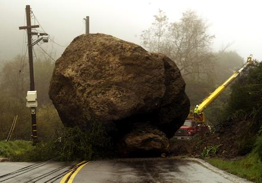
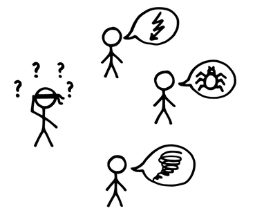
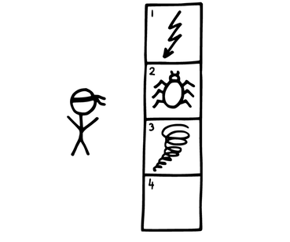

# 障害物リスト

 Original:[Impediment List](https://sites.google.com/a/scrumplop.org/published-patterns/retrospective-pattern-language/impediment-list)

別名: 障害物バックログ

確信度：★

{:style="text-align:center;"}

…[スクラムチーム](ch02_07_7_Scrum_Team.md)は、プロダクトを前に進めようとしている。

{:style="text-align:center;"}
＊　　＊　　＊

**チームメンバーは、しばしば進捗の妨げとなる問題にぶつかります。その場で解決するのは、不可能、非現実的、組織やチームの最大の関心でないといったことがあります。**

{:style="text-align:center;"}

チーム内外の出来事が、[開発チーム](ch02_14_14_Development_Team.md)​の作業を遅らせることがあります。チームメンバーは問題を即座に解決したいかもしれませんが、それは[Sprint Goal](https://sites.google.com/a/scrumplop.org/published-patterns/value-stream/sprint-goal)​に向って進捗することから遠ざけます。

一方で、すぐに障害物を解決しなければ、急性の問題から慢性の問題へと移行する可能性があり、いわば無視して、ただ共存するということになります。

障害物は、しばしば[開発チーム](ch02_14_14_Development_Team.md)の作業を阻害します。障害物は開発チームのパフォーマンス向上も妨げるかもしれません。例えば、チームの相互作用における課題が進捗の妨げになったり、遅いもしくは古い機器によって、チームが最高の状態で働けないことがあります。

それゆえ：

**見過ごせない全ての課題は[障害物リスト](ch03_40_40_Impediment_List.md)によって可視化し、解決するために組織の適切な人々に上げましょう。** [スクラムマスター](ch02_20_19_ScrumMaster.md)は、相対的な深刻度と価値によって、リストに並べます。

{:style="text-align:center;"}

{:style="text-align:center;"}
＊　　＊　　＊

[スクラムチーム](ch02_07_7_Scrum_Team.md)メンバーは誰でも、リストに障害物を加えて、可視化できます。これは、[スクラムチーム](ch02_07_7_Scrum_Team.md)が`4.1.1. 信頼で結ばれた共同体`(`4.1.1. 信頼で結ばれた共同体`を参照)であることを前提としています。なぜならば、障害物の中には、健康状態に関する個人的なもの、家族の状況、チームにおける衝突などで挙げるのが難しいものもあるからです。チームメンバーがこれらの障害物に関していつでも[スクラムマスター](ch02_20_19_ScrumMaster.md)に打ち明けられるようにすべきです。個人の尊厳を守るために、障害物によっては[スクラムマスター](ch02_20_19_ScrumMaster.md)が個別の解決を選択をすることもあります。

[開発チーム](ch02_14_14_Development_Team.md)メンバーは、[障害物リスト](ch03_40_40_Impediment_List.md)のほとんどのアイテムを、自分たち自身で解決しますが、[スクラムチーム](ch02_07_7_Scrum_Team.md)外の誰かの助けを求めることもあります。[スクラムマスター](ch02_20_19_ScrumMaster.md)は、チームの他のメンバーの気が散りそうな場合や、チームの知識が解決に不要な場合は、障害物に個人で取り組むかもしれません。他のやり方としては、[開発チーム](ch02_14_14_Development_Team.md)が​[プロダクトオーナー](ch02_11_11_Product_Owner.md)と協力して、[Product Backlog](https://sites.google.com/a/scrumplop.org/published-patterns/value-stream/product-backlog)に障害物を取り除くための作業を追加することもあります。

[スプリントレトロスペクティブ](ch02_37_36_Sprint_Retrospective.md)​の時に、[スクラムチーム](ch02_07_7_Scrum_Team.md)がリストに新しい障害物を加えることがよくあります。これは、[障害物リスト](ch03_40_40_Impediment_List.md)をリファインメントする良い機会でもあります。

[障害物リスト](ch03_40_40_Impediment_List.md)には改善マインド([カイゼンとカイカク](ch02_19_Kaizen_and_Kaikaku.md)を参照)が表れます。空の[障害物リスト](ch03_40_40_Impediment_List.md)は、改善策を十分熱心に探そうとしていないことを意味します。（問題が無い事は問題です。）一方で、チームは適切なタイミングで障害物に取り組む必要があり、そうでなければ改善は止まってしまいます。リストにある障害物が古くなってしまってはいけません。

実話：あるチームが障害物を取り除いてくれないマネージャーに不満をもらしていました。私が「マネージャーは障害物を知ってますか？」とチームに聞いてみたら、彼らは知っているはずだと言いました。私はチームに頼んで、障害物をそれぞれ蛍光色の付箋に、上部に「ブロック」と太字で書いてもらい、マネージャーのところに持っていきました。彼が居なかったので、見落とさないようにモニターの周りに貼りました。30分後に彼は私を探して、声をかけてきました。彼はやって来て、「これはチームのブロッカーなのか」と聞いてきました。私が「はい」と答えると、彼は微笑んで「今やるべき仕事が分かったのは素晴らしい」と言いました。

