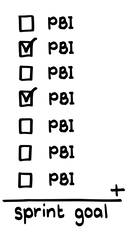
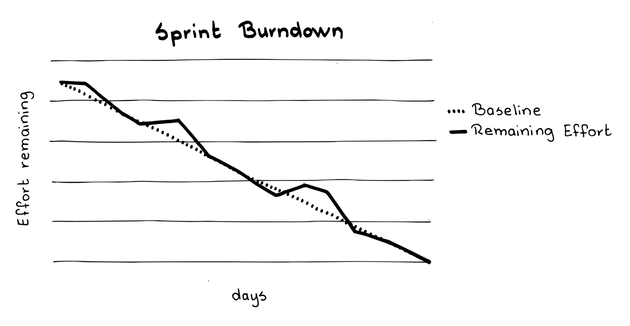

# スプリントバーンダウンチャート

 Original:[Sprint Burndown Chart](https://sites.google.com/a/scrumplop.org/published-patterns/value-stream/information-radiator/sprint-burndown-chart)

{:style="text-align:center;"}

...[スプリントプランニング](ch02_25_24_Sprint_Planning.md)​が終了し、​[Production Episode](https://sites.google.com/a/scrumplop.org/published-patterns/value-stream/production-episode)​が開始され、[開発チーム](ch02_14_14_Development_Team.md)が全力で作業に従事している。

[開発チーム](ch02_14_14_Development_Team.md)は、その能力、ベロシティ（[Notes on Velocity](https://sites.google.com/a/scrumplop.org/published-patterns/value-stream/notes-on-velocity)を参照）、および上位の[Product Backlog Item](https://sites.google.com/a/scrumplop.org/published-patterns/value-stream/product-backlog/product-backlog-item)（PBI）の開発に必要な工数の見積もりを理解した上で、[Sprint Goal](https://sites.google.com/a/scrumplop.org/published-patterns/value-stream/sprint-goal)に合意し、[Sprint Backlog](https://sites.google.com/a/scrumplop.org/published-patterns/value-stream/sprint-backlog)という形で開発および構築計画を作成しました。

[開発チーム](ch02_14_14_Development_Team.md)は、[Sprint Goal](https://sites.google.com/a/scrumplop.org/published-patterns/value-stream/sprint-goal)を確約します。さらにこの[Production Episode](https://sites.google.com/a/scrumplop.org/published-patterns/value-stream/production-episode)のタイムボックスで完了すると予測した[Product Backlog Item](https://sites.google.com/a/scrumplop.org/published-patterns/value-stream/product-backlog/product-backlog-item)のすべてを完了するためにできることをなんでもすると確約します。

{:style="text-align:center;"}
＊　　＊　　＊

**[開発チーム](ch02_14_14_Development_Team.md)のメンバーは、技術、生産、エンジニアリングのタスクに大半の注意を払いますが、自己管理チームとしてビジネスの問題にも対処しなければなりません（[自律したチーム](ch02_16_16_Autonomous_Team.md)を参照）。チームメンバーが、予測達成に向けた進捗状況に関する情報をタイムリーに得られることが重要です。そうすれば必要に応じてすぐに方向転換できるようになります。**

チームのデリバリー予測を保証するには未知なことが多すぎます。しかしながら、[Sprint Goal](https://sites.google.com/a/scrumplop.org/published-patterns/value-stream/sprint-goal)の言葉とチームのデリバリー予測によって、ステークホルダーの期待は高まっています。

[開発チーム](ch02_14_14_Development_Team.md)は、頻繁に、おそらく毎日、推定される残り作業を明確に理解する必要があります。そうすることで、[Sprint](https://sites.google.com/a/scrumplop.org/published-patterns/value-stream/sprint)​期間中の進捗を管理できます。

もし[開発チーム](ch02_14_14_Development_Team.md)がキャパシティを過大評価していることが判明したら、[スクラムチーム](ch02_07_7_Scrum_Team.md)​ はステークホルダーに（直接、または[プロダクトオーナー](ch02_11_11_Product_Owner.md)を通じて）、できるだけ早くそのことを伝える必要があります。[スクラムチーム](ch02_07_7_Scrum_Team.md)と、場合によっては会社や顧客が協力して解決策を見つけられるように、[緊急時手順](ch02_33_32_Emergency_Procedure.md)への移行が必要な場合もあります。

一方、[開発チーム](ch02_14_14_Development_Team.md)が[Product Backlog Item](https://sites.google.com/a/scrumplop.org/published-patterns/value-stream/product-backlog/product-backlog-item)を出荷可能なインクリメントにするために必要な労力を大幅に過大評価していたことが判明した場合、[Sprint](https://sites.google.com/a/scrumplop.org/published-patterns/value-stream/sprint)の終わりにはキャパシティに余裕があることになります。[スクラムチーム](ch02_07_7_Scrum_Team.md)全体として、そのキャパシティの余裕をどのように使うのがベストかを決定する必要があります。

{:style="text-align:center;"}
 
PBI: PBI sprint goal: スプリントゴール

キャパシティの余裕があるため、[プロダクトオーナー](ch02_11_11_Product_Owner.md)は、本来次の[Sprint](https://sites.google.com/a/scrumplop.org/published-patterns/value-stream/sprint)に予定されている[Product Backlog Item](https://sites.google.com/a/scrumplop.org/published-patterns/value-stream/product-backlog/product-backlog-item)を、現在の[Sprint](https://sites.google.com/a/scrumplop.org/published-patterns/value-stream/sprint)で開発するよう前倒しするかもしれません（または、取り決めに従って、[開発チーム](ch02_14_14_Development_Team.md)は[Product Backlog](https://sites.google.com/a/scrumplop.org/published-patterns/value-stream/product-backlog)の先頭から作業を継続することもできます）。[開発チーム](ch02_14_14_Development_Team.md)はそれに応じて[デイリースクラム](ch02_30_29_Daily_Scrum.md)で作業計画を更新することができます。(そして、[開発チーム](ch02_14_14_Development_Team.md)と[プロダクトオーナー](ch02_11_11_Product_Owner.md)が、次に[Refined Product Backlog](https://sites.google.com/a/scrumplop.org/published-patterns/value-stream/product-backlog/refined-product-backlog)に取り組む際に一緒になって作業します。）

[Sprint](https://sites.google.com/a/scrumplop.org/published-patterns/value-stream/sprint)の終わりに[開発チーム](ch02_14_14_Development_Team.md)がどの結末を迎えるのか予測し、ステークホルダーに対して、その情報の透明性を保つことは非常に有用です。

それゆえ：

**タイムボックスの残り時間に対して、[Sprint](https://sites.google.com/a/scrumplop.org/published-patterns/value-stream/sprint)の推定残り作業量をプロットするグラフを作成しましょう。[Sprint](https://sites.google.com/a/scrumplop.org/published-patterns/value-stream/sprint)の進捗を傾向線としてグラフにプロットすることで、その傾きから[開発チーム](ch02_14_14_Development_Team.md)が目標を達成する可能性が一目瞭然で直感的にわかります。グラフを[スクラムチーム](ch02_07_7_Scrum_Team.md)全員が容易にアクセスできる場所に掲示します。定期的に、少なくとも一日単位で更新しましょう。**

以下のグラフは、[スプリントバーンダウンチャート](ch03_06_43_Sprint_Burndown_Chart.md)、または「スプリントバーンダウングラフ」と呼ばれるものです。

{:style="text-align:center;"}

{:style="text-align:center;"}
Sprint Burndown: スプリントバーンダウン Effort remaining: 残り工数 Baseline: 基準線 Remaining Effort: 工数残り Days: 日

[スプリントバーンダウンチャート](ch03_06_43_Sprint_Burndown_Chart.md)のコンセプトは、高性能戦闘機を着陸させようとするパイロットの経験から導き出されたアナロジーです。飛行機が滑走路への進入路で高い位置にあることを検出するように設計されています。また、滑走路の端までの距離、降下率、対気速度、方位も間接的に表示されます。飛行機が滑走路への進入路で高い位置にある場合、しばしば着陸を中止する必要があります。パイロットがより早く降下しようとして、機首を上げパワーを下げると、パワーカーブのバックサイドに入る可能性があります。つまり速度を落として飛行を維持するためには、より大きなパワーが必要となり、それが墜落の原因になります。(これは『人月の神話』[Bro95]のブルックスの法則と類似しています。遅いプロジェクトに人を加えると遅くなるというものです）。しかし、問題を早期に発見した優秀なパイロットは、飛行機を滑走路の終端までに着陸させるため、安全で効果的な行動をとることができます。下手なパイロットは、とにかく着地しようとして、着陸で滑走路の終端を越えてしまうかもしれません。空母に着陸する場合、これは飛行機を破壊し、しばしばパイロットをも巻き込む可能性があります。

[スプリントバーンダウンチャート](ch03_06_43_Sprint_Burndown_Chart.md)では、Y軸は予測を達成するために見積もられた工数の合計を反映しています。測定単位は、[Product Backlog Item](https://sites.google.com/a/scrumplop.org/published-patterns/value-stream/product-backlog/product-backlog-item)を見積もるために使用されるものと同じであるべきです（すなわち、​[Estimation Points](https://sites.google.com/a/scrumplop.org/published-patterns/value-stream/estimation-points)）。

X軸は、[Sprint](https://sites.google.com/a/scrumplop.org/published-patterns/value-stream/sprint)の残り作業日数を示しています。グラフは、0（[Sprint](https://sites.google.com/a/scrumplop.org/published-patterns/value-stream/sprint)最終日）までの作業日数のカウントダウン、カレンダーの日付（例えば、1月4日、3月5日など）、その[Sprint](https://sites.google.com/a/scrumplop.org/published-patterns/value-stream/sprint)の経過日数のいずれかを示しています。

[スプリントバーンダウンチャート](ch03_06_43_Sprint_Burndown_Chart.md)は、[開発チーム](ch02_14_14_Development_Team.md)のものです。これは、本来、外部のステークホルダー（経営陣も含む）ではなく、[開発チーム](ch02_14_14_Development_Team.md)が使用することを意図したツールです。しかし、広く使うことで、[Production Episode](https://sites.google.com/a/scrumplop.org/published-patterns/value-stream/production-episode)の中で起きていることについて、より多くの人に対して透明性を確保する[Information Radiator](https://sites.google.com/a/scrumplop.org/published-patterns/value-stream/information-radiator)となります。スクラムでは何も隠す必要がなく、透明性は時に障害の早期発見と解決につながります。しかし、[スプリントバーンダウンチャート](ch03_06_43_Sprint_Burndown_Chart.md)は開発を管理するチーム外の関係者に情報を提供するためではなく、主にチーム自身による管理を助けるためにあります。

[スプリントバーンダウンチャート](ch03_06_43_Sprint_Burndown_Chart.md)を使う開発では、​[スクラムマスター](ch02_20_19_ScrumMaster.md)​は、[開発チーム](ch02_14_14_Development_Team.md)に定期的な更新を促し、[スプリントバーンダウンチャート](ch03_06_43_Sprint_Burndown_Chart.md)の目的を最も明確かつ容易に表現するフォーマットを選択するように導く必要があるかもしれません。

価値が直接結びついているのは、[スプリントバックログアイテム](ch03_40_73_Sprint_Backlog_Item.md)ではなく、[Product Backlog Item](https://sites.google.com/a/scrumplop.org/published-patterns/value-stream/product-backlog/product-backlog-item)であるため、チームはデリバリーされる[Product Backlog Item](https://sites.google.com/a/scrumplop.org/published-patterns/value-stream/product-backlog/product-backlog-item)のレベルで残作業を追跡する必要があります。チームはアイテムを完了させるたびに、全体の残作業量を減らし、新しい合計をグラフにプロットします。ここでいう、「完了」は、「完成」（[Definition of Done](https://sites.google.com/a/scrumplop.org/published-patterns/value-stream/definition-of-done)参照）と解釈するのが最善であり、[Product Backlog Item](https://sites.google.com/a/scrumplop.org/published-patterns/value-stream/product-backlog/product-backlog-item)が「完成」したときにのみ、チームはグラフを更新することを意味します。「完成」したものを追跡することで、チームは[Sprint](https://sites.google.com/a/scrumplop.org/published-patterns/value-stream/sprint)の価値実現に向けた進捗に注意を払い続けることができます。もし[スプリントバックログアイテム](ch03_40_73_Sprint_Backlog_Item.md)レベルでの完成でグラフを描いた場合は、どれだけの作業が残っているかを示すことになります。理論的には、ほとんどの作業を完了しても、ほとんどの[Product Backlog Item](https://sites.google.com/a/scrumplop.org/published-patterns/value-stream/product-backlog/product-backlog-item)レベルの作業が未完成のであれば、価値をほとんどもしくは全く提供できないことがあります。

チームは、実際に費やした工数ではなく、完了したアイテムの見積もり作業を記録します。私たちは、個々のタスクや[Product Backlog Item](https://sites.google.com/a/scrumplop.org/published-patterns/value-stream/product-backlog/product-backlog-item)にかかった時間を測定するという退屈なことはしたくありませんし、する必要もありません。[スプリントバーンダウンチャート](ch03_06_43_Sprint_Burndown_Chart.md)を更新するのは、2つの場合だけです。最初のケースでは、[Product Backlog Item](https://sites.google.com/a/scrumplop.org/published-patterns/value-stream/product-backlog/product-backlog-item)が「完成」したときに、チームはグラフを更新し、その[Product Backlog Item](https://sites.google.com/a/scrumplop.org/published-patterns/value-stream/product-backlog/product-backlog-item)の当初の見積もり工数をバーンダウンします。2つ目のケースは、緊急の要件や予定外の作業が発見された場合です。[Product Backlog Item](https://sites.google.com/a/scrumplop.org/published-patterns/value-stream/product-backlog/product-backlog-item)の見積もりをそれに応じて増やし、新たに発見された作業の差分だけグラフを上に修正することもあるかもしれません。一部が終わっただけの[Product Backlog Item](https://sites.google.com/a/scrumplop.org/published-patterns/value-stream/product-backlog/product-backlog-item)に対して、残りの作業量を減らしてはいけません。[スプリントバーンダウンチャート](ch03_06_43_Sprint_Burndown_Chart.md)の役割は、最近のことであっても、過去を振り返るのではなく、[Sprint](https://sites.google.com/a/scrumplop.org/published-patterns/value-stream/sprint)に残された日数の残りの作業に向けてチームを集中させることです。特定のアイテムの見積もりの精度は、通常、残りのアイテムの見積もりに影響を与えません。

このグラフをツールに描かせるのではなく、手書きのポスターとして壁に貼って管理することには、大きな利点があります。一つには、傾向線を物理的に描くことで、[開発チーム](ch02_14_14_Development_Team.md)の当事者意識が強まり、また他方では、[開発チーム](ch02_14_14_Development_Team.md)が必要とする本質的な情報のみに焦点を当て、シンプルに保つというプレッシャーもあります。意図的にせよ、偶然にせよ、壁のポスターを隠すことは簡単ではありません。[スプリントバーンダウンチャート](ch03_06_43_Sprint_Burndown_Chart.md)は、このような状況において、自己管理を強化するための強力なツールとなります。また、[スプリントバーンダウンチャート](ch03_06_43_Sprint_Burndown_Chart.md)に重要な出来事を簡単に記入して、それらのデータを[スプリントレトロスペクティブ](ch02_37_36_Sprint_Retrospective.md)で使用することもできます。

ほとんどのバーンダウンチャートには、Y軸（工数）の一番上からX軸（時間）の一番右の校正目盛まで、平均バーンダウン率の基準線が描かれています。チームは、[Sprint](https://sites.google.com/a/scrumplop.org/published-patterns/value-stream/sprint)の実際の進捗の傾向線を、基準線と比較することができます。もしチームが、平均バーンダウン率に対して、進捗の線が大きく上にあることに気づいたら、[Sprint Backlog](https://sites.google.com/a/scrumplop.org/published-patterns/value-stream/sprint-backlog)全体を納品できない可能性が高いと結論づけるかもしれません。一方、平均基準線よりも、進捗の線が大きく下にある場合、[開発チーム](ch02_14_14_Development_Team.md)は[Sprint](https://sites.google.com/a/scrumplop.org/published-patterns/value-stream/sprint)に余力があると結論づけるかもしれません。単純ではありませんが、現在の[Sprint](https://sites.google.com/a/scrumplop.org/published-patterns/value-stream/sprint)の軌跡と最近の[Sprint](https://sites.google.com/a/scrumplop.org/published-patterns/value-stream/sprint)の軌跡を比較するという方法もあります。というのも、バーンダウンの経路が直線になることはほとんどないためです。

{:style="text-align:center;"}
＊　　＊　　＊

[開発チーム](ch02_14_14_Development_Team.md)によっては、[Product Backlog Item](https://sites.google.com/a/scrumplop.org/published-patterns/value-stream/product-backlog/product-backlog-item)ではなくタスクを完成させるために必要な工数を示すグラフを使用したり、「 2つのY軸」を使用して、同じバーンダウンチャート上で[Product Backlog Item](https://sites.google.com/a/scrumplop.org/published-patterns/value-stream/product-backlog/product-backlog-item)とタスクの両方をそれぞれ異なる色の傾向線で表示することもあります。

[開発チーム](ch02_14_14_Development_Team.md)は、自分たちの必要性に最も適した表現を自由に選択できますが、ほとんどの場合、[スプリントプランニング](ch02_25_24_Sprint_Planning.md)の終了時にすべての開発タスクが判明しているわけではないことを認識する必要があります。[Sprint](https://sites.google.com/a/scrumplop.org/published-patterns/value-stream/sprint)の間にチームがより多くを学ぶことによって新しいタスクが発生するため、これまでに説明したように残りの作業量を増やす必要があります。[開発チーム](ch02_14_14_Development_Team.md)は、自分たちがどれだけの作業を行ったかよりも、どれだけのものを提供するかに焦点を当てるべきです。また、[開発チーム](ch02_14_14_Development_Team.md)が多くのタスクを完了しても、実際にはそれほど価値を提供していない可能性があります。

そのような事は、[Product Backlog Item](https://sites.google.com/a/scrumplop.org/published-patterns/value-stream/product-backlog/product-backlog-item)については起きるはずはありません。チームがすでに[Sprint Goal](https://sites.google.com/a/scrumplop.org/published-patterns/value-stream/sprint-goal)を達成していない限り、新しいアイテムを[Sprint](https://sites.google.com/a/scrumplop.org/published-patterns/value-stream/sprint)に入れることは許されないはずだからです。[Product Backlog Item](https://sites.google.com/a/scrumplop.org/published-patterns/value-stream/product-backlog/product-backlog-item)は[Sprint Goal](https://sites.google.com/a/scrumplop.org/published-patterns/value-stream/sprint-goal)の本質的な価値提案を表しているので、[Product Backlog Item](https://sites.google.com/a/scrumplop.org/published-patterns/value-stream/product-backlog/product-backlog-item)の開発を見積った工数に焦点を当てた[スプリントバーンダウンチャート](ch03_06_43_Sprint_Burndown_Chart.md)の傾向線は、チームをビジネス価値の提供に集中させてくれます。

Ken Schwaber氏は、2001年5月に[スプリントバーンダウンチャート](ch03_06_43_Sprint_Burndown_Chart.md)について初めて説明しました。彼は、Fidelity Investmentsに在籍していた時にこれを考案しました。[43]

