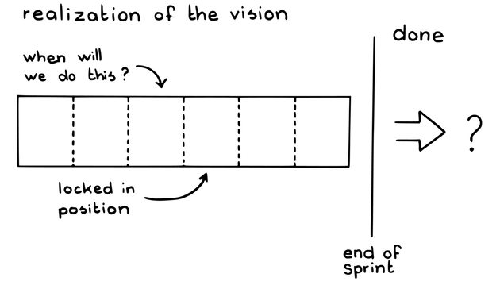
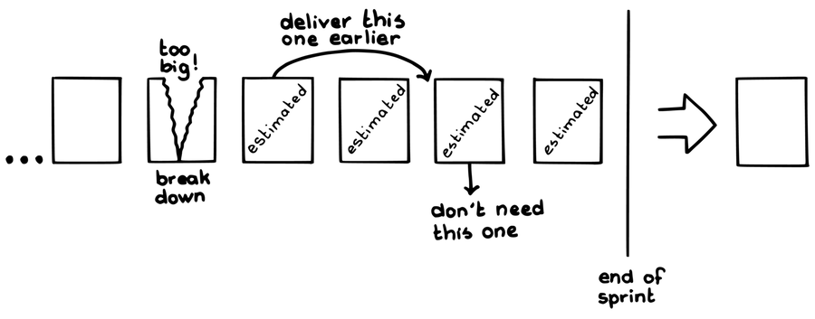

# プロダクトバックログアイテム

 Original:[Product Backlog Item](https://sites.google.com/a/scrumplop.org/published-patterns/value-stream/product-backlog/product-backlog-item)

確信度：★★

{:style="text-align:center;"}

… あなたは、ビジネスを推進するアイテムから​[Product Backlog](https://sites.google.com/a/scrumplop.org/published-patterns/value-stream/product-backlog)を構築しています。​[ビジョン](ch03_02_39_Vision.md)​は整っており、プロダクトバックログには、初期の非公式な市場リリースのイメージや​[スプリントゴール](ch03_38_71_Sprint_Goal.md)​も含まれるかもしれません。

{:style="text-align:center;"}
＊　　＊　　＊

あなたは、製品の価値（投資収益率、正味現在価値など、​[Value and ROI](https://sites.google.com/a/scrumplop.org/published-patterns/value-stream/product-backlog/value-and-roi)​を参照）を最適化するために、作業を最善の状態に整理したいと考えています。スクラムは作業の整理方法に多くの関心をむけています。「正しく行う」ことが確かな価値に繋がるのは明らかです。しかしながら、価値とROIは、ステークホルダーや「正しい事を行う」ことと、より強く関係しているかもしれません。

より広く見れば、価値は、ステークホルダーに客観的価値があるものを提供することによって生まれます。企業には多くのステークホルダーがいます。顧客、エンドユーザー、株主、マーケティングとセールス部門、サポート部門、デザイナー、アーキテクト、開発者、テスターなどの、それぞれが、全体的な価値感を形成し、[定期的なプロダクトインクリメント](ch03_52_85_Regular_Product_Increment.md)を作成することによって恩恵を受けようとしています。

{:style="text-align:center;"}
 
realization of the vision: ビジョンの実現 when will we do this ?: これはいつやる？ locked in position: 動かせないもの done: 完成 end of sprint: スプリントのおわり

理想的なシステムは、あるステークホルダーが利益を得て、他のステークホルダーが犠牲になるのではなく、すべてのステークホルダーにとっての価値を高めるものです。誰もが何か（時間、お金、労力）を差しだす必要があるかもしれませんが、誰もが与えた以上のものを得るというパラドックスを実現したいのです。斜に構えた皮肉な言い方をすれば、少なくとも誰もが与えただけの分は得られるようにしたいのです。

それゆえ：

** プロダクトバックログアイテム（PBI）と呼ばれる、プロダクトへの変更や追加についての明確な仕様を作成し、それらをまとめて[Product Backlog](https://sites.google.com/a/scrumplop.org/published-patterns/value-stream/product-backlog)を作ります。 ** それぞれのPBIには、​[開発チーム](ch02_14_14_Development_Team.md)​が開発し、提供できる何かを記述します。そのPBIが、「完成」（​[Definition of Done](https://sites.google.com/a/scrumplop.org/published-patterns/value-stream/definition-of-done)​を参照）した時には、関連するステークホルダーへ価値が提供されるようにします。最も一般的なステークホルダーは市場か、その代表である​[プロダクトオーナー](ch02_11_11_Product_Owner.md)​です。しかしながら、PBIには企業のコスト低減の取り組みや開発チームの労力低減の取り組み、​[プロダクトオーナーチーム](ch02_12_12_Product_Owner_Team.md)​の作業を支援するツールなどを記述することもあります。PBIには、ステークホルダーにとって潜在的に価値があるものであれば、何でも記述することができます。

{:style="text-align:center;"}
 
Too big !: 大きすぎる！ Break down: 分割しよう Deliver this one earlier: これは早く提供しよう Don’t need this one: これは不要 End of sprint: スプリントのおわり estimated: 見積もり済み 

PBIには、何が提供されるか、関連するステークホルダーがその内容をさくっと思い出せるような名前か、それと分かるものが必要となります。優れたPBIには、プロダクトオーナーがくだしたステークホルダー向けの判断や、プロダクトオーナーと開発チームとの間での合意事項が記録されます。それらは誰もが思い出せるように書き留めるべきです。優れたPBIには、それを実装することになる開発チームによる見積もりや、価値とROIにそのPBIがどう貢献するかの説明がついています。

PBIは、スクラムが提供する成果の中心的な役割を果たすものです。スクラムが提供する成果のライフタイムは[ビジョン](ch03_02_39_Vision.md)から始まり、[プロダクトオーナー](ch02_11_11_Product_Owner.md)はそれを[スプリントゴール](ch03_38_71_Sprint_Goal.md)に分解し、[定期的なプロダクトインクリメント](ch03_52_85_Regular_Product_Increment.md)に対応させます。​[スクラムチーム](ch02_07_7_Scrum_Team.md)​は、必要に応じて[プロダクトオーナー](ch02_11_11_Product_Owner.md)と協力しながら（​[リファインメントされたプロダクトバックログ](ch03_30_64_Refined_Product_Backlog.md)を参照）、それらの[定期的なプロダクトインクリメント](ch03_52_85_Regular_Product_Increment.md)をPBIに分解します。PBIは、スクラムにおける最も細かい提供の単位です。[プロダクトオーナー](ch02_11_11_Product_Owner.md)は、チームの協力を得ながら、PBIの状態を「準備完了」（​[Definition of Ready](https://sites.google.com/a/scrumplop.org/published-patterns/value-stream/product-backlog/definition-of-ready)を参照）にしていきます。明確で、価値があり、開発に値する、という状態です。PBIは、[開発チーム](ch02_14_14_Development_Team.md)の作業計画である[スプリントバックログ](ch03_39_72_Sprint_Backlog.md)に記載された解決策の実装を促進します。PBIの状態を「完成」と呼ぶには、提供の準備が整っている必要があります。

{:style="text-align:center;"}
＊　　＊　　＊

PBIは、通常より大きな[定期的なプロダクトインクリメント](ch03_52_85_Regular_Product_Increment.md)の一部分です。最高のPBIの焦点は、インクリメントへの貢献の背後にある要求よりも、[ビジョン](ch03_02_39_Vision.md)に基づくプロダクトの解決策にあります。[スクラムチーム](ch02_07_7_Scrum_Team.md)と[プロダクトオーナー](ch02_11_11_Product_Owner.md)は、それぞれの提供物の背景にある要求を対面で議論し、バックログを一緒に「準備完了」にしていきます。チームと他のステークホルダーは[プロダクトバックログアイテム](ch03_21_55_Product_Backlog_Item.md)を具体化するために、ユーザーストーリー、ストーリーボード、インタラクション図、プロトタイプ、ユーザーナラティブなど、どんなツールでも選んで使うことができます。しかし、一般的にこうした作成物それ自体は効果的なPBIではありません。例えば、一つの提供物に対してユーザーストーリーはいくつもあるでしょうし、それぞれは異なるステークホルダーからのもので、その提供物に対するそれぞれのステークホルダーのニーズや動機が表現されているかもしれません。しかしながら、スクラムで管理、見積もり、提供をする単位となるべきは、提供手段ではなく「提供」物です。そして、PBIはその提供物を表します。[スクラムチーム](ch02_07_7_Scrum_Team.md)は、[リファインメントされたプロダクトバックログ](ch03_30_64_Refined_Product_Backlog.md)を作り、[スプリントプランニング](ch02_25_24_Sprint_Planning.md)で目前の[Sprint](https://sites.google.com/a/scrumplop.org/published-patterns/value-stream/sprint)の準備をする際に、要求の詳細を対面で議論します。つまり、よいPBIは、要求をやり取りするメカニズムではなく、要求を集めたものです。PBIは[開発チーム](ch02_14_14_Development_Team.md)が要求を学習するための手段ではなく、[開発チーム](ch02_14_14_Development_Team.md)と[プロダクトオーナー](ch02_11_11_Product_Owner.md)の間で交わされる豊かなやりとりを記憶するものです。つまりPBIは、シナリオの詳細、サイズや重量、速度、時間といった特性など、チームが忘れてしまいそうな詳細を保存する場所として機能します。開発に関する判断の詳細は、グループの人々が2週間も頭に入れておくには多すぎるのです。また、よい[プロダクトバックログアイテム](ch03_21_55_Product_Backlog_Item.md)は、問題空間ではなく解決空間に存在していますが、その記述は、解決策をどのように実装し提供するかについて、十分なものではありません。それは[開発チーム](ch02_14_14_Development_Team.md)に任されています。

PBIは、記述された作成物で、[Product Backlog](https://sites.google.com/a/scrumplop.org/published-patterns/value-stream/product-backlog)上に現れますが、[プロダクトオーナー](ch02_11_11_Product_Owner.md)限から[開発チーム](ch02_14_14_Development_Team.md)に伝えられる情報の多くは、スクラムの計画イベントにおいて口頭で対話的にやりとりされます。[プロダクトオーナー](ch02_11_11_Product_Owner.md)が最初に説明を行った後に質疑応答の形をとることは、まったくもって適切なことです。よくある落とし穴は、[プロダクトオーナー](ch02_11_11_Product_Owner.md)が、[開発チーム](ch02_14_14_Development_Team.md)とのやりとりを必要最小限にするため、PBIを開発者が読める包括的なドキュメントにしてしまうことです。経験則としては、PBIは軽量な方法で始めて、時間が経つにつれて詳細さと具体性を増していくべきです。それでもなお、PBIには市場の詳細な情報（応答時間、サイズや重量の制限などの詳細）がふくまれることが多く、PBIを実現する上で重要になるでしょう。なぜなら、そのような情報は、成果物の性質について、[プロダクトオーナー](ch02_11_11_Product_Owner.md)やチームの決定を反映しているからです。

PBIが[Product Backlog](https://sites.google.com/a/scrumplop.org/published-patterns/value-stream/product-backlog)の先頭付近にあり、まもなく[Production Episode](https://sites.google.com/a/scrumplop.org/published-patterns/value-stream/production-episode)に入っていくときに、チームは特別の注意を払う必要があります。こうした項目を[開発チーム](ch02_14_14_Development_Team.md)が[Enabling Specification](https://sites.google.com/a/scrumplop.org/published-patterns/value-stream/product-backlog/enabling-specification)​とみなせるところまで、[プロダクトオーナー](ch02_11_11_Product_Owner.md)と[開発チーム](ch02_14_14_Development_Team.md)は議論をする必要があります。

PBIには、提供するために必要な作業タスクの間にあるビジネス上や開発上のすべての依存関係が反映されていることを確認しましょう。特定の日付に依存するPBI（例えば、納期が約束された部品を発注していて、納品待ちになっている場合など）に対しては、[Fixed-Date PBI](https://sites.google.com/a/scrumplop.org/published-patterns/value-stream/product-backlog/fixed-date-pbi)​を使いましょう。

スクラムではPBIの書式は規定していませんが、ユーザーストーリーに頼ることには注意が必要です。ユーザーストーリーは、PBIに対して、何（What）かしら簡単な要約を提示しますが、その価値の多くはステークホルダー(Who)とその動機（Why）を明らかにすることです。ユーザーストーリーは要求空間の中にあります。一つのPBIが、複数のユーザーストーリーに結びついた要求を満たすということもあります。リリース管理する観点からは、プロダクトバックログの要素は開発を待っている成果物であり、成果物が満たすべき要求ではありません。ステークホルダーが、成果物を簡単に認識または想像できるのであれば、チームはどんな形式のものでも使ってよいのです。

PBIが、スプリントで提供するものに対して10%より小さいときに、通常は最良の見積もりが得られます。​[Small Items](https://sites.google.com/a/scrumplop.org/published-patterns/value-stream/small-items)にするときに、[Granularity Gradient](https://sites.google.com/a/scrumplop.org/published-patterns/value-stream/product-backlog/granularity-gradient)​などの方法を取ることで、バックログ全体を分解する無駄を避けることができます。開発チームが集まって全てのPBIを見積もる必要があり（​[Pigs Estimate](https://sites.google.com/a/scrumplop.org/published-patterns/value-stream/estimation-points/pigs-estimate)​）、[Estimation Points](https://sites.google.com/a/scrumplop.org/published-patterns/value-stream/estimation-points)を用いるのがベストプラクティスです。

チームは、一般的には、内部的に着目している作業項目やタスクを管理するために、PBIを使うべきではありません。提供される価値と、その価値を生み出す仕組みとが混同されてしまいます。こうした混同は、ビジネスの外部市場への集中を失わせる原因となります。PBIは、作業環境、製造工場、作業スペースではなく、どちらかといえばステークホルダーのために価値を加えるものです。PBIの開発を支援する作業項目やタスクについては、スプリントバックログを使います。またプロセスの問題を記録し見える化するためには、​[障害物リスト](ch03_03_40_Impediment_List.md)​を用います。

[開発チーム](ch02_14_14_Development_Team.md)は、[プロダクトオーナー](ch02_11_11_Product_Owner.md)から過度に干渉されることなく、自分たちの作業計画、つまり[スプリントバックログ](ch03_39_72_Sprint_Backlog.md)を管理する必要があります。作業場所の掃除、機械の日々のメンテナンス、コードのリファクタリングなどはあまりにも日常的な作業項目であるために、ビジネスレベルで指示されることはおろか、作業計画にも明示されません。他の内部的な作業、たとえばテスティングや発注書の作成などが作業計画に明記されることもあるかもしれませんが、これがPBIとして明示されることはまずないでしょう。ときには、こうした項目が長期的な価値を脅かすほど大きくなることもあります。例えば、機械の日々のメンテナンスや​[Good Housekeeping](https://sites.google.com/a/scrumplop.org/published-patterns/value-stream/good-housekeeping)を避けた累積的な影響によって、職場環境が安全でなく、また非効率になってしまい、大規模な清掃作業が必要になるなどです。こうした例外的な状況では[プロダクトオーナー](ch02_11_11_Product_Owner.md)は、ビジネスレベルの監視に値するとして、バグ、期限切れの機械のメンテナンス、技術的な負債の削減などといった、本来は内部的な項目をPBIに含めることがあります。

一方で、ほとんどのPBIは[定期的なプロダクトインクリメント](ch03_52_85_Regular_Product_Increment.md)に関連しており、PBIには、提供してステークホルダーにとっての価値を向上させるものであれば、どんなものでも記述することができます。進んだチームでは、広義の意味での「ステークホルダー」という言葉を使うこともあります。チームにとって価値があるとして、エンジニアリングダイアグラムのような内部文書の作成にもPBIを用いることがあります。この場合、チームをステークホルダーとして扱っています。外部文書であるユーザーマニュアルにはPBIが必要なことは確実です（代わりに内部文書の作成を[Definition of Done](https://sites.google.com/a/scrumplop.org/published-patterns/value-stream/definition-of-done)の一部として扱う方法もあります。経験則では、大きな単位の内部作業にはPBIを使って見える化を維持し、作業計画を煩雑にしてしまうような繰り返し行う小さな作業には[Definition of Done](https://sites.google.com/a/scrumplop.org/published-patterns/value-stream/definition-of-done)を用います）。

それでもPBIは「どうやって（how）」よりも、「何を(what)」「いつ(when)」「誰のために(whom)」に重点をおくべきです。もし[プロダクトオーナー](ch02_11_11_Product_Owner.md)が「何を」「いつ」「誰のために」ではなく「どうやって」開発するかに多くの時間を使っているのであれば、チームは背後にある障害を探し出し、それに対処する必要があります。[定期的なプロダクトインクリメント](ch03_52_85_Regular_Product_Increment.md)以外の重要な懸念事項に鋭い焦点を当てるためにPBIを用いる高度なアプローチについては、[割り込みに負けるな](ch02_34_33_Illegitimus_Non_Interruptus.md)も参照してください。

PBIの高度な使い方として、[Sprint](https://sites.google.com/a/scrumplop.org/published-patterns/value-stream/sprint)中に[開発チーム](ch02_14_14_Development_Team.md)による作業が必要となるようなプロセス改善の取り組みを引き出す、というものがあります。[Scrumming the Scrum](https://sites.google.com/a/scrumplop.org/published-patterns/retrospective-pattern-language/scrumming-the-scrum)​を参照してください。

スプリントの終わりに達したとき、プロダクトバックログ項目によって進められた製品への貢献は、完成の定義を満たしている必要があります。

PBIはコストと求める価値に基づいて並び替えることができます（「価値」が何を指すかについては、[Value and ROI](https://sites.google.com/a/scrumplop.org/published-patterns/value-stream/product-backlog/value-and-roi)を参照してください）。他の条件がすべて同じであったとしても、バックログにおけるPBIの位置を変更すると、貢献する価値が変化することがあります（例えば、季節性や競合の動きなど、市場のタイミングの問題があります）。[Product Backlog](https://sites.google.com/a/scrumplop.org/published-patterns/value-stream/product-backlog)は、（​[High Value First](https://sites.google.com/a/scrumplop.org/published-patterns/value-stream/product-backlog/high-value-first)​にあるように）比較的独立しているPBIの個々の価値の見積もりに基づいて、または全体的、長期的、統合的な​[ROI-Ordered Backlog](https://sites.google.com/a/scrumplop.org/published-patterns/value-stream/product-backlog/roi-ordered-backlog)​に基づいて、順序付けることができるものです。

