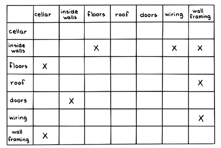
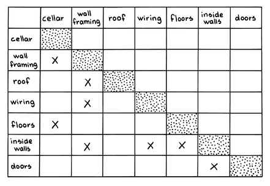

# リファインメントされたプロダクトバックログ

 Original:[Refined Product Backlog](https://sites.google.com/a/scrumplop.org/published-patterns/value-stream/product-backlog/refined-product-backlog)

別名：バックログリファインメントミーティング

確信度：★★

{:style="text-align:center;"}

{:style="text-align:center;"}
注意深く調整

{:style="text-align:center;"}

​[Product Backlog](https://sites.google.com/a/scrumplop.org/published-patterns/value-stream/product-backlog)​があります。​[スクラムチーム](ch02_07_7_Scrum_Team.md)​は先を見越した計画づくりをする必要があります。

{:style="text-align:center;"}
＊　　＊　　＊

アジャイルな企業は、価値創出の機会を活かすために素早く対応できる体制を整える必要があり、また、遠すぎる先の作業をしたり計画したりすることを避けるべきです。市場機会に素早く対応するには、チームはステークホルダーのニーズを理解する必要があり、またやるべきアイテムを進められるように、カモの列のように全てのアイテムを一列にならべておく必要があります。[プロダクトオーナー](ch02_11_11_Product_Owner.md)は、 ​[Regular Product Increment](https://sites.google.com/a/scrumplop.org/published-patterns/value-stream/regular-product-increment)​がビジョンをどのように支えているかを伝えておく必要があります。[プロダクトオーナー](ch02_11_11_Product_Owner.md)は、市場への最大の即応性を実現し、最高の価値を創造するために、[Regular Product Increment](https://sites.google.com/a/scrumplop.org/published-patterns/value-stream/regular-product-increment)​を時系列に並べます。機会が訪れた時には、その準備ができていて欲しいと思うものです。市場にまつわる意思決定には、「対応できる最後のタイミング」があるかもしれません。それを過ぎると、時間の経過とそれに伴う状況の変化によって、選択肢やそれを行使する能力が失われる可能性があります。

しかし、長期にわたって価値を生み出さないような仕事は、先送りすることも重要です。長期的な成果物に性急に取り組むことによって、他の実現可能なプロダクトを重要な市場の好機に提供することが遅れると、大きな機会損失を招く可能性があります。

このことをさらに複雑にするのは、成果物には他の成果物に強く依存するものがある、という事実です。[プロダクトバックログアイテム](ch03_21_55_Product_Backlog_Item.md)​（PBI）の中には、それまでの製品インクリメントの上に構築されるものがあります。市場で大きく勝つ機会が訪れた時には正しい基盤が整っているように、前もって計画することが重要です。そうすることによって、そうでない場合より、いくつかのPBIをより早く提供するように示唆されるかもしれません。早期のリリースにおいて、そのアイテムは低い価値しかもたらさないかもしれないが、より大きな[Value and ROI](https://sites.google.com/a/scrumplop.org/published-patterns/value-stream/product-backlog/value-and-roi)のある[Regular Product Increment](https://sites.google.com/a/scrumplop.org/published-patterns/value-stream/regular-product-increment)の準備をすることにもなります。

時間が経つにつれ、チームは市場や依存関係についてより多くを学びます。しかしながら同時に、組織の中で人々は開発や市場に関する決定をくだしたり市場そのものが変化することによって、既存の計画の変更を求めたり誘発したりします。すべての新しい決定が、将来の製品や市場の可能性を制限する制約になるかもしれません。例えば、ある機能の市場への導入を遅らせることで、その市場で一番になる機会を失くしてしまうかもしれません。チームは、今日のチームと市場の理解に基づいて最も価値が得られるようPBIを順序付けますが、明日になれば、絶好の機会が訪れるかもしれず、異なる並び順のバックログの方がより価値が高くなることもあります。こうした問題を事前に遠く見通すことは、しばしばチームにとって困難です。

それゆえ：

**[スクラムチーム](ch02_07_7_Scrum_Team.md)（特に[プロダクトオーナー](ch02_11_11_Product_Owner.md)と[開発チーム](ch02_14_14_Development_Team.md)）は、頻繁に会い、[Product Backlog](https://sites.google.com/a/scrumplop.org/published-patterns/value-stream/product-backlog)を適切に並べかえ、最も差し迫った大きなPBIをより小さなものに分解するべきです。[開発チーム](ch02_14_14_Development_Team.md)は、最終的に実装することになる（[Pigs Estimate](https://sites.google.com/a/scrumplop.org/published-patterns/value-stream/estimation-points/pigs-estimate)）[プロダクトバックログアイテム](ch03_21_55_Product_Backlog_Item.md)の見積もりを最新の状態に保つべきです。**

チームは特に[Product Backlog](https://sites.google.com/a/scrumplop.org/published-patterns/value-stream/product-backlog)の上位にあるアイテムに集中するべきです。PBI間の依存関係や、PBIと外部の市場要因（例：休暇シーズンのセール）との依存関係、そしてPBIの構築を可能にするリソースが利用可能になる時期（例：原材料や実現技術のサプライヤーからの納品）に特に注意を払ってください。[スクラムチーム](ch02_07_7_Scrum_Team.md)は、バックログ上のPBIに見積もりと価値の属性を付けるべきです。

バックログの先頭付近のPBI（次の２〜３​[Sprint](https://sites.google.com/a/scrumplop.org/published-patterns/value-stream/sprint)分）は、スプリントの開発工数の10％を超えるような作業を要するものが１つもないよう、十分に小さくします。​[Small Items](https://sites.google.com/a/scrumplop.org/published-patterns/value-stream/small-items)を参照してください。

{:style="text-align:center;"}
＊　　＊　　＊

リファインメントには、詳細な要求分析、[Product Backlog](https://sites.google.com/a/scrumplop.org/published-patterns/value-stream/product-backlog)の構造を[Granularity Gradient](https://sites.google.com/a/scrumplop.org/published-patterns/value-stream/product-backlog/granularity-gradient)にしていく取り組み、見積もりの更新、PBIのリリースのタイミングに関連する依存関係や制約を反映するためのアイテムの並べ替え、そして一般的には、チームが入手した新しい情報を反映するための[Product Backlog](https://sites.google.com/a/scrumplop.org/published-patterns/value-stream/product-backlog)の更新が含まれます。

心に留めておいてください。バックログのリファインメントのためにチームを集める主な目的は、想定される機能をどのように実装するか、チームに考え始めてもらうことかもしれません。リファインメントは学習プロセスの一部です。想定されるニーズを潜在意識で処理する、あるいはランチを食べながら今後の作業について非公式に議論するといった、今後の機能についての事前の精神的な準備は、ビジョンを設計に落とし込むブレークスルーの原動力となります。アイザック・アシモフは、創造性は集団活動から離れた孤独の中で、そして構造化された専門的な環境の外での非公式で気持ちの良い交流の中で開花すると提案しました（On Creativity [Asi15]）。スティーブ・ジョンソンは、「ゆっくりとした閃き」が創造性の主要な要因であると指摘しています。バックログのリファインメントと見積もりは、チームメンバーの心の中でこのプロセスを引き起こす種を蒔きます。デプロイメントのかなり前にアイテムを見ることで、このプロセスを展開する時間が与えられます（Where Good Ideas Come From [Joh11]の”The Slow Hunch”を参照）。

訳注：Isaac Asimov Asks, “How Do People Get New Ideas?”- A 1959 Essay by Isaac Asimov on Creativity

最初に並び替えに使うと良いテクニックとして、リーン規範における「デザイン構造マトリクス」[59]（Design Structure Matrix Methods and Applications [EB12a]を参照）があります。それぞれの軸にPBIをラベル付けしたマトリクスを作り、アイテム間に依存関係があるところに「X」を記入します。

{:style="text-align:center;"}
 
Cellar 地下室 Inside walls 内壁 Floors 床 Roof 屋根 Doors ドア Wiring 配線 Wall framing 壁枠

そして、マトリクスを左下三角行列になるように並べ替えます。つまり、最終責任時点を前倒しにするのです。それは先送りできません。これは「最終責任時点」というフレーズの、XP以前の元々の意味です（”Proceedings of the 8th Annual Conference on the International Group for Lean Construction”の”Positive versus Negative Iteration in Design”[Bal00]を参照）。左下三角行列になっていれば、すべてのアイテムは、それが依存するアイテムよりも後に来ることになります。さらに、これらの決定を前倒しすることで、チームは関連する作業に深く入り込むことになり、それが創発的な要求を明らかにし、目の前の問題への洞察のレベルを高めることになります。時間が経過するだけでは、新しい洞察が得られる保証はありません。創発的な要求を出現させるためには、チームが積極的にアイテムの設計と実装に取り組む必要があります。

{:style="text-align:center;"}
Cellar 地下室 Wall framing 壁枠 Roof 屋根 Wiring 配線 Floors 床 Inside walls 内壁 Doors ドア 
 
Cellar 地下室 Wall framing 壁枠 Roof 屋根 Wiring 配線 Floors 床 Inside walls 内壁 Doors ドア

外部の動かせない動かせない期日については、常識を働かせて対処してください。マトリクスの並べ替えができない場合は、循環依存があるということなので、チームはより綿密にアイテムを見直す必要があります。最悪の場合、チームは相互に依存する2つのアイテムを、大きな1つのアイテムに統合する必要があるかもしれません。

基本的な依存関係の制約が分かれば、残っている並び順の自由度を使って市場へのアラインメントと価値の機会を最適化してください。[開発チーム](ch02_14_14_Development_Team.md)による相対的なコストの予測と、デリバリー時にアイテムが生み出すと予想される価値を知ることで、価値を最適化するためにアイテムの並び順を調整することができます。与えられたアイテムセットの並び順を変更するだけでも、実現される価値が2倍になることがよくあります。

それぞれのPBI（バックログの先頭付近のもの）が、[Definition of Ready](https://sites.google.com/a/scrumplop.org/published-patterns/value-stream/product-backlog/definition-of-ready)をできる限り満たすようにしましょう。

[Granularity Gradient](https://sites.google.com/a/scrumplop.org/published-patterns/value-stream/product-backlog/granularity-gradient)にすることで、リファインメントはほどほどにしましょう。直近２〜３スプリント分のPBIの洗練を優先し、残りの部分には時間が許す範囲で、また責任ある決定をできる情報がある範囲で、取り組むようにしましょう。

初期のスクラムでは、この活動は[スプリントプランニング](ch02_25_24_Sprint_Planning.md)の中で行われていました。時が経つにつれ、チームはその作業を[スプリントプランニング](ch02_25_24_Sprint_Planning.md)と「水曜午後のミーティング」や「プロダクトバックログリファインメントミーティング」と呼ばれる週次ミーティングに分散させるようになりました。現代の実践では、短い日次ミーティングでさらに作業を分散させることが一般的です。各チームは必要に応じてこれらの活動の頻度と時間を調整できますが、一般的に[プロダクトオーナー](ch02_11_11_Product_Owner.md)が[開発チーム](ch02_14_14_Development_Team.md)に要求する対面時間の合計は、作業時間の10パーセントを超えるべきではありません。[スクラムチーム](ch02_07_7_Scrum_Team.md)はこのような活動をすべて事前にスケジュールすべきです。これは[プロダクトオーナー](ch02_11_11_Product_Owner.md)が必要に応じて要求するような作業ではありません。

[スプリントプランニング](ch02_25_24_Sprint_Planning.md)と同様、チームは[Greatest Value](https://sites.google.com/a/scrumplop.org/published-patterns/value-stream/greatest-value)を目指すだけではなく、純粋に​[プロダクトプライド](ch02_39_38_Product_Pride.md)からも、バックログを調整します。

見積もりについては、[Estimation Points](https://sites.google.com/a/scrumplop.org/published-patterns/value-stream/estimation-points)​を参照してください。

バックログリファインメントはスクラムガイドでは正式なイベントとはされていません。この例外的な扱いに対する1つの主張は、スクラムガイドには[Sprint](https://sites.google.com/a/scrumplop.org/published-patterns/value-stream/sprint)を超えて適用されることは書かれていないというものです。しかし、その議論は誤りです。なぜならスクラムガイドには、「今後のスプリントで開発チームが従事するプロダクトバックログアイテムは、スプリントのタイムボックスで「完成」できるようにうまく細分化する。」、そして「スプリントレビューの成果は、次のスプリントで使用するプロダクトバックログアイテムが含まれた改訂版のプロダクトバックログである。新たな機会に見合うように、プロダクトバックログを全体的に調整することもある。」と記されているからです。より一般的な解釈では、この活動は一定のリズムで行う必要はなく、「ミーティング」として実施する必要もなく、[スクラムチーム](ch02_07_7_Scrum_Team.md)には、最適と考える方法で活動を実施する自由が与えられています。

将来の[Sprint](https://sites.google.com/a/scrumplop.org/published-patterns/value-stream/sprint)の計画づくりの活動を現在の[Sprint](https://sites.google.com/a/scrumplop.org/published-patterns/value-stream/sprint)に含める、竹内・野中によるハーバードビジネスレビューの古典的論文（The New New Product Development Game [TN86]）にある「タイプB」開発におけるスプリントの重複から、発想を得た面があります。

訳注：The New New Product Development Game by Hirotaka Takeuchi and Ikujiro Nonaka

