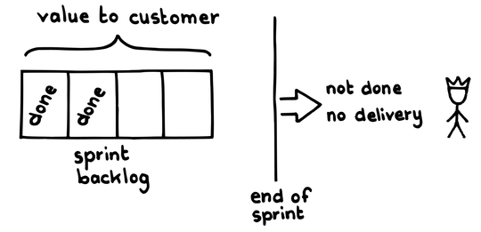
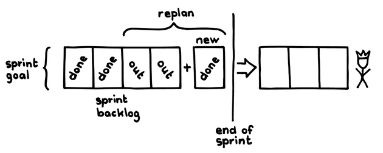

# スプリントゴール

 Original:[Sprint Goal](https://sites.google.com/a/scrumplop.org/published-patterns/value-stream/sprint-goal)

確信度：★★

{:style="text-align:center;"}

…​[Sprint](https://sites.google.com/a/scrumplop.org/published-patterns/value-stream/sprint)​を始める準備ができています。[スプリントプランニング](ch02_25_24_Sprint_Planning.md)​でその計画づくりを行っています。

{:style="text-align:center;"}
＊　　＊　　＊

スプリントの目標は、ステークホルダーに価値を提供することです。しかし、単に​[スプリントバックログアイテム](ch03_40_73_Sprint_Backlog_Item.md)（SBI, 作業タスクなどからなる）のリストに従うだけで、必ずしも可能な限り最大の価値を創ることができるとは限りません。

チームは個々のタスクや成果物に基づいて作業計画を立てるため、[Production Episode](https://sites.google.com/a/scrumplop.org/published-patterns/value-stream/production-episode)の中で、個々のアイテムをピックアップし、独立して作業することは簡単です。しかしそれでは、作業に対して異なる視点をもつ個人同士が相互作用することで生まれるイノベーションが希薄になってしまいます。キュービクル（訳注：背の高い仕切り壁を使って個人別に席を区分けする形態）の壁は、継続的な洞察のやりとりに対する障壁になるかもしれません。ここでの洞察とは、一人の開発者にとってのものだけではなく、多くの開発者（​[開発チーム](ch02_14_14_Development_Team.md)のメンバー）やチーム全体にとって重要な洞察、という意味です。チームワークが損なわれてしまうのです。

{:style="text-align:center;"}
 
value to customer: 顧客にとっての価値 done: 完成 sprint backlog: スプリントバックログ end of sprint: スプリントの終わり not done: 未完成 no delivery: 提供できない

チームは進行中の[Sprint](https://sites.google.com/a/scrumplop.org/published-patterns/value-stream/sprint)を部分的に再計画する必要があるかもしれません。それによって、[Sprint](https://sites.google.com/a/scrumplop.org/published-patterns/value-stream/sprint)の終了時にステークホルダーへの価値の提供が確実になります。チームの最新の洞察から新たな作業が生まれる可能性があり、チームはこれに応じて計画を更新する必要があります。もしチームが計画の更新をせずに、元々の作業計画に従うのであれば、可能な限り最大の価値を生む、ということにはならないでしょう。もう一つのよくあるケースは、チームが​[Sprint Backlog](https://sites.google.com/a/scrumplop.org/published-patterns/value-stream/sprint-backlog)にあるすべてのSBIを完了できないことが[Sprint](https://sites.google.com/a/scrumplop.org/published-patterns/value-stream/sprint)の途中で明らかになる、というものです。これはしばしば、SBIを完了するために必要な作業が拡大するためです。それでも、チームは可能な限り価値を提供したいと考えており、そのためには再計画が必要かもかもしれません。[Sprint](https://sites.google.com/a/scrumplop.org/published-patterns/value-stream/sprint)の作業を再計画するには、事前の検討と時間が必要です。

もう一つのシナリオは、[プロダクトバックログアイテム](ch03_21_55_Product_Backlog_Item.md)​（PBI）の開発方法に自信をもつために、その実装方法についての重要な技術的知識をチームが必要とする場合です。開発者が（もしくは​[プロダクトオーナー](ch02_11_11_Product_Owner.md)​でさえ）、提案されたアーキテクチャーを検証したり、ある技術のもつ性能特性を学ぶためには、技術的なプロトタイプが必要かもしれません。こうした作業はPBIとして明確にする必要がありますが、そこには不確実な性質があるため、チームは計画した作業のすべてをこなすことよりも、知識を得ることに集中する必要があります。技術的なプロトタイプは、[Sprint](https://sites.google.com/a/scrumplop.org/published-patterns/value-stream/sprint)の成功に向かう上でのクリティカルパスとなります。

場合によっては、最大の価値は明示された一つの[プロダクトバックログアイテム](ch03_21_55_Product_Backlog_Item.md)にはないかもしれません。例えば、チームにとっての最大の価値は[Sprint](https://sites.google.com/a/scrumplop.org/published-patterns/value-stream/sprint)あたりの収益をあげることにあって、チームはこのための取り組みに[プロダクトバックログアイテム](ch03_21_55_Product_Backlog_Item.md)を充てる、ということもあれば、[Sprint](https://sites.google.com/a/scrumplop.org/published-patterns/value-stream/sprint)の価値の大部分が、たくさんあるPBIのうちの重要な１つから得られる、ということもあるでしょう。

それゆえ：

**​[スクラムチーム](ch02_07_7_Scrum_Team.md)​は、[Sprint](https://sites.google.com/a/scrumplop.org/published-patterns/value-stream/sprint)で作り出そうとしている価値を表す短い声明にコミットします。これが[Sprint](https://sites.google.com/a/scrumplop.org/published-patterns/value-stream/sprint)で行われるすべての作業の焦点となります。**

{:style="text-align:center;"}
 
sprint goal: スプリントゴール sprint backlog: スプリントバックログ done: 完成 out: 取りやめ new: 新しいやつ replan: 再計画 end of sprint: スプリントの終わり

[スクラムチーム](ch02_07_7_Scrum_Team.md)全体が共同で[スプリントゴール](ch03_38_71_Sprint_Goal.md)を作成します。[プロダクトオーナー](ch02_11_11_Product_Owner.md)は当然ながら[スプリントゴール](ch03_38_71_Sprint_Goal.md)の作成を導くでしょう。なぜなら、​[プロダクトオーナー](ch02_11_11_Product_Owner.md)は、[ビジョン](ch03_02_39_Vision.md)へ向けた次のステップや​[Greatest Value](https://sites.google.com/a/scrumplop.org/published-patterns/value-stream/greatest-value)をどうやって生み出すかについてもっともよく分かっているからです。[スクラムチーム](ch02_07_7_Scrum_Team.md)は、[スプリントゴール](ch03_38_71_Sprint_Goal.md)を常に達成可能なものとしてコミットする必要があります。

[開発チーム](ch02_14_14_Development_Team.md)は、各[Sprint](https://sites.google.com/a/scrumplop.org/published-patterns/value-stream/sprint)の[スプリントゴール](ch03_38_71_Sprint_Goal.md)を達成するために、​[Regular Product Increment](https://sites.google.com/a/scrumplop.org/published-patterns/value-stream/regular-product-increment)​を作成します。

{:style="text-align:center;"}
＊　　＊　　＊

[スクラムチーム](ch02_07_7_Scrum_Team.md)は、[Sprint](https://sites.google.com/a/scrumplop.org/published-patterns/value-stream/sprint)で取り組むPBIを選択するために[スプリントゴール](ch03_38_71_Sprint_Goal.md)を用いることもできますが、[スプリントゴール](ch03_38_71_Sprint_Goal.md)はある意味で、個々のPBIを合わせたものよりも重要なものになります。[スプリントゴール](ch03_38_71_Sprint_Goal.md)はPBIに一貫性を持たせ、価値のある[Regular Product Increment](https://sites.google.com/a/scrumplop.org/published-patterns/value-stream/regular-product-increment)を作ることに役に立ちます。[Product Backlog](https://sites.google.com/a/scrumplop.org/published-patterns/value-stream/product-backlog)の最初の形としては、[スプリントゴール](ch03_38_71_Sprint_Goal.md)を列挙したものとして表現し、[プロダクトオーナー](ch02_11_11_Product_Owner.md)と[開発チーム](ch02_14_14_Development_Team.md)が一緒になってPBIに詳細化していくのが一つのやり方です。

​[自律したチーム](ch02_16_16_Autonomous_Team.md)​のメンバーは、自分たちのゴールをどうやって達成するかを自分たちで管理できなければなりません。そして[Developer-Ordered Work Plan](https://sites.google.com/a/scrumplop.org/published-patterns/value-stream/sprint-backlog/developer-ordered-work-plan)​では、「[開発チーム](ch02_14_14_Development_Team.md)は、[Production Episode](https://sites.google.com/a/scrumplop.org/published-patterns/value-stream/production-episode)中の自分たちの作業を、自分たちが適切だと判断すれば、自由に並べ替えることができなければならない」と述べています。[スプリントゴール](ch03_38_71_Sprint_Goal.md)は、[プロダクトオーナー](ch02_11_11_Product_Owner.md)が[開発チーム](ch02_14_14_Development_Team.md)が作業を行う潜在的な順序に影響を与えることのできる唯一のメカニズムになります（[開発チーム](ch02_14_14_Development_Team.md)が[スプリントゴール](ch03_38_71_Sprint_Goal.md)の伝える重要性から緊急性を推測することによります）。ただし、繰り返しになりますが、順序の変更はスクラムチームの合意がある場合に限ります。

[スプリントプランニング](ch02_25_24_Sprint_Planning.md)で、[スクラムチーム](ch02_07_7_Scrum_Team.md)は[Sprint](https://sites.google.com/a/scrumplop.org/published-patterns/value-stream/sprint)の終わりまでに「何(what)」を達成したいのかを特定します。[スプリントゴール](ch03_38_71_Sprint_Goal.md)は、つまりそのためのものです。[開発チーム](ch02_14_14_Development_Team.md)は[Sprint Backlog](https://sites.google.com/a/scrumplop.org/published-patterns/value-stream/sprint-backlog)を作成することで、[スプリントゴール](ch03_38_71_Sprint_Goal.md)を「どうやって(how)」達成するかの詳細を定義します。もし[開発チーム](ch02_14_14_Development_Team.md)が、その[スプリントゴール](ch03_38_71_Sprint_Goal.md)は達成できないと判断した場合、[開発チーム](ch02_14_14_Development_Team.md)は[プロダクトオーナー](ch02_11_11_Product_Owner.md)と[スプリントゴール](ch03_38_71_Sprint_Goal.md)を修正する必要があります。[スプリントプランニング](ch02_25_24_Sprint_Planning.md)の重要なアウトプットは、[開発チーム](ch02_14_14_Development_Team.md)が[スプリントゴール](ch03_38_71_Sprint_Goal.md)を達成する方法と、ゴールを達成したことが分かる方法を説明できるようになることです。この説明する能力は、今後の作業を十分に理解することで得られ、実際にチームが[Sprint](https://sites.google.com/a/scrumplop.org/published-patterns/value-stream/sprint)内で[スプリントゴール](ch03_38_71_Sprint_Goal.md)を達成できる確率を高めます。

[開発チーム](ch02_14_14_Development_Team.md)は[スプリントゴール](ch03_38_71_Sprint_Goal.md)を確約します。この[スプリントゴール](ch03_38_71_Sprint_Goal.md)は[開発チーム](ch02_14_14_Development_Team.md)を団結させ（`4.2.12. 目的の統一`を参照）、ステークホルダーのチームへの信頼を築くことに役立ちます。

[スプリントゴール](ch03_38_71_Sprint_Goal.md)はチームの目に留まるようにすべきです。例えば、スクラムボードや他の[Information Radiator](https://sites.google.com/a/scrumplop.org/published-patterns/value-stream/information-radiator)上に表示しておきましょう。

[開発チーム](ch02_14_14_Development_Team.md)は[Sprint](https://sites.google.com/a/scrumplop.org/published-patterns/value-stream/sprint)の間、[Sprint Backlog](https://sites.google.com/a/scrumplop.org/published-patterns/value-stream/sprint-backlog)を最新に保つことで、[スプリントゴール](ch03_38_71_Sprint_Goal.md)を満たす助けになります。[Sprint Backlog](https://sites.google.com/a/scrumplop.org/published-patterns/value-stream/sprint-backlog)上の進捗（[スプリントバーンダウンチャート](ch03_06_43_Sprint_Burndown_Chart.md)などに示される）は、[Sprint](https://sites.google.com/a/scrumplop.org/published-patterns/value-stream/sprint)中にサッカーフィールドを進むかのように進展します。１ヤード進むごとにボールは終わりに向かって近づきますが、ゴールしないと価値は得られません。ただし、すべてのSBIを完了することなく（なにがしかの方法で）[スプリントゴール](ch03_38_71_Sprint_Goal.md)を完了することが可能な場合があります。このことは、チームが不測の事態に対処することに役立つほか、[デイリースクラム](ch02_30_29_Daily_Scrum.md)​で自分たちの作業計画を毎日変更する柔軟さを[開発チーム](ch02_14_14_Development_Team.md)に与えます。例えば、障害物が現れ、[開発チーム](ch02_14_14_Development_Team.md)の提供物に全ての[Sprint Backlog](https://sites.google.com/a/scrumplop.org/published-patterns/value-stream/sprint-backlog)を含めることが難しくなったとします。このとき、チームは再計画に長い時間を費やすのではなく、自動的に「プランB」として[スプリントゴール](ch03_38_71_Sprint_Goal.md)を用います。カーネギーメロン大学のGray Matter [ST13]の研究によると、前もって割り込みに準備しているチームは、そうでないチームよりも割り込みの対処に、14%優れていると報告されています。割り込みの準備をしているチームは、そうでないチームと比べて、割り込みがないタスクを43%速く完了させます。これは予定外のことに備えるという心構えです。予定外のことが起きたとき、外部のコーチングがなくても、チームは新たな布陣に移行することで対処できるのです。

理論的には、各[Sprint](https://sites.google.com/a/scrumplop.org/published-patterns/value-stream/sprint)で一部のPBIしか完了しなくても、[スプリントゴール](ch03_38_71_Sprint_Goal.md)を達成し続けることが可能です。[Sprint Backlog](https://sites.google.com/a/scrumplop.org/published-patterns/value-stream/sprint-backlog)は[スプリントゴール](ch03_38_71_Sprint_Goal.md)に一致するはずなので、これは稀なことであるべきです。もし頻繁に起こるのであれば、[Value Stream](https://sites.google.com/a/scrumplop.org/published-patterns/value-stream)に深刻な問題があります。

Velocity（[Notes on Velocity](https://sites.google.com/a/scrumplop.org/published-patterns/value-stream/notes-on-velocity)を参照）は、チームが物事を正しく行っているかどうかを理解するのに役立ちます（正しく行えば速度は向上するという仮定に基づきます）。[スプリントゴール](ch03_38_71_Sprint_Goal.md)は、チームが正しいことを行っているか確認する役に立ちます。行っていることの「理由(why)」を理解することで、チームは物事が変化しても集中を保つことが可能になります。

ジェフサザーランドは、チームが集中を維持することに加えて、[スプリントゴール](ch03_38_71_Sprint_Goal.md)はスウォーミング（​[スウォーミング：一個流し](ch02_26_25_Swarming_One_Piece_Continuous_Flow.md)を参照）を促進すると補足しています。全員で一緒に一つのことに取り組めるでしょうか？ 彼は次のように述べています：

2007年のシリコンバレーで、Palm社はWeb OSの開発に取り組んでいました。後にHewlett-Packard社に買収されることになったものです。[Sprint](https://sites.google.com/a/scrumplop.org/published-patterns/value-stream/sprint)から[Sprint](https://sites.google.com/a/scrumplop.org/published-patterns/value-stream/sprint)へ、チームは順調に進んでいましたが、壁にぶち当たる[Sprint](https://sites.google.com/a/scrumplop.org/published-patterns/value-stream/sprint)がいくつかありました。PBIが完成しないのです。開発者はやる気がなく、早々に帰宅していました。私は現場に行って[プロダクトオーナー](ch02_11_11_Product_Owner.md)と[スクラムマスター](ch02_20_19_ScrumMaster.md)に話し、チームメンバーはなぜやる気がないのか１時間ほどかけてヒアリングしてもらいました。**その結果、彼らはなぜ低レベルのPBIに一生懸命取り組んでいるのか、理由を理解していないことがわかりました。**

午後いっぱいかけて、私達は[Product Backlog](https://sites.google.com/a/scrumplop.org/published-patterns/value-stream/product-backlog)を整理し、高レベルのストーリーと分解した階層構造の間にある明確なつながりを示しました。開発者たちは、Web OSのパフォーマンスを10％向上させることが[スプリントゴール](ch03_38_71_Sprint_Goal.md)だと理解するとすぐに、低レベルのストーリーを完成させることにやる気をだし、Velocityは通常通りに戻りました。

PBIを実装する理由を理解することは開発者にとって非常に重要です。特に、自分がする作業の理由が分からなければサーフィンに行きたいと思うような熟練した開発者にとっては。

[スプリントゴール](ch03_38_71_Sprint_Goal.md)は通常、プロダクトの価値に関連するものです。チームはまた、[スプリントゴール](ch03_38_71_Sprint_Goal.md)をプロセスのゴールで定義することも可能です。例えば、すべてのプログラミング作業をペアプログラミングで行う、[デイリースクラム](ch02_30_29_Daily_Scrum.md)に毎日遅れずに参加するなどです。

[スプリントゴール](ch03_38_71_Sprint_Goal.md)に繰り返し向かっていくことで、チームをより高いレベルのエンゲージメントに動機づけます。逆に、[スプリントゴール](ch03_38_71_Sprint_Goal.md)を定義したり提案するには[Happiness Metric](https://sites.google.com/a/scrumplop.org/published-patterns/retrospective-pattern-language/happiness-metric)が効果的なツールとなります。

[スプリントゴール](ch03_38_71_Sprint_Goal.md)は、2001年に、Ken SchwaberとMike Beedleによって初めて記述されました（Agile Software Development with Scrum (Series in Agile Software Development) [SB01], p. 48） 訳注：アジャイルソフトウェア開発スクラム (アジャイルソフトウェア開発シリーズ)

