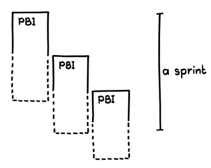
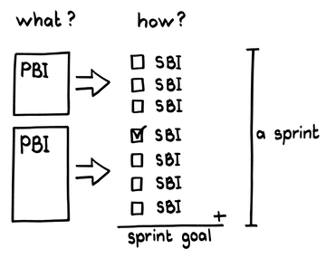

# スプリントバックログ

 Original:[Sprint Backlog](https://sites.google.com/a/scrumplop.org/published-patterns/value-stream/sprint-backlog)

別名：スプリントの計画

確信度：★★

{:style="text-align:center;"}

… ​[スクラムチーム](ch02_07_7_Scrum_Team.md)には明確に定義された[Product Backlog](https://sites.google.com/a/scrumplop.org/published-patterns/value-stream/product-backlog)があり、今回の[Sprint](https://sites.google.com/a/scrumplop.org/published-patterns/value-stream/sprint)を定義するために​[スプリントプランニング](ch02_25_24_Sprint_Planning.md)を開催しているところです。[開発チーム](ch02_14_14_Development_Team.md)は、提供すると想定している[プロダクトバックログアイテム](ch03_21_55_Product_Backlog_Item.md)（PBI）の予測を、[プロダクトオーナー](ch02_11_11_Product_Owner.md)に伝えていますが、チームメンバーはそれらをどのように開発する計画かを明確にする必要があります。

{:style="text-align:center;"}
＊　　＊　　＊

**[Sprint](https://sites.google.com/a/scrumplop.org/published-patterns/value-stream/sprint)中の進捗を管理するためには、[開発チーム](ch02_14_14_Development_Team.md)は[スプリントゴール](ch03_38_71_Sprint_Goal.md)​を達成するために残っている作業を明確に理解する必要があります。**

チームがあるPBIを[Sprint](https://sites.google.com/a/scrumplop.org/published-patterns/value-stream/sprint)で完了できるかどうかを理解するために、PBIの詳細を理解する必要があります。PBIを​[Small Items](https://sites.google.com/a/scrumplop.org/published-patterns/value-stream/small-items)​に分解することで、チームはPBIを「完成」（[Definition of Done](https://sites.google.com/a/scrumplop.org/published-patterns/value-stream/definition-of-done)​を参照）させるために必要な作業をより深く理解できるようになります。これはスクラムそのものに流れる設計作業です。この設計作業を省略することはできません。しかし、[Sprint](https://sites.google.com/a/scrumplop.org/published-patterns/value-stream/sprint)の開始時点では、チームは必要な作業についての理解は不完全であり、より多くの洞察が得られるにつれ、作業は増える傾向があります。

{:style="text-align:center;"}
 
PBI: PBI A sprint: 1スプリント

[開発チーム](ch02_14_14_Development_Team.md)が[スプリントゴール](ch03_38_71_Sprint_Goal.md)を達成するために自己組織化するには、なんらかの基盤が必要になります。残っている作業について、[デイリースクラム](ch02_30_29_Daily_Scrum.md)で頻繁で正確なフィードバックを行うことは、[開発チーム](ch02_14_14_Development_Team.md)が開発のダイナミクスを管理するために不可欠です。

[開発チーム](ch02_14_14_Development_Team.md)には、[スプリントゴール](ch03_38_71_Sprint_Goal.md)に対する進捗を測定するための出発点が必要です。もちろん、[プロダクトオーナー](ch02_11_11_Product_Owner.md)や[スクラムマスター](ch02_20_19_ScrumMaster.md)も関心を持っています。しかし、実際に[定期的なプロダクトインクリメント](ch03_52_85_Regular_Product_Increment.md)​を作るのは[開発チーム](ch02_14_14_Development_Team.md)です。

それゆえ：

**[スプリントゴール](ch03_38_71_Sprint_Goal.md)を満たすために、チームが成し遂げなければならない全てのことについて、作業計画を作成します。チームは通常この作業を[スプリントバックログアイテム](ch03_40_73_Sprint_Backlog_Item.md)​（SBI）に細分化します。**これらの項目は、チームが完了させる必要があるタスク、成果物に組み合わされる中間的な構成要素、または[Sprint](https://sites.google.com/a/scrumplop.org/published-patterns/value-stream/sprint)の中で[スプリントゴール](ch03_38_71_Sprint_Goal.md)を達成する方法をチームが理解するのに役立つその他の作業単位を表すことがあります。

{:style="text-align:center;"}
 
What ?: 何を？ PBI: PBI How ?: どのように？ SBI: SBI Sprint goal: スプリントゴール A sprint: 1スプリント

{:style="text-align:center;"}
＊　　＊　　＊

[開発チーム](ch02_14_14_Development_Team.md)は[スプリントバックログ](ch03_39_72_Sprint_Backlog.md)を作成し、所有します。そして、メンバーだけが共同で変更できます（Agile Project Management with Scrum [Sch01], p. 50、[Developer-Ordered Work Plan](https://sites.google.com/a/scrumplop.org/published-patterns/value-stream/sprint-backlog/developer-ordered-work-plan)を参照）。[スプリントバックログ](ch03_39_72_Sprint_Backlog.md)作成の本質は、PBIの詳細設計であり、それによって[開発チーム](ch02_14_14_Development_Team.md)の誰もが、[スプリントゴール](ch03_38_71_Sprint_Goal.md)をどのように達成するのか説明できるようになります（Software in 30 Days: How Agile Managers Beat the Odds, Delight Their Customers, and Leave Competitors in the Dust [SS12]）。[スプリントバックログ](ch03_39_72_Sprint_Backlog.md)は、開発の「どのように」を表現するためのメカニズムを提供し、[開発チーム](ch02_14_14_Development_Team.md)が設計上の判断を覚えておくのに役立ちます。しかし、[Sprint](https://sites.google.com/a/scrumplop.org/published-patterns/value-stream/sprint)はその定義によりタイムボックス化されています。そのため、[開発チーム](ch02_14_14_Development_Team.md)が[スプリントバックログ](ch03_39_72_Sprint_Backlog.md)を作成する際には、ベロシティを考慮して（[Notes on Velocity](https://sites.google.com/a/scrumplop.org/published-patterns/value-stream/notes-on-velocity)を参照）、[スプリントゴール](ch03_38_71_Sprint_Goal.md)のために、[Sprint](https://sites.google.com/a/scrumplop.org/published-patterns/value-stream/sprint)内で終えられると思える[スプリントバックログ](ch03_39_72_Sprint_Backlog.md)を作る必要があります。ベロシティに関するパターンである[Yesterday’s Weather](https://sites.google.com/a/scrumplop.org/published-patterns/value-stream/estimation-points/yesterday-s-weather)や​[Updated Velocity](https://sites.google.com/a/scrumplop.org/published-patterns/value-stream/estimation-points/updated-velocity?pageMoved=Estimation%20Points)を利用することで、[スプリントバックログ](ch03_39_72_Sprint_Backlog.md)にどれくらい入れられるかをチームが判断する役に立ちます。

正確な[スプリントバックログ](ch03_39_72_Sprint_Backlog.md)は、[開発チーム](ch02_14_14_Development_Team.md)が行うべきすべての詳細な作業を覚えておくのに役立ちます。[開発チーム](ch02_14_14_Development_Team.md)は[スプリントバックログ](ch03_39_72_Sprint_Backlog.md)の順序を決定し、また[スプリントゴール](ch03_38_71_Sprint_Goal.md)を満たす機会が最適化されるように、順序付けを維持するべきです。[スプリントバックログ](ch03_39_72_Sprint_Backlog.md)の内容は[Sprint](https://sites.google.com/a/scrumplop.org/published-patterns/value-stream/sprint)の間に変化する可能性があります。[開発チーム](ch02_14_14_Development_Team.md)が作業の難しさを学ぶにつれ、SBIが追加されたり変更されるかもしれません。チームはSBIを削除したり、さらには分割または結合することもあります。[スプリントバックログ](ch03_39_72_Sprint_Backlog.md)には動的な性質があるため、[デイリースクラム](ch02_30_29_Daily_Scrum.md)の主な活動として、インクリメンタルに再計画を行う必要があります。

[スプリントバックログ](ch03_39_72_Sprint_Backlog.md)は、進捗を把握（[スプリントバーンダウンチャート](ch03_06_43_Sprint_Burndown_Chart.md)）し、状況を見える化（[Visible Status](https://sites.google.com/a/scrumplop.org/published-patterns/value-stream/visible-status)​）するための基盤を提供します。[スプリントバックログ](ch03_39_72_Sprint_Backlog.md)は、[デイリースクラム](ch02_30_29_Daily_Scrum.md)で、[開発チーム](ch02_14_14_Development_Team.md)のメンバーが次に何をするかを決めるのに役立ちます。[スプリントバックログ](ch03_39_72_Sprint_Backlog.md)の順序付けに正式なものはありませんが、他のSBIの完了に依存するSBIがある、という意味で順序はあります。[開発チーム](ch02_14_14_Development_Team.md)がPBIに群がる（[スウォーミング：一個流し](ch02_26_25_Swarming_One_Piece_Continuous_Flow.md)​を参照）ことも順序づけに影響しますが、それをどう管理するかは[開発チーム](ch02_14_14_Development_Team.md)次第です。どう管理するにしても、[開発チーム](ch02_14_14_Development_Team.md)は作業を順序付け、状況を正確に把握するために、SBI間の依存関係を理解する必要があります。[Dependencies First](https://sites.google.com/a/scrumplop.org/published-patterns/value-stream/sprint-backlog/dependencies-first)​を参照してください。

[開発チーム](ch02_14_14_Development_Team.md)は、透明性を高めるために、​[Scrum Board](https://sites.google.com/a/scrumplop.org/published-patterns/value-stream/information-radiator/scrum-board)​のような[Information Radiator](https://sites.google.com/a/scrumplop.org/published-patterns/value-stream/information-radiator)​を使い、すべてのステークホルダーに対して[スプリントバックログ](ch03_39_72_Sprint_Backlog.md)を透明にする必要があります。この透明性を利用して、[開発チーム](ch02_14_14_Development_Team.md)外の人がチームをマイクロマネジメントしてしまうことがないように注意しなければなりません。[スクラムマスター](ch02_20_19_ScrumMaster.md)は[Information Radiator](https://sites.google.com/a/scrumplop.org/published-patterns/value-stream/information-radiator)が濫用されないように、注意しなければなりません。[スプリントバーンダウンチャート](ch03_06_43_Sprint_Burndown_Chart.md)や[Scrum Board](https://sites.google.com/a/scrumplop.org/published-patterns/value-stream/information-radiator/scrum-board)は、[スプリントバックログ](ch03_39_72_Sprint_Backlog.md)の進捗をより視覚的な[Information Radiator](https://sites.google.com/a/scrumplop.org/published-patterns/value-stream/information-radiator)に要約します。

