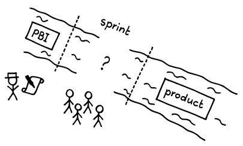
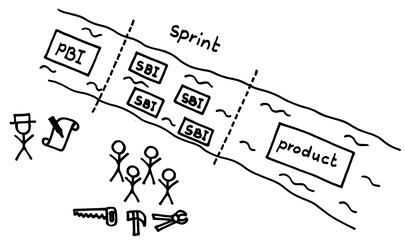

# スプリントバックログアイテム

 Original:[Sprint Backlog Item](https://sites.google.com/a/scrumplop.org/published-patterns/value-stream/sprint-backlog/sprint-backlog-item)

確信度：★

{:style="text-align:center;"}

…​[スクラムチーム](ch02_07_7_Scrum_Team.md)は、​[Product Backlog Item](https://sites.google.com/a/scrumplop.org/published-patterns/value-stream/product-backlog/product-backlog-item)​の順序づけができている。チームは[スプリントプランニング](ch02_25_24_Sprint_Planning.md)をおこなっており、今回の​[Sprint](https://sites.google.com/a/scrumplop.org/published-patterns/value-stream/sprint)の[Production Episode](https://sites.google.com/a/scrumplop.org/published-patterns/value-stream/production-episode)で行う作業について、計画づくりを始める準備ができている。

{:style="text-align:center;"}
＊　　＊　　＊

プロダクトバックログアイテム（PBI）は、ソリューションや実装に至る方法や、ソリューションの提供方法を定義しません。

{:style="text-align:center;"}
 
[Sprint](https://sites.google.com/a/scrumplop.org/published-patterns/value-stream/sprint): スプリント Product: プロダクト

Scrumはチームがリスクを管理するのを助けます。PBIは[スクラムチーム](ch02_07_7_Scrum_Team.md)が外部に向けたリスクを評価するために十分な情報を提供します。しかし、複雑な開発に起因するリスクについての洞察は提供しません。開発作業は本質的に創発的です。PBIはビジネス（エンドユーザーと市場）の観点で成果物を記述しますが、[開発チーム](ch02_14_14_Development_Team.md)はものづくりの観点で作業や見積もりを行います。

リスク管理における2つの重要な要素は、実現可能性と時間です。リスクを理解し、軽減するには、PBIを十分に詳細に理解する必要があり、それによってPBIが技術的に実現可能であると確信して、[Production Episode](https://sites.google.com/a/scrumplop.org/published-patterns/value-stream/production-episode)内でDoneの状態（[Definition of Done](https://sites.google.com/a/scrumplop.org/published-patterns/value-stream/definition-of-done)を参照）に到達できます。それでも、事前に100パーセントの確信を持つことはできません。[スプリントプランニング](ch02_25_24_Sprint_Planning.md)の間に多くのリスクを軽減できるとしても、[Production Episode](https://sites.google.com/a/scrumplop.org/published-patterns/value-stream/production-episode)の間に生じる創発的な要求を受け入れる必要があります。これらを枠外や二級の扱いにはしたくはありません。しかし、これら自体はPBIではありません。

機能を実装まで持っていくことで、リスクを軽減することもできます。実際、優れた[プロダクトオーナー](ch02_11_11_Product_Owner.md)は、その機能の動作するプロトタイプを作ってチームをサポートするかもしれません。しかし、エンジニアリング、開発、デプロイのコストを無視して商業的な基準だけを考慮してPBIを[Production Episode](https://sites.google.com/a/scrumplop.org/published-patterns/value-stream/production-episode)に持ち込むのはリスクがあります。そのトップのPBIが[Production Episode](https://sites.google.com/a/scrumplop.org/published-patterns/value-stream/production-episode)全体を占めてしまうと、[Sprint](https://sites.google.com/a/scrumplop.org/published-patterns/value-stream/sprint)中に他には何も「完成」にならなくなってしまいます。

与えられたPBIの作業に着手し、[Sprint](https://sites.google.com/a/scrumplop.org/published-patterns/value-stream/sprint)の成果物の提供にリスクがあることが分かった時点でそれを棚上げすることもできます。しかし、そうすると仕掛り中の作業が際限なく大きくなる可能性があります。

粗い粒度の見積もりは不正確で、信頼性が低く、予測しがたいものです。見積もるには[Small Items](https://sites.google.com/a/scrumplop.org/published-patterns/value-stream/small-items)が必要です。

PBIを異なる視点で見ることで、より効果的な開発ができます。PBIには、チームワークと並行開発に基づく補完的なタスクの集まりが含まれています。チームは自己組織化してそれに取り組み始めることはできますが、何らかの方針が必要です。チームメンバー全員が、このPBIを完了させるために必要な5つのうち1つだけに着手してしまうことを防ぐには、どうしたらよいでしょうか？チームが1つのPBIでスウォーミングする（[スウォーミング：一個流し](ch02_26_25_Swarming_One_Piece_Continuous_Flow.md)を参照）のであれば、まずそのPBIについて話し合っておく方が良いでしょう。

それゆえ：

**[Product Backlog Item](https://sites.google.com/a/scrumplop.org/published-patterns/value-stream/product-backlog/product-backlog-item)を作業項目に分解し、それらを[Sprint Backlog](https://sites.google.com/a/scrumplop.org/published-patterns/value-stream/sprint-backlog)と呼ばれる計画にまとめます。各作業項目は[スプリントバックログアイテム](ch03_40_73_Sprint_Backlog_Item.md)（SBI）です。** 通常、どの[スプリントバックログアイテム](ch03_40_73_Sprint_Backlog_Item.md)も、単一の[開発チーム](ch02_14_14_Development_Team.md)メンバーが1日の作業で完了できる量より大きくならないようにします。

{:style="text-align:center;"}
 
[Sprint](https://sites.google.com/a/scrumplop.org/published-patterns/value-stream/sprint): スプリント Product: プロダクト PBI: PBI SBI: SBI

{:style="text-align:center;"}
＊　　＊　　＊

[開発チーム](ch02_14_14_Development_Team.md)は通常、作業項目をタスクとして表現します。代わりに内部的な作成物や、他の分解の結果として表現することもできますが、それらの作業項目で[Sprint Goal](https://sites.google.com/a/scrumplop.org/published-patterns/value-stream/sprint-goal)を達成できるという確信を[開発チーム](ch02_14_14_Development_Team.md)が持つ必要があります。チームは[Sprint](https://sites.google.com/a/scrumplop.org/published-patterns/value-stream/sprint)の間に完了しなければならないすべての作業項目を取り上げ、それらを[Sprint Backlog](https://sites.google.com/a/scrumplop.org/published-patterns/value-stream/sprint-backlog)と呼ばれる計画にまとめます。[Sprint Backlog](https://sites.google.com/a/scrumplop.org/published-patterns/value-stream/sprint-backlog)は、プロダクトインクリメントの開発に対する[開発チーム](ch02_14_14_Development_Team.md)の見通しとなります。

（[スプリントプランニング](ch02_25_24_Sprint_Planning.md)や[Sprint](https://sites.google.com/a/scrumplop.org/published-patterns/value-stream/sprint)中に行われる）設計のプロセスにより、作業に対する洞察が得られます。この設計プロセスは、未知の追加作業によって発生するコストや、[Sprint](https://sites.google.com/a/scrumplop.org/published-patterns/value-stream/sprint)の後半になって隠れた大きな作業の塊を発見し、納期が遅れるといったリスクを軽減します。設計はPBIを明確にし、未知の作業を明らかにします。

チームは[Production Episode](https://sites.google.com/a/scrumplop.org/published-patterns/value-stream/production-episode)の間、SBIを進捗測定の単位として使用できます。[Sprint Burndown Chart](https://sites.google.com/a/scrumplop.org/published-patterns/value-stream/information-radiator/sprint-burndown-chart)は[Sprint Backlog](https://sites.google.com/a/scrumplop.org/published-patterns/value-stream/sprint-backlog)上の作業項目の粒度で進捗を反映します。このような粒度が、素早いフィードバックを可能にします。また、見積もりのための[Small Items](https://sites.google.com/a/scrumplop.org/published-patterns/value-stream/small-items)を作成することで、忠実な見積もりになります。

SBIの集まりは動的であり、プロダクトについてより多くのことを学ぶにつれて変化します。SBIは[Production Episode](https://sites.google.com/a/scrumplop.org/published-patterns/value-stream/production-episode)の過程で発見された作業（例：より多くの設計と開発が必要）として現れたり、あるいは消滅することもあります。そのため、[デイリースクラム](ch02_30_29_Daily_Scrum.md)でそれらについて議論し、[Sprint](https://sites.google.com/a/scrumplop.org/published-patterns/value-stream/sprint)を再計画してください。チームは新しいSBIが現れたら見積もりを行い、それぞれに[Estimation Points](https://sites.google.com/a/scrumplop.org/published-patterns/value-stream/estimation-points)を割り当てるべきです。また、それに応じて[Sprint Burndown Chart](https://sites.google.com/a/scrumplop.org/published-patterns/value-stream/information-radiator/sprint-burndown-chart)も更新すべきです。

[開発チーム](ch02_14_14_Development_Team.md)は共同で、[Sprint Backlog](https://sites.google.com/a/scrumplop.org/published-patterns/value-stream/sprint-backlog)上のすべてのSBIに対して責任を持ち続けます。

よくあるやり方は、SBIを付箋に書いて[Scrum Board](https://sites.google.com/a/scrumplop.org/published-patterns/value-stream/information-radiator/scrum-board)に貼り、作業完了の進捗を可視化することです。文章は最小限に抑えてください：SBIの文章は、これまでの作業計画の議論の結果を[開発チーム](ch02_14_14_Development_Team.md)に思い出させるのに十分な程度にするべきです。また、付箋に[Estimation Points](https://sites.google.com/a/scrumplop.org/published-patterns/value-stream/estimation-points)も書くことも、よく行われます。これにより、チームが作業項目をDoneに移動したときに[Sprint Burndown Chart](https://sites.google.com/a/scrumplop.org/published-patterns/value-stream/information-radiator/sprint-burndown-chart)を簡単に更新できます。チームは[Sprint Backlog](https://sites.google.com/a/scrumplop.org/published-patterns/value-stream/sprint-backlog)のステータスを適切に可視化するために、あらゆる創造的な方法（例：色、回転、マークの追加など）で付箋を使用します。この使用法に関して規範的なガイダンスは必要ありません：何が最も効果的かを見つけることは、[開発チーム](ch02_14_14_Development_Team.md)に任されています。

