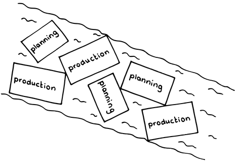
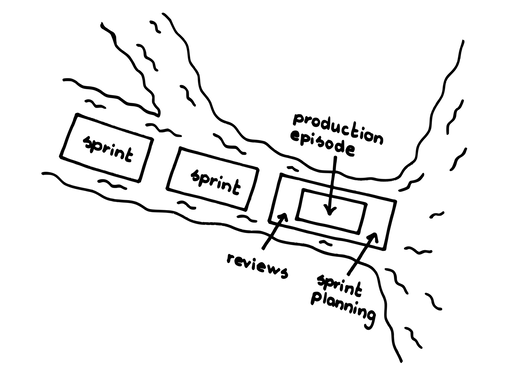

# プロダクションエピソード

 Original:[Production Episode](https://sites.google.com/a/scrumplop.org/published-patterns/value-stream/production-episode)

確信度：★★

{:style="text-align:center;"}

...チームは[スプリントプランニング](ch02_25_24_Sprint_Planning.md)を完了し、作業の計画を明確にした[スプリントバックログ](ch03_39_72_Sprint_Backlog.md)を手にしています。あなたは[定期的なプロダクトインクリメント](ch03_52_85_Regular_Product_Increment.md)を提供するために努力しており、[スプリントゴール](ch03_38_71_Sprint_Goal.md)を目指しています。

{:style="text-align:center;"}
＊　　＊　　＊

**チームメンバーが最善を尽くし、計画された仕事を最も効率的に完了できるのは、気が散ることなく一緒に仕事ができる時です。**

開発に活かすという意味では、目の前の仕事をジャストインタイムで理解するのは大切なことです。一方で、絶え間ない中断は確実に混乱をもたらし、コストがかかります。フロー状態になっているのがよいのですが、要件について役立つ更新をしようという善意からの中断であっても、[開発チーム](ch02_14_14_Development_Team.md)​がフローを回復するまでに時間がかかるかもしれません。流れを乱して要件を修正することで市場価値は高まるかもしれませんが、開発コストへの影響を相殺できるかどうかは定かではありません。いずれにせよ、入力を明確化して、[開発チーム](ch02_14_14_Development_Team.md)を「助ける」ためであっても、繰り返し中断することは、チームをフローから遠ざけ、それぞれの​[Sprint](https://sites.google.com/a/scrumplop.org/published-patterns/value-stream/sprint)​の成果の価値を実質的には低下させることになります。

チームがやるべき仕事のリストと完了させるまでの期限の両方を受け取ると、モチベーション、品質、効率のすべてが低下し、うまくいくことはほとんどありません（Journal of Personality and Social Psychology 34[ADL76] ）。ただ、切迫感なく、またどれくらいの時間を使えるか知らずに仕事をすると、未達につながることにもなります[66]。

アジャイルは変化に対応すべきと言いますが、外部の小さな変化にいちいち反応するようなシステムは、制御不能なシステムになってしまう可能性があります。柔軟性はビジネス目標かもしれませんが、効果的な仕事を可能にするのは一貫性と安定性です。

{:style="text-align:center;"}
 
Planning: 計画 Production: 生産

納期が近い将来にないと、人々は集中力が低下し、重要な活動を先延ばしにする傾向があります。(高校生の頃、テスト対策で試験の前日から猛勉強したことを思い出してください)。これは開発においては、初期の頃は簡単なことや楽しいことに集中し、最も価値のある[プロダクトバックログアイテム](ch03_21_55_Product_Backlog_Item.md)​ (PBI)に取り組まない、ということを意味します。 パーキンソンの法則は、「仕事は、その完了に利用できる時間を埋めるように拡大する」ことになる様を捉えています[67]。

それゆえ：

**市場に向けて実現するプロダクトのすべての作業をタイムボックスに区切った間隔で行い、[開発チーム](ch02_14_14_Development_Team.md)のみが参加するようにしましょう。**この中断のない開発期間は、[スプリントプランニング](ch02_25_24_Sprint_Planning.md)と​[スプリントレビュー](ch02_36_35_Sprint_Review.md)の間に収まります。この期間中、開発者は​[リファインメントされたプロダクトバックログ](ch03_30_64_Refined_Product_Backlog.md)に取り組むにために、予め定めた短時間の話し合いを[プロダクトオーナー](ch02_11_11_Product_Owner.md)と持ちますが、全体としてそれ以外は中断されることのない時間となります。

{:style="text-align:center;"}
 
Sprint: スプリント Reviews: レビュー Sprint Planning: スプリントプランニング Production episode: 生産エピソード

[プロダクションエピソード](ch03_42_75_Production_Episode.md)中、チームは[スプリントゴール](ch03_38_71_Sprint_Goal.md)に集中し、[スプリントバックログ](ch03_39_72_Sprint_Backlog.md)のすべての作業を完了するという「予測」の達成に向けて全力を尽くします。[プロダクトオーナー](ch02_11_11_Product_Owner.md)と[開発チーム](ch02_14_14_Development_Team.md)との間には、「[プロダクトオーナー](ch02_11_11_Product_Owner.md)は[プロダクションエピソード](ch03_42_75_Production_Episode.md)の間はPBIに追加や変更をしない」という合意があります。これにより、[開発チーム](ch02_14_14_Development_Team.md)は集中しコミットし続けることができ、最も重要なことである[スプリントゴール](ch03_38_71_Sprint_Goal.md)に取り組むための十分な安定性を確保することができます。[プロダクトオーナー](ch02_11_11_Product_Owner.md)は​[Product Backlog](https://sites.google.com/a/scrumplop.org/published-patterns/value-stream/product-backlog)​の順序を変えることでプロダクトの長期的な方向性を変更することができます。その場合でも、続く[Sprint](https://sites.google.com/a/scrumplop.org/published-patterns/value-stream/sprint)冒頭のイベント[スプリントプランニング](ch02_25_24_Sprint_Planning.md)で[開発チーム](ch02_14_14_Development_Team.md)が[Product Backlog](https://sites.google.com/a/scrumplop.org/published-patterns/value-stream/product-backlog)の内容を扱うまで、[Product Backlog](https://sites.google.com/a/scrumplop.org/published-patterns/value-stream/product-backlog)への変更が[開発チーム](ch02_14_14_Development_Team.md)の作業の計画には影響することはありません。こうすることで[プロダクトオーナー](ch02_11_11_Product_Owner.md)に対して、何に取り組むのが最も価値が高いかを慎重に考えるよう動機づけることができます。そうすれば、より価値の低いPBIに時間とお金を浪費しないようになります。

最高に鍛錬された​[スクラムチーム](ch02_07_7_Scrum_Team.md)​以外では、[プロダクションエピソード](ch03_42_75_Production_Episode.md)の最中はデリバリーする範囲の変更を禁止すべきです（ただし、早く終えた際に[Product Backlog](https://sites.google.com/a/scrumplop.org/published-patterns/value-stream/product-backlog)の先頭から項目を取り出して継続することを除いて）。より高度なチームでは、[プロダクトオーナー](ch02_11_11_Product_Owner.md)と[開発チーム](ch02_14_14_Development_Team.md)の間でお互いに前向きでフェアと感じられる方法で交渉する、効率的な方法をみつけることができるでしょう。マネジメントや[プロダクトオーナー](ch02_11_11_Product_Owner.md)による頻繁なスコープの変更や中断は、チームのモチベーションを失わせる原因となり、ビジネスが[ビジョン](ch03_02_39_Vision.md)に忠実でないことの兆候かもしれません。

[スプリントプランニング](ch02_25_24_Sprint_Planning.md)では、[開発チーム](ch02_14_14_Development_Team.md)のメンバーはこの[Sprint](https://sites.google.com/a/scrumplop.org/published-patterns/value-stream/sprint)で完了できると感じられる作業の量を（「コミット」ではなく）予測し、その量の作業を作業の計画（[スプリントバックログ](ch03_39_72_Sprint_Backlog.md)）に取り込みます。つまり、この間隔は、完了について外部から押し付けられる制約ではなく、「プロジェクトからの贈り物」となります。[プロダクションエピソード](ch03_42_75_Production_Episode.md)中には予期せぬ要件や不具合といった新たな作業が発生することがあり、[開発チーム](ch02_14_14_Development_Team.md)はそれに応じて[スプリントバックログ](ch03_39_72_Sprint_Backlog.md)を更新することがあります。こうした後発的な作業は[Sprint](https://sites.google.com/a/scrumplop.org/published-patterns/value-stream/sprint)によらず概ね同じ量になる傾向があり、[Sprint](https://sites.google.com/a/scrumplop.org/published-patterns/value-stream/sprint)のなかで[開発チーム](ch02_14_14_Development_Team.md)によって考慮されるものの、それを事前に見積もったり説明しようとはしません。こうした労力は、[Estimation Points](https://sites.google.com/a/scrumplop.org/published-patterns/value-stream/estimation-points)​や[Notes on Velocity](https://sites.google.com/a/scrumplop.org/published-patterns/value-stream/notes-on-velocity)で説明しているような一般的な見積り方法を使用する際に、チームの見積りに吸収されます。

[プロダクションエピソード](ch03_42_75_Production_Episode.md)の長さは、[Sprint](https://sites.google.com/a/scrumplop.org/published-patterns/value-stream/sprint)の長さから[スプリントプランニング](ch02_25_24_Sprint_Planning.md)や[スプリントレビュー](ch02_36_35_Sprint_Review.md)、そして[スプリントレトロスペクティブ](ch02_37_36_Sprint_Retrospective.md)に割り当てた時間を引いたものになります。[Sprint](https://sites.google.com/a/scrumplop.org/published-patterns/value-stream/sprint)の長さは4週間が上限で、典型的には2週間です。

[プロダクションエピソード](ch03_42_75_Production_Episode.md)の間、[開発チーム](ch02_14_14_Development_Team.md)は進捗を評価し、​[デイリースクラム](ch02_30_29_Daily_Scrum.md)で[Sprint](https://sites.google.com/a/scrumplop.org/published-patterns/value-stream/sprint)を再計画します。毎日、[開発チーム](ch02_14_14_Development_Team.md)は[スプリントバックログ](ch03_39_72_Sprint_Backlog.md)を[スプリントゴール](ch03_38_71_Sprint_Goal.md)を達成するために最適化された改訂版の​[Developer-Ordered Work Plan](https://sites.google.com/a/scrumplop.org/published-patterns/value-stream/sprint-backlog/developer-ordered-work-plan)に更新します。チームは​[Good Housekeeping](https://sites.google.com/a/scrumplop.org/published-patterns/value-stream/good-housekeeping)の規律も維持します。

{:style="text-align:center;"}
＊　　＊　　＊

成功した[プロダクションエピソード](ch03_42_75_Production_Episode.md)の終わりには、チームは[スプリントゴール](ch03_38_71_Sprint_Goal.md)に到達し、[スプリントレビュー](ch02_36_35_Sprint_Review.md)の準備ができた新しい[定期的なプロダクトインクリメント](ch03_52_85_Regular_Product_Increment.md)を実現できています。[プロダクションエピソード](ch03_42_75_Production_Episode.md)が終わっても、いくつかの[スプリントバックログアイテム](ch03_40_73_Sprint_Backlog_Item.md)​は[スプリントバックログ](ch03_39_72_Sprint_Backlog.md)に残っているかもしれません。しかし、[開発チーム](ch02_14_14_Development_Team.md)は[スプリントゴール](ch03_38_71_Sprint_Goal.md)を達成するのに十分なバックログを完了させています。もし、[開発チーム](ch02_14_14_Development_Team.md)が早くに終えたのであれば、追加の作業を[Product Backlog](https://sites.google.com/a/scrumplop.org/published-patterns/value-stream/product-backlog)の先頭から取り込み、作業をブレークダウンして作業計画に落とし込み、[Sprint](https://sites.google.com/a/scrumplop.org/published-patterns/value-stream/sprint)を継続します。[スプリントバックログ](ch03_39_72_Sprint_Backlog.md)の全体をデリバリーできない[Sprint](https://sites.google.com/a/scrumplop.org/published-patterns/value-stream/sprint)になる恐れが出た際は、チームは[スプリントゴール](ch03_38_71_Sprint_Goal.md)を活用すべきです。チームは毎日[デイリースクラム](ch02_30_29_Daily_Scrum.md)でこのリスクを評価し、それに応じて対応をとります。

[Sprint](https://sites.google.com/a/scrumplop.org/published-patterns/value-stream/sprint)中に「完成」の状態になったPBIは（[Definition of Done](https://sites.google.com/a/scrumplop.org/published-patterns/value-stream/definition-of-done)​を参照）、その[Sprint](https://sites.google.com/a/scrumplop.org/published-patterns/value-stream/sprint)もしくはその後の[Sprint](https://sites.google.com/a/scrumplop.org/published-patterns/value-stream/sprint)のデリバリー候補になります。Scrumでは、「完成」したかどうかの判断と、デプロイするかどうかの判断は分けて行います。あるPBIをいつ市場にリリースするかの判断は、[プロダクトオーナー](ch02_11_11_Product_Owner.md)が行います。[スクラムチーム](ch02_07_7_Scrum_Team.md)は、最も重要なデリバリーの候補となる[定期的なプロダクトインクリメント](ch03_52_85_Regular_Product_Increment.md)を[Sprint](https://sites.google.com/a/scrumplop.org/published-patterns/value-stream/sprint)の終わりに作成することがほとんどですが、より頻繁にデリバリーする（例えば、緊急修正など）ことも可能です。[Responsive Deployment](https://sites.google.com/a/scrumplop.org/published-patterns/value-stream/responsive-deployment)を参照して下さい。PBIを十分に小さくすると、そのうちのいくつかを[Sprint](https://sites.google.com/a/scrumplop.org/published-patterns/value-stream/sprint)ごとに提供できる可能性が高まります。

[Sprint](https://sites.google.com/a/scrumplop.org/published-patterns/value-stream/sprint)の失敗とは、[スクラムチーム](ch02_07_7_Scrum_Team.md)が[スプリントゴール](ch03_38_71_Sprint_Goal.md)を達成しないことを指します。失敗という言葉を使うことを避け、代わりに「[スプリントゴール](ch03_38_71_Sprint_Goal.md)を達成しなかった[Sprint](https://sites.google.com/a/scrumplop.org/published-patterns/value-stream/sprint)」と言う人もいます。まずあり得ないことですが、チームが[スプリントバックログ](ch03_39_72_Sprint_Backlog.md)をすべて消化した可能性はあります。The Scrum Guide[68]や他の広範なプラクティスも、成功した[Sprint](https://sites.google.com/a/scrumplop.org/published-patterns/value-stream/sprint)と失敗した[Sprint](https://sites.google.com/a/scrumplop.org/published-patterns/value-stream/sprint)のそれぞれに続く行動を区別していませんが、チームが[スプリントレトロスペクティブ](ch02_37_36_Sprint_Retrospective.md)で[Sprint](https://sites.google.com/a/scrumplop.org/published-patterns/value-stream/sprint)を議論する際、その区別がプロセス改善の重要性を強調するのに役立ちます。

チームのベロシティ（​[Notes on Velocity](https://sites.google.com/a/scrumplop.org/published-patterns/value-stream/notes-on-velocity)を参照）とは、１つの[Sprint](https://sites.google.com/a/scrumplop.org/published-patterns/value-stream/sprint)でチームが完了できる作業の量のことです。これは、[Sprint](https://sites.google.com/a/scrumplop.org/published-patterns/value-stream/sprint)内で作業を完了することについて、チームが実際に示した能力を指しており、通常は[Sprint](https://sites.google.com/a/scrumplop.org/published-patterns/value-stream/sprint)あたりの相対的な（場合によっては絶対的な）作業の量を示すものです。チームは、直近過去の平均的な実績に基づいてベロシティを設定します。​[Yesterday’s Weather](https://sites.google.com/a/scrumplop.org/published-patterns/value-stream/estimation-points/yesterday-s-weather)を考慮すると、チームの成果物は[スプリントバックログ](ch03_39_72_Sprint_Backlog.md)を作成するときに設定した期待に沿ったものになるはずです。ベロシティは確率的な値であるため、約半分の[Sprint](https://sites.google.com/a/scrumplop.org/published-patterns/value-stream/sprint)ではすべての[スプリントバックログアイテム](ch03_40_73_Sprint_Backlog_Item.md)を早期に（[Sprint](https://sites.google.com/a/scrumplop.org/published-patterns/value-stream/sprint)が終わる前に）完了し、半分は目標を達成できないということになります。。良いチームは[Yesterday’s Weather](https://sites.google.com/a/scrumplop.org/published-patterns/value-stream/estimation-points/yesterday-s-weather)を利用して、[Sprint](https://sites.google.com/a/scrumplop.org/published-patterns/value-stream/sprint)に多くを取り込みすぎてすべてをデリバリーできなくなるリスクを回避することを学びます。[Teams That Finish Early Accelerate Faster](https://sites.google.com/a/scrumplop.org/published-patterns/retrospective-pattern-language/teams-that-finish-early-accelerate-faster)で紹介したような優れた規律が、チームのデリバリー実績を向上させます。

例外として、特に[スプリントゴール](ch03_38_71_Sprint_Goal.md)の達成が不可能になった場合に、[プロダクトオーナー](ch02_11_11_Product_Owner.md)は[Sprint](https://sites.google.com/a/scrumplop.org/published-patterns/value-stream/sprint)を切り上げることができます。[緊急時手順](ch02_33_32_Emergency_Procedure.md)​を参照してください。

このパターンの名前は、同じく仕事のフレーミングをテーマとするWard Cunninghamの”Development Episode”パターンに敬意を表したものです[69]。

