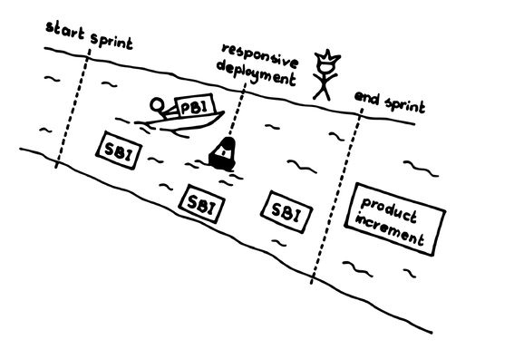

# レスポンシブデプロイメント

 Original:[Responsive Deployment](https://sites.google.com/a/scrumplop.org/published-patterns/value-stream/responsive-deployment)

{:style="text-align:center;"}

フレッド・ブルックスは「Faire de la bonne cuisine demande un certain temps」（素晴らしい料理を作るには、ある一定の時間が必要だ）と言いましたが、だからといって料理を放置して冷めさせてしまったり、さらに悪いことに腐らせてしまったりしてよいということにはなりません。準備ができたら届けるのはリーンな考え方です。しかし、忘れてはならないのは、お腹が空いてもいないのに食べ物を押し付けると、迷惑だということです。

… [Sprint](https://sites.google.com/a/scrumplop.org/published-patterns/value-stream/sprint)​はうまく流れていて、チームはベロシティを管理しデリバリーを適切に予測する規律を示しています。顧客基盤は管理可能なほど小さく、[スクラムチーム](ch02_07_7_Scrum_Team.md)​と市場、また[プロダクトオーナー](ch02_11_11_Product_Owner.md)​と​[開発チーム](ch02_14_14_Development_Team.md)​の間には親密な信頼関係があります。ビジネスの力学、持続可能なリズムの必要性、計画づくりのオーバーヘッドと作る時間のトレードオフのバランスをとる必要性を考えて、[Sprint](https://sites.google.com/a/scrumplop.org/published-patterns/value-stream/sprint)は現実的な範囲で短くなっています。1日程度の短い時間枠で市場向け製品に注意を払う必要がある、ビジネス上の予期せぬ出来事が発生する可能性があります。

{:style="text-align:center;"}
＊　　＊　　＊

**リズムよく仕事をすることは良いことですが、（ムラをなくし）流れを良くすることや、チームによる出荷待ちアイテムの在庫を減らすことも重要です。**[Sprint](https://sites.google.com/a/scrumplop.org/published-patterns/value-stream/sprint)の良いリズムは、[Sprint](https://sites.google.com/a/scrumplop.org/published-patterns/value-stream/sprint)の短期計画を成功させる鍵ですが、市場の緊急性によっては[Sprint](https://sites.google.com/a/scrumplop.org/published-patterns/value-stream/sprint)でさえ長すぎると感じることがあります。リズムそのものが、チームとしての微妙な遅れにつながる可能性もあります。例えば、テストや品質保証、その他の作業をデリバリー直前の「最終責任時点」まで先延ばしにしてしまうことがあります。これはもちろん、[スウォーミング：一個流し](ch02_26_25_Swarming_One_Piece_Continuous_Flow.md)に違反しています。 さらに、一緒にデリバリーするものはすべて一緒にテストすることが重要だと[開発チーム](ch02_14_14_Development_Team.md)が考えてしまうかもしれません（これには多少は真実味がありますが、テストできるものはできるだけ早くテストすることが、より重要です）。そうなると、チームはテスト活動を[Sprint](https://sites.google.com/a/scrumplop.org/published-patterns/value-stream/sprint)の終わりに押しやってしまうことになります。これは、各アイテムを「完成」（[Definition of Done](https://sites.google.com/a/scrumplop.org/published-patterns/value-stream/definition-of-done)を参照）させてから次のアイテムに移ることを真に行うチームとしての思考を妨げます。たくさんの​[プロダクトバックログアイテム](ch03_21_55_Product_Backlog_Item.md)​（PBI）、そして「プロダクト全体」を、不確かな状態にしてしまうのです。

一方では、[Sprint](https://sites.google.com/a/scrumplop.org/published-patterns/value-stream/sprint)の終わりに十分な大きさのプロダクトや機能のパッケージを市場に提供できるのは良いことです。結局のところ、提供されるものが大きければ[開発チーム](ch02_14_14_Development_Team.md)の印象は良くなります。開発のリズムは、企業が範囲の経済性を獲得するのに役立ちます。ある一連の機能を提供するにあたって、機能のそれぞれを別々に処理するより、一緒に処理したほうが管理の手間をまとめられるためです。また一方で、チームは同等のビジネス価値の多くをより早く個別に市場に提供することができたかもしれません。早期にデリバリーすることは、市場にタイムリーな価値をもたらし、次の[Sprint](https://sites.google.com/a/scrumplop.org/published-patterns/value-stream/sprint)で機能をチューニングしようとフィードバックに飢えるチームに対して、よりタイムリーなフィードバックをもたらします。もし本当に[Sprint](https://sites.google.com/a/scrumplop.org/published-patterns/value-stream/sprint)の終わりまで機能の提供を待つのであれば、それが市場でどのように役立っているのか評価するために別の[Sprint](https://sites.google.com/a/scrumplop.org/published-patterns/value-stream/sprint)が必要になり、次の次、3つ目の[Sprint](https://sites.google.com/a/scrumplop.org/published-patterns/value-stream/sprint)で顧客からのフィードバックに対応することになります。フローをスムーズにする（ムラをなくす）ということは、デリバリーの頻度を見直すことを意味します。さらに悪いことに、倉庫に置かれて[Sprint](https://sites.google.com/a/scrumplop.org/published-patterns/value-stream/sprint)の終わりにデプロイされることを待っているプロダクトは在庫であり、在庫は無駄につながります。

{:style="text-align:center;"}
 
start sprint: スプリント開始 end sprint: スプリント終了 SBI: SBI Product increment: プロダクトインクリメント

[Whack the Mole](https://sites.google.com/a/scrumplop.org/published-patterns/value-stream/whack-the-mole)は、バグが発生したときに対処することを求めています。もしチームが[Sprint](https://sites.google.com/a/scrumplop.org/published-patterns/value-stream/sprint)の終わりまでプロダクトをデリバリーできないのであれば、デリバリーが行われるまでの間、市場はプロダクトの不具合に苦しむことになります。バグ修正のデリバリーを無関係な機能のデリバリーに併せて遅らせることには、高い機会費用が発生するかもしれません。とはいえ、プロダクトの通常のリズムから外れてデリバリーすることには、管理コストが発生します。

それゆえ：

**選択した[プロダクトバックログアイテム](ch03_21_55_Product_Backlog_Item.md)は、「完成」し、プロダクトオーナーが[プロダクションエピソード](ch03_42_75_Production_Episode.md)の過程で承認し次第、市場にリリースするようにします。**完成の定義などスクラムの通常の品質基準は、すべてそのまま維持します。細かくデリバリーを行うことで生じるコストやオーバーヘッドがメリットを上回らないようにします。管理手順（例えば納品に対する請求、ロードマップの更新など）の多くは、できるだけ[Sprint](https://sites.google.com/a/scrumplop.org/published-patterns/value-stream/sprint)のリズムを維持します。

{:style="text-align:center;"}

{:style="text-align:center;"}
start sprint: スプリント開始 responsive deployment: レスポンシブデプロイメント end sprint: スプリント終了 PBI: PBI SBI: SBI product increment: プロダクトインクリメント

[スクラムチーム](ch02_07_7_Scrum_Team.md)は、部分的なプロダクトインクリメントが[Definition of Done](https://sites.google.com/a/scrumplop.org/published-patterns/value-stream/definition-of-done)を満たし次第、それを消費者に提供することができます。これにより、提供済みのプロダクトに不具合が残っている時間をへらすことができます。このテクニックは、[Follow the Moon](https://sites.google.com/a/scrumplop.org/published-patterns/value-stream/sprint/follow-the-moon)の自然な周期に沿う通常のスクラムのリズムを補完するもので、`4.1.4. 名前付きの安定した基盤`のようなパターンを通じて、チームはスクラムの重要なサイクルのリズムに引き続き則っていく必要があります。スクラムでは通常、[レスポンシブデプロイメント](ch03_51_84_Responsive_Deployment.md)を緊急かつ例外的なケースのために残しておきます。より高度な状況として、市場が[スクラムチーム](ch02_07_7_Scrum_Team.md)と緊密な関係性をもっている場合、チームはこのアプローチをより広範囲に用いて通常のスクラムのリズムに従うのではなく、リリース管理の労力を[スプリントレビュー](ch02_36_35_Sprint_Review.md)​にまとめる代わりに、[Sprint](https://sites.google.com/a/scrumplop.org/published-patterns/value-stream/sprint)の日々に分散させるのです。

部分的なプロダクトインクリメントごとに、チーム（もしくはよりあり得ることとして[プロダクトオーナー](ch02_11_11_Product_Owner.md)と[開発チーム](ch02_14_14_Development_Team.md)の一部のサブセット）はミニ[スプリントレビュー](ch02_36_35_Sprint_Review.md)を行います。この短くシンプルなレビューは、部分的なプロダクトインクリメントの戦術的な課題にフォーカスするもので、戦略的な課題については[プロダクションエピソード](ch03_42_75_Production_Episode.md)の終わりにある[スプリントレビュー](ch02_36_35_Sprint_Review.md)に任せます。こうしたレビューは[開発チーム](ch02_14_14_Development_Team.md)の時間をあまり消費しないよう、短く焦点を絞ったものにしなければなりません。この際、できるだけ多くのレビュー作業を[プロダクトオーナー](ch02_11_11_Product_Owner.md)チームが引き受けることで、状況を改善することができます。

{:style="text-align:center;"}
＊　　＊　　＊

チームは引き続き​[定期的なプロダクトインクリメント](ch03_52_85_Regular_Product_Increment.md)を提供しますが、「完成」して提供待ちになっている成果物の在庫を最小化することでデリバリーをスムーズにし、緊急のデプロイを即実行できるようにします。

AT&Tはかつて、主なソフトウェアコンテンツ（「ジェネリックリリース」と呼ばれていました）を定期的に出荷していました。同社は、インクリメンタルパッチを含む「ブロードキャスト警告メッセージ」（BWMs）として緊急の修正をオンデマンドで配信していました。2012年の記事によると、Facebookは少なくとも毎日、多くの場合には日に２回出荷しています（Ars Technica [Pau12]）。より近年の記事では、数時間ごとに出荷していると記載されています[72]。合法的なギャンプルを運営するフィンランドの企業Ålands Penningautomatförening（PAF）は、積極的で統制のとれたリリース構造を持っていて、数時間のターンアラウンドで変更を行い、市場の変化に対応することができます（Ari Tanninen による Jim Coplien への関連記事、2011年4月18日）。

こうしたアプローチのすべての成功の鍵は、デリバリー１回あたりのコストが低いということでした。これら全てのケースにおいて、企業は時間をかけて執拗に改善（[カイゼンとカイカク](ch02_19_Kaizen_and_Kaikaku.md)を参照）を行い、インクリメンタルなデリバリーのコストを最小化させています。アドホックなデリバリースケジュールに移る際は、ベロシティ（[Notes on Velocity](https://sites.google.com/a/scrumplop.org/published-patterns/value-stream/notes-on-velocity)を参照）や、欠陥がないことや顧客満足度などの価値を示す他の指標に注意を払い、途切れない開発フローと機能配信の即時性との間でのトレードオフに対処してください。

[プロダクションエピソード](ch03_42_75_Production_Episode.md)の途中で市場に提供することによって、部分的なインクリメントにフィードバックする道が開かれます。エンドユーザーや顧客は、[Sprint](https://sites.google.com/a/scrumplop.org/published-patterns/value-stream/sprint)の終わりの定期的なデリバリーに期待する配慮と同じ配慮をレスポンシブデリバリーにも期待するでしょう。そのため、部分的なインクリメントのそれぞれについて本格的な[スプリントレビュー](ch02_36_35_Sprint_Review.md)が行われ、中間的な変更のすべてに対応しようと複合的なフィードバックがなされる可能性があります。こうした変更を優先すると、もともとの​[スプリントゴール](ch03_38_71_Sprint_Goal.md)や[スプリントバックログ](ch03_39_72_Sprint_Backlog.md)に取り組む作業からどんどん時間が奪われていきます。これは、どちらかを危険に晒すことになりかねません。[プロダクトオーナー](ch02_11_11_Product_Owner.md)はこうしたやり取りの間に入り、チームの他のメンバーを混乱から守る必要があります。ほとんどの場合において、チームは部分的なインクリメントへのフィードバックについての議論を、[スプリントレビュー](ch02_36_35_Sprint_Review.md)まで延期するべきです。このルールにあり得る唯一の例外は、前回提供された[定期的なプロダクトインクリメント](ch03_52_85_Regular_Product_Increment.md)の中に、エンドユーザーの日々の作業に影響があるような欠陥があり、ビジネスが影響を受ける場合です。部分的なインクリメントをデリバリーすることで緊急の要件が明らかになった場合、[プロダクトオーナー](ch02_11_11_Product_Owner.md)は​[緊急時手順](ch02_33_32_Emergency_Procedure.md)の発動を検討することができます。

[緊急時手順](ch02_33_32_Emergency_Procedure.md)では、教科書的なスクラムよりも極端な状況下でこのパターンを採用します。[緊急時手順](ch02_33_32_Emergency_Procedure.md)の中で、チームは[プロダクトオーナー](ch02_11_11_Product_Owner.md)からの緊急のリクエストに基づいて、[Sprint](https://sites.google.com/a/scrumplop.org/published-patterns/value-stream/sprint)が終了するより前にプロダクトを提供することができます。これは「企業生命を賭ける」ようなハイリスクな問題としてトップマネジメントにエスカレーションするような極度に緊急な状況で行われるのが通常です。[緊急時手順](ch02_33_32_Emergency_Procedure.md)の発動がすべて、[Sprint](https://sites.google.com/a/scrumplop.org/published-patterns/value-stream/sprint)の異常終了を意味するわけではありません。[レスポンシブデプロイメント](ch03_51_84_Responsive_Deployment.md)が例外をルール化します。[開発チーム](ch02_14_14_Development_Team.md)は毎日、最も早くデリバリーできるものを終わらせるために働きます。チームは[プロダクトオーナー](ch02_11_11_Product_Owner.md)と緊急のやりとりを特にすることなく、こうしたデリバリーに向けて自分たち自身でやりくりすることはよくあります。多くの場合、チームは、[開発チーム](ch02_14_14_Development_Team.md)内部の制約に最も合うよう計画した順序でデリバリーするはずです。また、[開発チーム](ch02_14_14_Development_Team.md)と[プロダクトオーナー](ch02_11_11_Product_Owner.md)の間に十分な信頼関係があり、[Sprint](https://sites.google.com/a/scrumplop.org/published-patterns/value-stream/sprint)内のPBIの作業の順序について、[プロダクトオーナー](ch02_11_11_Product_Owner.md)でも確かな指針を与えることができる場合もよくあります。このパターンが機能するにはこうした信頼が必要になります。信頼がなければ、[プロダクトオーナー](ch02_11_11_Product_Owner.md)は[自律したチーム](ch02_16_16_Autonomous_Team.md)を阻害しているとみなされるでしょう。このような[スクラムチーム](ch02_07_7_Scrum_Team.md)を[プロダクトオーナー](ch02_11_11_Product_Owner.md)と毎日関わり合って運営するには、チームの高度な成熟度が必要です。

[プロダクトオーナー](ch02_11_11_Product_Owner.md)の関与とは別の話として、このパターンを採用するには、チームが十分に計画を立てる規律を持ち、[Sprint](https://sites.google.com/a/scrumplop.org/published-patterns/value-stream/sprint)の終わりの納品がアドホックな開発にならないよう市場と開発プロセスが十分に成熟していて、定期的なものになっている必要があります。チームはしっかりとした[Definition of Done](https://sites.google.com/a/scrumplop.org/published-patterns/value-stream/definition-of-done)を持つ必要があり、それだけでなくおそらくは、しっかりとした ​[Definition of Ready](https://sites.google.com/a/scrumplop.org/published-patterns/value-stream/product-backlog/definition-of-ready)を持つ必要もあります。最後に、提供前に部分的なプロダクトインクリメントを評価するための一時停止は、フローを妨げます。良いフローは、チームのスループットを著しく向上させるものです。

上記の３つの理由から分かる通り、このパターンは守破離の「破（あえてルールを破る）」の段階にあるものです。通常のルールからは外れるものであるため、成熟した規律正しいチームだけが適用すべきパターンです。このパターンは選択的に適用されるべきもので、[スクラムチーム](ch02_07_7_Scrum_Team.md)と市場との間にシームレスなインターフェースがある場合や、顧客サイトへのオンデマンドでの訪問などチームの介入が必要な緊急事態を処理するために例外的に用いられるべきです。ポイントは、何かに対応するためのデリバリーであるべきで、またそのデリバリーはプッシュでなくプルに基づくものであるべきだ、ということです。顧客に心地よくいてもらうことを含め、全体的な価値提案が常に最優先されるべきす。（DevOpsなど）ソフトウェア開発における開発上のオペレーションの宣伝の多くが、開発サイドがクリーンな状態を維持できるよう、こうした行動を支持する方向に傾いています。[レスポンシブデプロイメント](ch03_51_84_Responsive_Deployment.md)を安易に使用することでどんなことになるのかを探ることには価値があります。

このパターンを「継続的デリバリー」と呼ぶには少し誤りではありますが、流行語であることには変わりがないでしょう。デリバリーが本当に「継続的」であることは稀です。優れたプロダクト開発は、個別のステップをどれだけ熟慮しているかに依存しています。`4.1.4. 名前付きの安定した基盤`の文化が重要な理由はここにあります。ベンダーと市場は、デリバリーに対する自分たちの立ち位置を理解しなければなりません。チームは、区切られた[Sprint](https://sites.google.com/a/scrumplop.org/published-patterns/value-stream/sprint)の完了に向けて、スライドしていくのではなく、ステップを踏むことができなければなりません。[One Step at a Time](https://sites.google.com/a/scrumplop.org/published-patterns/retrospective-pattern-language/one-step-at-a-time)と比べてみてください。開発は個別の`4.1.19. プログラミングエピソード`で進めていく必要があり、その管理は[スウォーミング：一個流し](ch02_26_25_Swarming_One_Piece_Continuous_Flow.md)で行うことが最適となります。

[レスポンシブデプロイメント](ch03_51_84_Responsive_Deployment.md)は、プロダクトのデリバリーに市場がすぐに反応して使用することを前提にしています。そうでないと、プロダクトの保管倉庫を生産者から無くし、消費者へ移すだけになってしまいます。「ジャストインタイム」というリーンの原則は、期待される期限によって駆動されるもので、プロダクトを早く完成させることは遅く完成させることと同じくらい悪いこととされます（例えば、顧客サイドの在庫コストや、テスカバレッジが低下する可能性などがあります）。

ほとんどのプロダクト開発では、合意した納期にあわせて納品物をまとめることで、開発者と消費者との間で行われる交渉のオーバーヘッドを軽減しています。これは、[Sprint](https://sites.google.com/a/scrumplop.org/published-patterns/value-stream/sprint)のそもそもの考え方の背後にある、理論的根拠の大部分になります。前述したように、[プロダクションエピソード](ch03_42_75_Production_Episode.md)のさなかでレビューのために一時停止することは、フローを乱します。例えるなら、[レスポンシブデプロイメント](ch03_51_84_Responsive_Deployment.md)とはファストフードのようなものです。個々の顧客に素早く対応しますが、キューイングによる遅延が発生することがある、というマイナス面があります。ある顧客は他の顧客の注文が出来上がるまで待つ、ということです。[Sprint](https://sites.google.com/a/scrumplop.org/published-patterns/value-stream/sprint)は、大きな市場に対して定期的に提供を行う宴会場のように運営されるもので、このリズムではファストフードのようなタイムスケールを実現することはできません。こうした力学は、[レスポンシブデプロイメント](ch03_51_84_Responsive_Deployment.md)を通常の[Value Stream](https://sites.google.com/a/scrumplop.org/published-patterns/value-stream)​の流れではなく、緊急の要求に対するソリューションの提供のために位置付ける傾向があります。あるいは、[レスポンシブデプロイメント](ch03_51_84_Responsive_Deployment.md)は単一の開発組織と単一の消費者との間で機能するものなのかもしれません。予想されるデリバリーまでの待ち時間と、早すぎるデプロイによる在庫のムダの両方を回避できるよう、複数の[Value Stream](https://sites.google.com/a/scrumplop.org/published-patterns/value-stream)のスケジュールを合わせることは、あまりにも困難なのかもしれません。

[レスポンシブデプロイメント](ch03_51_84_Responsive_Deployment.md)についてまだ言及していないことに、市場へのインパクトがあります。ユーザーにとっては、自分の手元にある機能を変更されたり、最新のリリースをダウンロードしてインストールするために何時間も取られることほどイライラすることはありません。[レスポンシブデプロイメント](ch03_51_84_Responsive_Deployment.md)は良いことのように宣伝されていますが、実際には悪い方針であることがほとんどです。むしろ、[レスポンシブデプロイメント](ch03_51_84_Responsive_Deployment.md)は、ビジネス上の要請に従って選択的に適用すべきものです。[Whack the Mole](https://sites.google.com/a/scrumplop.org/published-patterns/value-stream/whack-the-mole)（もぐらたたき）の精神に則り、プロダクトに不具合があった場合、チームは常に今行っていることを中断してそれを修正すべきです。修正をデリバリーするために顧客の日常生活を中断させるかどうかはポリシーの問題であって、上記のように修正の緊急性と顧客との関係性に依存します。機能を[レスポンシブデプロイメント](ch03_51_84_Responsive_Deployment.md)することが通常理にかなうのは、チームが単一の顧客に対してサービスを行っていて、顧客を`4.1.1. 信頼で結ばれた共同体`に参加させるのが容易な場合です。ハイパフォーマンスなチームでは、不具合修正の[レスポンシブデプロイメント](ch03_51_84_Responsive_Deployment.md)は標準的な作業であるべきです。

[レスポンシブデプロイメント](ch03_51_84_Responsive_Deployment.md)は、複数の開発スレッドでは上手くいきません。もし複数のニーズをもつ複数のマーケットに対して、共通のコードベースでソフトウェアを継続的にデプロイしているのなら、それらの間で意図しない汚染が発生する可能性が高くなります。[レスポンシブデプロイメント](ch03_51_84_Responsive_Deployment.md)は、シンプルな状況の方が機能する可能性が高いです。

