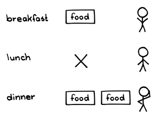
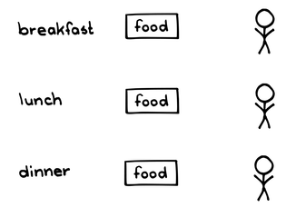

# 定期的なプロダクトインクリメント

 Original:[Regular Product Increment](https://sites.google.com/a/scrumplop.org/published-patterns/value-stream/regular-product-increment)

別名：プロダクトインクリメント、出荷判断可能なインクリメント

確信度：★★

{:style="text-align:center;"}
 
理想的なめんどりは、1日に1個の卵を産む。そして産み出す速さは実際に規則的で、26時間に1個を産む。

…[プロダクトオーナー](ch02_11_11_Product_Owner.md)​は[Product Backlog](https://sites.google.com/a/scrumplop.org/published-patterns/value-stream/product-backlog)を管理し、[開発チーム](ch02_14_14_Development_Team.md)は現在の[Production Episode](https://sites.google.com/a/scrumplop.org/published-patterns/value-stream/production-episode)​において、[スプリントゴール](ch03_38_71_Sprint_Goal.md)に向けて作業しています。

{:style="text-align:center;"}
＊　　＊　　＊

**チームが[Sprint](https://sites.google.com/a/scrumplop.org/published-patterns/value-stream/sprint)​ごとに価値を生み出しているかどうかを検証することは、非常に難しことがよくあります。しかし、[プロダクトオーナー](ch02_11_11_Product_Owner.md)は、[Sprint](https://sites.google.com/a/scrumplop.org/published-patterns/value-stream/sprint)を重ねるごとにプロダクトの価値が高まっていることを確かめたいと考えています。**

[プロダクトオーナー](ch02_11_11_Product_Owner.md)は適切な方法で価値あるプロダクトを構築したいと考えています。市場には真のニーズがあり、市場のニーズと[プロダクトオーナー](ch02_11_11_Product_Owner.md)の意図との間にミスマッチが生じる可能性は常にあります。そのため、[プロダクトオーナー](ch02_11_11_Product_Owner.md)は開発された¶55 Product Backlog Item(PBI)が、自分が思い描いた価値を創出する軌道に乗っているかを、定期的に検証する必要があります。「アーンドバリュー」などの多くの手法は、この検証のためにプロダクトの抽象化を使用します。しかし、そのような指標はプロダクト自体の特性から切り離されているため、顧客の価値に対する視点を反映していないかもしれません。

価値あるプロダクトを創るために、[スクラムチーム](ch02_07_7_Scrum_Team.md)は[スプリントプランニング](ch02_25_24_Sprint_Planning.md)で[スプリントゴール](ch03_38_71_Sprint_Goal.md)を作成し、そのゴールを使用して[Sprint](https://sites.google.com/a/scrumplop.org/published-patterns/value-stream/sprint)中の作業を推進します。[Sprint](https://sites.google.com/a/scrumplop.org/published-patterns/value-stream/sprint)の終わりに、チームは[スプリントゴール](ch03_38_71_Sprint_Goal.md)に記述された意図した価値を現実と照らし合わせて確認する必要があります。

{:style="text-align:center;"}
 
breakfast: 朝食 food: 食べ物 lunch: 昼食 dinner: 夕食  food: 食べ物  food: 食べ物

ステークホルダーは、[開発チーム](ch02_14_14_Development_Team.md)が[Sprint](https://sites.google.com/a/scrumplop.org/published-patterns/value-stream/sprint)の終わりに、彼らにとって価値のある具体的なものを提供することを期待しています。いくつかの組織サイロからの専門家で構成される[開発チーム](ch02_14_14_Development_Team.md)、あるいは複数の[開発チーム](ch02_14_14_Development_Team.md)が協力して作業する場合、これらの専門家が作業を完了すると実際のプロダクトができていると信じるかもしれません。しかし、共有されたチームの視点がないために、彼らは単に孤立したコンポーネントを作っただけかもしれません。プロダクト全体はこれらのコンポーネントの合計以上の価値があり、真の価値はこれらのコンポーネントを結合して一貫性のある全体にすることから生まれます。市場は、チームが開発の都合で、プロダクトをどのように分割したかについてはおそらく気にしないでしょう。

それゆえ：

**全ての[Sprint](https://sites.google.com/a/scrumplop.org/published-patterns/value-stream/sprint)で、[スクラムチーム](ch02_07_7_Scrum_Team.md)は「完成」（[Definition of Done](https://sites.google.com/a/scrumplop.org/published-patterns/value-stream/definition-of-done)を参照）した、使用可能で、潜在的にリリース可能な「プロダクトインクリメント」を提供するよう努めます。チームはプロダクトインクリメントを使用して、プロダクトの価値を高めたかどうかを検証し、プロダクトが市場で実際にどのように機能するかを理解します。**長期的には、エンドユーザーはより満足し、現在の使用からの洞察によりチームの先見性が磨かれ、将来の多くのリスクを回避することができます。

スクラムの主な価値は、ステークホルダーが使用するためのプロダクトを、一度に評価可能な一つのインクリメントとして生産し、プロダクトの使用と構築から得られる知識を増やすことです。その知識は、チームがプロセスとプロダクトの両方を段階的に改善することを学ぶのに役立ちます。[カイゼンとカイカク](ch02_19_Kaizen_and_Kaikaku.md)を参照してください。[Sprint](https://sites.google.com/a/scrumplop.org/published-patterns/value-stream/sprint)は、[スクラムチーム](ch02_07_7_Scrum_Team.md)のプロダクトに対する意図と現実の間の門として見ることができます。

{:style="text-align:center;"}
 
breakfast: 朝食 food: 食べ物 lunch: 昼食 food: 食べ物 dinner: 夕食 food: 食べ物

{:style="text-align:center;"}
＊　　＊　　＊

[開発チーム](ch02_14_14_Development_Team.md)は、[ビジョン](ch03_02_39_Vision.md)をサポートし、[プロダクトオーナー](ch02_11_11_Product_Owner.md)のロードマップ（[Product Roadmap](https://sites.google.com/a/scrumplop.org/published-patterns/value-stream/release-plan/product-roadmap)を参照）を反映し、チームの[Definition of Done](https://sites.google.com/a/scrumplop.org/published-patterns/value-stream/definition-of-done)を満たす、価値あるプロダクトインクリメントを定期的に繰り返し提供します。

インクリメントと[スプリントゴール](ch03_38_71_Sprint_Goal.md)の間には密接な関係があります。最良のProduct Incrementは、少なくとも[スプリントゴール](ch03_38_71_Sprint_Goal.md)を達成し、一貫性がある複数のPBIから構成されています。スクラムで[Sprint](https://sites.google.com/a/scrumplop.org/published-patterns/value-stream/sprint)を使用する基本的な理由の一つは、プロダクトに一貫性のあるインクリメントを提供することです。

スクラムにおいて、プロダクトは、[プロダクトオーナー](ch02_11_11_Product_Owner.md)が定義し、所有し、管理する管理単位です。[プロダクトオーナー](ch02_11_11_Product_Owner.md)はプロダクトの価値に対して責任を負います（[Value and ROI](https://sites.google.com/a/scrumplop.org/published-patterns/value-stream/product-backlog/value-and-roi)を参照）。スクラムはプロダクトがどれだけ一貫性があるかについては言及していません。自転車と飛行機を一緒にしてプロダクトを構成することも、ブラウザとオペレーティングシステムと定義することもできます。プロダクトは一つ以上の[Value Stream](https://sites.google.com/a/scrumplop.org/published-patterns/value-stream)をサポートします：エンドユーザー向けのものと、プロダクトの成功のステークホルダーである[スクラムチーム](ch02_07_7_Scrum_Team.md)自身向けのものです。スクラムにおいて、最高のプロダクトは、単一の市場（エンドユーザー）で[Value Stream](https://sites.google.com/a/scrumplop.org/published-patterns/value-stream)をサポートすることで、市場へ上手く集中することを可能にします。特定のプロダクトインクリメントは、これらの[Value Stream](https://sites.google.com/a/scrumplop.org/published-patterns/value-stream)の一つ以上に沿って価値を創出します。

プロダクトインクリメントを提供するために、[開発チーム](ch02_14_14_Development_Team.md)は[機能横断チーム](ch02_10_10_Cross_Functional_Team.md)であるべきで、[Sprint](https://sites.google.com/a/scrumplop.org/published-patterns/value-stream/sprint)中に組織やロールのサイロを越えてインクリメントの提供をサポートします。これはスクラムを採用する組織にとって課題となります。組織内の個人は、自分たちの個別の仕事の進め方を通じて、組織の現実の価値観（掲げられた価値観とは対照的に）を示します。個人のパフォーマンス指標を、個別のサイロベースの行動を強化するものにすると、この機能横断的な作業と対立し、[開発チーム](ch02_14_14_Development_Team.md)によるプロダクトインクリメントの作成を妨げてしまいます。

チームや組織がプロダクトインクリメントを提供できるようになると、組織に次のような新しい力が働くようになります：

* 「三重制約」または「鉄の三角形」の変更。[Sprint](https://sites.google.com/a/scrumplop.org/published-patterns/value-stream/sprint)の長さは固定されているため時間は固定され、この変更に対応するためにスコープとコストは柔軟にする必要があります。

* 時間は固定されており、つまり提供間隔も固定されています。提供の遅れはありません。

* 提供に関する報告がシンプルになります：インクリメントは完成しているか、そうでないかです。

* プロダクトインクリメントの開発を妨げる社内のサイロは、チームが機能横断的に作業するにつれて崩れ始めます。これにより、サイロ管理者の役割はリソース配分からスタッフの人材開発（しばしば脇に置かれる活動）とソートリーダーシップへと変化します。

各[Sprint](https://sites.google.com/a/scrumplop.org/published-patterns/value-stream/sprint)の開発タイムボックスの終了後、チームは[スプリントレビュー](ch02_36_35_Sprint_Review.md)を行い、その中で特にプロダクトインクリメントを確認する必要があります。しかし、リリース後には市場からの追加のフィードバックが必然的に来ます。このフィードバックをできるだけ早く引き出すために、チームは各プロダクトインクリメントを一部の顧客層に展開（単に出荷やリリースではなく）し、実際に使用してもらう必要があります。チームは、おそらくは承認されたプロダクトインクリメントを時間をかけてより広い市場範囲に提供していくことができます。おそらくはリスクを減らすためにベータリリースから始め、次に密接なパートナーへ、そして最終的には市場全体へと提供します。[Release Staging Layers](https://sites.google.com/a/scrumplop.org/published-patterns/value-stream/release-plan/release-staging-layers)を参照してください。プロダクトのライフタイムのなかで、ユーザーの生活の質、プロダクトを構築するコミュニティ、そして可能な限り大きなコミュニティへの貢献は、可能な限り[Greatest Value](https://sites.google.com/a/scrumplop.org/published-patterns/value-stream/greatest-value)へと高めていくべきです。

[Sprint](https://sites.google.com/a/scrumplop.org/published-patterns/value-stream/sprint)の終わりに、チームは[スプリントレトロスペクティブ](ch02_37_36_Sprint_Retrospective.md)を開催して、プロダクト開発プロセスをふりかえる必要もあります。

プロダクトの[Value Stream](https://sites.google.com/a/scrumplop.org/published-patterns/value-stream)がそれぞれの市場で分化した場合、企業はプロダクトを分割することを検討するかもしれません。[Value Stream Fork](https://sites.google.com/a/scrumplop.org/published-patterns/value-stream/value-stream-fork)を参照してください。

